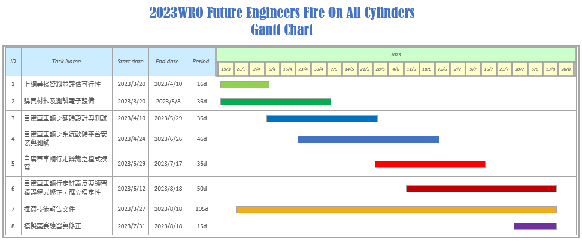

Engineering materials
====

Official GitHub repository for WRO TAIWAN team Fire On All Cylinders. All code, documentation, and files are located here.  
__Located Below is the content of the technical report, and a link to the build instructions.__

WRO台灣隊伍"Fire On All Cylinders"的官方GitHub存儲庫。所有的程式碼、文件和檔案都在此處。  
__下方是技術報告的內容，以及建置說明的連結。__
## Content(官方目錄)
- ###  ${{\color{red} Hardware Overview (硬體部份)}} $ 
  #### 1. Mobility Management(移動性管理)
    - [Vehicle chassis design(車輛底盤設計)](https://github.com/kirkhu/WRO2023_Future-Engineers-Fire-On-All-Cylinders/blob/main/schemes/vehicle_chassis_design/README.md)
    - [Introduction to Motor(馬逹介紹)](https://github.com/kirkhu/WRO2023_Future-Engineers-Fire-On-All-Cylinders/blob/main/schemes/Motor/README.md)
    - [Vehicle 3D/2D Models(3D 建模模型、2D雷切圖)](https://github.com/kirkhu/WRO2023_Future-Engineers-Fire-On-All-Cylinders/blob/main/models/Vehicle_3D_2D/README.md)
    
  #### 2. Power and Sense Management2.(電源和感測器管理)
    - __Vehicle design(車輛設計)__
      - [BOM Parts List(自駕車輛零件清單)](https://github.com/kirkhu/WRO2023_Future-Engineers-Fire-On-All-Cylinders/tree/main/schemes/Parts_List#readme)
      - [Assembly Instructions & Diagrams(自駕車輛組裝接線圖)](https://github.com/kirkhu/WRO2023_Future-Engineers-Fire-On-All-Cylinders/blob/main/schemes/Assembly_Instructions/README.md)  
      - [Circuit Design(電路圖設計)](https://github.com/kirkhu/WRO2023_Future-Engineers-Fire-On-All-Cylinders/blob/main/models/Circuit_Design/README.md)
      - [Hardware Fool-Proof-Design(硬體防呆設計)](https://github.com/kirkhu/WRO2023_Future-Engineers-Fire-On-All-Cylinders/blob/main/schemes/fool-proof-design/README.md) 
    - __power Management(電源管理)__
      - [Power_supply_system(電源供應系統)](https://github.com/kirkhu/WRO2023_Future-Engineers-Fire-On-All-Cylinders/blob/main/schemes/Power_supply_system/README.md) 
      - [Li-Polymer Battery Safety Notice(鋰聚電池安全事項)](https://github.com/kirkhu/WRO2023_Future-Engineers-Fire-On-All-Cylinders/blob/main/schemes/Li-Polymer_Battery/README.md)  
   
    - __Sense Management(感測器管理)__
      - [Color sensor(顏色感應器)](https://github.com/kirkhu/WRO2023_Future-Engineers-Fire-On-All-Cylinders/blob/main/schemes/color_sensor/README.md)
      - [Introduction to Lidar(光達介紹)](https://github.com/kirkhu/WRO2023_Future-Engineers-Fire-On-All-Cylinders/blob/main/schemes/Lidar/README.md)
      - [Camera(攝影鏡頭)](https://github.com/kirkhu/WRO2023_Future-Engineers-Fire-On-All-Cylinders/blob/main/schemes/Camera/README.md)
  
- ### ${{\color{red} Software Overview (軟體部份)}} $ 
  #### 3. Obstacle Management(障礙物管理)
    - [Software Platform Construction(自駕車輛系統軟體平台建置)](https://github.com/kirkhu/WRO2023_Future-Engineers-Fire-On-All-Cylinders/blob/main/src/System_Platform%20_Software/README.md)
    - [Introduction to OpenCV(OpenCV影像軟體介紹)](https://github.com/kirkhu/WRO2023_Future-Engineers-Fire-On-All-Cylinders/blob/main/other/OpenCV/README.md)
    - [Introduction to ROS(ROS系統介紹)](https://github.com/kirkhu/WRO2023_Future-Engineers-Fire-On-All-Cylinders/blob/main/other/ROS/README.md)  
    - __Image Processing and Predictions(影像處理)__
      - [Image Processing (圖像預測)](https://github.com/kirkhu/WRO2023_Future-Engineers-Fire-On-All-Cylinders/blob/main/src/Image_Processing_and_Predictions/README.md)  
      - [Steering overview (轉向概述)](https://github.com/kirkhu/WRO2023_Future-Engineers-Fire-On-All-Cylinders/blob/main/src/Steering_overview/README.md)  
    - __Programming(自駕車輛程式設計)__
      - [Open Challenge Code overview(資格賽程式概述)](https://github.com/kirkhu/WRO2023_Future-Engineers-Fire-On-All-Cylinders/tree/main/src/Programming/Open_Challenge)
      - [Obstacle Challenge Code overview(任務賽程式概述)](https://github.com/kirkhu/WRO2023_Future-Engineers-Fire-On-All-Cylinders/tree/main/src/Programming/Obstacle_Challenge)
  
- ### ${{\color{red} Other(其他)}} $
  #### 4. Pictures – Team and vehicle(圖片-團隊和車輛)
    - [Team Members of Introduction(團隊成員介紹)](https://github.com/kirkhu/WRO2023_Future-Engineers-Fire-On-All-Cylinders/blob/main/t-photos/README.md) 
    - [Vehicle's Photos(自駕車輛各視角圖)](https://github.com/kirkhu/WRO2023_Future-Engineers-Fire-On-All-Cylinders/blob/main/v-photos/README.md)  

  #### 5. Performance videos(車輛各任務完成影片)
    - [Open Challenge(資格賽影片)](https://github.com/kirkhu/WRO2023_Future-Engineers-Fire-On-All-Cylinders/blob/main/video/Open_Challenge/video.md)
    - [Obstacle Challenge(任務賽影片)](https://github.com/kirkhu/WRO2023_Future-Engineers-Fire-On-All-Cylinders/blob/main/video/Obstacle_Challenge/video.md)  

  #### 6. GitHub utilization(GitHub 使用)
    - [GitHub 編輯方式(使用VSCODE 編輯及使用GIT做版本控制)](https://github.com/kirkhu/WRO2023_Future-Engineers-Fire-On-All-Cylinders/blob/main/src/GitHub_Edit/README.md)
    - [GitHub Web Editing Languages 網頁編輯語言](https://github.com/kirkhu/WRO2023_Future-Engineers-Fire-On-All-Cylinders/blob/main/src/GitHub_Languages/README.md)  

  #### 7. Engineering Factor(工程因素/技術條件)
    - [Work Diary(工作日誌)](https://github.com/kirkhu/WRO2023_Future-Engineers-Fire-On-All-Cylinders/blob/main/other/work_diary/README.md) 

- ### ${{\color{red} CompetitionSchedule (練習時間規劃)}} $  
# 

 
