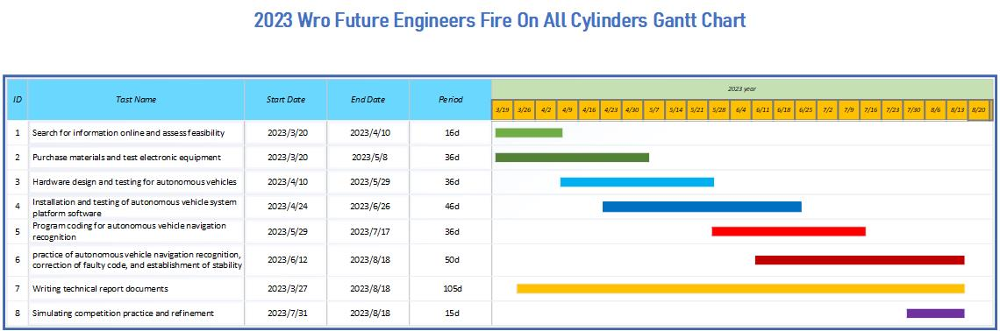

 

- This is the official GitHub repository for the WRO TAIWAN team "Shinan Fire On All Cylinders." All code, documentation, and files are located here.
- Here you can find the links to the technical report content and setup instructions, organized separately for learners and judges, for easy access during either learning or assessment. 
- In this technical document, the directory will be established based on the scoring criteria, and the directory headings will be hyperlinked for easy access for judges or learners to navigate to the key content of the technical document, facilitating quick assessment.  
    #### [Learner's Perspective](https://github.com/kirkhu/WRO2023_FE-Shinan-Fire-On-All-Cylinders/blob/main/learners_contents.md)
## Rubric for Judging Engineering Documentation 
- ###  ${{\color{red} Hardware Overview }} $ 
  #### 1. Mobility Management
    * [Vehicle Chassis Design](https://github.com/kirkhu/WRO2023_FE-Shinan-Fire-On-All-Cylinders/blob/main/schemes/vehicle_chassis_design/README.md)
    * [Steering Mechanism](https://github.com/kirkhu/WRO2023_FE-Shinan-Fire-On-All-Cylinders/blob/main/schemes/vehicle_chassis_design/README.md)
    * [Motor Introduction](https://github.com/kirkhu/WRO2023_FE-Shinan-Fire-On-All-Cylinders/blob/main/schemes/Motor/README.md)
    * [Vehicle 2D/3D Models_in CAD](https://github.com/kirkhu/WRO2023_FE-Shinan-Fire-On-All-Cylinders/blob/main/models/Vehicle_2D_3D/README.md)
    
  #### 2. Power and Sense Management
    - __Vehicle design__
      - [BOM Parts List](https://github.com/kirkhu/WRO2023_FE-Shinan-Fire-On-All-Cylinders/blob/main/schemes/Parts_List#readme)
      - [Assembly Instructions & Diagrams](https://github.com/kirkhu/WRO2023_FE-Shinan-Fire-On-All-Cylinders/blob/main/schemes/Assembly_Instructions/README.md)  
      - [Circuit Design](https://github.com/kirkhu/WRO2023_FE-Shinan-Fire-On-All-Cylinders/blob/main/models/Circuit_Design/README.md)
      - [Hardware Fool-Proof-Design](https://github.com/kirkhu/WRO2023_FE-Shinan-Fire-On-All-Cylinders/blob/main/schemes/fool-proof-design/README.md) 
    - __Power Management__
      - [Power_Supply_System](https://github.com/kirkhu/WRO2023_FE-Shinan-Fire-On-All-Cylinders/blob/main/schemes/Power_supply_system/README.md) 
      - [Li-Polymer Battery Safety Notice](https://github.com/kirkhu/WRO2023_FE-Shinan-Fire-On-All-Cylinders/blob/main/schemes/Li-Polymer_Battery/README.md)  
   
    - __Controller Selection__
      - [Jetson Nano Board_Introduction](https://github.com/kirkhu/WRO2023_FE-Shinan-Fire-On-All-Cylinders/blob/main/other/Jetson%20Nano)
      - [Raspberry_Pi_Board Introduction](https://github.com/kirkhu/WRO2023_FE-Shinan-Fire-On-All-Cylinders/blob/main/other/Raspberry_Pi)
      - [Controller Comparison ](https://github.com/kirkhu/WRO2023_FE-Shinan-Fire-On-All-Cylinders/blob/main/other/Controller%20Selection)
    - __Sense Management__
      - [Color Sensor](https://github.com/kirkhu/WRO2023_FE-Shinan-Fire-On-All-Cylinders/blob/main/schemes/color_sensor/README.md)
      - [Lidar](https://github.com/kirkhu/WRO2023_FE-Shinan-Fire-On-All-Cylinders/blob/main/schemes/Lidar/README.md)
      - [Camera](https://github.com/kirkhu/WRO2023_FE-Shinan-Fire-On-All-Cylinders/blob/main/schemes/Camera/README.md)
  
- ### ${{\color{red} Software Overview }} $ 
  #### 3. Obstacle Management
    - [Introduction to OpenCV](https://github.com/kirkhu/WRO2023_FE-Shinan-Fire-On-All-Cylinders/blob/main/other/OpenCV/README.md)
    - [Introducution to ROS](https://github.com/kirkhu/WRO2023_FE-Shinan-Fire-On-All-Cylinders/blob/main/other/ROS)
    - [Software Platform Construction](https://github.com/kirkhu/WRO2023_FE-Shinan-Fire-On-All-Cylinders/blob/main/src/System_Platform_Software/README.md)
    - __Image Processing and Predictions__
      - [Image Processing]()  
      - [Steering Overview]() 
    - __Programming__
      - [Open Challenge Code Overview](https://github.com/kirkhu/WRO2023_FE-Shinan-Fire-On-All-Cylinders/blob/main/src/Programming/Open_Challenge)
      - [Obstacle Challenge Code Overview](https://github.com/kirkhu/WRO2023_FE-Shinan-Fire-On-All-Cylinders/blob/main/src/Programming/Obstacle_Challenge)
      - [Distinctive Pseudo Code](https://github.com/kirkhu/WRO2023_FE-Shinan-Fire-On-All-Cylinders/blob/main/src/Feature_Program/README.md)
- ### ${{\color{red} Other}} $
  #### 4. Pictures – Team and Vehicle
    - [Team Members Introduction](https://github.com/kirkhu/WRO2023_FE-Shinan-Fire-On-All-Cylinders/blob/main/t-photos/README.md) 
    - [Vehicle Photos]()  
  #### 5. Performance Videos
    - [Open Challenge](https://github.com/kirkhu/WRO2023_FE-Shinan-Fire-On-All-Cylinders/blob/main/video/Open_Challenge/video.md)
    - [Obstacle Challenge](https://github.com/kirkhu/WRO2023_FE-Shinan-Fire-On-All-Cylinders/blob/main/video/Obstacle_Challenge/video.md)
  #### 6. GitHub Utilization
    - [GitHub Edit(VSCODE Edit/GIT)](https://github.com/kirkhu/WRO2023_FE-Shinan-Fire-On-All-Cylinders/blob/main/src/GitHub_Edit/README.md)
    - [GitHub Web Editing Languages](https://github.com/kirkhu/WRO2023_FE-Shinan-Fire-On-All-Cylinders/blob/main/src/GitHub_Languages/README.md)  
  #### 7. Engineering Factor  
    - [Work Diary](https://github.com/kirkhu/WRO2023_FE-Shinan-Fire-On-All-Cylinders/blob/main/other/work_diary/README.md)
- ### ${{\color{red} Competition Schedule}} $  
# 

 

