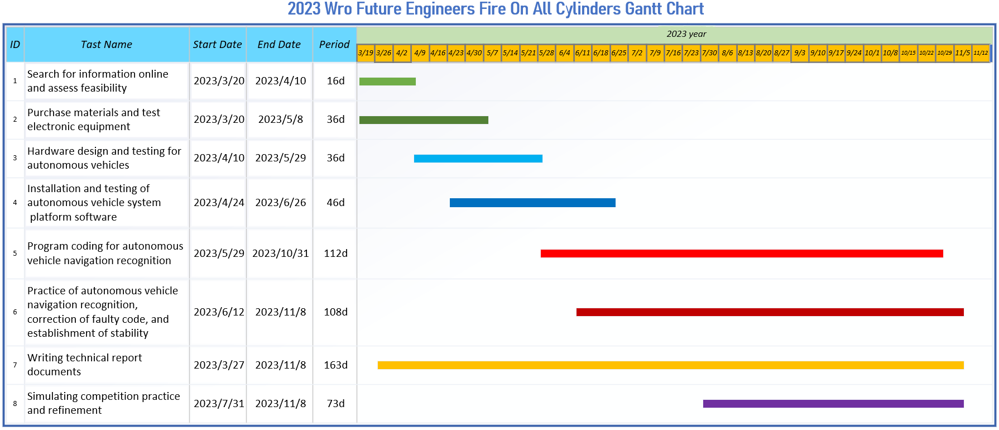

 

## For Learners ## 

- ### Hardware Selection
    - [Controller Selection](https://github.com/kirkhu/WRO2023_FE-Shinan-Fire-On-All-Cylinders/tree/main/other/Controller_Choosing)
    - [Moter Selection](https://github.com/kirkhu/WRO2023_FE-Shinan-Fire-On-All-Cylinders/blob/main/schemes/Motor/README.md)
    - [Color Sensor](https://github.com/kirkhu/WRO2023_FE-Shinan-Fire-On-All-Cylinders/blob/main/schemes/color_sensor/README.md)
    - [Lidar Selection](https://github.com/kirkhu/WRO2023_FE-Shinan-Fire-On-All-Cylinders/blob/main/schemes/Lidar/README.md)
    - [Camera Selection](https://github.com/kirkhu/WRO2023_FE-Shinan-Fire-On-All-Cylinders/blob/main/schemes/Camera/README.md)
    
- ### Vehicle Design
    - [Vehicle 2D/3D Models in CAD](https://github.com/kirkhu/WRO2023_FE-Shinan-Fire-On-All-Cylinders/tree/main/models/Vehicle_2D_3D)
    - [BOM Parts List](https://github.com/kirkhu/WRO2023_FE-Shinan-Fire-On-All-Cylinders/tree/main/schemes/Parts_List#readme)
    - [Vehicle Chassis Design Process](https://github.com/kirkhu/WRO2023_FE-Shinan-Fire-On-All-Cylinders/tree/main/schemes/Vehicle_Chassis_Design)
    - [Circuit Design](https://github.com/kirkhu/WRO2023_FE-Shinan-Fire-On-All-Cylinders/blob/main/models/Circuit_Design/README.md)
    - [Hardware Fool-Proof Design](https://github.com/kirkhu/WRO2023_FE-Shinan-Fire-On-All-Cylinders/blob/main/schemes/fool-proof-design/README.md) 
    - [Assembly Instructions & Wiring Diagrams](https://github.com/kirkhu/WRO2023_FE-Shinan-Fire-On-All-Cylinders/blob/main/schemes/Assembly_Instructions/README.md)
    - __power Management__
      - [Power Supply System](https://github.com/kirkhu/WRO2023_FE-Shinan-Fire-On-All-Cylinders/blob/main/schemes/Power_supply_system/README.md) 
      - [Li-Polymer Battery Low Voltage Alarm and Charging Equipment](https://github.com/kirkhu/WRO2023_FE-Shinan-Fire-On-All-Cylinders/blob/main/schemes/Li-Polymer_Battery/README.md)
- ### System Initialization
    - [OpenCV Introduction](https://github.com/kirkhu/WRO2023_FE-Shinan-Fire-On-All-Cylinders/blob/main/other/OpenCV/README.md)
    - [ROS Introduction](https://github.com/kirkhu/WRO2023_FE-Shinan-Fire-On-All-Cylinders/blob/main/other/ROS/README.md) 
    - [Software Platform Construction](https://github.com/kirkhu/WRO2023_FE-Shinan-Fire-On-All-Cylinders/tree/main/src/System_Platform_Software)
- ### Obstacle Management
    - __Image Processing and Predictions__
      - [Image Processing](https://github.com/kirkhu/WRO2023_FE-Shinan-Fire-On-All-Cylinders/tree/main/src/Image_Processing_and_Steering/Image_Processing)  
      - [Steering Overview ](https://github.com/kirkhu/WRO2023_FE-Shinan-Fire-On-All-Cylinders/tree/main/src/Image_Processing_and_Steering/Steering_overview)  
    - __Programming__
      - [Open Challenge Code Overview](https://github.com/kirkhu/WRO2023_FE-Shinan-Fire-On-All-Cylinders/tree/main/src/Programming/Open_Challenge)
      - [Obstacle Challenge Code Overview](https://github.com/kirkhu/WRO2023_FE-Shinan-Fire-On-All-Cylinders/tree/main/src/Programming/Obstacle_Challenge)
      - [Distinctive Pseudo Code](https://github.com/kirkhu/WRO2023_FE-Shinan-Fire-On-All-Cylinders/tree/main/src/Distinctive_Pseudo_Code)
- ### Pictures – Team and vehicle
    - [Team Members Introduction](https://github.com/kirkhu/WRO2023_FE-Shinan-Fire-On-All-Cylinders/blob/main/t-photos/README.md) 
    - [Vehicle Photos](https://github.com/kirkhu/WRO2023_FE-Shinan-Fire-On-All-Cylinders/blob/main/v-photos/README.md) 
- ### Performance videos
    - [Open Challenge](https://github.com/kirkhu/WRO2023_FE-Shinan-Fire-On-All-Cylinders/blob/main/video/Open_Challenge/video.md)
    - [Obstacle Challenge](https://github.com/kirkhu/WRO2023_FE-Shinan-Fire-On-All-Cylinders/blob/main/video/Obstacle_Challenge/video.md)
    - [Self-Driving Car Design Process Video](https://github.com/kirkhu/WRO2023_FE-Shinan-Fire-On-All-Cylinders/blob/main/video/ALL_video/video.md)
- ### GitHub Utilization
    - [GitHub Edit(VScode Edit/GIT)](https://github.com/kirkhu/WRO2023_FE-Shinan-Fire-On-All-Cylinders/blob/main/src/GitHub_Edit/README.md)
    - [GitHub Web Editing Languages](https://github.com/kirkhu/WRO2023_FE-Shinan-Fire-On-All-Cylinders/blob/main/src/GitHub_Languages/README.md)
- ### Work Dairy
    - [March](https://github.com/kirkhu/WRO2023_FE-Shinan-Fire-On-All-Cylinders/tree/main/other/work_diary#20230319--20230326)
    - [April](https://github.com/kirkhu/WRO2023_FE-Shinan-Fire-On-All-Cylinders/tree/main/other/work_diary#20230327--20230402)
    - [May](https://github.com/kirkhu/WRO2023_FE-Shinan-Fire-On-All-Cylinders/tree/main/other/work_diary#20230501-20230507)
    - [June](https://github.com/kirkhu/WRO2023_FE-Shinan-Fire-On-All-Cylinders/tree/main/other/work_diary#20230529--20230604)
    - [July](https://github.com/kirkhu/WRO2023_FE-Shinan-Fire-On-All-Cylinders/tree/main/other/work_diary#20230626--20230702)
    - [August](https://github.com/kirkhu/WRO2023_FE-Shinan-Fire-On-All-Cylinders/tree/main/other/work_diary#20230731--20230806)
    - [September](https://github.com/kirkhu/WRO2023_FE-Shinan-Fire-On-All-Cylinders/tree/main/other/work_diary#20230828--20230903)
    - [October](https://github.com/kirkhu/WRO2023_FE-Shinan-Fire-On-All-Cylinders/tree/main/other/work_diary#20231002--20231008)
- ### ${{\color{red} Competition Schedule}} $  
# 

 
