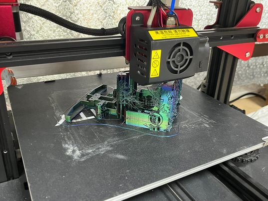
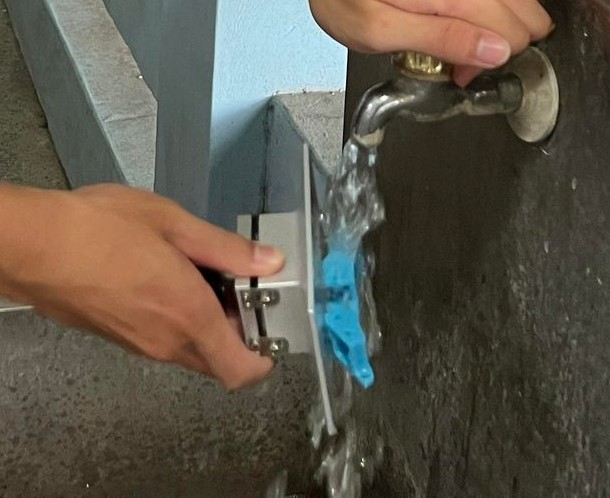

</td>

2023WRO Future Engineers Shinan Fire On All Cylinders  
====
# 
Hardware Assembly Instructions.

## 3D Printed

- 3D printing is a manufacturing technology that transforms digital models into physical objects by layering materials one after another to create the object.
- We have chosen to use 3D printing for the fabrication of the car body due to its advantages over using a Laser Cutting Machine to cut wooden panels. 3D printing offers inherent structural integrity, eliminating the need for assembly steps and resulting in a more lightweight design.

<table>
<tr align="center">
<th>up view</th>
<th>side view</th>
<tr align="center">
<td></td>
<td></td>
</tr>
</table>

<table>
<tr align="center">
<th colspan="3">Working 3D Printer</th>
</tr>
<tr>
<td></td>
<td></td>
<td></td>
</tr>
</table>

## Photo Curing

- Photocuring is a process that utilizes ultraviolet (UV) or other visible light to cure specific materials. It is commonly employed in areas such as 3D printing and coatings, where materials undergo a chemical reaction upon exposure to light, transitioning from a liquid or semi-solid state to a solid state.

- In 3D printing, photopolymerization is a prevalent technique known as stereolithography (SLA) or digital light processing (DLP) printing. In this method, liquid resin is selectively applied layer by layer onto a build platform. A UV light source is then used to irradiate the resin, solidifying it layer by layer to gradually construct the desired object's shape. This technology enables the creation of high-precision, intricate structures, with the ability for rapid production.

- Within the photopolymerization process, a photosensitizer is an essential component. A photosensitizer is a substance capable of absorbing light energy and initiating a chemical reaction. It is typically added to the resin. When light shines on the resin, the photosensitizer absorbs the energy, triggering intermolecular cross-linking reactions that transform the liquid into a solid.

- Photocuring technology is widely used in various fields, including product development, medical devices, jewelry, industrial manufacturing, and more. It enables high-precision, rapid, and customizable manufacturing, offering considerable flexibility in different materials and applications.

<table>
<tr align="center">
<th colspan="2">Photocured 3D Printing Finished Product</th>
<th>Light Curing Machine</th>
<tr align="center">
<td></td>
<td></td>
<td></td>
</tr>
</table>

- If not regularly maintained, light curing machine may become unusable due to resin buildup. Therefore, regular cleaning is essential. To understand how to properly maintain the machine, we sought guidance from our senior, who carefully demonstrated the process to us. Here are the maintenance steps:

  1. After printing is complete, the finished product will be stuck to the build plate.
  2. Remove the build plate and wipe off the resin, being careful not to touch the finished product.
  3. Rinse off easily removable supports with water.
  4. Spray alcohol onto the finished product, making sure to reach every corner.
  5. Wipe the finished product to remove excess resin.
  6. Carefully detach the finished product using tools.
  7. Use a knife to scrape away any remaining support material on the finished product.
  8. Rinse off any fine residue with water.
  9. Wipe the build plate clean of resin, and it's ready for the next print.

<table>
<tr align="center">
<td></td>
<td></td> 
<td></td>
</tr>
<tr align="center">
<td></td>
<td></td>
<td></td>
</tr>
<tr>
<td></td>
<td></td>
<td></td>
</tr>
</table>

- Because the parts made from photosensitive resin are somewhat soft, we need to expose them to ultraviolet (UV) light for secondary curing to make the parts harder and less susceptible to deformation, which could affect the vehicle's movement.

<table>
<tr>
<th>Secondary curing</th>
</tr><tr>
<td></td>
</tr>
</table>

## Comparison between Stacked 3D Printing and Photocuring 
The following data was obtained during the experiment when printing the Ackermann steering mechanism

<table>
<tr align="center">
<th rowspan="2">Photo</th>
<th> Stacked 3D Printing Machine</th>
<th> Light Curing Machine</th>
</tr><tr align="center">
<td></td>
<td></td>

</tr><tr align="left">
<td>The required printing time</td>
<td>Faster</td>
<td>Slower</td>
</tr><tr>
<td>Exterior</td>
<td>Exterior with signs of layering </td>
<td>Smooth</td>
</tr><tr>
<td>Hardness</td>
<td>Depends on the density</td>
<td>Depends on the exposure time</td>
</tr>
</table>

# 
[Return Home](../../)
 
