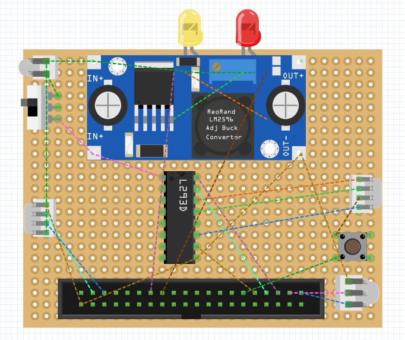
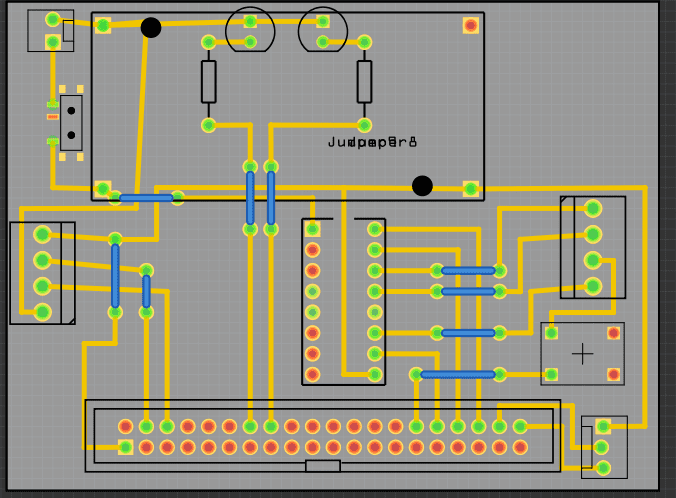
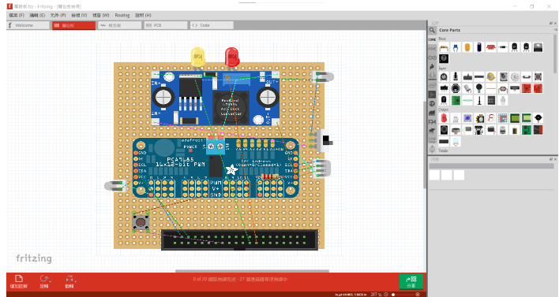

2023WRO Future Engineersn Shinan Fire On All Cylinders  
====
## 
Circuit schematic drawing(電路圖繪製) 

- ### Circuit Board (電路板)

<table>
  <tr align="center">
      <th> Circuit Board of Top View(電路板上視圖) </th><th>Circuit Board of Bottom View(電路板下視圖)</th>
  </tr>
  <tr align="center">
     <td>  </td><td></td>
  </tr>
</table>

- ### Circuit schematic drawing(電路圖繪製)

<table>
  <tr align="center">
      <th>Circuit Diagram(電路配置圖)</th><th>PCB Diagram(PCB 配置)</th><th>Circuit Wiring Diagram(電路線路圖)</th>
  </tr>
  <tr align="center">
     <td></td><td></td><td></td>
  </tr>
</table>

## Explanation of Circuit Principles

Welding is mainly based on the PCB configuration diagram, where yellow lines represent single-core wires, and blue lines represent jumpers. Jumpers can prevent two single-core wires from touching and causing damage to sensors, batteries, or the main unit.

In the top-left corner, there are two PIN sockets for the battery. They are connected to a switch and then to a voltage regulator board. This setup allows the system to be powered on and off using the switch. The four-PIN socket on the left side is for the color sensor, responsible for providing voltage to the color sensor and receiving I2C signals. The four-PIN socket on the right side is for the DC motor, supplying power to it. In the bottom-right corner is the socket for the servo motor, which provides power and transmits PWM signals to control the servo motor.

### Introduction to Fritzing
- Fritzing is a convenient and user-friendly tool that can be used to draw circuit diagrams for self-driving cars, and it does not require any software installation. Fritzing provides a variety of electronic components and modules, which users can simply drag and drop onto the canvas to quickly create and design their circuit diagrams. This makes it particularly suitable for beginners or those unfamiliar with complex circuit design software.
- In addition to circuit diagrams, Fritzing also allows users to create schematics, breadboard views, and even design custom PCB (Printed Circuit Board) layouts. This comprehensive feature set makes it a valuable tool for prototyping and educational purposes. 
- After drawing the circuit diagram using Fritzing, it becomes convenient to solder the circuit on a breadboard following the diagram. This reduces the error rate and allows for easy corrections.
- Software link：[Fritzing](https://fritzing.org/) 
- The circuit diagrams created for this competition are all designed using Fritzing.

   

# 
[Return Home](../../)
  
