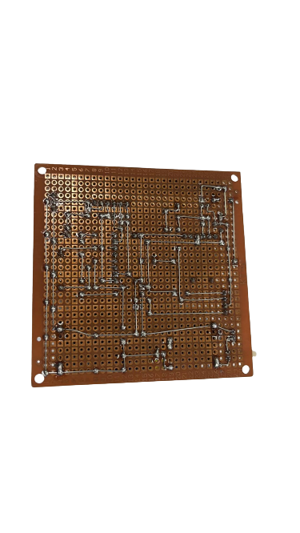
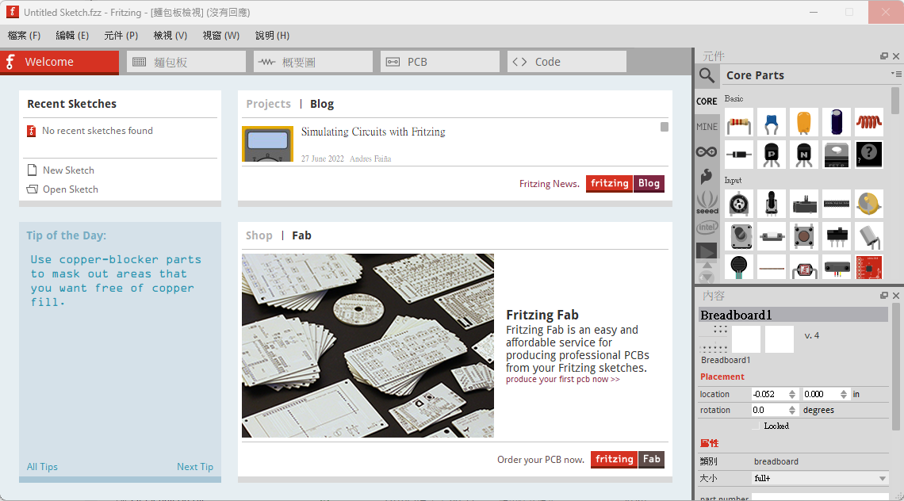

## 
Circuit Design 

- ### Circuit Schematic Drawing

 - In the design of self-driving car circuits, we used the Fritzing circuit software to draw circuit diagrams according to the functions required by self-driving cars. This method allows construction workers to follow the drawings and reduce errors.
 - The circuit board for the self-driving car is not a finished product that we purchased. Instead, we soldered it ourselves using a phenolic universal board, according to the circuit diagram we designed in advance.
 - Power and signal are two essential parts of self-driving car circuits. Power provides electricity to the circuit, while signal transmits data. Designing socket methods around the circuit board can facilitate the connection of sensors or batteries, which can improve the flexibility and scalability of the circuit.
   
 - #### Circuit Board

<table>
  <tr align="center">
      <th> Circuit Board Top View</th><th>Circuit Board Button View</th>
  </tr>
  <tr align="center">
     <td>  </td><td></td>
  </tr>
</table>

- ### Circuit Schematic Drawing

<table>
  <tr align="center">
      <th>Circuit Diagram</th><th>PCB Layouts</th><th>Circuit Schematic</th>
  </tr>
  <tr align="center">
     <td></td><td></td><td></td>
  </tr>
</table>

- ### Fritzing Introduction
  - Fritzing is a free and open-source electronic design automation (EDA) software. It provides a graphical user interface (GUI) for designing electronic circuits and circuit boards. Fritzing also includes a breadboard simulator, which allows users to test their circuits before building them.  
  - Fritzing is a popular choice for hobbyists and beginners, as it is easy to use and does not require any prior knowledge of electronics. It is also used by professional engineers for prototyping and designing electronic circuits.
  - Fritzing has a number of features that make it a powerful tool for electronic design, including:  
    - A large library of electronic components, including resistors, capacitors, transistors, and integrated circuits (ICs).  
    - A breadboard simulator that allows users to test circuits before building them.  
    - A PCB (printed circuit board) designer that allows users to create custom circuit boards.   
    - A schematic editor that allows users to create circuit diagrams.
  - In general, Fritzing is a very useful tool for a variety of electronic design applications. It is a good choice for hobbyists and beginners because it is easy to use and powerful. It is also a good choice for professional engineers because it has a wide range of features.
  - The circuit diagrams created for this competition are all designed using Fritzing.
  - Software link：[Fritzing](https://fritzing.org/)  

   
  

# 
[Return Home](../../)
  
