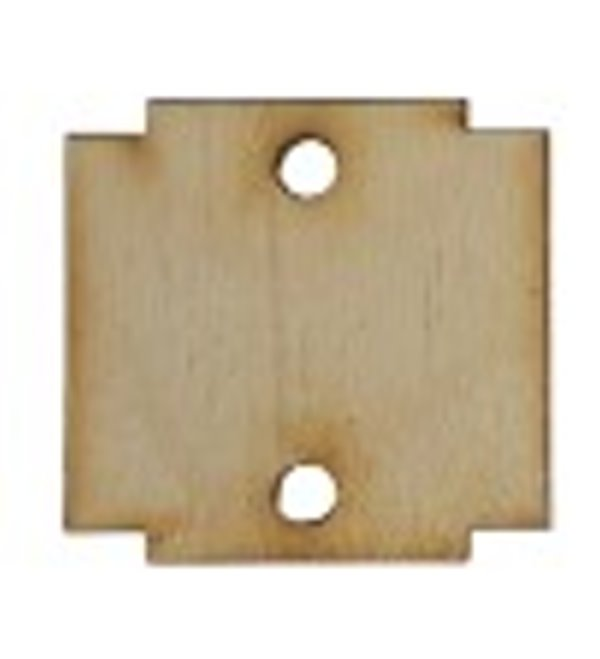
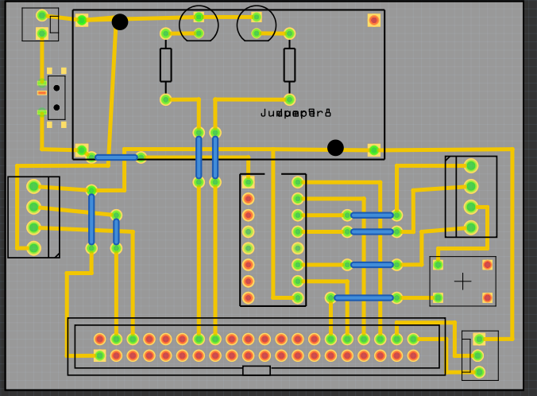
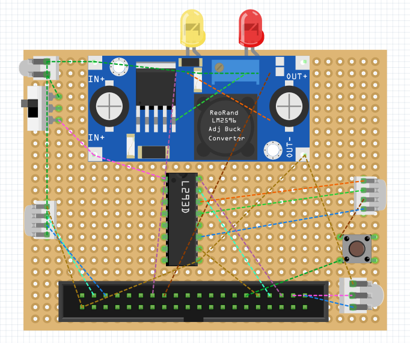
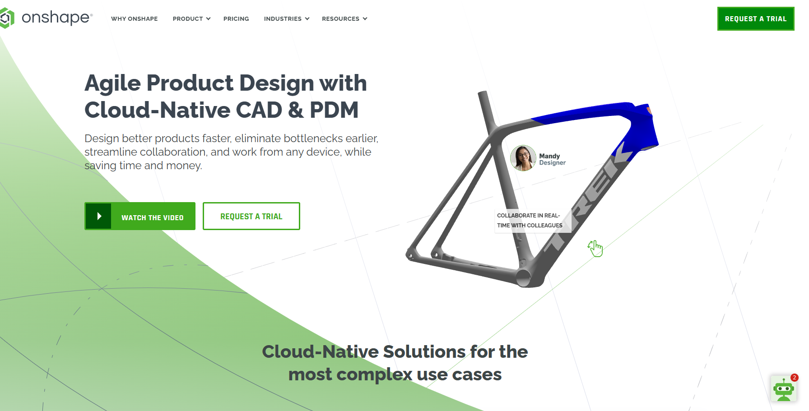

2023WRO Future Engineers Fire On All Cylinders  
====
## 
Vehicle 3D/2D Models(3D 建模模型、2D雷切圖)

- ### Vehicle 3D Model(車輛3D建模圖)
  

- ###  Vehicle body 2D Cutters Model of laser cutting machines(車體2D 雷切模型)

 

- ### Physical cutting of vehicle body panels(實體切割之車體木板) 

|  |  |  |  |   
| :----: | :----: |:----: |:----: | 
| |  | | |

- ### Circuit schematic drawing(電路圖繪製) 
|  |  | 
| :----: | :----: |

- ###  Laser cutting machine operation(雷切機操作) 

<

## English
### Introduction to Onshape
- Using  Onshape to design a 3D model of a self-driving car. Onshape is a free and user-friendly web-based design software.
- After creating the model using Onshape, you can generate 2D flat dimension drawings and then proceed to cut it with a laser cutting machine.
- The 3D/2D models created for this competition are all designed using Onshape.  
- Software link：[On Shope](https://www.onshape.com/en/) 
### Introduction to TinkerCAD
- TinkerCAD is a free and user-friendly web-based design software that can be used to create the required circuit diagrams for a self-driving car. It eliminates the need for additional software installations, making it very convenient and accessible.
- After drawing the circuit diagram using TinkerCAD, it becomes convenient to solder the circuit on a breadboard following the diagram. This reduces the error rate and allows for easy corrections.
- Software link：[TinkerCAD](https://www.tinkercad.com/) 
- The circuit diagrams created for this competition are all designed using TinkerCAD.

## 中文
### Onshape的介紹
- 使用 Onshape 來設計自駕車的 3D 模型，而 Onshape 是免費且容易操作的網頁型態設計軟體。
- 藉由 OnShope 建立模型後，可輸出2D平面尺寸圖，再交由雷切機進行切割。
- 本競賽活動所建立的3D/2D模型均由OnShope設計而成。
- Software link：[On Shope](https://www.onshape.com/en/) 
###  TinkerCAD 的介紹
- TinkerCAD 可以用來繪製自駕車所需的電路圖，而且是免費且容易操作的網頁型態設計軟體，不需要另外安裝軟體。
- 藉由TinkerCAD繪製電路圖後，可方便依圖在電木板上焊接電路，減少錯誤率，並可便修正。
- 本競賽活動所製的電路圖均藉由TinkerCAD設計而成。
- Software link：[On Shope](https://www.tinkercad.com/)   
| Onshape | TinkerCAD |
|:----:|:----:|
|| | 

# 
[Return Home](../)
  
