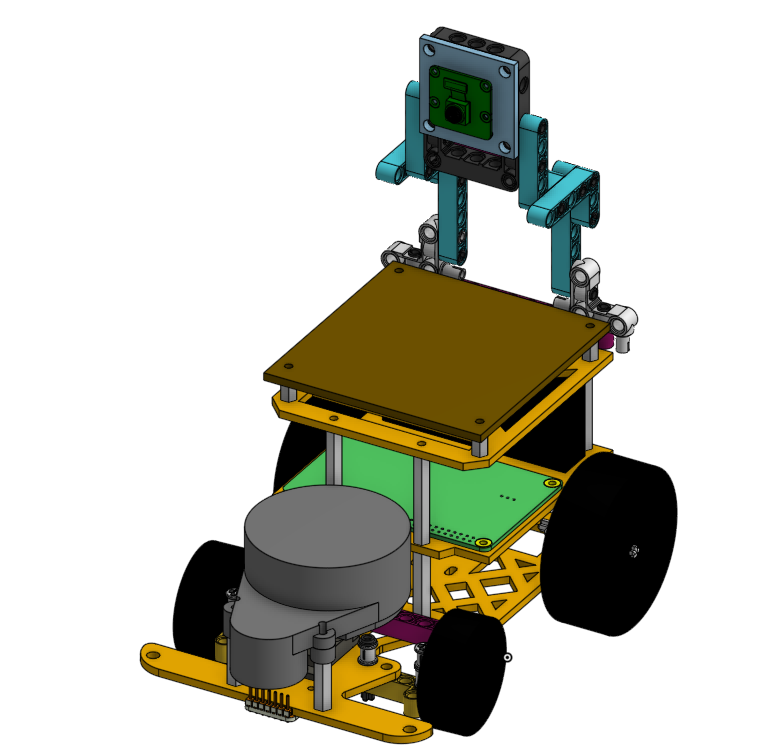
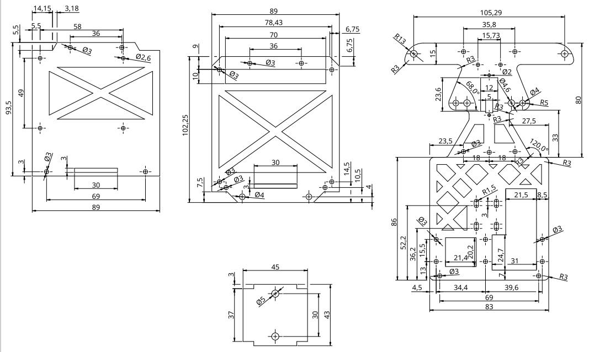
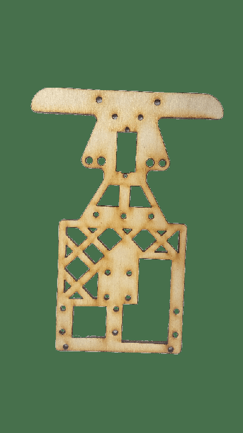
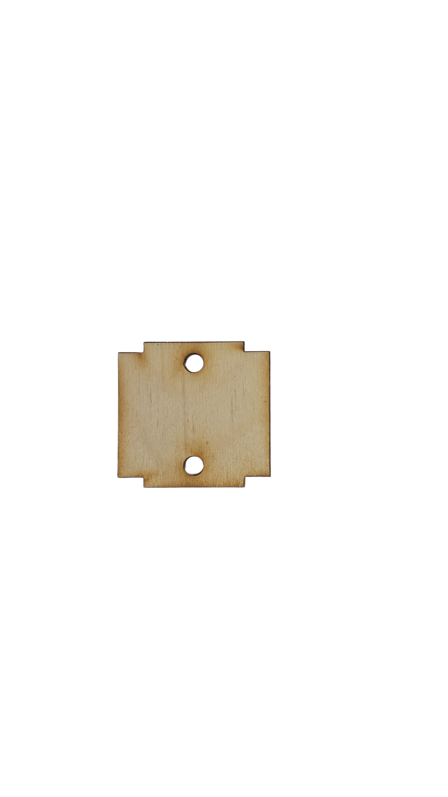
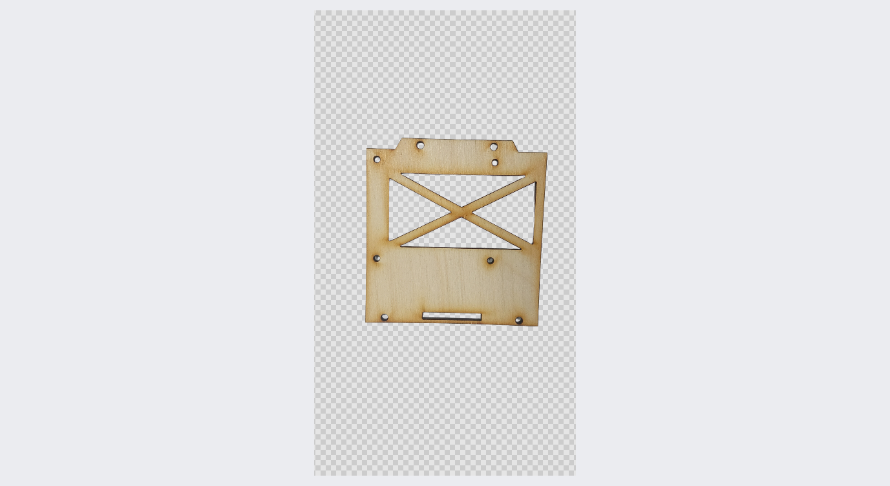
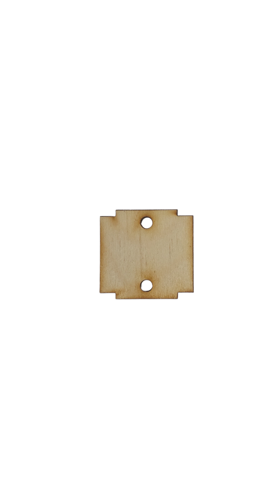
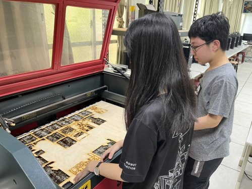

2023WRO Future Engineers Fire On All Cylinders  
====
# 
Vehicle 3D Model(3D建模圖)

  
# 
 2D Cutters Model of laser cutting machines(2D 雷切模型) 

# 
 2D Cutters Model of laser cutting machines(2D 雷切模型) 

|        |        |       |        |    
| :----: | :----: |:----: |:----: |  
|    |   ||    |     |  
|  |  |  |  | 

  

## English
- Using Onshape to design 3D models for vehicles, as Onshape is a free and easy-to-use web-based design software.
- After creating the model using Onshape, you can generate 2D flat dimension drawings and then proceed to cut it with a laser cutting machine.
- Software link：[On Shope](https://www.onshape.com/en/) 
## 中文
- 使用 Onshape 來設計車輛的 3D 模型，而 Onshape 是免費且容易操作的網頁型態設計軟體。
- 藉由 OnShope 建立模型後，可輸出2D平面尺寸圖，再交由雷切機進行切割。
- Software link：[On Shope](https://www.onshape.com/en/) 

# 
[Return Home](../)
  
