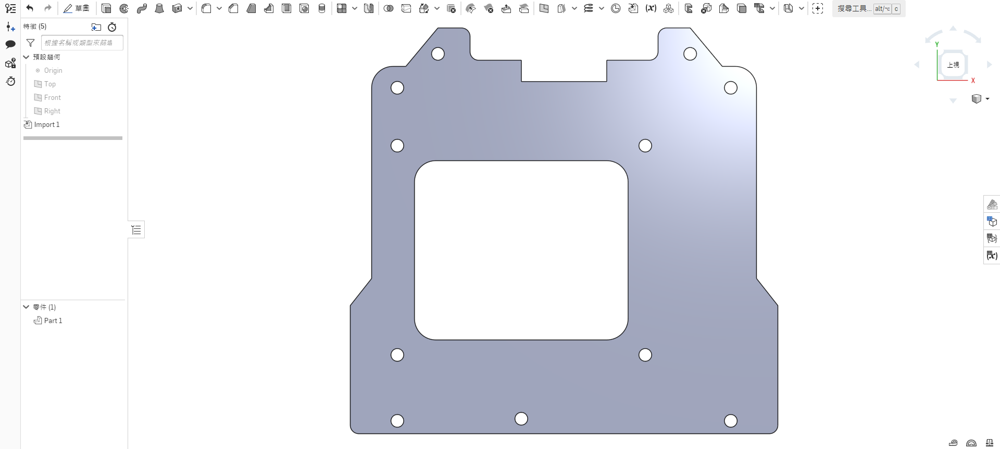
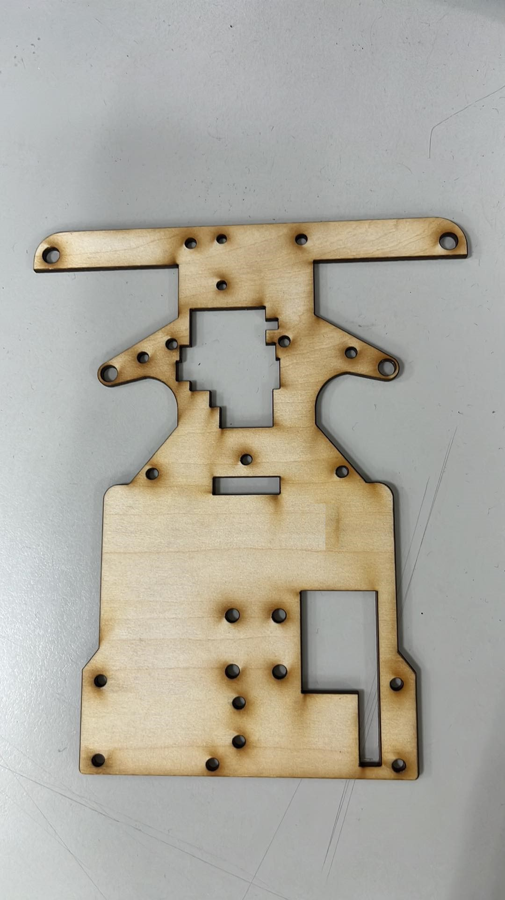
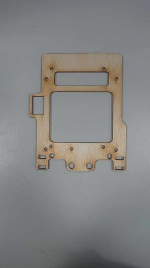
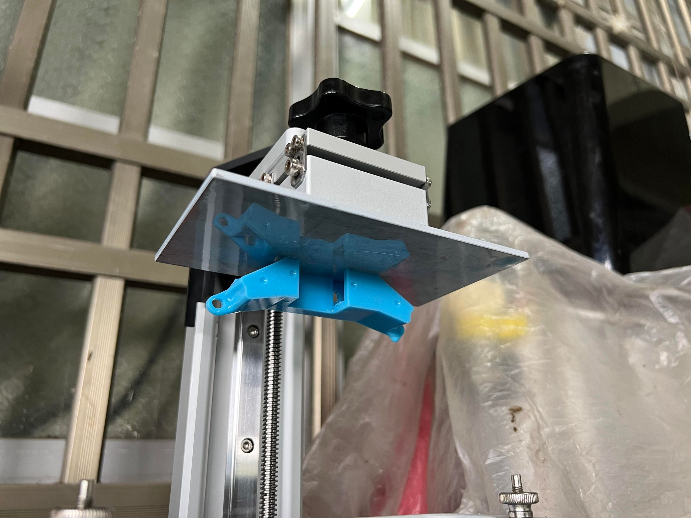
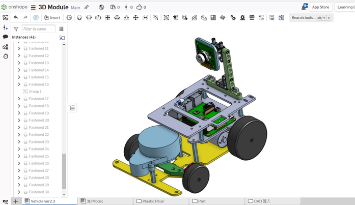

## 
2D Vehicle Models

- __The 2D models created for this competition are all designed using Onshape.__  

- ### Onshape Model Draft - Onshape

<table>
<tr>
<th>Vehicle Bottom</th>
<th>Vehicle Middle</th>
<th>Vehicle Top</th>
</tr><tr>
<td></td> 
<td></td> 
<td></td>
</tr>
</table>

 

- ### Panels Used for Vehicle Body

<table>
<tr>
<th>Bottom Layer </th>
<th>Biddle Layer</th>
<th>upper Layer</th>
</tr>
<tr>
<td></td>
<td></td>
<td></td>
</tr>
</table>

- ###  Operation of Laser-Cutting Machine

## 
3D Vehicle Models

## 3D Printing
- 3D printing is a manufacturing technology that transforms digital models into physical objects by layering materials one after another to create the object.
- We have chosen to use 3D printing for the fabrication of the car body due to its advantages over using a Laser Cutting Machine to cut wooden panels. 3D printing offers inherent structural integrity, eliminating the need for assembly steps and resulting in a more lightweight design.

<table>
<tr align="center">
<th>3D Photo file</th>
<th>top view</th>
<th>side view</th>
<tr align="center">
<td></td>
<td></td>
<td></td>
</tr>
</table>

<table>
<tr>
<th colspan="2">3D Printer</th>
</tr><tr>
<td></td>
<td></td>
</tr>
</table>

## Photocuring
- Photocuring is a process that uses ultraviolet (UV) or other visible light sources to cure specific materials. It is commonly used in fields such as 3D printing, coatings, and bonding, where materials undergo a chemical reaction under the exposure of light, transforming from liquid or semi-solid states to solid states.

- In 3D printing, photocuring is a common technique known as UV curing 3D printing. In this method, liquid resin is applied layer by layer on a build platform, and then exposed to UV light sources, causing each layer of resin to cure and gradually build up the shape of the object. This technology is capable of producing objects with high precision and complex structures.

- During the process of photocuring, photosensitizers are essential elements. Photosensitizers are substances that can absorb light energy and trigger chemical reactions. They are usually added to the resin. When light is directed onto the resin, photosensitizers absorb the light energy, initiating cross-linking reactions between molecules and transforming the liquid into a solid state.

- Photocuring technology is widely used in various fields, including product development, medical devices, jewelry, industrial manufacturing, and more. It enables high-precision, rapid, and customizable manufacturing, offering considerable flexibility in different materials and applications.

<table>
<tr align="center">
<th colspan="2"> Photocured 3D Printing</th>
<th> Light-curing Machine</th>
</tr><tr align="center">
<td></td>
<td></td>
<td></td>
</tr>
</table>

A stereolithography 3D printer may become unusable if not regularly maintained, as resin buildup can occur. Hence, regular cleaning is essential. To understand how to properly maintain the machine, we sought guidance from our senior, who graciously demonstrated the process to us.

Maintenance Process:

1. After printing is complete, the finished product will be stuck to the build plate.
2. Remove the build plate and wipe off the resin, being careful not to touch the finished product.
3. Rinse off easily removable supports with water.
4. Spray alcohol onto the finished product, making sure to reach every corner.
5. Wipe the finished product to remove excess resin.
6. Carefully detach the finished product using tools.
7. Use a knife to scrape away any remaining support material on the finished product.
8. Rinse off any fine residue with water.
9. Wipe the build plate clean of resin, and it's ready for the next print

<table>
<tr align="center">
<td></td>
<td></td> 
<td></td>
</tr>
<tr align="center">
<td></td>
<td></td>
<td></td>
</tr>
<tr>
<td></td>
<td></td>
<td></td>
</tr>
</table>

- Because the photocured parts are somewhat soft, we need to expose them to ultraviolet (UV) light for secondary curing, making the parts harder and less susceptible to deformation, which could affect the vehicle's movement.

<table>
<tr>
<th>Secondary Curing</th>
</tr><tr>
<td></td>
</tr>
</table>

## Comparison between Stacked 3D Printing and Photocuring 
The following data was obtained during the experiment when printing the Ackermann steering mechanism  

<table>
<tr align="center">
<th rowspan="2">Photo</th>
<th> Stacked 3D Printing Machine</th>
<th> Light-curing Machine</th>
</tr><tr align="center">
<td></td>
<td></td>
</tr><tr align="">
<td>The required printing time </td>
<td>Faster</td>
<td>Slower</td>
</tr><tr>
<td>Exterior</td>
<td>Exterior with signs of layering</td>
<td>Smooth</td>
</tr><tr>
<td>Hardness</td>
<td>Dependent on the density</td>
<td>Dependent on the exposure time</td>
</tr>
</table>

### Introduction to Onshape
- We used  Onshape, a free and user-friendly web-based design software, to design a 3D model of a self-driving car.
- After creating the model using Onshape, we were able to generate 2D flat dimension drawings and then proceeded to cut it with a laser cutting machine.
- The 3D/2D models created for this competition were all designed using Onshape.  
- Software Link：[On Shape](https://www.onshape.com/en/) 

|| |
|:---:|:---:|

# 
[Return Home](../../)
  
  
