

## 
3D Vehicle Model Design

 - The vehicle chassis used in this competition is our in-house, self-developed design. The following will introduce the vehicle chassis design and production process.
 - We use Onshape to design the 3D model structure of the vehicle, and based on the chassis's characteristics, we manufacture the necessary vehicle parts using equipment such as laser cutting machines and 3D printers.
- ### Onshape Model Draft
    

    <table>
    <tr>
    <th>3D Vehicle Model </th>
    <th>Vehicle Underfloor</th>
    <th>Vehicle Mid-Deck</th>
    <th>Vehicle Top Deck</th>
    </tr><tr>
    <td>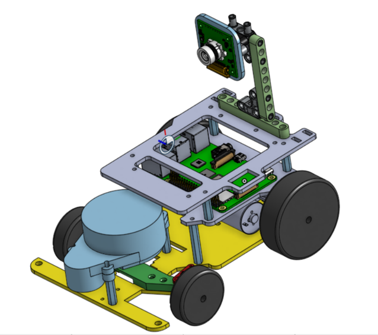</td> 
    <td>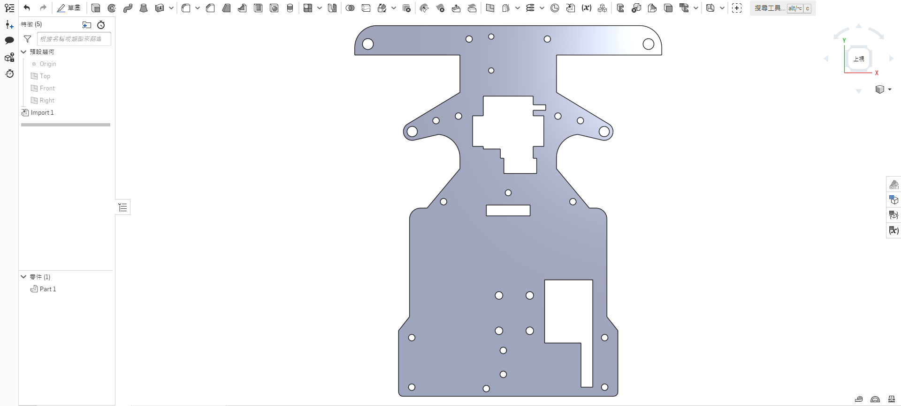</td> 
    <td></td> 
    <td>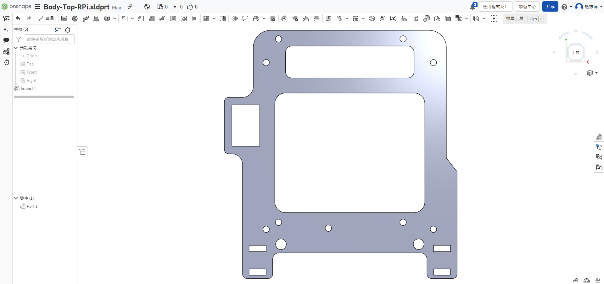</td>
    </tr>
    </table>
    
 
    

    <table>
    <tr>
    <th>3D Vehicle Chassis Design</th>
    <th>3D Vehicle Chassis Models</th>
    </tr><tr>
     <td></td> 
    <td></td> 
    </tr>
    </table>
    
 

  - #### Onshape Introduction
    - We use Onshape to design 3D models of self-driving cars. Onshape is a free and easy-to-use web-based CAD software.
    - After creating a model in Onshape, you can output a 2D dimension drawing, which can then be sent to a laser-cutting machine for cutting or converted and sent to a 3D printer for output.
    - All 3D/2D vehicle models created for this competition were designed in OnShape.
    - Software Website：[On Shape](https://www.onshape.com/en/) 

        || |
        |:---:|:---:| 

- ### The Production of Vehicle Chassis Panels Introduction - Using a laser-cutting machine
  - A laser-cutting machine is a device that utilizes a laser beam to cut materials. The laser beam has high energy density and can cut a variety of materials, including wood, metal, plastic, paper, and more, quickly and precisely.
  - We use the laser-Cutting machine provided by the school to produce the 'vehicle underfloor,' 'vehicle mid-deck,' and 'vehicle top deck' required for the vehicle chassis. We cut 3mm thick wooden boards according to the self-designed vehicle flat panel dimensions chart.  
  - We use lighter-weight wooden boards as the material for vehicle flat panels to reduce the vehicle's weight.  
  - Here is an introduction to the process of creating vehicle flat panels using a laser cutting machine.

    - ####  Operation of Laser-Cutting Machine
    

    - #### Vehicle Chassis Panels Dimensions Chart
        

        <table>
        <tr>
        <th>Lens Holder</th>
        <th>Vehicle Underfloor</th>
        <th>Vehicle Mid-Deck</th>
        <th>Vehicle Top Deck</th>
        </tr><tr>
        <td></td> 
        <td>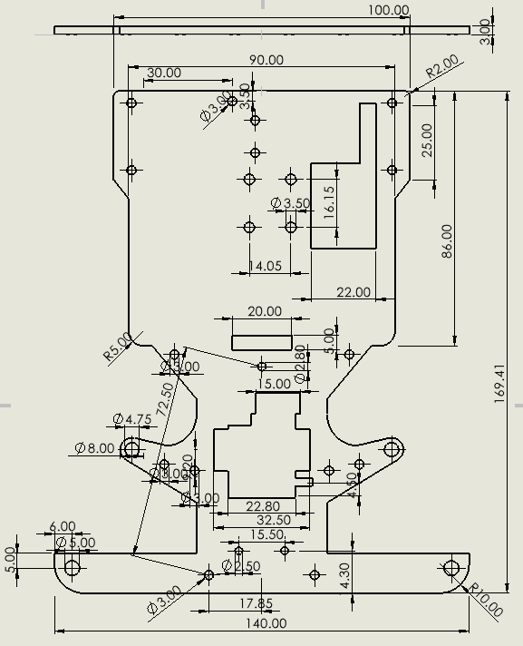</td> 
        <td>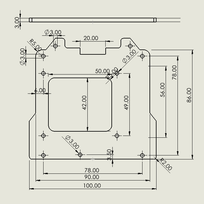</td> 
        <td>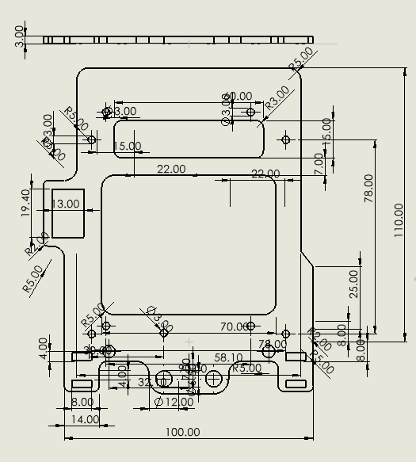</td>
        </tr>
        </table>
        
 

    - #### Vehicle Body Wooden Panels Produced Using a Laser Cutting Machine
        

        <table>
        <tr>
        <th>Lens Holder</th>
        <th>Vehicle Underfloor</th>
        <th>Vehicle Mid-Deck</th>
        <th>Vehicle Top Deck</th>
        </tr>
        <tr>
        <td></td>
        <td></td>
        <td></td>
        <td></td>
        </tr>
        </table>
        

- ### The Production of Vehicle Support Frames Introduction - Using a 3D Printer
    - 3D printing is a manufacturing technology that builds objects layer by layer using a digital model.
    - We chose to use a 3D printer to manufacture the vehicle body because, compared to commercially available LEGO, 3D printing offers the advantage of not being bound by original specifications, providing increased freedom and flexibility in design. In contrast to products cut with a laser cutting machine, 3D printed components eliminate assembly issues and offer advantages in terms of lightweight construction.
    - Here is an introduction to the process of producing vehicle support frames using a 3D printer.

  - #### Stacked 3D Printer
   
    

    <table>
    <tr>
    <th>The Operational Status of the 3D Printer</th>
    <tr></tr>
    <td> 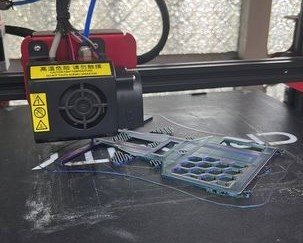 </td>
    </tr>
    </table>
    
    <table>
    <tr align="center"><th colspan="4">The 3D Model and Physical Prototype of the Vehicle Chassis Designed for this Competition<th></tr>
    <tr align="center">
    <td>3D Photo File</td>
    <td>Top View</td>
    <td>Side View</td>
    <td>Vehicle Chassis Damage</td>
    <tr align="center">
    <td></td>
    <td></td>
    <td>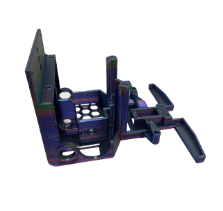</td>
    <td>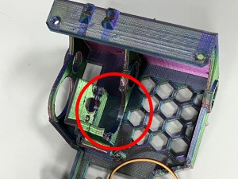</td>
    </tr>
    </table>
    

        
     - The vehicle chassis produced using the 3D printer mentioned above was found to be prone to damage during collisions due to motor torque. As a result, we switched to using a Stereolithography (SLA) 3D printer to manufacture the required support frames for the vehicle, ensuring that the same issue does not occur during the competition."

  - #### Stereolithography (SLA) 3D Printer 

    - The working principle of a stereolithography (SLA) 3D printer is to project a UV light source onto a vat of liquid resin. The light cures the resin layer by layer until the entire object solidifies, known for its high precision and surface smoothness. They are typically used to manufacture highly precise and intricately structured objects.

    

    <table>
    <th> Stereolithography (SLA) 3D Printer</th><tr></tr>
    <td></td>
    </tr>
    </table>
    

  - #### The process of using a Stereolithography (SLA) 3D Printer
    A stereolithography 3D printer may become unusable due to resin clogs if it is not regularly maintained, so it needs periodic cleaning. To understand how to maintain the machine, we sought advice from a senior student, who graciously gave us a hands-on demonstration.

    __Maintenance Process:__
    1. After the printing is complete, the finished product will be stuck to the build plate.
    2. Remove the build platform.
    3. Wipe off any resin adhering to the finished product.
    4. Clean the finished product with water.
    5. Spray alcohol to prevent an oily surface.
    6. Wipe off excess moisture and alcohol.
    7. Use a utility knife to remove the finished product from the platform.
    8. Remove any burrs from the finished product.
    9. Finally, clean the platform and restore the machine.

    

    <table>
    <tr>
    <td>Step 1</td>
    <td>Step 2</td> 
    <td>Step 3</td></tr>
    <tr align="center">
    <td></td>
    <td></td> 
    <td>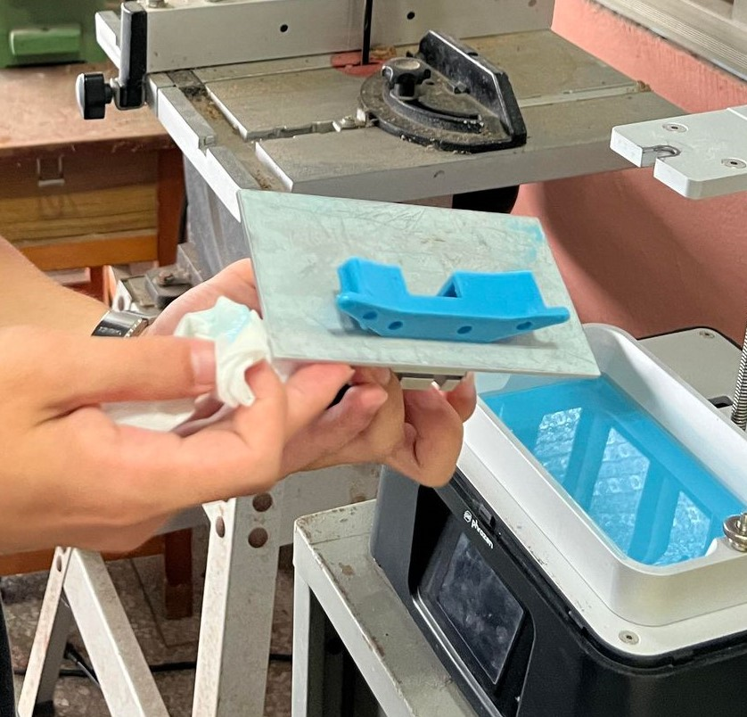</td>
    </tr>
    <td>Step 4</td>
    <td>Step 5</td> 
    <td>Step 6</td></tr>
    <tr align="center">
    <td></td>
    <td></td>
    <td>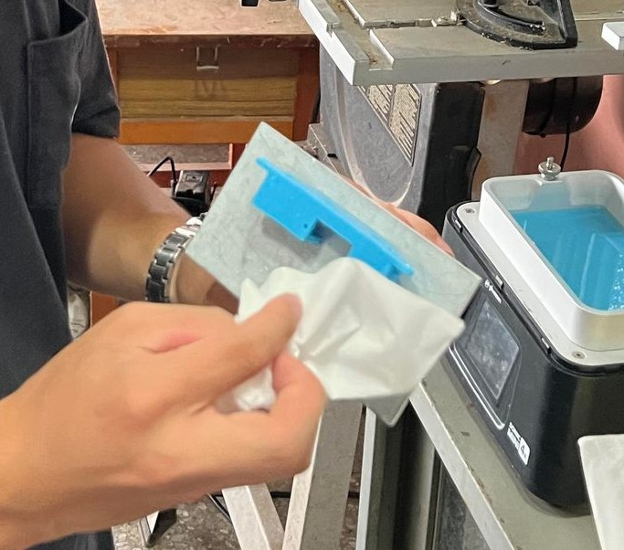</td>
    </tr>
    <td>Step 7</td>
    <td>Step 8</td> 
    <td>Step 9</td></tr>
    <tr>
    <td></td>
    <td></td>
    <td>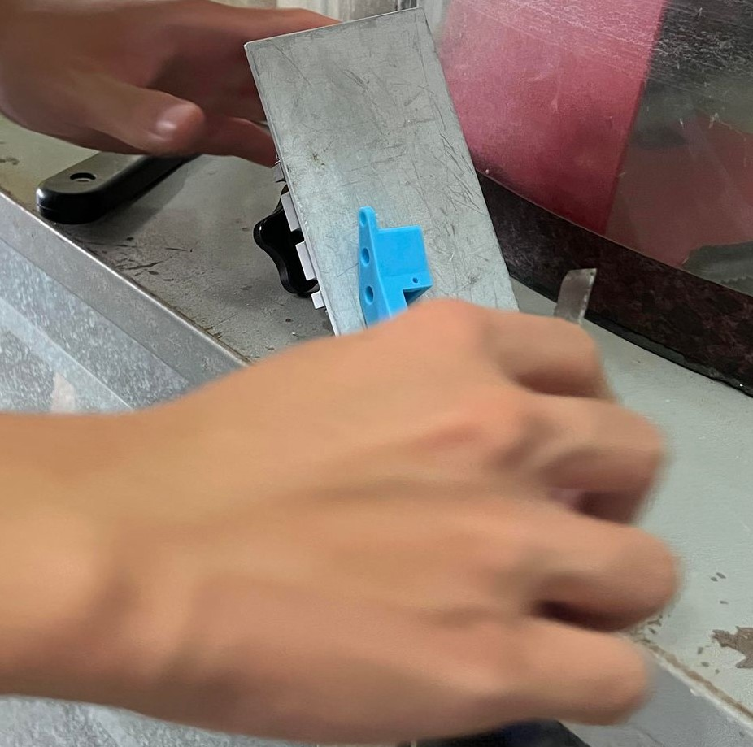</td>
    </tr>
    </table>
    

   - Because the photocured parts are somewhat soft, we need to expose them to ultraviolet (UV) light for secondary curing, making the parts harder and less susceptible to deformation, which could affect the vehicle's movement.  

   

    <table>
    <tr>
    <th>Secondary Curing</th>
    </tr><tr>
    <td>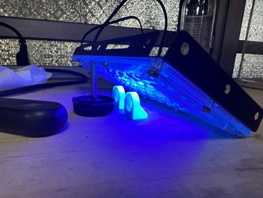</td>
    </tr>
    </table>
    

   - #### Comparison between Stacked 3D Printer and  Stereolithography (SLA) 3D Printer
     The following data was obtained during the experiment when printing the Ackermann steering mechanism. 
        

        <table>
        <tr align="center">
        <th rowspan="2">Photo</th>
        <th> Stacked 3D Printe</th>
        <th> Stereolithography (SLA) 3D Printer</th>
        </tr><tr align="center">
        <td></td>
        <td></td>
        </tr><tr align="">
        <td>The required printing time</td>
        <td>Faster</td>
        <td>Slower</td>
        </tr><tr>
        <td>Exterior</td>
        <td>Exterior with signs of layering</td>
        <td>Smooth</td>
        </tr><tr>
        <td>Hardness</td>
        <td>Dependent on the density</td>
        <td>Dependent on the exposure time</td>
        </tr>
        </table>
        

 - ###  Onshpae Modle Draft- 3D Vehicle Modles
    - The vehicle chassis used in this competition was designed and developed by us using Onshape.
    

    <table>
    <tr>
    <th>3D Vehicle Chassis Design</th>
    <th>3d Vehicle Models</th>
    </tr><tr>
    <td></td> 
    <td></td> 
    </tr>
    </table>
    
 

    - ####  3D Vehicle Model Dimension Diagram
      

      <table>
      <tr>
      <th>Front Assembly</th>
      <th>Steering Knuckle</th>
      <th>Center Bearing Holder</th>
      <th>Out Bearing Holder</th>

    </tr><tr>
      <td></td> 
      <td></td> 
      <td>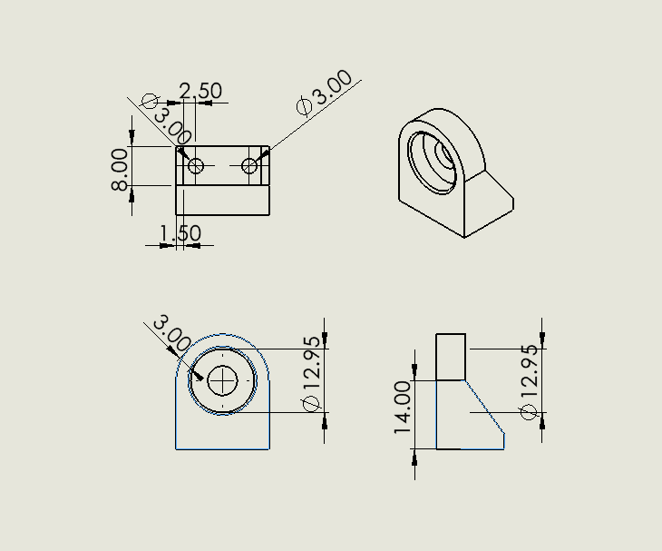</td>
      <td></td>
      </tr>
      </table>
      
 

  - ####  Vehicle body support components produced with Stereolithography (SLA) 3D Printer
      

      <table>
      <tr>
      <th>Front Assembly</th>
      <th>Steering Knuckle</th>
      <th>Bearing Holder</th>

      </tr><tr>
      <td>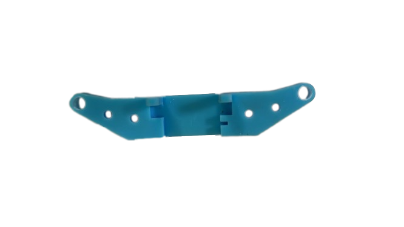</td> 
      <td>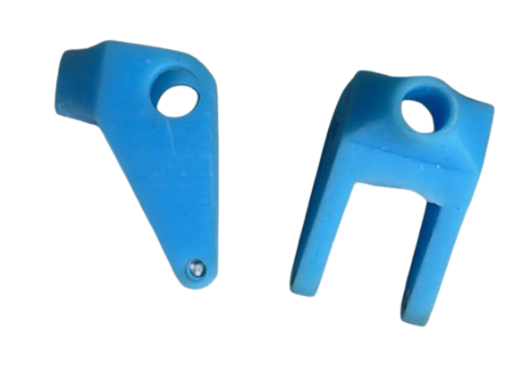</td> 
      <td>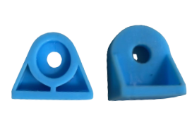</td>
      </tr>
      </table>
      
 

# 
[Return Home](../../)
  
  
