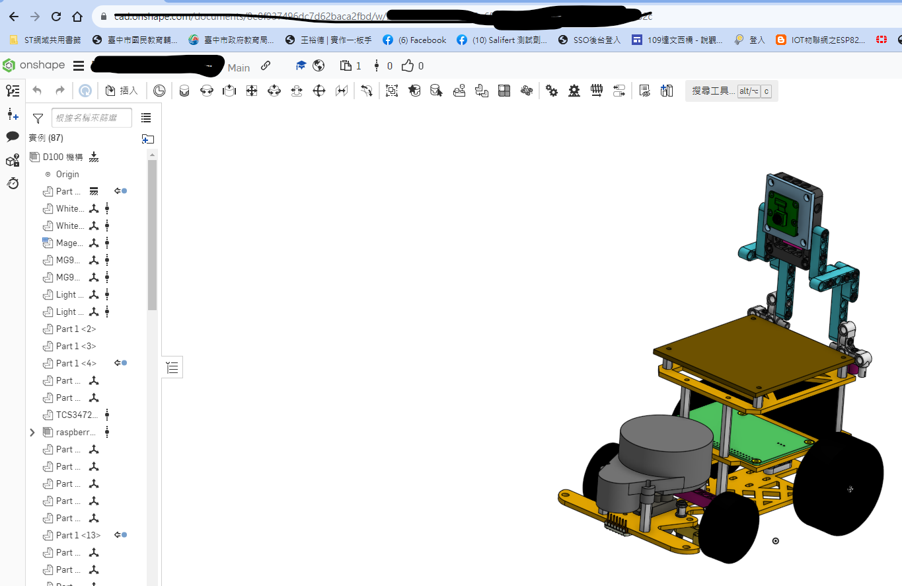

2023WRO Future Engineers Shinan Fire On All Cylinders  
====
## 
Vehicle 3D/2D Models

- ### Physical cutting of vehicle body panels

- ### 3D Printed Physical Diagram

- ###  Laser cutting machine operation

### Introduction to Onshape
- Using  Onshape to design a 3D model of a self-driving car. Onshape is a free and user-friendly web-based design software.
- After creating the model using Onshape, you can generate 2D flat dimension drawings and then proceed to cut it with a laser cutting machine.
- The 3D/2D models created for this competition are all designed using Onshape.  
- Software link：[On Shape](https://www.onshape.com/en/) 

  
|| |
|:---:|:---:|

# 
[Return Home](../../)
  
