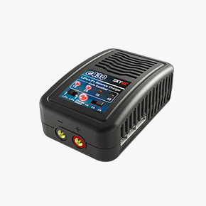
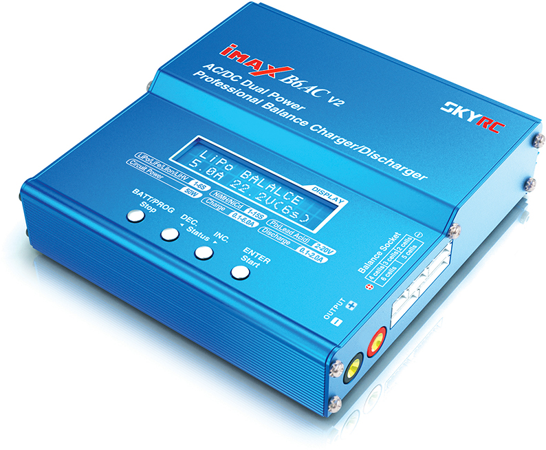

LiPo Battery Safety Notice
====
- 這裡說明鋰電池的危險、如何保養及成分  
    - 危險
        - 可燃燒  
        - 內容物有毒
        - 操作不當會使電子物件燒毀
    - 保養
        - 避免在陽光直射、高溫等環境充電  
        - 周遭避免放置可(易)燃物。  
        - 完成充電時記得移除充電電源，避免過充。   
        - 使用時勿過度放電，以免降低電池壽命。  
        - 嚴禁敲打、摔碰及撞擊。
    - 成分
        - 聚合物電解質：鋰聚合物電池使用聚合物作為電解質，取代了傳統鋰離子電池中的有機溶劑電解質。這種聚合物電解質具有高離子導電性和化學穩定性，能夠有效地傳導鋰離子並防止電池內部短路。

        - 聚合物薄膜隔離層：鋰聚合物電池通常使用聚合物薄膜作為隔離層，用於隔開陽極和陰極，防止直接接觸。

        - 陽極（Anode）：陽極通常由碳材料製成，例如石墨或其他碳化合物。當充電時，鋰離子會從陽極釋放出來，並在放電時返回陽極。

        - 陰極（Cathode）：陰極是鋰聚合物電池中最重要的成分之一，它通常由含有鋰的金屬氧化物或磷酸鹽材料製成，類似於傳統鋰離子電池的陰極。

        - 鋰鹽：鋰聚合物電池的電解質中包含鋰鹽，用於增加電解質的導電性。

        - 電極連接器：鋰聚合物電池內部的電極通常由薄片狀的鋰合金材料製成，並使用連接器連接到電池的外部電路。
  
- 低電壓警報器及充放電的設備
    - 低電壓警報器

    - 充放電設備
        - skyrc e430  
          

        - skyrc imax b6ac v2  
          

- (圖片檔放OTHER/LiPo_Batter)  

<small>資料來源:[台南市政府消防局](https://119.tainan.gov.tw/News_Content.aspx?n=25497&s=7743170) </small>  
# 
[Return Home](../)
