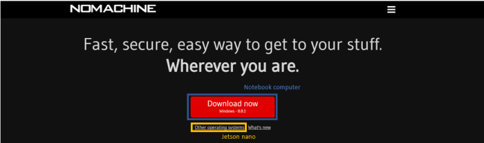
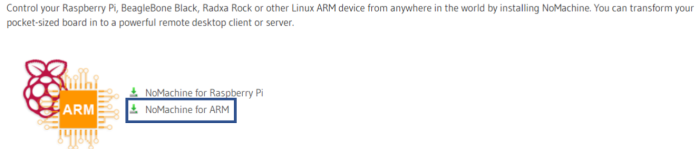
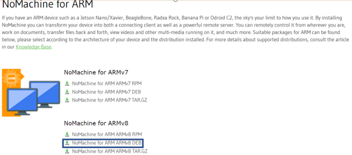

# 
Introduction to NoMachine (nomachine介紹)
 

 # ＮoMachine
 
- NoMachine is a remote desktop application that allows users to access and control computers from different locations. This application is available for multiple operating systems, including Windows, macOS, and Linux. Here are the key features and advantages of NoMachine:

  Remote Desktop Control: NoMachine allows you to access and control remote computers from anywhere, enabling you to operate them as if you were sitting in front of them.

  Multi-Platform Support: It is compatible with various operating systems, making it usable on a wide range of computers and devices.

  High Performance: NoMachine delivers exceptional performance, supporting smooth multimedia streaming and high-resolution graphics.

  Security: It offers robust security features, including encrypted communication, to ensure the protection of your data during remote transmissions.

  File Transfer: You can easily transfer files between your local computer and the remote one without the need for additional tools.

  Collaboration and Remote Assistance: NoMachine is well-suited for remote collaboration and technical support. You can share your desktop with remote users to better understand and resolve issues.

- We need this feature because we may not always have a screen connected to the Jetson Nano, so using NoMachine allows us to operate it directly from our laptop, which is very convenient.

- When using the Raspberry Pi, I used VNC, and we also tried using it for remote access to the Jetson Nano. However, we found that there were significant latency issues, so ultimately, we chose to use NoMachine.

- __Here are the installation steps:__

  1. Install NoMachine on both your notebook computer and Jetson Nano.
    
  2. Select the installation version for Jetson Nano.
    
    
    

  3. Simply connect Jetson Nano and your notebook computer via IP to use it.

   
