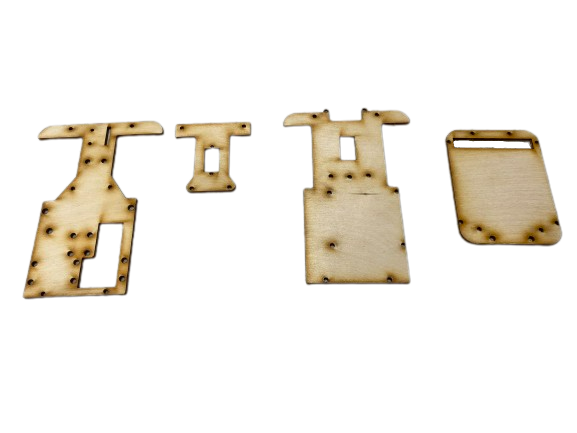

2023WRO Future Engineers Fire On All Cylinders  
=====
# 
Work Diary (工作日誌)
 

## 2023/03/19 ~ 2023/03/26  
**member:** ZHAO,ZHEN-BO  
**content:**  

上網找如何製作自走車及參考美國的技術報告

| [Donkey Car 官網](http://docs.donkeycar.com/)| [Donkey Car 技術文件](http://docs.donkeycar.com/) |
| :---: | :---: |
|   |  |

## 2023/03/27 ~ 2023/04/02
**member:** ZHAO,ZHEN-BO、LIN,JHONG-BIN  
**content:** 

- After reading the rules, We started to choose the controller. After watching the previous competitions, we found that most of them are raspberry pi but there are also jeston nano, so I decided to choose one of these two. In the end, I chose raspberry pi 4B because of its smaller size and cheaper price than jeston nano.  

- 在閱讀完規則後，開始挑選控制器，因為看過歷屆的比賽，發現大多都是 raspberry pi ，但也有 jeston nano ，因此決定在這兩種裡挑一種，最後選擇了 raspberry pi 4B ，因為體積比較小而且價格也比 jeston nano 便宜  

| raspberry pi 4 B 8G | Jeston Nano |
| :---: | :---: |
|   |  |

## 2023/04/03 ~ 2023/04/09  
**member:** ZHAO,ZHEN-BO 
**content:**  

- While waiting for the Raspberry Pi to be initialized and the library to be installed, there are two motors to choose as power, namely GA25-370 and JGA16-050. The former has the advantage of large torque and can drive heavy objects. The latter has the advantage of small size and light weight, but the torque is relatively small. Considering that the body may be heavier, I chose the GA25-370 with higher torque.  
- When testing the operation of the motor, simply providing positive and negative poles does not effectively control the GA25-370's movements, and it cannot adjust its speed. Therefore, a motor controller is required to regulate the speed of the DC reduction motor. There are two options: the L293D chip and the L298N module. To reduce weight, we opted for the smaller L293D chip. Its compact size allows us to install more sensors, saving space, reducing weight, and enhancing the robot's maneuverability.

- 在等待初始化樹梅派及安裝函式庫時，挑選作為動力的馬達，有兩種，分別是 GA25-370 和 JGA16-050，前者的優點是扭力大，可以帶動較重的物體，後者的優點是體積小，重量也比較輕，但是扭力相對較小，由於考慮到機體可能會比較重，所以選了扭力較大的 GA25-370   
- 在測試馬達的作動方式時，單純的提供正負極並沒有辦法很好的控制GA25-370的作動，無法調節速度，因此還需要馬達控制器來調節直流減速馬達的速度，有兩種選擇：L293D晶片和L298N模組。為了減輕重量，我們選擇了體積較小的L293D晶片。它的小巧尺寸使我們能夠安裝更多的感應器，進而節省空間、減輕重量，並增加機器人的機動性。

| GA25-370 | JGA16-050 |
| :---: | :---: |
|   |  |

| L293D | L298N |
| :---: | :---: |
|   |  |

## 2023/04/10 ~ 2023/04/16  
**member:** ZHAO,ZHEN-BO、LIN,JHONG-BIN、Hu,Yun-Ruei
**content:**  

- 由於車輛需要不斷的移動，因此需要將電力來源改成電池，考慮到馬達需要12V的電壓才能使用，要挑選電壓為12V、電流為3V的電池，所以有鋰離子電池(18650)和鋰聚合電池(3S)兩種，但是18650重量較重，佔據空間也比較大，因此選擇了離聚合電池
- 但是樹梅派最大電壓只能到5.2V，因此還需要藉由降壓板來壓低電壓，才不會造成樹梅派的燒毀，我們本來打算使用有數值顯示的降壓板，因為有數值顯示我們就能看到目前輸出電壓的大小，但是最大安培只能接受3A，因此我們選擇了能接受5A的

## 2023/04/17 ~ 2023/04/23
**member:** ZHAO,ZHEN-BO、LIN,JHONG-BIN、Hu,Yun-Ruei  
**content:**  

 The next step is the steering motor. After searching the information on the Internet, I found that MG90S and SG90 are commonly used. The difference between MG90S and SG90 is that the front gear is metal, and the latter is plastic. Because we often need to rotate all the time, we choose MG90S, which is not easy to damage  

接下來就是轉向馬達，在網上查找資料後，發現常用的是 MG90S 跟 SG90 兩種，MG90S 跟 SG90 的差異是前者是齒輪式金屬，後者是塑膠，因為我們常需要一直旋轉，因此選擇就不容易損壞的 MG90S   

| MG90S | SG90 |
| :---: | :---: |
|   |  |

## 2023/04/24 ~ 2023/04/30
**member:** ZHAO,ZHEN-BO、LIN,JHONG-BIN、Hu,Yun-Ruei  
**content:**

- When the vehicle is uncertain about the distance ahead, it cannot turn in time when encountering a wall. Therefore, ultrasonic sensors have been added to enable the vehicle to turn before colliding with the wall. 
- Based on the experiments conducted, it has been found that ultrasonic sensors can only detect obstacles in front of the vehicle. Additionally, they are less effective in detecting distances while the vehicle is swaying from side to side. Therefore, it has been decided to adopt a 360-degree LiDAR sensor for detecting distances in front of, as well as to the left and right sides of the vehicle.

- 車輛在不知道前方距離時，無法在遇到牆壁及時轉彎，因此加上了超音波，這樣就可以在撞到牆之前轉彎。 
- 經實驗得知，超音波只能偵測前方障礙物距離，且在車輛左右晃動下，不容易偵測距離，因此改採用可以360度偵測的光達感測器，來當車輛的前方、左右邊的距離。

| ultrasound | ydlidar x2 |
| :---: | :---: |
|  | |

## 2023/05/01~ 2023/05/07  
**member:** ZHAO,ZHEN-BO、LIN,JHONG-BIN、Hu,Yun-Ruei  
**content:**  
- To begin assembling the machine, I used LEGO parts from the club to build the base. I attached the motors, Raspberry Pi, and other components onto the chassis and made the machine functional.
After the vehicle becomes operational, additional sensors are added to allow the vehicle to sense its surroundings and respond accordingly based on the mission requirements.
- While moving the robot, I noticed that using LEGO blocks for construction resulted in slower and sometimes stuck movements. Therefore, I switched to using a laser cutter to cut wooden boards. With the use of wooden boards, the overall weight of the robot decreased, leading to increased speed and improved energy efficiency. Additionally, I can adjust the size and position of the wooden components based on specific requirements. Unlike LEGO blocks, which come pre-built and often require continuous modifications to fit the robot's needs, wooden boards offer more flexibility and can be custom-designed using Onshape.

- 我們要先組裝機器，所以我就利用社團的樂高零件先組底座，將馬達和樹梅派等裝上車，讓車輛得以行使。
在車輛可以行駛之後，再加上其他的感測器，讓車輛能夠感測場地環境，再根據任務所需做出反應
- 在測試的時候我發現用樂高積木的移動速度不快，轉彎時還會因為重量過重而無法成功轉彎，因此改用雷切機切割木板，換成木板重量變輕了，因此速度也變快了，所以也比較省電，而且還可以根據需求調整尺寸和和位置，不像樂高已經做好了，為了配合還要一直改裝，但是木板可以利用 Onshape 自行繪畫調整。

|  | |
| :---: | :---: |

## 2023/05/08 ~ 2023/05/14  
**member:** ZHAO,ZHEN-BO、LIN,JHONG-BIN、Hu,Yun-Ruei  
**content:**

- TCS34725 color sensor 
  - In the competition, vehicles need to demonstrate more functionalities than just turning. To achieve clockwise and counterclockwise turns, we must equip the vehicle with a color sensor to detect the colors of the lines on the ground and make appropriate judgments accordingly. Therefore, we must be particularly cautious in selecting the color sensor.
  - The TCS34725 color sensor has been chosen because it meets all the requirements of this competition. Firstly, it possesses outstanding sensing capabilities, allowing it to quickly and accurately identify the colors of the ground lines. 
  - Secondly, the sensor is thin and compact, enabling it to be placed close to the ground without interfering with the vehicle's movements.
  - The high precision of this sensor ensures that the vehicle can accurately recognize the colors of the ground lines and execute clockwise or counterclockwise turns as needed. 
  - This is a crucial factor in the vehicle's excellent performance and victory in the competition.In conclusion, the TCS34725 color sensor is a perfect fit for the requirements of this competition. 
  - Its slim design and highly accurate color recognition capabilities enable the vehicle to adapt flexibly to changes in ground lines, achieve clockwise and counterclockwise turns, and enhance its performance in the competition. 
- I encountered a bottleneck when using the color sensor to detect lines because I was unsure how to write a Python program to detect the values of blue and orange lines. With the guidance of my teacher, I successfully completed it. The partial code is as follows:
- During the implementation testing, it was discovered that we originally used a USB 180-degree adapter (as shown in the lower left image), but it was prone to colliding with obstacles, particularly building blocks. As a result, we made a change and switched to using a USB 3.0 90-degree adapter for the connection. This modification makes it less likely to accidentally hit obstacles when trying to avoid them.

- TCS34725 顏色感測器 
 - 車輛在競賽中需要展現更多功能，而僅僅懂得轉彎是不夠的。為了實現順時針和逆時針的轉彎，我們必須裝備車輛以感測地上線的顏色，並相應地做出適當的判斷。因此，我們在挑選顏色感測器時，要特別謹慎。
 - TCS34725 顏色感測器被選中是因為它滿足了此次競賽的所有要求。首先，它具有出色的感測功能，可以快速而準確地辨識地面線條的顏色。其次，這款感測器相當薄且小巧，這意味著它可以輕鬆貼近地面，不會對車輛的運行造成任何干擾。
 - 該感測器的高度精確度確保了車輛可以準確識別地面線條的顏色，並且根據需要執行順時針或逆時針的轉彎動作。這是車輛在競賽中表現出色並獲得優勝的關鍵因素之一。
 - 綜上所述，TCS34725 顏色感測器是一款完美符合本次競賽要求的感測器。它的薄型設計和高度精確的顏色識別功能使車輛能夠靈活適應地面線條的變化，實現順時針和逆時針的轉彎，從而提升了車輛在競賽中的表現。
- 在使用顏色感測器偵測線時遇到瓶頸，因為不知道如何使用python撰寫程式來偵測藍、橘線的數值，經過老師指導，成功完成，片段程式如下。
- 在實作測試時發現，本來我們是使用usb 180度轉接頭(如左下圖)，但容易撞到積木，因此我們改成使用 usb3.0 90 度轉接頭來連接，就不容易避開障礙物時碰到障礙物。
 
|片段程式|定義成函數|
| :---: | :---: |
|||

| ||
| :---: | :---: |

|| |
| :---: | :---: |

## 2023/05/15 ~ 2023/05/21  
**member:** ZHAO,ZHEN-BO、LIN,JHONG-BIN、Hu,Yun-Ruei  
**content:**

為了能夠讓機器閃避積木，因此我們需要在車輛上加裝鏡頭，由於我們使用的控制器是raspberry pi，因此我們需要找與其相符的鏡頭，因此我們找到了三種鏡頭

1. raspberry pi camera Rev 1.3(傳感器:OmniVision OV5647)
2. raspberry pi camera Module V2(傳感器:Sony IMX219)
3. raspberry pi camera Module V3(傳感器:Sony IMX708)

由於V3與我們raspberry pi的作業系統不符，因此不採用，而1.3的偵率只有30p，而V2最高達到90p，因此最後我們選擇了raspberry pi camera Module V2。

|  |  |  |
| :---: | :---: | :---: |
| raspberry pi camera Rev 1.3 | raspberry pi camera Module V2 | raspberry pi camera Module V3 |

在之後測試時，發現當汽車閃避積木時無法預判下一個積木的位置，因此我們將原本的鏡頭改裝成廣角，相比原本的72度的視野範圍，廣角的160度範圍大，能夠提前預判下一積木的位置

| 原本的 | 加裝廣角後 |
| :---: | :---: |
|||
|  |  |

raspberry pi camera Module V2 可以選擇三種解析度

  1. 1080x640 幀率30p
  2. 640x320 幀率60p
  3. 320x240 幀率90p

當解析度為1080x640時，由於解析度高，因此程式需要耗費大量的時間去辨識積木，會降低程式的運算效率，而當解析度為320x240時，雖然預算效率極高，但是由於解析度過低，因而無法正常辨識積木，然而當解析度為640x320時，可以正常辨識積木，而且運算效率也不會太慢導致撞上積木

## 2023/05/22 ~ 2023/05/28  
**member:** ZHAO,ZHEN-BO、LIN,JHONG-BIN、Hu,Yun-Ruei  
**content:**

再轉寫技術文件時，

## 2023/05/29 ~ 2023/06/04  
**member:** ZHAO,ZHEN-BO、LIN,JHONG-BIN、Hu,Yun-Ruei  
**content:**
(開始測試)

## 2023/06/05 ~ 2023/06/11 
**member:** ZHAO,ZHEN-BO、LIN,JHONG-BIN、Hu,Yun-Ruei  
**content:**

## 2023/06/12 ~ 2023/06/18
**member:** ZHAO,ZHEN-BO、LIN,JHONG-BIN、Hu,Yun-Ruei  
**content:**

## 2023/06/19 ~ 2023/06/25   
**member:** ZHAO,ZHEN-BO、LIN,JHONG-BIN、Hu,Yun-Ruei  
**content:**
(修正程式)

## 2023/06/26 ~ 2023/07/02 
**member:** ZHAO,ZHEN-BO、LIN,JHONG-BIN、Hu,Yun-Ruei  
**content:**

## 2023/07/03 ~ 2023/07/09 
**member:** ZHAO,ZHEN-BO、LIN,JHONG-BIN、Hu,Yun-Ruei  
**content:**

## 2023/07/10 ~ 2023/07/16 
**member:** ZHAO,ZHEN-BO、LIN,JHONG-BIN、Hu,Yun-Ruei  
**content:**

- Although it is possible to move straight and turn using the ultrasonic sensor, there is a risk of scraping against walls and getting stuck at corners. Therefore, we replaced the ultrasonic sensor with a lidar, which can detect the surroundings and maintain the robot in the center of the road. With the lidar, it can also detect turns ahead.  
- However, during the actual testing of the YDLIDAR X4 and DLIDAR X2, we also encountered the issue of missing angles (as shown in the attached image). Therefore, in this competition, we decided to use the D100 sensor for vehicle detection and measuring the distance to the side walls. The results obtained from the D100 sensor met our expectations and requirements.

- 雖然可以直行和利用超音波轉彎，但是有可能轉彎時擦到牆壁，然後卡牆邊無法繼續運行，之後我們將超音波改成了光達，光達可以偵測四周，因此可以維持在道路中央，還可以偵測前方轉彎。
- 然而我們在實測光達時也發現了ydlidar x4、dlidar x2 所遇之缺角問題(如附圖所示)因此，在本次競賽中，我們決定採用D100感測器來進行車輛偵測場邊牆距離，並且使用的結果符合預期的需求。

|  |  |
| :---: | :---: |

## 2023/07/17 ~ 2023/07/23  
**member:** ZHAO,ZHEN-BO、LIN,JHONG-BIN、Hu,Yun-Ruei  
**content:**

The robot is now able to operate normally. The next step is to use the camera to avoid obstacles (blocks). First, we need to detect the distance to the blocks, and then identify the color of the blocks. By leveraging OpenCV's functionality, we can draw virtual lines to help with obstacle avoidance. Using the virtual line and the distance to the blocks, along with an algorithm, we can steer the front wheels to avoid the obstacles.

However, there is an issue at the corners where the robot cannot avoid obstacles in a timely manner. To address this, we need to combine the gyroscope's readings with the output values from the algorithm to successfully navigate around corners

機器人現在能夠正常運行。接下來的步驟是使用攝影機來避開障礙物（積木）。首先，我們需要偵測到障礙物（積木）的距離，然後辨識積木的顏色。透過利用OpenCV的功能，我們可以畫出虛擬線來協助避開障礙物。使用虛擬線和障礙物的距離，再加上一個演算法，我們可以操縱前輪來避開這些障礙物。  

然而，在轉彎處有一個問題，機器人無法及時避開障礙物。為了解決這個問題，我們需要將原本方向的數值與演算法的輸出值結合起來，以成功地在轉彎處繞過障礙物。
| lidar D100  |  ydlidar x4  |   ydlidar x2    |      
|:----: | :----: | :----:|
||||

## 2023/07/24 ~ 2023/07/30  
**member:** ZHAO,ZHEN-BO、LIN,JHONG-BIN、Hu,Yun-Ruei  
**content:**

- We made significant progress in our project. We successfully organized and listed the components in the parts inventory, and we uploaded it to the technical documentation. Additionally, we completed the drawing of the vehicle's introduction diagram. Throughout this process, we embarked on a learning journey, gradually familiarizing ourselves with GitHub syntax. Although we are not yet fully proficient in using GitHub, we dedicated time to researching relevant information online and steadily improving our skills. These achievements have brought valuable advancements to our report and project as a whole.
- Over these few days, we have been continuously adjusting and fine-tuning the execution of venue tasks, making constant adjustments to motor speed and various parameters in the hopes of effectively reducing the error rate. We are eager to achieve better performance and improve our overall competition results.
- During practical testing, we discovered that the vehicle was getting stuck at the junctions of the terrain due to protrusions, which was affecting its normal operation. To address this issue, we adopted a method of using a laser cutting machine to create 3mm thick spacers. These spacers were then placed under the vehicle chassis to elevate its height, enabling the vehicle to pass over the obstacles smoothly.

- 我們完成了將零件清單整理並列點，並上傳至技術文件中。此外，我們也完成了車體的介紹圖的繪製工作。在這個過程中，我們逐步學習了GitHub語法的使用並逐漸熟悉它。儘管對GitHub的使用不是很熟練，但我們努力在網上查詢相關資訊，並逐步提高了技能水平。這些進展為我們的報告帶來了寶貴的進步。
- 這幾天我們持續調整及修正場地任務執行，不斷地進行馬達速度和各項參數的微調，期望能有效降低失誤率，期待能夠取得更好的表現並提高整體競賽成績。
- 在進行實際測試時，我們發現車輛在場地圖交界處因凸起而出現卡車的情況，這影響了車輛的正常運行。為了解決這個問題，我們採取了一個方法，使用雷切機切割出3mm厚的墊片，並將其放置在車身底部，從而將車身撐高，以便車輛能夠順利通行。

#### Overcoming Terrain Protrusions (克服場地凸起)

|   |    |    |
| :---: | :---: |:---: |
| |||
| |||

### Team Members' Practice Status(隊員練習狀況)

| ||
| :---: | :---: |

| ||
| :---: | :---: |

## 2023/07/31 ~ 2023/08/06
**member:** ZHAO,ZHEN-BO、LIN,JHONG-BIN、Hu,Yun-Ruei  
**content:**

## 2023/08/07 ~ 2023/08/13
**member:** ZHAO,ZHEN-BO、LIN,JHONG-BIN、Hu,Yun-Ruei  
**content:**

## 2023/08/14 ~ 2023/08/20
**member:** ZHAO,ZHEN-BO、LIN,JHONG-BIN、Hu,Yun-Ruei  
**content:**

# 
[Return Home](../../)
 

