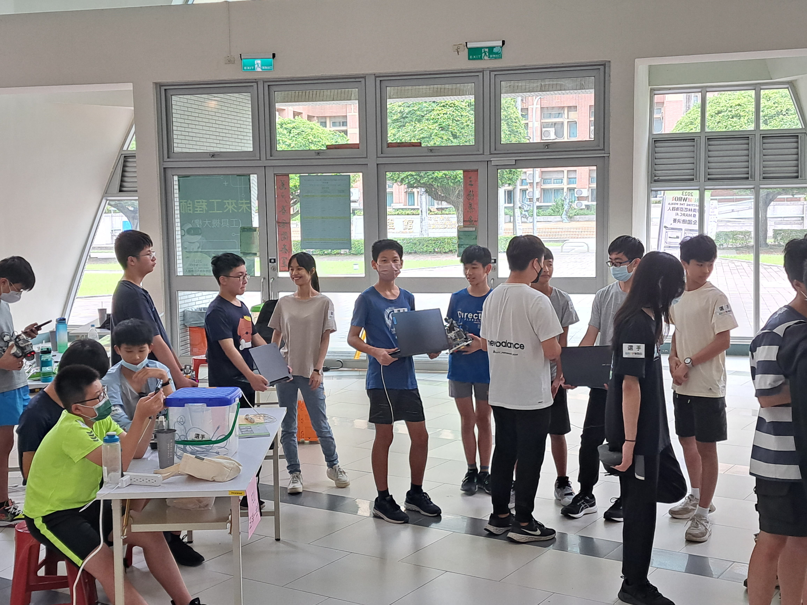

2023WRO Future Engineers Shinan Fire On All Cylinders  
=====
# 
Work Diary 
 

## 2023/07/31 ~ 2023/08/06
**member:** ZHAO,ZHEN-BO、LIN,JHONG-BIN、Hu,Yun-Ruei  
**content:**  

- As the deadline for submitting the technical report is next week, we have begun revising the content of the technical documentation. We are also adjusting the website according to the official grading criteria and continuously adding to the technical report.
- Complete recording videos for each task and upload them to YouTube.

<table>
<tr align="center">
<th> old directory </th>
<th> Revised Directory (Upper Section) </th>
<th> Revised Directory (Lower Section) </th>
</tr>
<tr align="center">
<td> </td>
<td> </td>
<td> </td>
</tr>
</table>

  __Open Challenge__
  - [Open Challenge Full Narrow speed 70%](https://youtu.be/QtpuHt05MDg)
  - [Open Challenge Full Narrow speed 50%](https://youtu.be/QaYUrrdAtE8)
  - [Open Challenge Half width and half narrow speed 70%](https://youtu.be/pcTpH8QgJFU)
  - [Open Challenge Half width and half narrow speed 50%](https://youtu.be/7HdWxfWPfWc)
  - [Open Challenge All Width speed 70%](https://youtu.be/MA1k2P87LdE)
  - [Open Challenge All Width speed 50%](https://youtu.be/OUg0x4Qdc0c)  

 __Open Challenge__
  - [Obstacle Challenge speed 50% ](https://youtu.be/Jo7555gfXG8)
  - [Obstacle Challenge speed70% ](https://youtu.be/iCmcXbACizY)

__Team Members' Practice Status__

<table>
<tr align="center">
<th>Report writing</th> 
<th>Mechanism adjustment</th>
<th>Report writing</th>
<th>Field mission practice</th>
</tr>
<tr align="center">
<td></td>
<td></td>
<td></td>
<td></td>
</table>

## 2023/08/07 ~ 2023/08/13
**member:** ZHAO,ZHEN-BO、LIN,JHONG-BIN、Hu,Yun-Ruei  
**content:**

This week, with our machine now adjusted to smoothly complete the mission race on the field, we have begun filming an introductory video for the race. In the video, we will showcase the actions our vehicle performs during the mission race, providing explanations through subtitles synchronized with the video.

<table>
<tr align="center">
<th>modifying code and testing vehicles</th>
<th>currently editing videos</th>
</tr><tr align="center">
<td></td>
<td></td>
</tr><tr align="center">
</table>

<table>
<th>mission race introduction video</th>
</tr>
<td>

</td>
</table>

## 2023/08/14 ~ 2023/08/20
**member:** ZHAO,ZHEN-BO、LIN,JHONG-BIN、Hu,Yun-Ruei  
**content:**

As the competition is scheduled for this week, we have intensified our practice efforts, trying out various scenarios and adjusting our program to adapt to a wide range of situations. Experimenting with different scenarios has the advantage of helping us anticipate challenges that our machine might face and making necessary adjustments in advance. Here's our practice approach:

- We have assigned lane labels A, B, C, and D. Each lane is divided into three sections, with placement points for blocks both on the inner and outer sides in each section. Red blocks indicating turning conditions will be placed sequentially, while the positions of other blocks will be randomized.
- The record sheet will include the following information:
  1. Completion time
  2. Number of successful attempts/number of failed attempts
We believe that this approach will assist our machine in preparing for a variety of scenarios, ensuring that we are well-prepared for the competition. 

<table>
<tr align="center">
<th>Field Setup</th>
<th>Record Sheet</th> 
</tr>
<tr align="center">
<td></td>
<td></td>
</table>

  

- Today is 8/19,our match day. In the first half of the qualifying round, due to our Request for Maintenance during the initial round, the score was reduced by 50%, resulting in our obtaining 15 points. In the second round, we successfully completed it and achieved a full score of 30 points, allowing us to advance to the second half of the obstacle course. During the first obstacle race, our robot hit the wall and stopped due to excessive avoidance; fortunately, after adjustments, the second attempt by our team resulted in a perfect score. This marked a successful conclusion to today's competition.

<table>
<tr align="center">
<th>Waiting for test</th>
<th>Competition photo</th> 
<th>Award-winning photo</th>
</tr>
<tr align="center">
<td></td>
<td></td>
<td></td>
</tr>
</table>

## 2023/08/21 ~ 2023/08/27
**member:** ZHAO,ZHEN-BO、LIN,JHONG-BIN、Hu,Yun-Ruei  
**content:**

As we have confirmed our participation in the international competition, we are undergoing significant modifications to our vehicle. We are transitioning from the use of wooden boards to a 3D-printed chassis for a more integrated structure, optimizing the space available. Moreover, this redesign will allow us to incorporate threaded components for added stability. Additionally, we are upgrading the controller from Raspberry Pi 4B to the higher computing power provided by the Jetson Nano microcomputer. The Jetson Nano supports programming in Python, thus most of our existing code does not need significant modifications. However, one notable difference with the Jetson Nano is that the generation of PWM signals requires an external board for implementation.

<table>
<tr align="center">
<td rowspan="2">Controller</td>
<td>Jeston Nano</td>
<td>Raspberry Pi 4B</td>
<tr align="center">
<td></td>
<td></td>
</tr>
<tr align="center">
<td>Computational efficiency</td>
<td>472 GFLOPs</td>
<td>13.5 GFLOPs</td>
</table>

<small>Data source</small>  
<small>[Taiwansersor](https://www.taiwansensor.com.tw/product/nvidia-jetson-nano-developer-kit-%E4%BA%BA%E5%B7%A5%E6%99%BA%E6%85%A7%E9%96%8B%E7%99%BC%E5%A5%97%E4%BB%B6-ai-%E9%96%8B%E7%99%BC%E5%A5%97%E4%BB%B6/)</small>  
<small>[University of Maine System](https://web.eece.maine.edu/~vweaver/group/green_machines.html)</small>

# 
[Return Home](../../)
 
