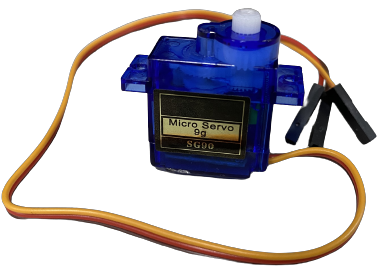
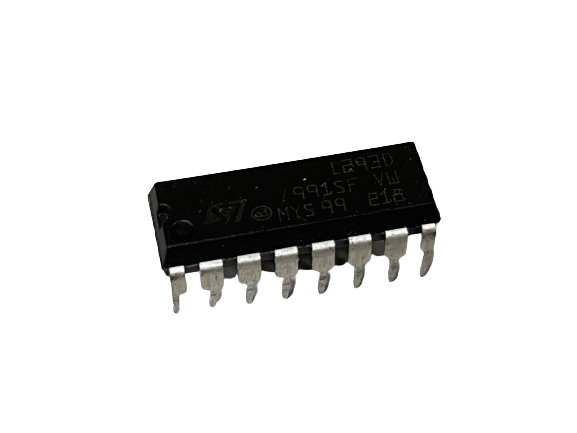
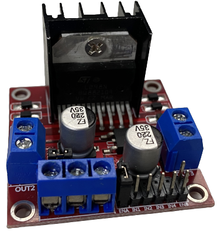
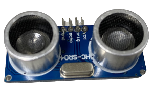
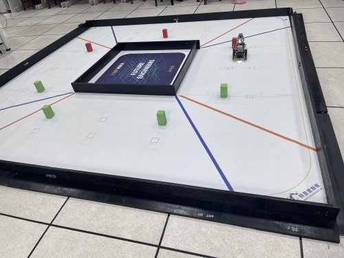
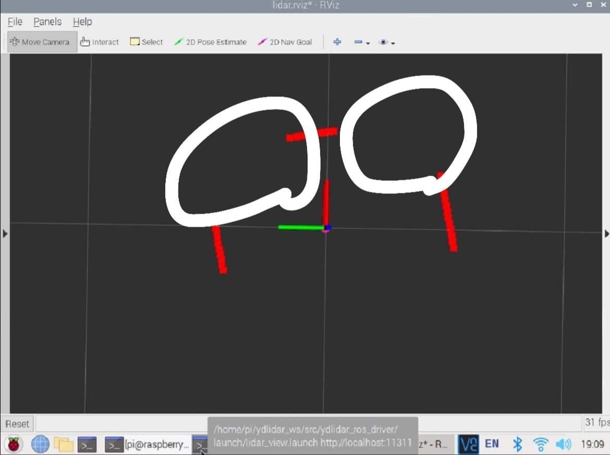
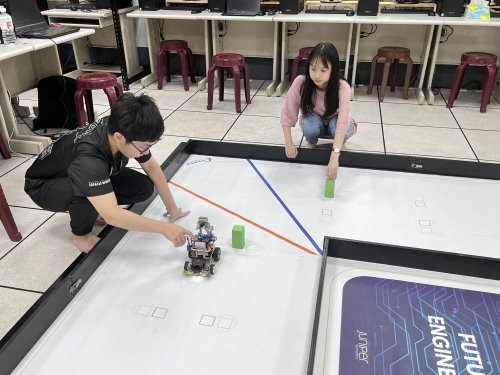

2023WRO Future Engineers Fire On All Cylinders  
=====
# 
Work Diary (工作日誌)
 

## 2023/03/19 ~ 2023/03/21  

**member:** ZHAO,ZHEN-BO  

**content:**  

After reading the rules, We started to choose the controller. After watching the previous competitions, we found that most of them are raspberry pi but there are also jeston nano, so I decided to choose one of these two. I chose raspberry pi 4 because of its smaller size and cheaper price than jeston nano.  

在閱讀完規則後，開始挑選控制器，因為看過歷屆的比賽，發現大多都是 raspberry pi ，但也有 jeston nano ，因此決定在這兩種裡挑一種，選擇的是 raspberry pi 4 ，因為體積比較小而且價格也比 jeston nano 便宜  

| raspberry pi 4 B 8G | Jeston Nano |
| :---: | :---: |
|   |  |

## 2023/03/22 ~ 2023/03/26

**member:** ZHAO,ZHEN-BO、LIN,JHONG-BIN

**content:** 

After using the Raspberry Pi, I noticed that it tends to overheat and even get damaged due to prolonged usage. Therefore, I needed a heat sink. The original heat sink provided by the manufacturer couldn't be used on my Raspberry Pi because it is completely sealed and doesn't allow for proper ventilation. As a result, I chose another heat sink with dual fans, which is not sealed and can effectively dissipate heat.

在使用樹梅派之後我發現樹梅派會因為長期使用而過熱，還會燒壞，因此需要散熱器，原廠的散熱器並不能在我的樹梅派上使用，因為散熱器是完全密封的，沒辦法使，因此我們選擇了另一個不密封而且有雙風扇的散熱器。

## 2023/03/27 ~ 2023/03/31  

**member:** ZHAO,ZHEN-BO 

**content:**  

While waiting for the Raspberry Pi to be initialized and the library to be installed, there are two motors to choose as power, namely GA25-370 and JGA16-050. The former has the advantage of large torque and can drive heavy objects. The latter has the advantage of small size and light weight, but the torque is relatively small. Considering that the body may be heavier, I chose the GA25-370 with higher torque.  

在等待初始化樹梅派及安裝函式庫時，挑選作為動力的馬達，有兩種，分別是 GA25-370 和 JGA16-050，前者的優點是扭力大，可以帶動較重的物體，後者的優點是體積小，重量也比較輕，但是扭力相對較小，由於考慮到機體可能會比較重，所以選了扭力較大的 GA25-370   

| GA25-370 | JGA16-050 |
| :---: | :---: |
|   |  |

## 2023/04/01 ~ 2023/04/05  

**member:** ZHAO,ZHEN-BO、LIN,JHONG-BIN、Hu,Yun-Ruei  

**content:**  

The next step is the steering motor. After searching the information on the Internet, I found that MG90S and SG90 are commonly used. The difference between MG90S and SG90 is that the front gear is metal, and the latter is plastic. Because we often need to rotate all the time, we choose MG90S, which is not easy to damage  

接下來就是轉向馬達，在網上查找資料後，發現常用的是 MG90S 跟 SG90 兩種，MG90S 跟 SG90 的差異是前著齒輪式金屬，後者是塑膠，因為我們常需要一直旋轉，因此選擇就不容易損壞的 MG90S   

| MG90S | SG90 |
| :---: | :---: |
|   |  |

## 2023/04/04 ~ 2023/04/06  

**member:** ZHAO,ZHEN-BO、LIN,JHONG-BIN、Hu,Yun-Ruei  

**content:**  

Next is the motor controller. There are two options: the L293D chip and the L298N module. To reduce weight, we chose the smaller L293D chip. Its compact size allows us to install more sensors, which in turn saves space, reduces weight, and increases the mobility of the robot.  

接下來是馬達控制器。有兩種選擇：L293D晶片和L298N模組。為了減輕重量，我們選擇了體積較小的L293D晶片。它的小巧尺寸使我們能夠安裝更多的感應器，進而節省空間、減輕重量，並增加機器人的機動性。    

| L293D | L298N |
| :---: | :---: |
|   |  |

## 2023/04/07 ~ 2023/04/10

**member:** ZHAO,ZHEN-BO、LIN,JHONG-BIN、Hu,Yun-Ruei  

**content:**

To begin assembling the machine, I used LEGO parts from the club to build the base. I attached the motors, Raspberry Pi, and other components onto the chassis and made the machine functional.

我們要先組裝機器，所以我就利用社團的樂高零件先組底座，先將馬達和樹梅派等裝上車，讓機器作動。  

## 2023/04/11 ~ 2023/04/14  

**member:** ZHAO,ZHEN-BO、LIN,JHONG-BIN、Hu,Yun-Ruei  

**content:**  

- When the vehicle is uncertain about the distance ahead, it cannot turn in time when encountering a wall. Therefore, ultrasonic sensors have been added to enable the vehicle to turn before colliding with the wall. 
- Based on the experiments conducted, it has been found that ultrasonic sensors can only detect obstacles in front of the vehicle. Additionally, they are less effective in detecting distances while the vehicle is swaying from side to side. Therefore, it has been decided to adopt a 360-degree LiDAR sensor for detecting distances in front of, as well as to the left and right sides of the vehicle.

- 車輛在不知道前方距離時，無法在遇到牆壁及時轉彎，因此加上了超音波，這樣就可以在撞到牆之前轉彎。 
- 經實驗得知，超音波只能偵測前方障礙物距離，且在車輛左右晃動下，不容易偵測距離，因此改採用可以360度偵測的光達感測器，來當車輛的前方、左右邊的距離。

| ultrasound | ydlidar x2 |
| :---: |:---: |
|  | |

## 2023/04/15 ~ 2023/04/17  

**member:** ZHAO,ZHEN-BO、LIN,JHONG-BIN、Hu,Yun-Ruei  
.心弓土
**content:**

But you can't just turn, because you need to rotate clockwise and counterclockwise, so you need a color sensor to sense the color of the ground line to judge whether it is clockwise or counterclockwise, so when choosing a color sensor, because it is to measure the line on the ground, it should be thin and close to the ground, so it can't be too large, so the TCS34725 color sensor meets my requirements.  

但是不能只會轉彎，因為要順時針旋轉和逆時針旋轉，因此需要顏色感測器感測地上線的顏色來判斷是順時針和逆時針，所以在挑選顏色感測器時，因為是要測地上的線，所以要薄的，可以貼近地面的，所以也不能太大，因此 TCS34725 顏色感測器很符合我的要求  

|| |
| :---: | :---: |

## 2023/07/09 ~ 2023/07/12

**member:** ZHAO,ZHEN-BO、LIN,JHONG-BIN、Hu,Yun-Ruei  

**content:**

- I encountered a bottleneck when using the color sensor to detect lines because I was unsure how to write a Python program to detect the values of blue and orange lines. With the guidance of my teacher, I successfully completed it. The partial code is as follows:
- During the implementation testing, it was discovered that we originally used a USB 180-degree adapter (as shown in the lower left image), but it was prone to colliding with obstacles, particularly building blocks. As a result, we made a change and switched to using a USB 3.0 90-degree adapter for the connection. This modification makes it less likely to accidentally hit obstacles when trying to avoid them.

- 在使用顏色感測器偵測線時遇到瓶頸，因為不知道如何使用python撰寫程式來偵測藍、橘線的數值，經過老師指導，成功完成，片段程式如下。
- 在實作測試時發現，本來我們是使用usb 180度轉接頭(如左下圖)，但容易撞到積木，因此我們改成使用usb3.0 90度轉接頭來連接，就不容易避開障礙物時碰到障礙物。
 
 

| ||
| :---: | :---: |

## 2023/07/13 ~ 2023/07/15  

**member:** ZHAO,ZHEN-BO、LIN,JHONG-BIN、Hu,Yun-Ruei  

**content:**

Then use the algorithm to limit the value to an integer, so that the value of identifying the color looks neater, and it is easier to find problems in the debugger  

之後利用演算法使數值限制成整數，讓辨識顏色的數值看起來較整齊，比較容易在偵錯器中找到問題 。

## 2023/07/16 ~ 2023/07/17  

**member:** ZHAO,ZHEN-BO、LIN,JHONG-BIN、Hu,Yun-Ruei  

**content:**

The next step is to use the gyroscope to make the machine move in a straight line, but the gyroscope is not easy to use, so it is the help of the seniors to make my machine move in a straight line  

接下來就是借用陀螺儀讓機器能夠直線前進，但是陀螺儀並不好使用，因此是學長幫忙才讓我的機器能夠直線行走  

## 2023/07/18 ~ 2023/07/22  

**member:** ZHAO,ZHEN-BO、LIN,JHONG-BIN、Hu,Yun-Ruei  

**content:**

Although it is possible to move straight using the gyroscope and turn using the ultrasonic sensor, there is a risk of scraping against walls and getting stuck at corners. Therefore, we replaced the ultrasonic sensor with a lidar, which can detect the surroundings and maintain the robot in the center of the road. With the lidar, it can also detect turns ahead.  
However, during the actual testing of the YDLIDAR X4 and DLIDAR X2, we also encountered the issue of missing angles (as shown in the attached image). Therefore, in this competition, we decided to use the D100 sensor for vehicle detection and measuring the distance to the side walls. The results obtained from the D100 sensor met our expectations and requirements.

雖然可以藉由陀螺儀直行，和利用超音波轉彎，但是有可能轉彎時擦到牆壁，然後卡牆邊無法繼續運行，之後我們將超音波改成了光達，光達可以偵測四周，因此可以維持在道路中央，還可以偵測前方轉彎。
然而我們在實測光達時也發現了ydlidar x4、dlidar x2 所遇之缺角問題(如附圖所示)因此，在本次競賽中，我們決定採用D100感測器來進行車輛偵測場邊牆距離，並且使用的結果符合預期的需求。
| | |
| :---: | :---: |

| lidar D100  |  ydlidar x4  |   ydlidar x2    |      
|:----: | :----: | :----:|
||||

## 2023/07/23 ~ 2023/07/25  

**member:** ZHAO,ZHEN-BO、LIN,JHONG-BIN、Hu,Yun-Ruei  

**content:**

The robot is now able to operate normally. The next step is to use the camera to avoid obstacles (blocks). First, we need to detect the distance to the blocks, and then identify the color of the blocks. By leveraging OpenCV's functionality, we can draw virtual lines to help with obstacle avoidance. Using the virtual line and the distance to the blocks, along with an algorithm, we can steer the front wheels to avoid the obstacles.

However, there is an issue at the corners where the robot cannot avoid obstacles in a timely manner. To address this, we need to combine the gyroscope's readings with the output values from the algorithm to successfully navigate around corners

機器人現在能夠正常運行。接下來的步驟是使用攝影機來避開障礙物（積木）。首先，我們需要偵測到障礙物（積木）的距離，然後辨識積木的顏色。透過利用OpenCV的功能，我們可以畫出虛擬線來協助避開障礙物。使用虛擬線和障礙物的距離，再加上一個演算法，我們可以操縱前輪來避開這些障礙物。  

然而，在轉彎處有一個問題，機器人無法及時避開障礙物。為了解決這個問題，我們需要將陀螺儀的數值與演算法的輸出值結合起來，以成功地在轉彎處繞過障礙物。  

## 2023/07/26 ~ 2023/07/27

**member:** ZHAO,ZHEN-BO、LIN,JHONG-BIN、Hu,Yun-Ruei  

**content:**

Today, we made significant progress in our project. We successfully organized and listed the components in the parts inventory, and we uploaded it to the technical documentation. Additionally, we completed the drawing of the vehicle's introduction diagram. Throughout this process, we embarked on a learning journey, gradually familiarizing ourselves with GitHub syntax. Although we are not yet fully proficient in using GitHub, we dedicated time to researching relevant information online and steadily improving our skills. These achievements have brought valuable advancements to our report and project as a whole.

今天我們完成了將零件清單整理並列點，並上傳至技術文件中。此外，我們也完成了車體的介紹圖的繪製工作。在這個過程中，我們逐步學習了GitHub語法的使用並逐漸熟悉它。儘管對GitHub的使用不是很熟練，但我們努力在網上查詢相關資訊，並逐步提高了技能水平。這些進展為我們的報告帶來了寶貴的進步。

| ||
| :---: | :---: |

## 2023/07/28 ~ 2023/07/30

**member:** ZHAO,ZHEN-BO、LIN,JHONG-BIN、Hu,Yun-Ruei  

**content:**

Over these few days, we have been continuously adjusting and fine-tuning the execution of venue tasks, making constant adjustments to motor speed and various parameters in the hopes of effectively reducing the error rate. We are eager to achieve better performance and improve our overall competition results.

這幾天我們持續調整及修正場地任務執行，不斷地進行馬達速度和各項參數的微調，期望能有效降低失誤率，期待能夠取得更好的表現並提高整體競賽成績。

| ||
| :---: | :---: |

# 
[Return Home](../../)
 

