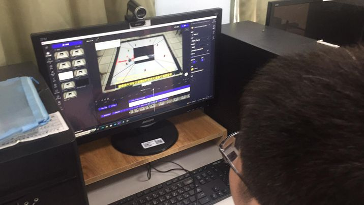
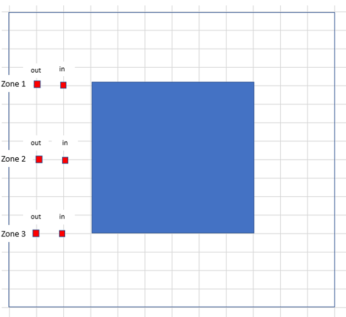
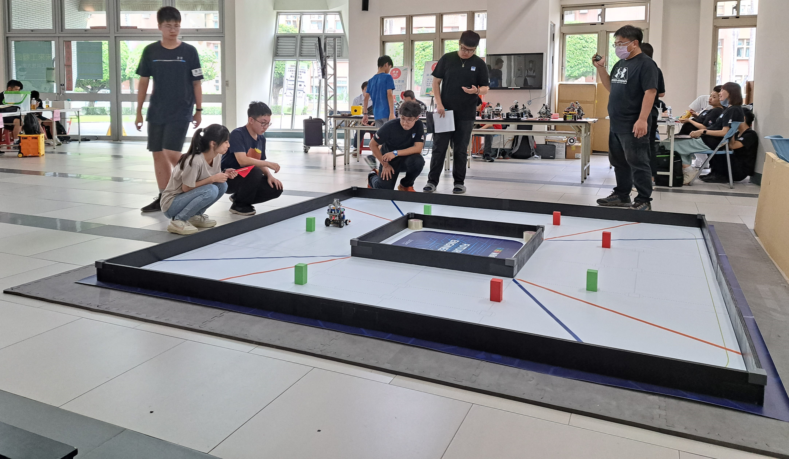
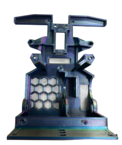
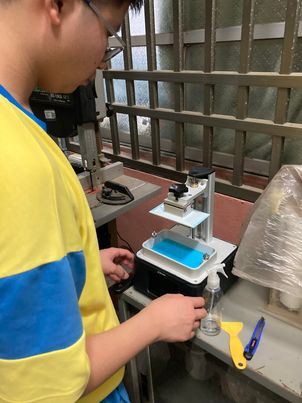

<div align="center"></div>

2023WRO Future Engineers Shinan Fire On All Cylinders  
=====
# <div align="center">Work Diary </div> 

## 2023/03/19 ~ 2023/03/26  
**member:**  ZHAO,ZHEN-BO、LIN,JHONG-BIN、HU,YUN,RUEI  
**content:**  

At the outset, due to our uncertainty about how to initiate the process of constructing and assembling the vehicle, we turned to the official Donkey Car website for guidance. Consequently, the construction of the vehicle will be based on modifications to the vehicle design provided on the official website.

<div align="center">
<table>
<tr align="center"><th><a href="https://www.donkeycar.com/">Donkey Car official website</a></th>
<th><a href="http://docs.donkeycar.com/">Donkey Car technical documentation</a></th>
</tr>
<tr align="center">
<td> </td>
<td></td>
</tr>
</table>
</div>
<div align="center" width=100%>

</div>

## 2023/03/27 ~ 2023/04/02
**member:** ZHAO,ZHEN-BO、LIN,JHONG-BIN、HU,YUN,RUEI  
**content:** 
- To ensure the smooth progression of the competition, our team carefully planned the completion timeline for each stage of the competition activities.
- After reading the rules, we began the process of selecting our controller. Upon reviewing previous competitions, we observed that the majority of participants used either Raspberry Pi or Jetson Nano as their controllers. Based on this information, I had to decide between these two options. Ultimately, I opted for the Raspberry Pi 4B due to its smaller size and more affordable price compared to the Jetson Nano.

  __Competition Activity Stages Work Completion Timeline Schedule(Gantt Chart)__ 
<div align="center" >
  
</div>

### Vehicle Computing Controller
<div align="center" >
<table >
<tr align="center">
<th>Raspberry pi 4 B 8G</th>
<th>Jeston Nano </th>
<tr align="center">
<td>
</td>
<td>
</td>
</tr>
</table>
</div>

## 2023/04/03 ~ 2023/04/09  
**member:** ZHAO,ZHEN-BO、LIN,JHONG-BIN、HU,YUN,RUEI

**content:**  

- As we waited for the Raspberry Pi to initialize and the required libraries to be installed, we proceeded to choose the motor for propulsion. We had two options: the JGA25-370 and the JGA16-050. The JGA25-370 offers higher torque, making it suitable for moving heavier objects. On the other hand, the JGA16-050 is smaller and lighter but comes with relatively lower torque. Taking into account the anticipated weight of the robot, we decided to go with the higher torque of the JGA25-370 motor.
- Among the JGA25-370 options, there are several variations currently available within the club.
- While testing the motor's operation, we found that a simple application of positive and negative voltage did not offer effective control over the performance or speed adjustment of the JGA25-370 motor. Consequently, a motor controller was necessary to regulate the speed of the DC geared motor. We considered two options: the L293D chip and the L298N module. In order to keep the weight minimal, we opted for the compact L293D chip. Its small size enables us to integrate more sensors, ultimately saving space, reducing weight, and improving the robot's maneuverability.

#### DC Motor
<div align="center"><table><tr align="center">
<th rowspan="2">Model(model number)</th>
<th>JGA25 370</th>
<th>JGA25 370</th>
<th>JGA25 371</th>
<th>JGA16-050</th>
</tr>
<tr  align="center">

<td></td>
<td></td>
<td></td>
<td ></td>
</tr>
<tr align="center">
<td >speed</td>
<td >1360rpm/m</td>
<td >620rpm/m</td>
<td >294rpm/m</td>
<td >220rpm/m</td>
</tr>
<tr align="center">
<td>torque</td>
<td>4.27kg.cm</td>
<td>9.15kg.cm</td>
<td>5.2kg.cm</td><td>1.15kgcm</td>
</tr><tr align="center">
<td>power</td><td>5.4W</td><td>5.4W</td><td>4.2W</td><td>0.33W</td>
</tr>
</table>
</div>


## 2023/04/10 ~ 2023/04/16  
**member:** ZHAO,ZHEN-BO、LIN,JHONG-BIN、HU,YUN,RUEI

**content:**  

- Given the vehicle's continuous movement, a switch to battery power is necessary. Considering the motors' requirement of a 12V voltage for operation, selecting a battery with 12V voltage and 3V current is essential. Two alternatives are available: lithium-ion batteries (18650) and lithium polymer batteries (3S). However, the 18650 battery is bulkier and heavier, leading us to choose the lithium polymer battery for its space-saving and lightweight advantages.
- However, the maximum voltage supported by the Raspberry Pi is only 5.2V. Therefore, we need to use a voltage regulator module to reduce the voltage and prevent any potential damage to the Raspberry Pi. In our initial considerations, the LM2596 DC-DC adjustable voltage regulator module seemed promising due to its numerical display feature that indicates the current output voltage. Nonetheless, it's worth noting that this module has a maximum current capacity of only 3A. Considering our requirements, we decided to opt for a constant voltage and constant current step-down power supply module, capable of handling up to 5A. While this alternative lacks a numerical display, we have plans to integrate a low voltage alarm system to monitor the battery voltage closely and ensure its safety.
####  Batteries
<div align="center" width=100%>
<table >
<tr>
  <th> 18650 lithium batteries </th> <th>Li-Polymer 3S Battery 
  </th>
</tr>
<tr>
  <td>
   </td>
  <td>
  
  </td>
</tr>
</table>
</div>


#### Voltage Regulator Module
<div align="center" width=100%>
<table >
<tr align="center">
  <th> LM2596 DC-DC Adjustable Buck Converter Module </th> 
  <th>5A Constant Voltage and Constant Current Buck Converter Module </th>
</tr>
<tr align="center">
  <td>    </td>
  <td> 
  </td>
  </tr>
</table>
</div>

#### Low Voltage Alarm
<div align="center" width=100%>
<table >
<tr align="center">
  <th> Low Voltage Alarm</th> 
</tr>
<tr align="center">
  <td>    </td>

  </tr>
</table>
</div>


## 2023/04/17 ~ 2023/04/23
**member:** ZHAO,ZHEN-BO、LIN,JHONG-BIN、HU,YUN,RUEI 
**content:**  

- The next step is to choose the controlling motor. After searching for information online, we discovered that MG90S and SG90 are the most common options. The difference between MG90S and SG90 lies in the front gear, with the former being made of metal and the latter being made of plastic. Due to our frequent need for continuous rotation, we have selected the MG90S, as it is less prone to damage.


#### Servo Motor
<div align="center">
<table>
<tr align="center">
<th rowspan="2">Model(model number)</th>
<th> MG90S</th>
<th >SG90</th>
</tr>
<tr align="center">
<td></td>
<td > </td>
</tr>
<tr align="center">
<td>rotation angle</td>
<td>90° MAX</td>
<td>0~90°/180° MAX</td>
</tr>
<tr align="center">
<td>torque</td>
<td>2.0kg/cm</td>
<td>1.4 kg/cm</td>
</tr>
<tr align="center">
<td>speed</td>
<td>0.11s</td>
<td>0.1S</td>
</tr>
</table>
</div>

## 2023/04/24 ~ 2023/04/30
**member:** ZHAO,ZHEN-BO、LIN,JHONG-BIN、HU,YUN,RUEI
**content:**

- When the vehicle is uncertain about the distance ahead, it may fail to turn in time when it encounters a wall. To address this issue, ultrasonic sensors have been incorporated to allow the vehicle to initiate a turn before coming into contact with the wall.
- Based on the conducted experiments, it has been determined that ultrasonic sensors are only capable of detecting obstacles directly in front of the vehicle. Moreover, their effectiveness diminishes when the vehicle sways from side to side. Therefore, the decision has been made to implement a 360-degree LiDAR sensor. This sensor will not only detect distances in front of the vehicle but also on its left and right sides.

#### Distance Sensor
<div align="center" width=100%>
<table >
<tr align="center">
  <th >ultrasound </th> 
  <th>ydlidar x2</th>
</tr>
<tr>
  <td>    </td>
  <td>
  </td>
  </tr>
</table>
</div>


## 2023/05/01~ 2023/05/07  
**member:** ZHAO,ZHEN-BO、LIN,JHONG-BIN、HU,YUN,RUEI  
**content:**  
- We began assembling the machine by using LEGO parts from the club to build the base. We then attached the motors, Raspberry Pi, and other components onto the chassis, making the machine functional.

   After the vehicle becomes operational, we further add additional sensors to enable the vehicle to sense its surroundings and respond accordingly based on mission requirements
- During testing, we discovered that the vehicle's movement speed using LEGO bricks was not fast, and its weight caused difficulties during turns. Consequently, we opted to use a laser cutting machine to cut wooden boards for the chassis, reducing the vehicle's weight, increasing its speed, and conserving power. Additionally, the use of wooden boards offers the advantage of adjusting dimensions and positions as needed. This adjustment is facilitated through tools like Onshape, allowing for flexible design and modifications without the need for constant adaptations like those required with LEGO in various scenarios."

<div align="center" width=100%>
<table >
<tr align="center">
  <th>wooden boards  </th>
  <th>onshape web page  </th>
  </tr>
<tr align="center">
  <td>  </td>
  <td>
  </td>
  </tr>
</table>
</div>


## 2023/05/08 ~ 2023/05/14  
**member:** ZHAO,ZHEN-BO、LIN,JHONG-BIN、HU,YUN,RUEI   
**content:**

- While it's feasible to move in a straight line and execute turns using the ultrasonic sensor, there's a risk of scraping against walls and encountering difficulties at corners. To address this, we substituted the ultrasonic sensor with a lidar, capable of detecting surroundings and maintaining the robot's position at the center of the path. Additionally, the lidar facilitates the identification of upcoming turns.
- Nevertheless, during actual testing of the YDLIDAR X4 and DLIDAR X2, we encountered a problem with missing angles (as depicted in the attached image). Therefore, for this competition, we opted to employ the D100 sensor for vehicle detection and measuring distances to side walls. The results yielded by the D100 sensor aligned with our expectations and requirements.

<div align="center" width=100%>
<table >
<tr align="center" >
  <th>ydlidar x4</th> 
  <th>ydlidar x2</th>
  <th>lidar 100</th>
</tr>
<tr align="center">
  <td>  </td>
  <td>  </td>
  <td> </td>
</tr>
</table>
</div>

<div align="center" width=100%>
<table >
<tr align="center">
  <th colspan="2">ydlidar x4、X2 distance imaging</th> 
  <th >lidar 100 distance imaging</th>
</tr>
<tr align="center">
  <td>    </td>
  <td>  </td>
  <td>   
  </td>
  </tr>
</table>
</div>


## 2023/05/15 ~ 2023/05/21  
**member:** ZHAO,ZHEN-BO、LIN,JHONG-BIN、HU,YUN,RUEI  
**content:**  
- TCS34725 color sensor 
  - In the competition, vehicles need to showcase more functionalities than just being able to turn. Merely knowing how to turn is insufficient. To achieve clockwise and counterclockwise turns, we must enable the vehicle to sense the color of lines on the ground and make appropriate judgments accordingly. Therefore, when selecting color sensors, we need to exercise special caution.
  - The TCS34725 color sensor has been chosen because it fulfills all the requirements of this competition. Firstly, it boasts exceptional sensing capabilities, enabling it to swiftly and accurately identify the colors of the ground lines. Secondly, the sensor is slim and compact, allowing it to be positioned near the ground without disrupting the vehicle's movements.
  - The high precision of this sensor ensures that the vehicle can accurately detect the colors of the ground lines and perform clockwise or counterclockwise turns as required. This is a crucial factor in the vehicle's excellent performance and its victory in the competition.

     In conclusion, the TCS34725 color sensor is a perfect fit for the requirements of this competition. Its slim design and highly accurate color recognition capabilities enable the vehicle to adapt flexibly to changes in ground lines, achieve clockwise and counterclockwise turns, and enhance its performance in the competition.

     I encountered a bottleneck when using the color sensor to detect lines because I was unsure how to write a Python program to detect the values of blue and orange lines. With the guidance of my teacher, I successfully overcame this challenge. The partial code is as follows:
- Additionally, during the implementation testing, we discovered that the original use of a USB 180-degree adapter (as shown in the lower left image) was prone to colliding with obstacles, particularly building blocks. As a result, we made a change and switched to using a USB 3.0 90-degree adapter for the connection. This modification reduces the likelihood of accidentally hitting obstacles while attempting to avoid them.


<div align="center" width=100%>
<table >
<tr align="center">
  <th>Snippet of Code</th> 
  <th>Function</th>
</tr>
<tr align="center">
  <td> </td>
  <td>
  </td>  
  </tr>
</table>
</div>

<div align="center" width=100%>
<table >
<tr align="center">
  <th>USB Horizontal 180°</th> 
  <th>USB Vertical 90°</th>
</tr>
<tr align="center">
  <td align="center"></td> 
  <td align="center"></td>
</tr>
</table>
</div>

<div align="center" width=100%>
<table >
<tr align="center">
  <th >Event Photo</th> 
  <th >Event Photo</th> 
</tr>
<tr>
  <td align="center"> 
  <td align="center"></td>
</tr>
</table>
</div>

## 2023/05/22 ~ 2023/05/28  
**member:** ZHAO,ZHEN-BO、LIN,JHONG-BIN、HU,YUN,RUEI  
**content:**  

- In order to enable the vehicle to avoid obstacles accurately, we need to install a camera module on the vehicle. Since we are using a Raspberry Pi as the controller, we need to find a compatible camera module for it. To do this, we referred to the camera module used by the American team in last year's competition and compared it with other camera modules in the same series. Here is the product information:

1. raspberry pi camera Rev 1.3(Sensor:OmniVision OV5647)
2. raspberry pi camera Module V2(Sensor:Sony IMX219)
3. raspberry pi camera Module V3(Sensor:Sony IMX708)

- Considering that V3 is not compatible with our existing Raspberry Pi operating system, we decided not to use that version. Additionally, the detection rate of version 1.3 is only 30p, whereas the V2 version can reach a maximum of 90p. Therefore, we ultimately chose the Raspberry Pi Camera Module V2 for our project. Through experimentation, we found that the V2 version has the best recognition performance.

### Camera Module
#### Camera Module
<div align="center">
<table>
<tr  align="center">
<th rowspan="2">Model(model number)</td> 
<th>raspberry pi camera Rev 1.3</th>
<th >raspberry pi camera Module V2</th>
<th >raspberry pi camera Module V3</th>
</tr>
<tr  align="center">
<td ></td>
<td ></td>
<td ></td>
</tr>
<tr  align="center">
<td>sensor</td>
<td>Omnivision OV547</td>
<td >Sony IMX 219</td>
<td>Sony IMX 708</td>
</tr>
<tr  align="center">
<td>sensor resolution</td>
<td >2592 * 1944 pix</td>
<td>3280 * 2464 pix</td>
<td>4608 * 2592 pix</td>
</tr>
<tr  align="center">  
<td>FPS Frame rate</td>
<td >30p MAX</td>
<td>90p MAX</td>
<td>120p MAX</td>
</tr>
</table>
</div>

During subsequent testing, we discovered that the vehicle was unable to predict the position of the next block while avoiding obstacles. This posed a challenge to the vehicle's obstacle avoidance strategy. Consequently, we decided to modify the original camera by converting it into a wide-angle lens. In comparison to the original 72-degree field of view, the wide-angle lens offers a 160-degree field of view, enabling us to anticipate the next block's position in advance. This enhancement has significantly improved the vehicle's obstacle avoidance effectiveness.

#### wide-angle lens
<div align="center">
<table>
<tr>
<th align="center"> Without the wide-angle lens </th> 
<th align="center">With the wide-angle lens </th>
</tr>
<tr>
<td align="center"></td><td>

</td>
</tr>
<td align="center"></td>
<td align="center"> </td>
</tr>
</table>
</div>

- In the Raspberry Pi program, it is possible to configure the resolution of the camera module. We conducted experiments with the following common resolutions.

  1. 1080x640 Frame rate30p
  
  2. 640x320 Frame rate60p
 
  3. 320x240 Frame rate90p
- In our experiments, we found that when the camera module's resolution was set to 1080x640, the high-resolution image processing demands led to a significant amount of time being spent on block recognition, resulting in a decrease in computational efficiency. On the other hand, when the resolution was set to 320x240, the computational efficiency was extremely high, but the low resolution hindered the proper recognition of the blocks. However, when we set the resolution to 640x320, we observed that the program could successfully recognize the blocks without compromising computational efficiency, thus avoiding collisions with the blocks. Therefore, we ultimately decided to set the camera module's resolution to 640x320.

## 2023/05/29 ~ 2023/06/04  
**member:** ZHAO,ZHEN-BO、LIN,JHONG-BIN、Hu,Yun-Ruei  
**content:**

- By using VS Code along with Git to edit our technical documentation, we can effectively manage potential conflicts and improve collaboration. The advantages of this approach include easy version control, immediate notifications to editors when conflicts arise due to simultaneous edits, and the ability for editors who upload data later to merge conflicts by comparing the data. This way, we can ensure a smoother and more efficient process when working on the technical documentation.

[github Homepage : https://github.com/kirkhu/WRO2023_Future-Engineers-Fire-On-All-Cylinders/tree/main](https://github.com/kirkhu/WRO2023_Future-Engineers-Fire-On-All-Cylinders/tree/main)

<div align="center">
<table>
<tr align="center">
<th> To edit in VS Code, just click on the source file control and then press "Copy to Repository
</th> 
<th>Entering the URL allows you to perform editing and version control in VS Code
</th>
</tr>
<tr>
<td align="center"></td><td>

</td>
</tr>
</table>
</div>


## 2023/06/05 ~ 2023/06/11 
**member:** ZHAO,ZHEN-BO、LIN,JHONG-BIN、HU,YUN,RUEI  
**content:**

- During the hardware design process, we encountered a few instances in which the Raspberry Pi controller or IC was damaged due to incorrect power or data cable connections. To prevent such issues, we implemented a solution that involves using male-female connectors for both power supply and data transmission. This approach ensured proper wiring and effectively mitigated the risk of the Raspberry Pi or IC becoming damaged. These design improvements have enhanced the stability of the hardware system, leading to increased overall product reliability and lifespan.
- During the hardware design process, we initially used a breadboard to connect the circuits. Unfortunately, we encountered instances of burning or poor contacts, resulting in abnormal functionality or potential issues that were challenging to detect. To improve this situation, we made the decision to switch to soldering the circuits onto a prototyping board. This change significantly reduced the risks of burning or poor contacts while ensuring stable and reliable connections. Through this improvement, we successfully enhanced the overall hardware system's reliability and ensured proper functionality.

<div align="center">
<table>
<tr  align="center">
<th> </th> 
<th></th>
</tr>
</table>
</div>

## 2023/06/12 ~ 2023/06/18
**member:** ZHAO,ZHEN-BO、LIN,JHONG-BIN、Hu,Yun-Ruei  
**content:**

- Before dodging the blocks, we need to complete the basic task of circling the track three times. During this circling process, we noticed the possibility of the vehicle rubbing against the walls while turning. To address this, we utilize the 360-degree detection capability of LiDAR to keep the vehicle centered on the track. By subtracting the distances on the left and right sides, we obtain an error value, which is then corrected using the servo motor to ensure the vehicle continues to travel along the center of the track.

<div align="center">
<table>
<tr  align="center">
<th>The vehicle collides with the side wall.
</th> 
<th>Detecting the distance to the left and right walls.
</th>
</tr>
<tr align="center">
<td></td>
<td></td>
</tr>
</table>
</div>


## 2023/06/19 ~ 2023/06/25   
**member:** ZHAO,ZHEN-BO、LIN,JHONG-BIN、HU,YUN,RUEI  
**content:**

- The robot is now able to operate successfully. The next step involves using the camera to avoid obstacles (blocks). Next, we need to detect the distance to the obstacles (blocks) and then identify the color of the blocks. By utilizing the features of OpenCV, we can calculate the distance between the blocks and the robot for obstacle avoidance. Through the implementation of an algorithm, we can control the front wheels to steer around these obstacles.
- However, there is an issue at the corners where the robot cannot avoid obstacles in a timely manner. To address this, we need to combine the gyroscope's readings with the output values from the algorithm to successfully navigate around corners.

<div align="center">
<table>
<tr align="center">
<th> Detecting block distance
</th> 
<th> Hitting a block
</th>
</tr>
<tr align="center">
<td></td>
<td>
</td>
</table>
</div>


## 2023/06/26 ~ 2023/07/02 
**member:** ZHAO,ZHEN-BO、LIN,JHONG-BIN、HU,YUN,RUEI  
**content:**

- During today's testing, we discovered that the robot tends to misinterpret people wearing red or green clothing in its surroundings as obstacles. This misinterpretation leads it to avoid these individuals unnecessarily, which could potentially result in missing the opportunity to timely avoid the next block. To rectify this issue, we introduced an additional layer of black masking at the top of the camera's field of view. This measure effectively prevents the robot from detecting colors outside of the designated track area. With the implementation of this black masking, the robot will no longer register colors beyond the track area, thus minimizing the likelihood of interference.

<div align="center">
<table>
<tr align="center">
<th>Using a black mask to block colors from outside the field.
</th> 
</tr>
<tr align="center">
<td></td>
</table>
</div>

## 2023/07/03 ~ 2023/07/09 
**member:** ZHAO,ZHEN-BO、LIN,JHONG-BIN、HU,YUN,RUEI 

**content:**

- This week, most of the programming has been completed, and we began testing the robot's success rate. We started with a speed of 50%, and due to its slower pace, the robot responded well for the most part. However, when accelerating to 70% speed, the color sensor occasionally misjudged the track's color due to its high speed. As a result, we modified the turning conditions to use the LiDAR's measurements of the left and right directions for determining the turning direction. This adjustment reduces the likelihood of turning in the wrong direction because of color misjudgment.

#### Detecting the direction of the turn
```
if get_left_dis > 100:
    reverse = False
else:
    reverse = True
if get_mid_dis > 55:
    servo.angle(-40)
```


## 2023/07/10 ~ 2023/07/16 
**member:** ZHAO,ZHEN-BO、LIN,JHONG-BIN、HU,YUN,RUEI  
**content:**

- The robot is now capable of successfully avoiding obstacles and completing the third lap around the track. The next task is to detect blocks and perform a turnaround maneuver. The turnaround will be executed only if the last block of the second lap is red. Therefore, it is necessary to detect the number of laps. We will use the color sensor to count the number of times the line is crossed and determine whether the set count has been reached.

- If the specified count has not yet been achieved, the system will continue to record the color of the nearest traffic sign until the count of line crossings is greater than or equal to the set count. At this point, the color recording will cease.

- After recording the color of the nearest traffic sign, the program will determine whether the color is red. If the color is indeed red, the system will adjust the angle of the servo motor to initiate a right turn and will continue turning until the vehicle is properly aligned in the specified direction, thus executing a turnaround maneuver. If the detected color is not red, the vehicle will proceed to move forward.


<div align="center">
<table>
<tr align="center">
<th>Display the number of line crossings and the color of the nearest traffic sign.</th>
<th>Adjusting the values.
</th>
</tr>
<tr align="center">
<td></td>
<td></td>
</table>
</div>

## 2023/07/17 ~ 2023/07/23  
**member:** ZHAO,ZHEN-BO、LIN,JHONG-BIN、HU,YUN,RUEI  
**content:**

- As the field mission has been roughly completed, we are going to start writing the technical report. Since we are not familiar with the correct technical report format, we have referred to the official website's technical report documentation and found that the report should include the following sections.

  1. modles: This folder should contain documentation related to the vehicle models, such as files for laser cutting machines and 3D printers.

  2. other: This folder is used to store data that does not belong to other categories, such as communication protocols and engineering logs.

  3. schemes: This folder is dedicated to hardware introductions, explaining the functions of electronic components and how they are connected.

  4. src: All programs should be placed in this folder.

  5. t-photos: This folder should contain team photos, including a group photo and funny pictures.

  6. v-photos: Machine photos from six different perspectives should be placed in this folder.

  7. video: Videos demonstrating the machine's operation should be placed in this folder, with each video lasting more than 30 seconds.

- When writing the technical report, we are switching between VS Code and the GitHub website. We use a desktop computer to view the GitHub web page and a laptop to edit the report in VS Code.

<div align="center">
<table>
<tr align="center">
<th>Official website's GitHub example</th> 
<th>Laptop and desktop comparison and modifications</th>
</tr>
<tr align="center">
<td></td>
<td></td>
</table>
</div>

## 2023/07/24 ~ 2023/07/30  
**member:** ZHAO,ZHEN-BO、LIN,JHONG-BIN、HU,YUN,RUEI  
**content:**

- We organized and listed the components in the parts inventory, and we uploaded them to the technical documentation.Additionally, we completed the drawing of the vehicle's introduction diagram. Throughout this process, we embarked on a learning journey, gradually familiarizing ourselves with GitHub syntax. Although we are not yet fully proficient in using GitHub, we dedicated time to researching relevant information online and steadily improving our skills. These achievements have brought valuable advancements to our report and project as a whole.
- Over the past few days, we have been continuously adjusting and fine-tuning the execution of the tasks at the venue, making constant adjustments to motor speed and various parameters, with the hope of effectively reducing the error rate. We are eager to achieve better performance and improve our overall competition results.
- During practical testing, we discovered that the vehicle was getting stuck at the junctions of the terrain due to protrusions, which was affecting its normal operation. To address this issue, we adopted a method of using a laser cutting machine to create 3mm thick spacers. These spacers were then placed under the vehicle chassis to elevate its height, enabling the vehicle to pass over the obstacles smoothly.

#### Overcoming Terrain Protrusions 

<div align="center">
<table>
<tr align="center">
<th> </th> 
<th></th>
<th></th>
</tr>
<tr align="center">
<td></td>
<td></td>
<td></td>
</table>
</div>

### Team Members' Practice Status

<div align="center">
<table>
<tr  align="center"> 
<th> </th> 
<th></th>
</tr>
<tr align="center">
<td></td>
<td></td>
</tr>
</table>
</div> 

## 2023/07/31 ~ 2023/08/06
**member:** ZHAO,ZHEN-BO、LIN,JHONG-BIN、HU,YUN,RUEI 
**content:**  

- As the deadline for submitting the technical report is next week, we have begun revising the content of the technical documentation. We are also adjusting the website according to the official grading criteria and continuously adding to the technical report.
- Complete recording videos for each task and upload them to YouTube.


<table>
<tr align="center">
<th> old directory </th>
<th> Revised Directory (Upper Section) </th>
<th> Revised Directory (Lower Section) </th>
</tr>
<tr align="center">
<td> </td>
<td> </td>
<td> </td>
</tr>
</table>

  __Open Challenge__
  - [Open Challenge full narrow speed 70%](https://youtu.be/QtpuHt05MDg)
  - [Open Challenge full anrrow speed 50%](https://youtu.be/QaYUrrdAtE8)
  - [Open Challenge half width and half narrow speed 70%](https://youtu.be/pcTpH8QgJFU)
  - [Open Challenge half width and half narrow speed 50%](https://youtu.be/7HdWxfWPfWc)
  - [Open Challenge all width speed 70%](https://youtu.be/MA1k2P87LdE)
  - [Open Challenge all Width speed 50%](https://youtu.be/OUg0x4Qdc0c)  

 __Open Challenge__
  - [Obstacle Challenge speed 50% ](https://youtu.be/Jo7555gfXG8)
  - [Obstacle Challenge speed 70% ](https://youtu.be/iCmcXbACizY)

__Team Members' Practice Status__

<div align="center">
<table>
<tr align="center">
<th>report writing</th> 
<th>mechanism adjustment</th>
<th>report writing</th>
<th>field mission practice</th>
</tr>
<tr align="center">
<td></td>
<td></td>
<td></td>
<td></td>
</table>
</div>

## 2023/08/07 ~ 2023/08/13
**member:** ZHAO,ZHEN-BO、LIN,JHONG-BIN、HU,YUN,RUEI  
**content:**

- This week, with our machine now adjusted to smoothly complete the mission race on the field, we have begun filming an introductory video for the race. In the video, we will showcase the actions our vehicle performs during the mission race, providing explanations through subtitles synchronized with the video.


<div align="center">
<table>
<tr align="center">
<th>modifying code and testing vehicles</th>
<th>currently editing videos</th>
</tr><tr align="center">
<td></td>
<td></td>
</tr><tr align="center">
</table>

<table>
<th>mission race introduction video</th>
</tr>
<td>

[](https://youtu.be/VrU3wQa6h5M "video")</td>
</table>
</div>


## 2023/08/14 ~ 2023/08/20
**member:** ZHAO,ZHEN-BO、LIN,JHONG-BIN、HU,YUN,RUEI  
**content:**

- As the competition is scheduled for this week, we have intensified our practice efforts, trying out various scenarios and adjusting our program to adapt to a wide range of situations. Experimenting with different scenarios has the advantage of helping us anticipate challenges that our machine might face and making necessary adjustments in advance. Here's our practice approach:

- We have assigned lane labels A, B, C, and D. Each lane is divided into three sections, with placement points for blocks both on the inner and outer sides in each section. Red blocks indicating turning conditions will be placed sequentially, while the positions of other blocks will be randomized.
- The record sheet will include the following information:
  1. Completion time
  2. Number of successful attempts/number of failed attempts
We believe that this approach will assist our machine in preparing for a variety of scenarios, ensuring that we are well-prepared for the competition.

- Today is 8/19, our match day. In the first half of the qualifying round, due to our Request for Maintenance during the initial round, the score was reduced by 50%, resulting in our obtaining 15 points. In the second round, we successfully completed it and achieved a full score of 30 points, allowing us to advance to the second half of the obstacle course. During the first obstacle race, our robot hit the wall and stopped due to excessive avoidance; fortunately, after adjustments, the second attempt by our team resulted in a perfect score. This marked a successful conclusion to today's competition.


<div align="center">
<table>
<tr align="center">
<th>field layout</th>
<th>record sheet</th> 
</tr>
<tr align="center">
<td></td>
<td></td>
</table>
</div>
<div align="center">
<table>
<tr align="center">
<th>competition photos</th>
<th>award-winning photo</th> 
</tr>
<tr align="center">
<td></td>
<td></td>
</table>
</div>

## 2023/08/21 ~ 2023/08/27
**member:** ZHAO,ZHEN-BO、LIN,JHONG-BIN、HU,YUN,RUEI  
**content:**

- As we have confirmed our participation in the international competition, we are undergoing significant modifications to our vehicle. Moreover, this redesign will allow us to incorporate threaded components for added stability. Additionally, we are upgrading the controller from Raspberry Pi 4B to the higher computing power provided by the Jetson Nano microcomputer. The Jetson Nano supports programming in Python, thus most of our existing code does not need significant modifications. However, one notable difference with the Jetson Nano is that the generation of PWM signals requires an external board for implementation.


#### 3D printed product
<div align="center">
<table>
<tr  align="center"> 
<th> </th> 
<th></th>
</tr>


<small>Data source</small>  
<small>[Taiwansersor](https://www.taiwansensor.com.tw/product/nvidia-jetson-nano-developer-kit-%E4%BA%BA%E5%B7%A5%E6%99%BA%E6%85%A7%E9%96%8B%E7%99%BC%E5%A5%97%E4%BB%B6-ai-%E9%96%8B%E7%99%BC%E5%A5%97%E4%BB%B6/)</small>  
<small>[University of Maine System](https://web.eece.maine.edu/~vweaver/group/green_machines.html)</small>


## 2023/08/28 ~ 2023/09/03
**member:** ZHAO,ZHEN-BO、LIN,JHONG-BIN、HU,YUN,RUEI  
**content:**

Today, we used a photopolymerization 3D printer. The advantage of photopolymerization lies in its smooth surface finish, high precision, and simple post-print maintenance. However, the drawback is that it takes longer printing time. Therefore, we only use it to print parts that need to be assembled separately, such as the Ackermann steering mechanism and bearing brackets. This approach helps us save printing time while achieving high precision results.

<div align="center">
<table>
<tr align="center">
<th>Maintenance of Photocuring 3D Printer</th>
<th>Finished Product Photos</th> 
</tr>
<tr align="center">
<td></td>
<td></td>
</tr>
</table>
</div>

## 2023/09/04 ~ 2023/09/10
**member:** ZHAO,ZHEN-BO、LIN,JHONG-BIN、HU,YUN,RUEI  
**content:**


## 2023/09/11 ~ 2023/09/17
**member:** ZHAO,ZHEN-BO、LIN,JHONG-BIN、HU,YUN,RUEI  
**content:**


## 2023/09/18 ~ 2023/09/24
**member:** ZHAO,ZHEN-BO、LIN,JHONG-BIN、HU,YUN,RUEI  
**content:**


## 2023/09/25 ~ 2023/10/01
**member:** ZHAO,ZHEN-BO、LIN,JHONG-BIN、HU,YUN,RUEI  
**content:**

- Other changes include: we have utilized a 3D printer to manufacture the vehicle chassis, replacing the initial wooden boards. This shift offers two primary advantages: firstly, the material is lighter than wood, and secondly, it can be produced as a unified, integrated piece. In contrast to wooden boards that are cut individually with a laser cutting machine and subsequently assembled, 3D printing offers considerably greater convenience.

<div align="center">
<table>
<tr align="center">
<td rowspan="2">Controller</td>
<td>Jetson Nano</td>
<td>Raspberry Pi 4B</td>
<tr align="center">
<td></td>
<td></td>
</tr>
<tr align="center">
<td>Computational efficiency</td>
<td>472 GFLOPs</td>
<td>13.5 GFLOPs</td>
</table>
</div>

## 2023/10/02 ~ 2023/10/08
**member:** ZHAO,ZHEN-BO、LIN,JHONG-BIN、HU,YUN,RUEI  
**content:**


# <div align="center">[Return Home](../../)</div> 

