2023WRO Future Engineers Fire On All Cylinders  
=====
# <div align="center">Work Diary (工作日誌)</div> 

## 2023/03/19 ~ 2023/03/26  
**member:** ZHAO,ZHEN-BO  
**content:**  

At the beginning, since we were unsure of how to start building and making the vehicle, we referenced the Donkey Car official website. Therefore, the construction of the vehicle will be based on modifications of the vehicle design from the official website.

由於一開始我們還不知道如何開始建構及製作，因此我們參考了Donkey Car 官網，因此車輛的製作會基於官網的車輛來改造。

<div align="center">
<table>
<tr><td align="center"><a href="https://www.donkeycar.com/">Donkey Car 官網</a></td>
<td align="center"><a href="http://docs.donkeycar.com/">Donkey Car 技術文件</a></td>
</tr>
<tr>
<td> 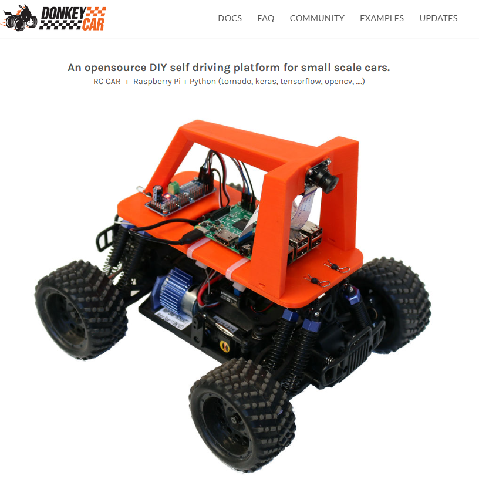</td>
<td>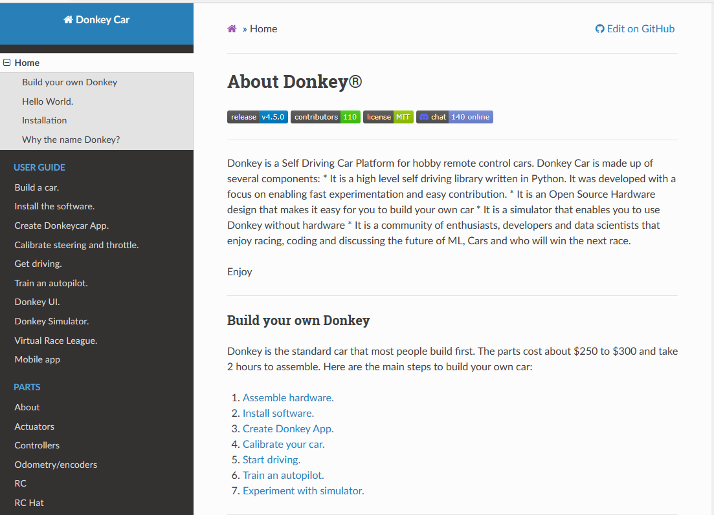</td>
</tr>
</table>
</div>


<div align="center" width=100%>
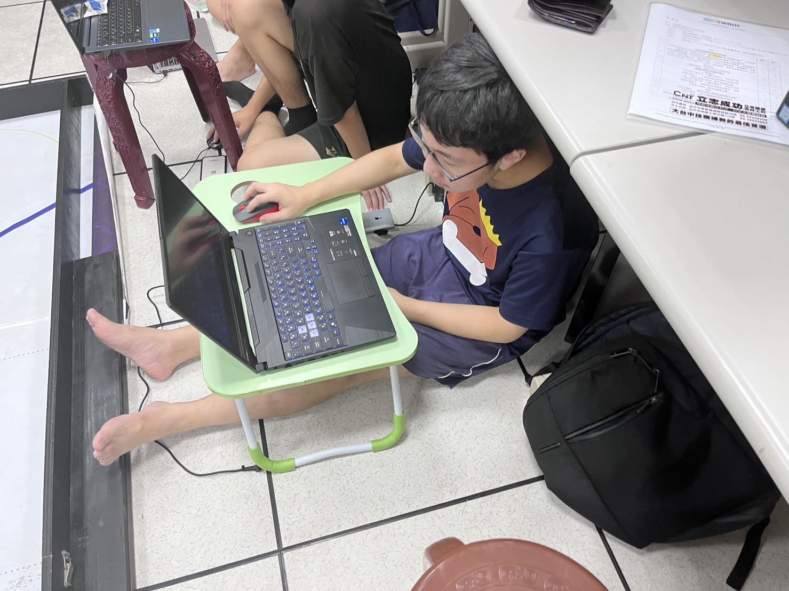
</div>


## 2023/03/27 ~ 2023/04/02
**member:** ZHAO,ZHEN-BO、LIN,JHONG-BIN  
**content:** 
- To ensure the smooth progression of the competition, our team carefully planned the completion timeline for each stage of the competition activities.
- After reading the rules, We started to choose the controller. After watching the previous competitions, we found that most of them are raspberry pi but there are also jeston nano, so I decided to choose one of these two. In the end, I chose raspberry pi 4B because of its smaller size and cheaper price than jeston nano. 

- 為確保競賽活動順利進行，我們小組進行了競賽活動各階段工作完成時間的細心規劃。，如下圖。
- 在閱讀完規則後，開始挑選控制器，因為看過歷屆的比賽，發現大多都是 raspberry pi ，但也有 jeston nano ，因此決定在這兩種裡挑一種，最後選擇了 raspberry pi 4B ，因為體積比較小而且價格也比 jeston nano 便宜。

  __競賽活動各階段工作完成時間規劃表(甘特圖)__ 
<div align="center" >
  
</div>

### Vehicle Computing Controller(車輛運算控制器)
<div align="center" >
<table >

<td align="center">
Raspberry pi 4 B 8G</td>
<td align="center">
Jeston Nano </td>
<tr>
<td>
</td>
<td>
</td>
</tr>
</table>
</div>


## 2023/04/03 ~ 2023/04/09  
**member:** ZHAO,ZHEN-BO  
**content:**  

- While waiting for the Raspberry Pi to initialize and libraries to be installed, we selected the motor for propulsion, with two options: JGA25-370 and JGA16-050. The former boasts higher torque, capable of moving heavier objects, while the latter is smaller and lighter, albeit with relatively lower torque. Considering the potential weight of the robot, we opted for the higher torque of the JGA25-370.
- Among the JGA25-370 options, there are several variations currently available within the club.
- During the testing of motor operation, a simple application of positive and negative voltage did not provide effective control over the JGA25-370's performance or speed adjustment. As a result, a motor controller is needed to regulate the speed of the DC geared motor. Two options were considered: the L293D chip and the L298N module. To minimize weight, we chose the compact L293D chip. Its small size allows us to accommodate more sensors, thereby saving space, reducing weight, and enhancing the robot's maneuverability.


- 在等待初始化樹梅派及安裝函式庫時，挑選作為動力的馬達，有兩種，分別是 JGA25-370 和 JGA16-050，前者的優點是扭力大，可以帶動較重的物體，後者的優點是體積小，重量也比較輕，但是扭力相對較小，由於考慮到機體可能會比較重，所以選了扭力較大的 JGA25-370 
- 而 JGA25-370 有許多種不同的分支，下面幾顆是目前社團擁有的
- 在測試馬達的作動方式時，單純的提供正負極並沒有辦法很好的控制JGA25-370的作動，無法調節速度，因此還需要馬達控制器來調節直流減速馬達的速度，有兩種選擇：L293D晶片和L298N模組。為了減輕重量，我們選擇了體積較小的L293D晶片。它的小巧尺寸使我們能夠安裝更多的感應器，進而節省空間、減輕重量，並增加機器人的機動性。


#### DC Motor(直流馬達)
<div align="center"><table><tr align="center">
<th rowspan="2">Model(型號)</th>
<th>JGA25 370</th>
<th>JGA25 370</th>
<th>JGA25 371</th>
<th>JGA16-050</th>
</tr>
<tr  align="center">

<td>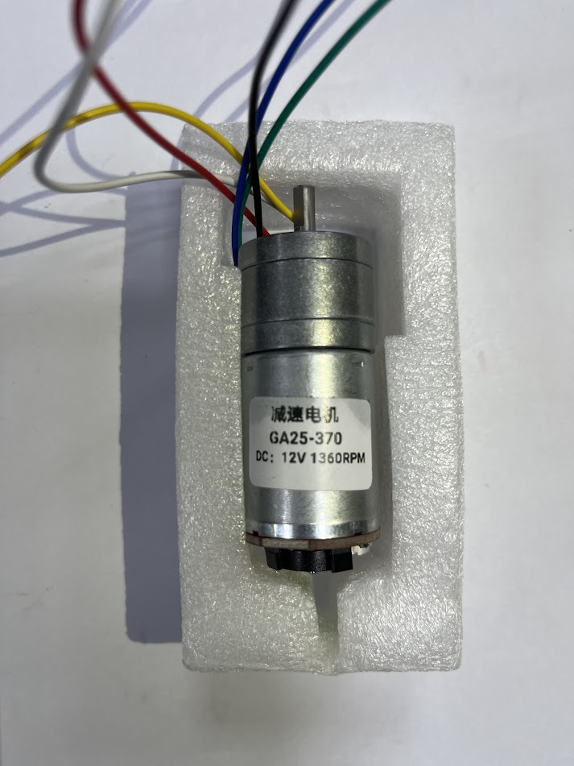</td>
<td></td>
<td></td>
<td >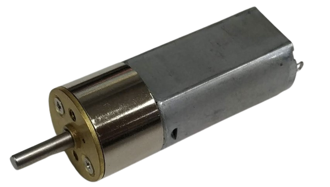</td>
</tr>
<tr align="center">
<td >speed(轉速)</td>
<td >1360rpm/m</td>
<td >620rpm/m</td>
<td >294rpm/m</td>
<td >220rpm/m</td>
</tr>
<tr align="center">\
<td>torque(力距)</td>
<td>4.27kg.cm</td>
<td>9.15kg.cm</td>
<td>5.2kg.cm</td><td>1.15kgcm</td>
</tr><tr align="center">
<td>power(功率)</td><td>5.4W</td><td>5.4W</td><td>4.2W</td><td>0.33W</td>
</tr>
</table>
</div>


## 2023/04/10 ~ 2023/04/16  
**member:** ZHAO,ZHEN-BO、LIN,JHONG-BIN、Hu,Yun-Ruei
**content:**  

- Due to the continuous movement of the vehicle, the power source needs to be changed to a battery. Considering that the motors require a 12V voltage to operate, we need to choose a battery with a voltage of 12V and a current of 3V. There are two options: lithium-ion batteries (18650) and lithium polymer batteries (3S). However, the 18650 battery is heavier and takes up more space, so we opted for the lithium polymer battery.
- However, the maximum voltage supported by the Raspberry Pi is only 5.2V. Therefore, we need to use a step-down module to reduce the voltage to prevent damage to the Raspberry Pi. We initially considered using the LM2596 DC-DC adjustable step-down module, as it has a numerical display to show the current output voltage. However, its maximum current capacity is only 3A. Therefore, we chose a constant voltage and constant current step-down power supply module that can handle up to 5A. Though it lacks a numerical display, we will install a low voltage alarm to detect the battery voltage and ensure its safety.

- 由於車輛需要不斷的移動，因此需要將電力來源改成電池。考慮到馬達需要12V的電壓才能使用，我們選擇了電壓為12V、電流為3A的電池。有兩種選擇：鋰離子電池(18650)和鋰聚合電池(3S)。然而，由於18650電池重量較重且佔據空間較大，因此我們選擇了鋰聚合電池。
- 但是樹梅派最大電壓只能到5.2V，因此我們需要使用降壓板來將電壓降低，以避免樹梅派受損。最初我們打算使用LM2596 DC-DC可調降壓模組，因為它有數值顯示，可以顯示目前輸出電壓的大小。然而，它的最大電流只能接受3A，因此我們選擇了一個能夠支援最大5A電流的恆壓恆流降壓電源模組。儘管沒有數值顯示，我們將安裝一個能夠偵測電池電壓的低電壓警報器，以確定目前電池的電壓是否正常。

####  Batteries(電池)
<div align="center" width=100%>
<table >
<tr>
  <td> 18650 lithium batteries(18650充電電池) </td> <td>Li-Polymer 3S Battery (鋰聚合物電池 3S)
  </td>
</tr>
<tr>
  <td>
  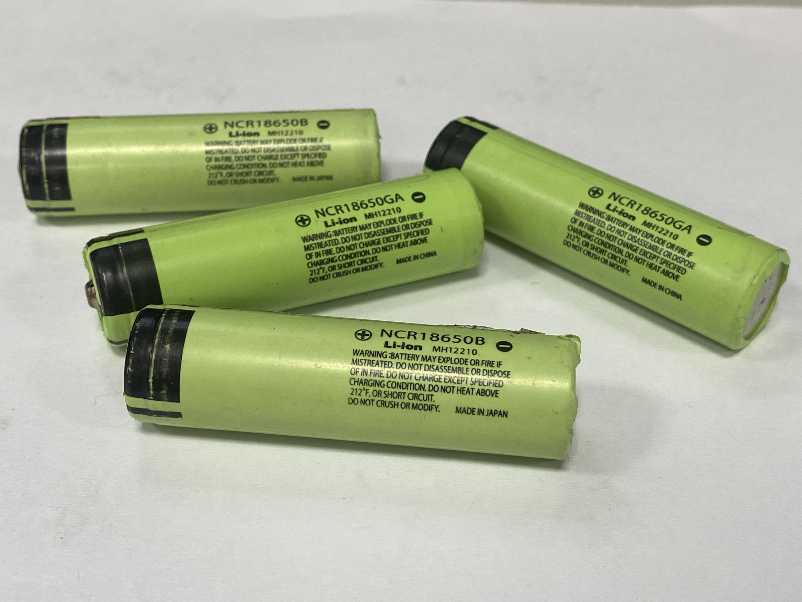 </td>
  <td>
  
  </td>
</tr>
</table>
</div>


#### Step-Down Module(降壓模組)
<div align="center" width=100%>
<table >
<tr>
  <td > LM2596 DC-DC可調降壓模組 </td> 
  <td>5A恆壓恆流降壓電源模組 </td>
</tr>
<tr>
  <td>    </td>
  <td> 
  </td>
  </tr>
</table>
</div>

#### Low Voltage Alarm(低電壓警報器)
<div align="center" width=100%>
<table >
<tr>
  <td> 低電壓警報器</td> 
</tr>
<tr>
  <td>    </td>

  </tr>
</table>
</div>


## 2023/04/17 ~ 2023/04/23
**member:** ZHAO,ZHEN-BO、LIN,JHONG-BIN、Hu,Yun-Ruei  
**content:**  

 - The next step is the steering motor. After searching the information on the Internet, I found that MG90S and SG90 are commonly used. The difference between MG90S and SG90 is that the front gear is metal, and the latter is plastic. Because we often need to rotate all the time, we choose MG90S, which is not easy to damage  

- 接下來是操控馬達。在網上搜尋資料後，我發現MG90S和SG90是常見的選擇。MG90S和SG90之間的差異在於前齒輪，前者是金屬的，後者則是塑料的。由於我們常常需要持續旋轉，我們選擇了MG90S，因為它不容易損壞。 

#### Servo Motor(伺服馬達)
<div align="center">
<table>
<tr align="center">
<td rowspan="2">Model(型號)</td>
<td> MG90S</td>
<td >SG90</td>
</tr>
<tr align="center">
<td></td>
<td > </td>
</tr>
<tr align="center">
<td >rotation angle(轉動角度)</td>
<td >90° MAX</td>
<td">0~90°/180° MAX</td>
</tr>
<tr align="center">
<td >torque(轉矩)</td>
<td  >2.0kg/cm</td>
<td  ">1.4 kg/cm</td>
</tr>
<tr align="center">
<td  >speed(轉速)</td>
<td >0.11s</td>
<td  >0.1S</td>
</tr>
</table>
</div>

## 2023/04/24 ~ 2023/04/30
**member:** ZHAO,ZHEN-BO、LIN,JHONG-BIN、Hu,Yun-Ruei  
**content:**

- When the vehicle is uncertain about the distance ahead, it cannot turn in time when encountering a wall. Therefore, ultrasonic sensors have been added to enable the vehicle to turn before colliding with the wall. 
- Based on the experiments conducted, it has been found that ultrasonic sensors can only detect obstacles in front of the vehicle. Additionally, they are less effective in detecting distances while the vehicle is swaying from side to side. Therefore, it has been decided to adopt a 360-degree LiDAR sensor for detecting distances in front of, as well as to the left and right sides of the vehicle.

- 車輛在不知道前方距離時，無法在遇到牆壁及時轉彎，因此加上了超音波，這樣就可以在撞到牆之前轉彎。 
- 經實驗得知，超音波只能偵測前方障礙物距離，且在車輛左右晃動下，不容易偵測距離，因此改採用可以360度偵測的光達感測器，來當車輛的前方、左右邊的距離。

#### Distance Sensor(距離感測器 )
<div align="center" width=100%>
<table >
<tr>
  <td align="center">ultrasound (超音波)</td> 
  <td align="center">ydlidar x2(光達)</td>
</tr>
<tr>
  <td>    </td>
  <td>
  </td>
  </tr>
</table>
</div>


## 2023/05/01~ 2023/05/07  
**member:** ZHAO,ZHEN-BO、LIN,JHONG-BIN、Hu,Yun-Ruei  
**content:**  
- To begin assembling the machine, I used LEGO parts from the club to build the base. I attached the motors, Raspberry Pi, and other components onto the chassis and made the machine functional.
After the vehicle becomes operational, additional sensors are added to allow the vehicle to sense its surroundings and respond accordingly based on the mission requirements.
- While moving the robot, I noticed that using LEGO blocks for construction resulted in slower and sometimes stuck movements. Therefore, I switched to using a laser cutter to cut wooden boards. With the use of wooden boards, the overall weight of the robot decreased, leading to increased speed and improved energy efficiency. Additionally, I can adjust the size and position of the wooden components based on specific requirements. Unlike LEGO blocks, which come pre-built and often require continuous modifications to fit the robot's needs, wooden boards offer more flexibility and can be custom-designed using Onshape.


- 首先，我們需要組裝機器，所以我利用社團的樂高零件先組裝底座，並將馬達和樹梅派等裝上車，讓車輛能夠行駛。
隨後，在車輛可以行駛之後，我們進一步添加其他感測器，讓車輛能夠感測場地環境，並根據任務需求做出相應的反應。
- 在進行測試時，我們發現使用樂高積木的移動速度不快，而且轉彎時重量過重，無法順利轉彎。因此，我們改用雷切機切割木板，使車輛的重量減輕，速度也相應提高，同時還節省了電力。使用木板的好處是可以根據需要自行調整尺寸和位置，而不像樂高需要不斷改裝以適應各種情況。這可以通過 Onshape 等工具進行自由繪畫和調整。

<div align="center" width=100%>
<table >
<tr>
  <td align=center>木板  </td>
  <td  align=center >onshape 網站  </td>
  </tr>
<tr>
  <td>  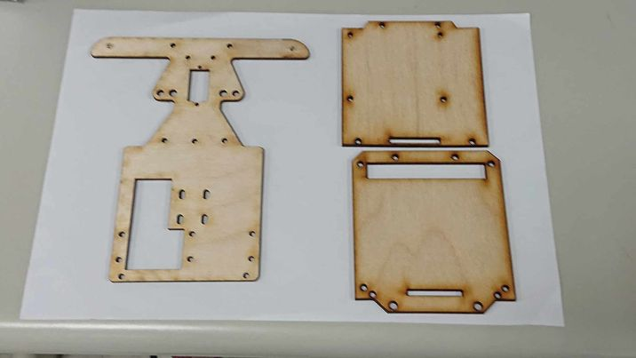  </td>
  <td>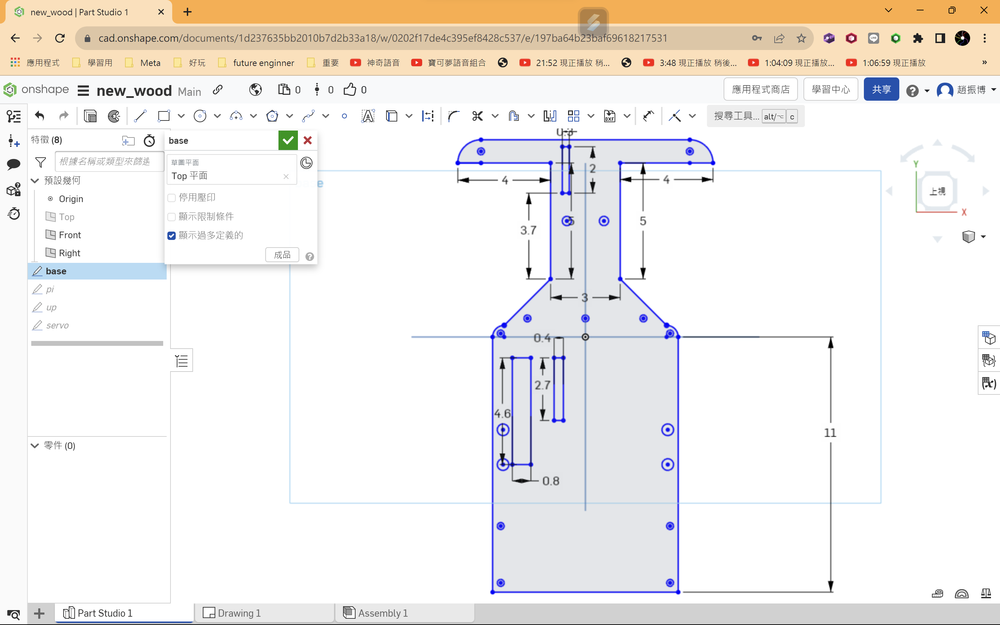
  </td>
  </tr>
</table>
</div>


## 2023/05/08 ~ 2023/05/14  
**member:** ZHAO,ZHEN-BO、LIN,JHONG-BIN、Hu,Yun-Ruei  
**content:**

- Although it is possible to move straight and turn using the ultrasonic sensor, there is a risk of scraping against walls and getting stuck at corners. Therefore, we replaced the ultrasonic sensor with a lidar, which can detect the surroundings and maintain the robot in the center of the road. With the lidar, it can also detect turns ahead.  
- However, during the actual testing of the YDLIDAR X4 and DLIDAR X2, we also encountered the issue of missing angles (as shown in the attached image). Therefore, in this competition, we decided to use the D100 sensor for vehicle detection and measuring the distance to the side walls. The results obtained from the D100 sensor met our expectations and requirements.

- 雖然可以直行和利用超音波轉彎，但是有可能轉彎時擦到牆壁，然後卡牆邊無法繼續運行，之後我們將超音波改成了光達，光達可以偵測四周，因此可以維持在道路中央，還可以偵測前方轉彎。
- 然而我們在實測光達時也發現了ydlidar x4、dlidar x2 所遇之缺角問題(如附圖所示)因此，在本次競賽中，我們決定採用D100感測器來進行車輛偵測場邊牆距離，並且使用的結果符合預期的需求。

<div align="center" width=100%>
<table >
<tr>
  <td align="center">ydlidar x4</td> 
  <td align="center">ydlidar x2</td>
  <td align="center">lidar 100</td>
</tr>
<tr>
  <td>    </td>
  <td>  </td>
  <td>    
  </td>

  </tr>
</table>
</div>

<div align="center" width=100%>
<table >
<tr>
  <td align="center">ydlidar x4</td> 
  <td align="center">ydlidar x2</td>
  <td align="center">lidar 100</td>
</tr>
<tr>
  <td>    </td>
  <td>  </td>
  <td> 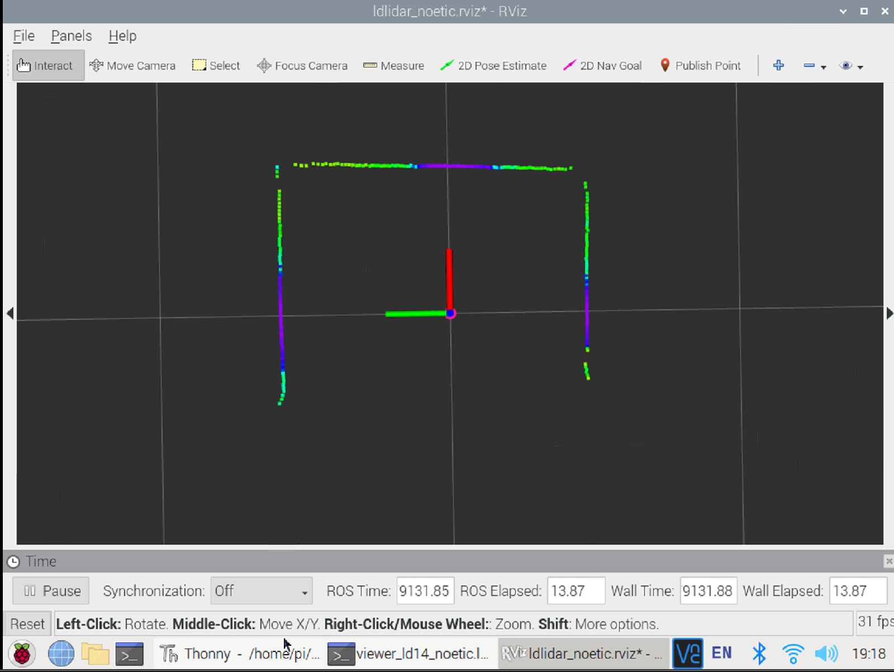  
  </td>
  </tr>
</table>
</div>


## 2023/05/15 ~ 2023/05/21  
**member:** ZHAO,ZHEN-BO、LIN,JHONG-BIN、Hu,Yun-Ruei  
**content:**  
- TCS34725 color sensor 
  - In the competition, vehicles need to demonstrate more functionalities than just turning. To achieve clockwise and counterclockwise turns, we must equip the vehicle with a color sensor to detect the colors of the lines on the ground and make appropriate judgments accordingly. Therefore, we must be particularly cautious in selecting the color sensor.
  - The TCS34725 color sensor has been chosen because it meets all the requirements of this competition. Firstly, it possesses outstanding sensing capabilities, allowing it to quickly and accurately identify the colors of the ground lines.Secondly, the sensor is thin and compact, enabling it to be placed close to the ground without interfering with the vehicle's movements.
  - The high precision of this sensor ensures that the vehicle can accurately recognize the colors of the ground lines and execute clockwise or counterclockwise turns as needed. 
  
   This is a crucial factor in the vehicle's excellent performance and victory in the competition.In conclusion, the TCS34725 color sensor is a perfect fit for the requirements of this competition.Its slim design and highly accurate color recognition capabilities enable the vehicle to adapt flexibly to changes in ground lines, achieve clockwise and counterclockwise turns, and enhance its performance in the competition. 
  
   I encountered a bottleneck when using the color sensor to detect lines because I was unsure how to write a Python program to detect the values of blue and orange lines. 
  With the guidance of my teacher, I successfully completed it. The partial code is as follows:

- During the implementation testing, it was discovered that we originally used a USB 180-degree adapter (as shown in the lower left image), but it was prone to colliding with obstacles, particularly building blocks. As a result, we made a change and switched to using a USB 3.0 90-degree adapter for the connection. This modification makes it less likely to accidentally hit obstacles when trying to avoid them.

- TCS34725 顏色感測器 
  - 車輛在競賽中需要展現更多功能，而僅僅懂得轉彎是不夠的。為了實現順時針和逆時針的轉彎，我們必須裝備車輛以感測地上線的顏色，並相應地做出適當的判斷。因此，我們在挑選顏色感測器時，要特別謹慎。
  - TCS34725 顏色感測器被選中是因為它滿足了此次競賽的所有要求。首先，它具有出色的感測功能，可以快速而準確地辨識地面線條的顏色。其次，這款感測器相當薄且小巧，這意味著它可以輕鬆貼近地面，不會對車輛的運行造成任何干擾。
  - 該感測器的高度精確度確保了車輛可以準確識別地面線條的顏色，並且根據需要執行順時針或逆時針的轉彎動作。這是車輛在競賽中表現出色並獲得優勝的關鍵因素之一。
  
   綜上所述，TCS34725 顏色感測器是一款完美符合本次競賽要求的感測器。它的薄型設計和高度精確的顏色識別功能使車輛能夠靈活適應地面線條的變化，實現順時針和逆時針的轉彎，從而提升了車輛在競賽中的表現。

   在使用顏色感測器偵測線時遇到瓶頸，因為不知道如何使用python撰寫程式來偵測藍、橘線的數值，經過老師指導，成功完成，片段程式如下。
- 在實作測試時發現，本來我們是使用usb 180度轉接頭(如左下圖)，但容易撞到積木，因此我們改成使用 usb3.0 90 度轉接頭來連接，就不容易避開障礙物時碰到障礙物。
 

<div align="center" width=100%>
<table >
<tr>
  <td align="center">Snippet of Code(片段程式)</td> 
  <td align="center">Function(定義成函數)</td>
</tr>
<tr>
  <td> </td>
  <td>
  </td>  
  </tr>
</table>
</div>

<div align="center" width=100%>
<table >
<tr>
  <td align="center">USB 水平 180°</td> 
  <td align="center">USB 垂直 90°</td>
</tr>
<tr>
  <td align="center"></td> 
  <td align="center"></td>
</tr>
</table>
</div>

<div align="center" width=100%>
<table >
<tr>
  <td align="center">Event Photo(活動照片)</td> 
  <td align="center">Event Photo(活動照片)</td> 
</tr>
<tr>
  <td align="center"> 
  <td align="center"></td>
</tr>
</table>
</div>

## 2023/05/22 ~ 2023/05/28  
**member:** ZHAO,ZHEN-BO、LIN,JHONG-BIN、Hu,Yun-Ruei  
**content:**  

- In order to enable the vehicle to avoid obstacles accurately, we need to install a camera module on the vehicle. Since we are using a Raspberry Pi as the controller, we need to find a compatible camera module for it. To do this, we referred to the camera module used by the American team in last year's competition and compared it with other camera modules in the same series. Here is the product information:
- 為了讓車輛能夠正確地閃避積木，我們需要在車輛上安裝一個鏡頭模組。由於我們使用的控制器是 Raspberry Pi，因此我們需要尋找與其相容的鏡頭模組。為此，我們參考了去年美國隊伍使用的鏡頭模組，並尋找了同一系列的鏡頭模組進行比較。以下是產品資訊：

1. raspberry pi camera Rev 1.3(傳感器:OmniVision OV5647)
2. raspberry pi camera Module V2(傳感器:Sony IMX219)
3. raspberry pi camera Module V3(傳感器:Sony IMX708)

- Considering that V3 is not compatible with our existing Raspberry Pi operating system, we decided not to use that version. Additionally, the detection rate of version 1.3 is only 30p, whereas the V2 version can reach a maximum of 90p. Therefore, we ultimately chose the Raspberry Pi Camera Module V2 for our project. Through experimentation, we found that the V2 version has the best recognition performance.
- 考慮到V3與我們現有的Raspberry Pi作業系統不相容，我們決定不使用該版本。而1.3版本的偵測率僅為30p，相比之下，V2版本的偵測率最高達到90p。因此，我們最終選擇了Raspberry Pi相機模組V2作為我們的選擇。經過實驗，我們發現V2版本具有最佳的辨識效果。

### Camera Module(攝影模組)
#### Camera Module(攝影模組)
<div align="center">
<table>
<tr>
<td align="center">Model(型號)</td> 
<td align="center">raspberry pi camera Rev 1.3</td>
<td align="center">raspberry pi camera Module V2</td>
<td align="center">raspberry pi camera Module V3</td>
</tr>
<tr>
<td>Photo</td>
<td align="center">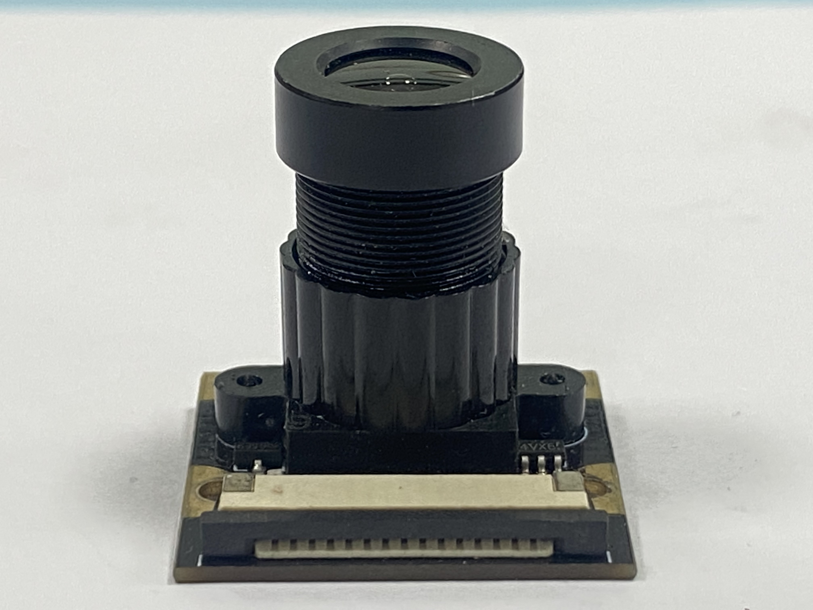</td>
<td align="center">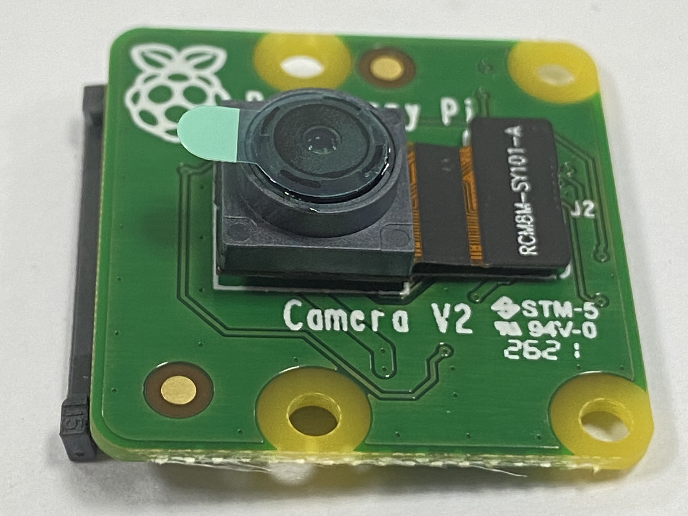</td>
<td align="center">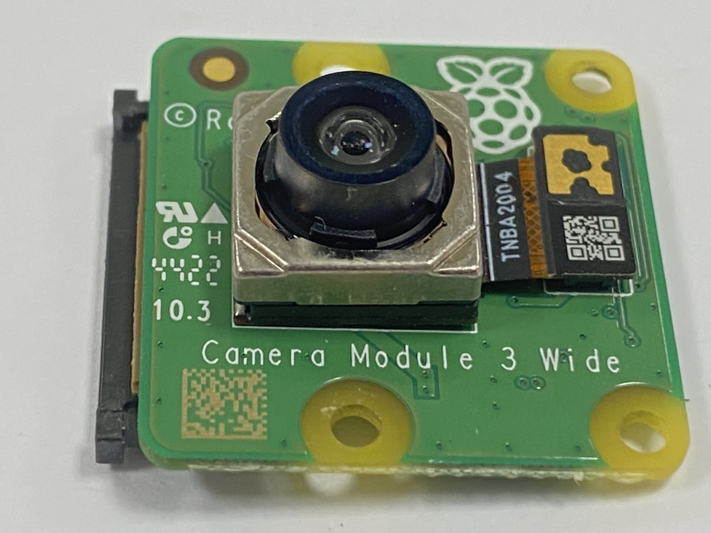</td>
</tr>
<td>sensor</td>
<td align="center">Omnivision OV547</td>
<td align="center">Sony IMX 219</td>
<td align="center">Sony IMX 708</td>
</tr>
<td>sensor resolution</td>
<td align="center">2592 * 1944 pix</td>
<td align="center">3280 * 2464 pix</td>
<td align="center">4608 * 2592 pix</td>
</tr>
<td>FPS幀率</td>
<td align="center">30p MAX</td>
<td align="center">90p MAX</td>
<td align="center">120p MAX</td>
</tr>
</table>
</div>

- During subsequent testing, we found that the vehicle was unable to anticipate the position of the next block while avoiding obstacles. This posed a challenge for the vehicle's obstacle avoidance strategy. As a result, we decided to modify the original camera and convert it into a wide-angle lens. Compared to the original 72-degree field of view, the wide-angle lens provides a 160-degree field of view, allowing us to anticipate the position of the next block in advance. This improvement has enhanced the vehicle's obstacle avoidance effectiveness.

- 在之後的測試中，我們發現當車輛閃避積木時無法預先得知下一個積木的位置，這對於車輛的避障策略造成了困擾。因此，我們決定將原本的鏡頭進行改裝，將其轉換成廣角鏡頭。相較於原本的72度視野範圍，廣角鏡頭提供了160度的視野範圍，能夠讓我們提前預測下一個積木的位置，從而改善車輛的避障效果。

#### wide-angle lens(廣角鏡)
<div align="center">
<table>
<tr>
<td align="center"> Without the wide-angle lens 未加廣角鏡</td> 
<td align="center">With the wide-angle lens 已加廣角鏡</td>
</tr>
<tr>
<td align="center"></td><td>
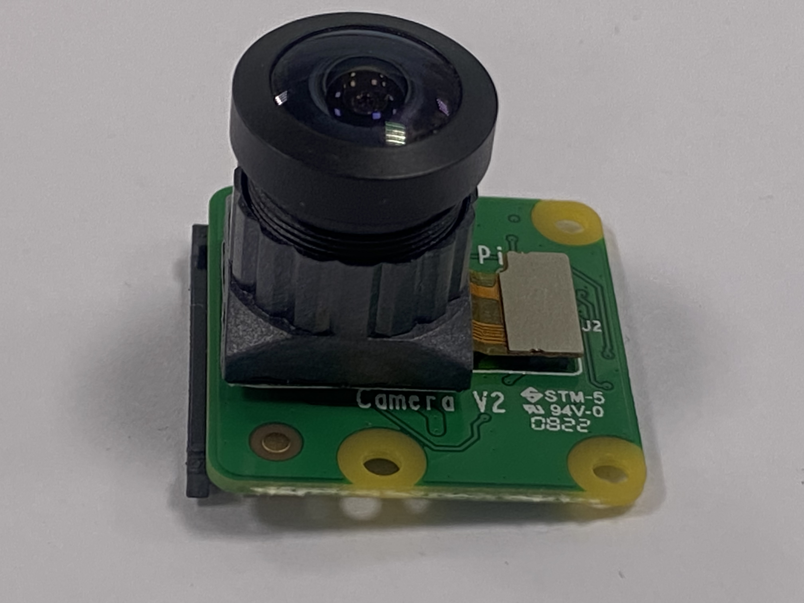
</td>
</tr>
<td align="center"></td>
<td align="center"> </td>
</tr>
</table>
</div>

- In the Raspberry Pi program, it is possible to configure the resolution of the camera module. We conducted experiments with the following common resolutions.
- 在raspberry pi的程式中可以設定鏡頭模組的解析度，我們將實驗以下常見的解析度

  1. 1080x640 幀率30p
  2. 640x320 幀率60p
  3. 320x240 幀率90p

- In our experiments, we found that when the camera module's resolution was set to 1080x640, the high-resolution image processing demands led to a significant amount of time being spent on block recognition, resulting in a decrease in computational efficiency. On the other hand, when the resolution was set to 320x240, the computational efficiency was extremely high, but the low resolution hindered the proper recognition of the blocks. However, when we set the resolution to 640x320, we observed that the program could successfully recognize the blocks without compromising computational efficiency, thus avoiding collisions with the blocks. Therefore, we ultimately decided to set the camera module's resolution to 640x320.
- 在我們的實驗發現，當相機模組的解析度設定為1080x640時，由於高解析度的影像處理需求，程式需要花費大量的時間來辨識積木，這導致了程式的運算效率降低。另一方面，當解析度設定為320x240時，雖然運算效率極高，但由於解析度過低，導致無法正常辨識積木。然而，當解析度設定為640x320時，我們觀察到可以正常辨識積木，而且運算效率也不會太慢，避免了車輛撞上積木的問題。因此，我們最終選擇將相機模組的解析度設定為640x320。 

## 2023/05/29 ~ 2023/06/04  
**member:** ZHAO,ZHEN-BO、LIN,JHONG-BIN、Hu,Yun-Ruei  
**content:**

- By using VS Code along with Git to edit our technical documentation, we can effectively manage potential conflicts and improve collaboration. The advantages of this approach include easy version control, immediate notifications to editors when conflicts arise due to simultaneous edits, and the ability for editors who upload data later to merge conflicts by comparing the data. This way, we can ensure a smoother and more efficient process when working on the technical documentation.

- 在撰寫技術文件時，我們決定使用VS Code加上git來編輯。這樣的做法有很多好處，其中包括容易進行版本控制，當不同編輯者同時編輯同一個檔案時，git會立即通知編輯者有衝突發生，這樣較晚上傳資料的編輯者就可以透過資料的比較來合併衝突。這樣的作法讓我們在編輯技術文件時能夠更有效率地合作和管理可能的衝突。

[github 主頁 : https://github.com/kirkhu/WRO2023_Future-Engineers-Fire-On-All-Cylinders/tree/main](https://github.com/kirkhu/WRO2023_Future-Engineers-Fire-On-All-Cylinders/tree/main)

<div align="center">
<table>
<tr>
<td align="center"> 要在VS Code編輯只要點擊原始檔控制，並按下複製儲存庫</td> 
<td align="center">輸入網址，就能在VS Code做編輯及版本控制</td>
</tr>
<tr>
<td align="center">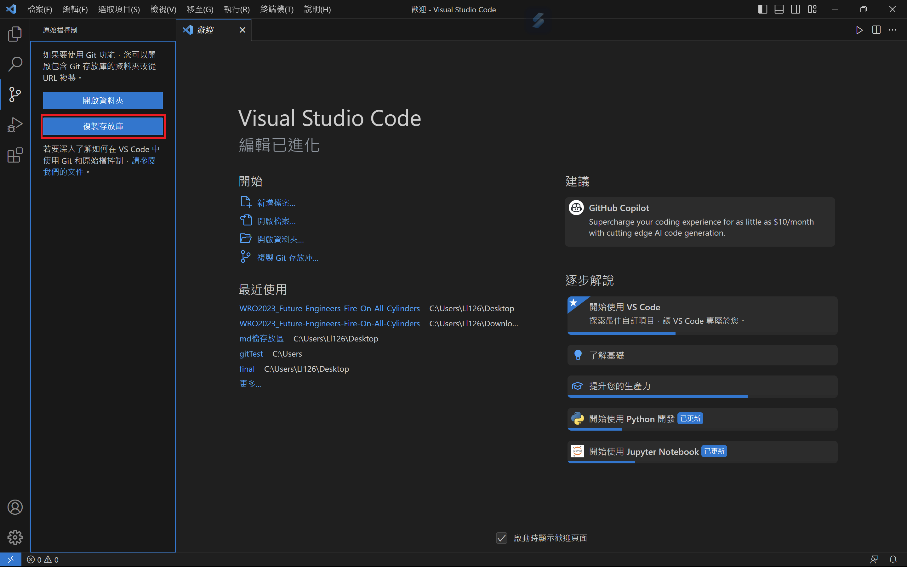</td><td>

</td>
</tr>
</table>
</div>


## 2023/06/05 ~ 2023/06/11 
**member:** ZHAO,ZHEN-BO、LIN,JHONG-BIN、Hu,Yun-Ruei  
**content:**

- During the hardware design process, we encountered a few instances where the Raspberry Pi controller or IC was damaged due to incorrect power or data cable connections. To prevent such issues, we implemented a solution using male-female connectors for both power supply and data transmission. This approach ensured correct wiring and effectively mitigated the risk of the Raspberry Pi or IC getting burnt. These design improvements have enhanced the stability of the hardware system, leading to increased overall product reliability and lifespan.
- During the hardware design process, we initially used a breadboard to connect the circuits. Unfortunately, we encountered some instances of burning or poor contacts, resulting in abnormal functionality or potential issues that were challenging to detect. To improve this situation, we made the decision to switch to soldering the circuits onto a prototyping board. This change significantly reduced the risks of burning or poor contacts while ensuring stable and reliable connections. Through this improvement, we successfully enhanced the overall hardware system's reliability and ensured proper functionality.  


- 在硬體設計過程中，遇到過幾次因電源接錯或資料線插錯而導致樹莓派控制器或IC損壞的情況。為了避免這樣的問題，我們採用了使用公母插座進行電源供應及資料傳輸的解決方案。透過公母插座，確保了正確的接線，有效地避免了樹莓派或IC燒毀的風險。這樣的設計改進增加了硬體系統的穩定性，提高了整體產品的可靠性和使用壽命。
- 在硬體設計過程中，我們最初使用麵包板連接電路，但不幸遇到了一些燒毀或接觸不良的現象，這導致功能運作不正常或存在潛在問題，且很難發現。為了改善這種情況，我們決定改用銲接方式將電路固定在電木板上。這樣的改變明顯地降低了燒毀或接觸不良的風險，同時確保了穩定可靠的連接。透過這項改進，我們成功地提高了整體硬體系統的可靠性，並確保了功能的正常運作。

<div align="center">
<table>
<tr>
<td align="center"> </td> 
<td align="center"></td>
</tr>
</table>
</div>

## 2023/06/12 ~ 2023/06/18
**member:** ZHAO,ZHEN-BO、LIN,JHONG-BIN、Hu,Yun-Ruei  
**content:**

- Before dodging the blocks, we need to complete the basic task of circling the track three times. During this circling process, we noticed the possibility of the machine rubbing against the walls while turning. To address this, we utilize the 360-degree detection capability of LiDAR to keep the vehicle centered on the track. By subtracting the distances on the left and right sides, we obtain an error value, which is then corrected using the servo motor to ensure the vehicle continues to travel along the center of the track.

- 在閃避積木之前，我們需要先完成基本的環繞場地三圈。在繞圈的過程中，我們發現機器有可能在轉彎時擦撞到牆壁，因此需要利用光達的360度偵測功能來使機器維持在道路中央。透過將左右邊的距離相減，我們可以得到一個誤差值，再利用伺服馬達來修正這個誤差，使機器能夠持續行駛在道路中央。

<div align="center">
<table>
<tr>
<td align="center"> 車輛撞擊邊牆</td> 
<td align="center">偵測左右牆距離</td>
</tr>
<tr>
<td align="center">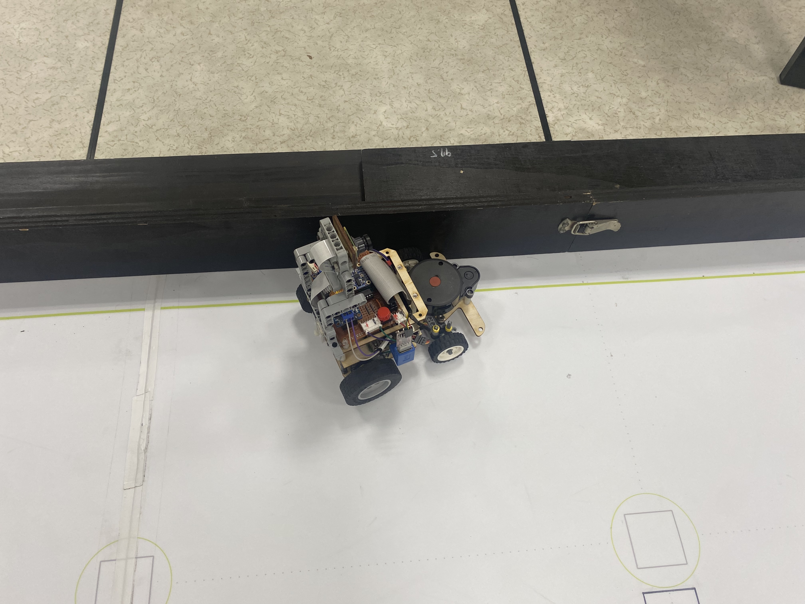</td><td>

</td>
</tr>
</table>
</div>


## 2023/06/19 ~ 2023/06/25   
**member:** ZHAO,ZHEN-BO、LIN,JHONG-BIN、Hu,Yun-Ruei  
**content:**

- The robot is now able to operate successfully. The next step is to use the camera to avoid obstacles (blocks). First, we need to detect the distance to the obstacles (blocks). and then identify the color of the blocks. Utilizing the features of OpenCV, we can calculate the distance between the blocks and the robot to avoid obstacles. By implementing an algorithm, we can control the front wheels to steer around these obstacles.
- However, there is an issue at the corners where the robot cannot avoid obstacles in a timely manner. To address this, we need to combine the gyroscope's readings with the output values from the algorithm to successfully navigate around corners

- 機器人現在已經能夠成功運作。接下來的步驟是使用攝影機來避開障礙物（積木）。首先，我們需要偵測與障礙物（積木）的距離，然後識別積木的顏色。透過利用OpenCV的功能，我們可以計算出積木與機器人之間的距離，以避開障礙物。透過實現一個演算法，我們可以控制前輪來繞過這些障礙物。  
- 然而，在轉彎處有一個問題，機器人無法及時避開障礙物。為了解決這個問題，我們需要將原本方向的數值與演算法的輸出值結合起來，以成功地在轉彎處繞過障礙物。  

<div align="center">
<table>
<tr>
<td align="center"> 偵測積木距離</td> 
<td align="center">撞擊積木</td>
</tr>
<tr>
<td align="center">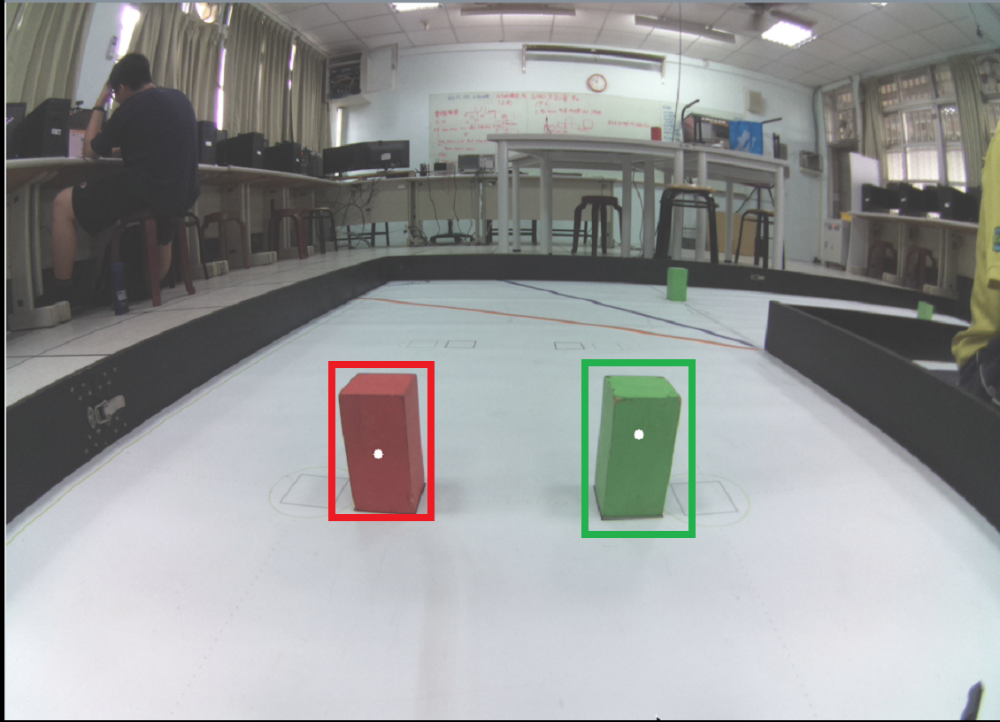</td><td>

</td>
</table>
</div>


## 2023/06/26 ~ 2023/07/02 
**member:** ZHAO,ZHEN-BO、LIN,JHONG-BIN、Hu,Yun-Ruei  
**content:**

- During today's testing, we discovered that the robot tends to misinterpret people wearing red or green clothing in its surroundings as obstacles, causing it to unnecessarily avoid them and potentially miss avoiding the next block in time. To address this issue, we added an additional layer of black masking at the top of the camera's field of view, preventing the robot from detecting colors outside of the track area.After adding the black masking, the robot will no longer detect colors outside of the track area, reducing the chances of interference.

- 今天在測試時發現當機器在周圍人穿紅色衣物或綠色衣物時會誤測成積木讓機器閃避，導致無法及時閃過下一個積木，因此我們在畫面的上方將上一層黑色遮罩，讓機器無法偵測場地以外的顏色。在加上黑色遮罩之後，就不會再偵測到場外的顏色，減少被干擾的機率。

<div align="center">
<table>
<tr>
<td align="center">使用黑色遮罩屏蔽場外的顏色</td> 
</tr>
<tr>
<td align="center"></td>
</table>
</div>

## 2023/07/03 ~ 2023/07/09 
**member:** ZHAO,ZHEN-BO、LIN,JHONG-BIN、Hu,Yun-Ruei  
**content:**

- This week, as most of the programming has been completed, we began testing the success rate of the robot. We started with 50% speed, and due to the slower pace, the robot mostly responded well. However, when accelerating to 70%, the color sensor occasionally misjudged the color of the track due to the high speed. As a result, we modified the turning conditions to utilize the LiDAR's measurements of left and right directions to determine the turning direction. This adjustment reduces the likelihood of turning in the wrong direction due to color misjudgment

- 這周我們已經完成了大部分的程式編寫，於是我們開始進行機器的成功率測試。一開始我們選擇了50%的速度，由於速度相對較慢，機器大多能夠順利做出反應。然而，當我們提高到70%的速度時，我們發現顏色感測器有時會因為速度過快而誤判地上線的顏色。因此，我們進行了調整，改用光達測量左右方向的方式來辨識轉彎方向，這樣可以減少因為顏色誤判而轉錯方向的情況。

#### 偵測轉彎方向
```
if get_left_dis > 100:
    reverse = False
else:
    reverse = True
if get_mid_dis > 55:
    servo.angle(-40)
```


## 2023/07/10 ~ 2023/07/16 
**member:** ZHAO,ZHEN-BO、LIN,JHONG-BIN、Hu,Yun-Ruei  
**content:**

- The robot is now capable of successfully avoiding obstacles and completing the third lap around the track. The next task is to detect blocks and perform a turnaround maneuver. The turnaround will only be executed if the last block of the second lap is red. Therefore, it is necessary to detect the lap count. We will utilize the color sensor to count the number of times the line is crossed and determine whether the set count has been reached.

- If the specified count has not yet been achieved, the system will continue to record the color of the nearest traffic sign until the count of line crossings is greater than or equal to the set value. At this point, color recording will cease.

- Once the color of the nearest traffic sign has been recorded, the program will determine whether the color is red. If the color is red, the system will set the angle of the servo motor to initiate a right turn and continue turning until the vehicle is oriented in the specified direction. If the detected color is not red, the vehicle will continue moving forward. However, if the color of the traffic sign is red, a turnaround maneuver will be executed.

- 已經可以完成閃避積木及繞場第三圈，接下來就是偵測積木並迴轉，迴轉是在第二圈的最後一個積木是紅色的才要進行的動作，因此要先偵測圈數，要利用顏色感測器來偵測經過的線條次數，並判斷是否超過了設定的次數。
- 如果未達到指定次數，系統將會持續紀錄距離最近的交通標誌顏色，直到經過的線條次數大於或等於設定次數，此時將不再紀錄顏色。
- 紀錄完最近的交通標誌顏色後，程式將判斷最近的交通標誌顏色是否為紅色。若標誌顏色為紅色，系統將設定伺服馬達角度為右轉角度，持續轉動直到車輛轉向指定的方向。若最近的交通標誌顏色不是紅色，則車輛會繼續向前行駛。

<div align="center">
<table>
<tr>
<td align="center">顯示線條次數與最近的交通標誌顏色</td> 
<td align="center">正在調整數值</td>
</tr>
<tr>
<td align="center"></td><td>
 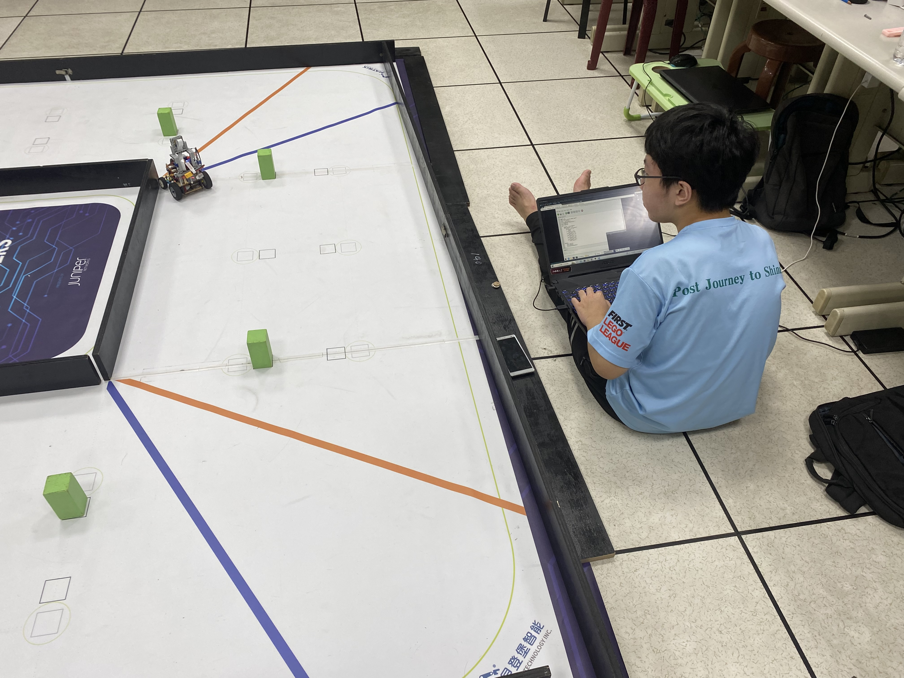
</td>
</table>
</div>

## 2023/07/17 ~ 2023/07/23  
**member:** ZHAO,ZHEN-BO、LIN,JHONG-BIN、Hu,Yun-Ruei  
**content:**

- As the field mission has been roughly completed, we are now starting to write the technical report. Since we are not familiar with the correct technical report format, we referred to the official website's technical report documentation, and found that the report should include the following sections:

  1. module: This folder should contain documentation related to the vehicle models, such as files for laser cutting machines and 3D printers.

  2. other: This folder is used to store data that does not belong to other categories, such as communication protocols and engineering logs.

  3. schemes: This folder is dedicated to hardware introductions, explaining the functions of electronic components and how they are connected.

  4. src: All programs should be placed in this folder.

  5. t-photos: This folder should contain team photos, including a group photo and humorous pictures.

  6. v-photos: Machine photos from six different perspectives should be placed in this folder.

  7. video: Videos demonstrating the machine's operation should be placed in this folder, with each video lasting more than 30 seconds.

- When writing the technical report, we are switching between VS Code and the GitHub website. We use a desktop computer to view the GitHub web page and a laptop to edit the report in VS Code.

- 由於場地任務已經大致完成，因此要開始撰寫技術報告，由於我們還不清楚正確的技術報告標準，因此參考官網的技術報告文件，發現需要以下部分

  1. module 此資料夾內需放入車輛模型的文件，如雷射切割機、3D列印機的檔案
  
  2. other 此資料夾用於放置不屬於其他分類的資料，如通訊協定、工程日誌等
  
  3. schemes 此資料夾用於硬體介紹，說明電子元件的作用與如何連接
  
  4. src 此資料夾需要放入所有程式
  
  5. t-photos 此資料夾需要放入團隊的合照，包括一張合照和搞笑照片
  
  6. v-photos 此資料夾需要放入機器的照片，包括六個不同方位的視圖
  
  7. video 此資料夾應該放入機器運作影片，要超過30秒

- 再撰寫技術文件時，由於需要再VS Code和Github網站之間切換，因此我們改用一台桌機檢視Github網頁，一台筆電用VS Code編輯

<div align="center">
<table>
<tr>
<td align="center">官方網站的github範例</td> 
<td align="center">筆電和桌機對照修改</td>
</tr>
<tr>
<td align="center">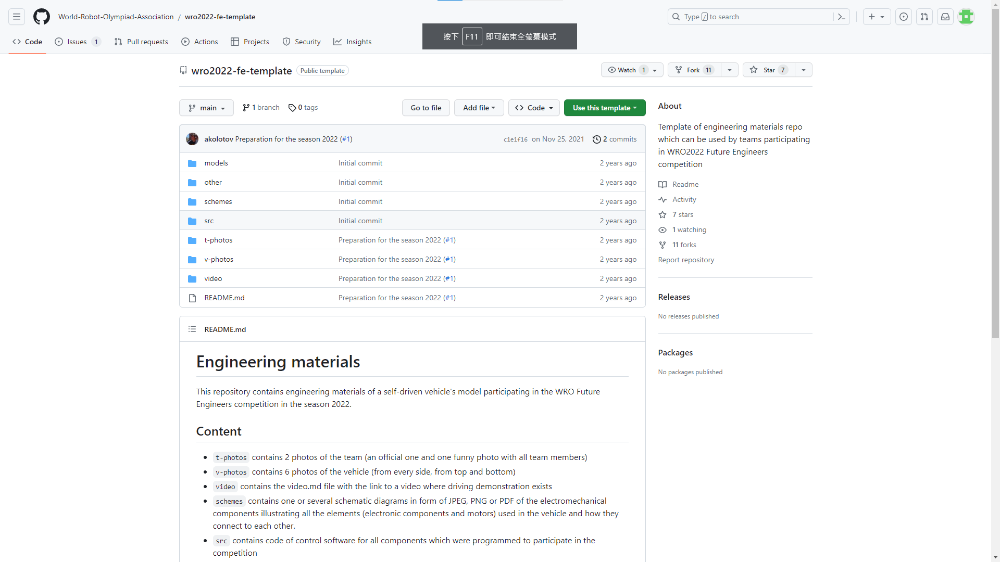</td><td>
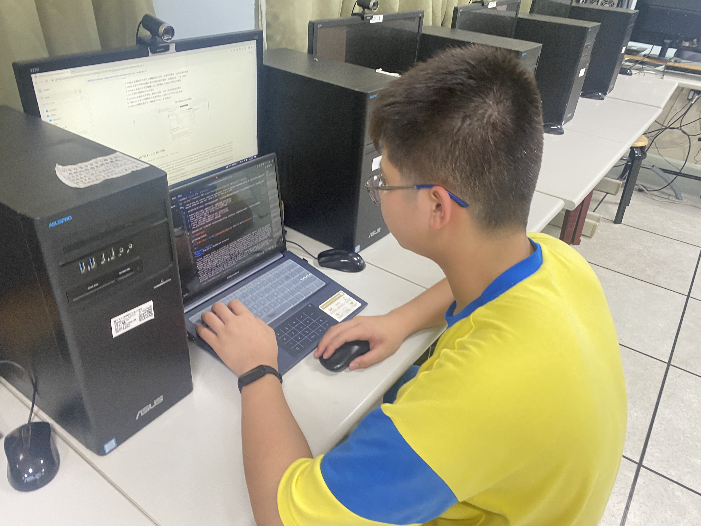
</td>
</table>
</div>

## 2023/07/24 ~ 2023/07/30  
**member:** ZHAO,ZHEN-BO、LIN,JHONG-BIN、Hu,Yun-Ruei  
**content:**

- We made significant progress in our project. We successfully organized and listed the components in the parts inventory, and we uploaded it to the technical documentation. Additionally, we completed the drawing of the vehicle's introduction diagram. Throughout this process, we embarked on a learning journey, gradually familiarizing ourselves with GitHub syntax. Although we are not yet fully proficient in using GitHub, we dedicated time to researching relevant information online and steadily improving our skills. These achievements have brought valuable advancements to our report and project as a whole.
- Over these few days, we have been continuously adjusting and fine-tuning the execution of venue tasks, making constant adjustments to motor speed and various parameters in the hopes of effectively reducing the error rate. We are eager to achieve better performance and improve our overall competition results.
- During practical testing, we discovered that the vehicle was getting stuck at the junctions of the terrain due to protrusions, which was affecting its normal operation. To address this issue, we adopted a method of using a laser cutting machine to create 3mm thick spacers. These spacers were then placed under the vehicle chassis to elevate its height, enabling the vehicle to pass over the obstacles smoothly.

- 我們完成了將零件清單整理並列點，並上傳至技術文件中。此外，我們也完成了車體的介紹圖的繪製工作。在這個過程中，我們逐步學習了GitHub語法的使用並逐漸熟悉它。儘管對GitHub的使用不是很熟練，但我們努力在網上查詢相關資訊，並逐步提高了技能水平。這些進展為我們的報告帶來了寶貴的進步。
- 這幾天我們持續調整及修正場地任務執行，不斷地進行馬達速度和各項參數的微調，期望能有效降低失誤率，期待能夠取得更好的表現並提高整體競賽成績。
- 在進行實際測試時，我們發現車輛在場地圖交界處因凸起而出現卡車的情況，這影響了車輛的正常運行。為了解決這個問題，我們採取了一個方法，使用雷切機切割出3mm厚的墊片，並將其放置在車身底部，從而將車身撐高，以便車輛能夠順利通行。

#### Overcoming Terrain Protrusions (克服場地凸起)

<div align="center">
<table>
<tr>
<td align="center"> 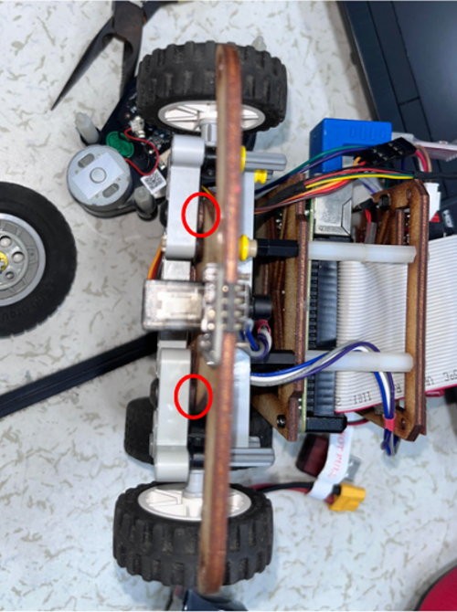</td> 
<td align="center">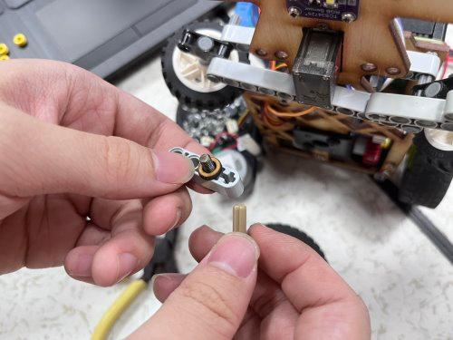</td>
<td align="center">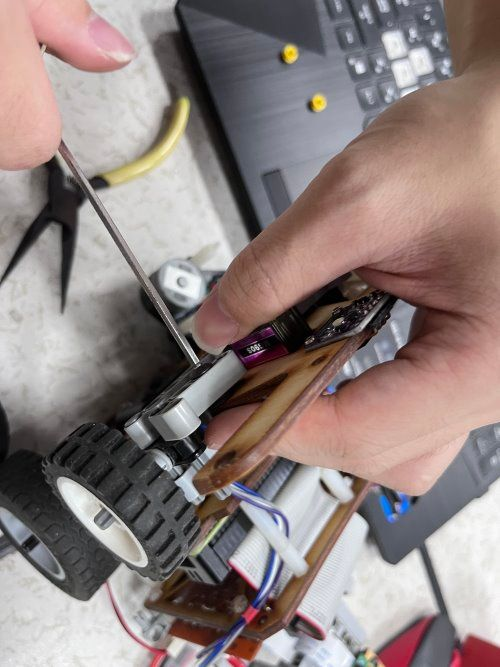</td>
</tr>
<tr>
<td align="center">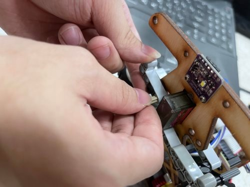</td><td>
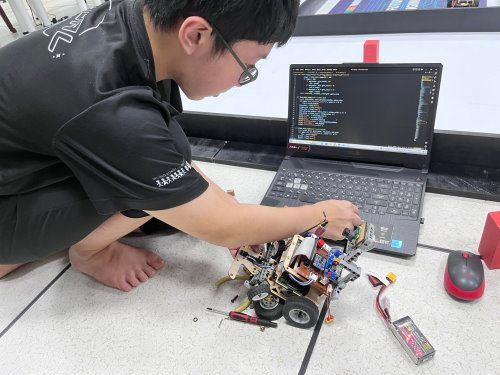
</td><td align="center">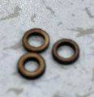</td>
</table>
</div>

### Team Members' Practice Status(隊員練習狀況)

<div align="center">
<table>
<tr>
<td align="center"> </td> 
<td align="center">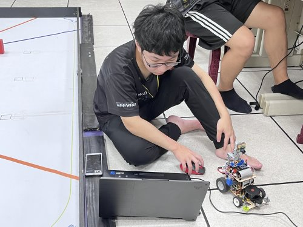</td>
</tr>
<tr>
<td align="center"></td><td>

</td>
</tr>
</table>
</div>

## 2023/07/31 ~ 2023/08/06
**member:** ZHAO,ZHEN-BO、LIN,JHONG-BIN、Hu,Yun-Ruei  
**content:**  

1.As the deadline for submitting the technical report is next week, we have begun revising the content of the technical documentation. We are also adjusting the website according to the official grading criteria and continuously adding to the technical report.

1.由於下星期就要交出技術文件，因此我們開始修改技術到告的內容，並依官方評分標準調整網頁，持續補充技術報告。 

<div align="center">
<table>
<tr>
<td align="center">舊目錄</td> 
<td align="center">新目錄(上)</td>
<td align="center">新目錄(下)</td>
</tr>
<tr>
<td align="center"></td><td>
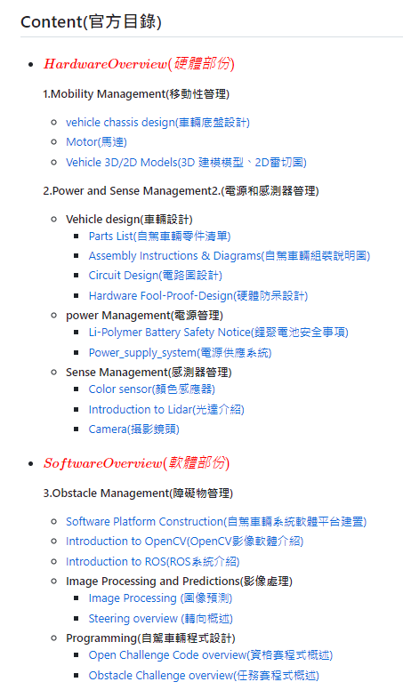
</td><td>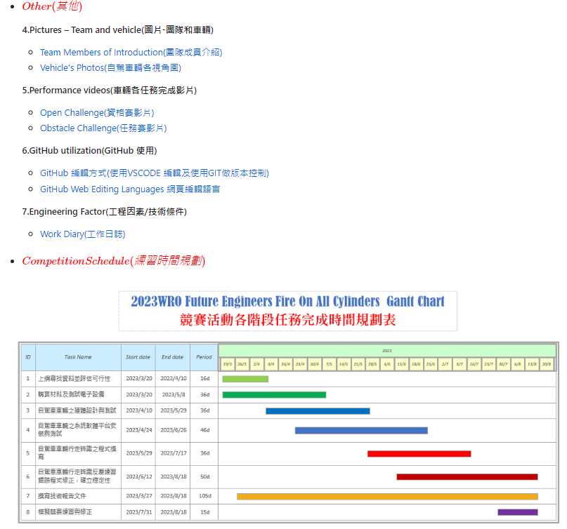<td>
</table>
</div>

2.Complete recording videos for each task and upload them to YouTube.

2.完成各任務錄影，並上傳YOUTUBE 

  __Open Challenge 資格賽__
  - [Open Challenge 全窄 速度70%](https://youtu.be/QtpuHt05MDg)
  - [Open Challenge 全窄 速度50%](https://youtu.be/QaYUrrdAtE8)
  - [Open Challenge 半寬半窄 速度70%](https://youtu.be/pcTpH8QgJFU)
  - [Open Challenge 半寬半窄 速度50%](https://youtu.be/7HdWxfWPfWc)
  - [Open Challenge 全寬 速度70%](https://youtu.be/MA1k2P87LdE)
  - [Open Challenge 全寬 速度50%](https://youtu.be/OUg0x4Qdc0c)  

 __Open Challenge 任務賽__
  - [Obstacle Challenge 速度50% ](https://youtu.be/Jo7555gfXG8)
  - [Obstacle Challenge 速度70% ](https://youtu.be/iCmcXbACizY)

### Team Members' Practice Status(隊員練習狀況)

<div align="center">
<table>
<tr>
<td align="center">報告撰寫</td> 
<td align="center">機構調整</td>
<td align="center">報告撰寫</td>
<td align="center">場地任務練習</td>
</tr>
<tr>
<td align="center">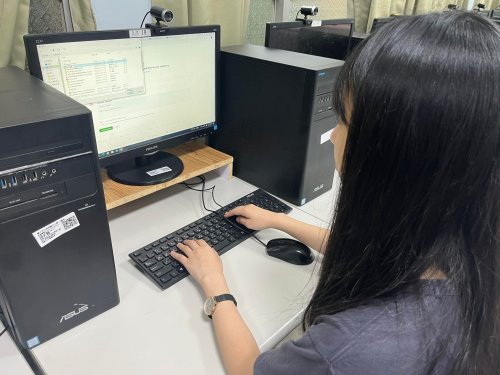</div></td><td>
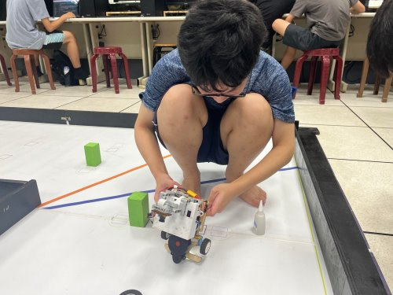
</td><td>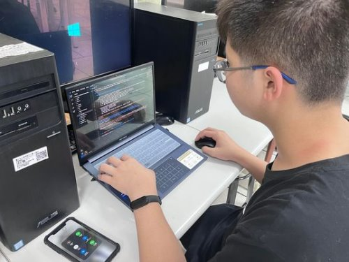</td>
<td>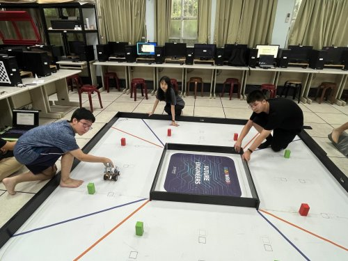</td>
</table>
</div>


## 2023/08/07 ~ 2023/08/13
**member:** ZHAO,ZHEN-BO、LIN,JHONG-BIN、Hu,Yun-Ruei  
**content:**


## 2023/08/14 ~ 2023/08/20
**member:** ZHAO,ZHEN-BO、LIN,JHONG-BIN、Hu,Yun-Ruei  
**content:**


# <div align="center">[Return Home](../../)</div> 

