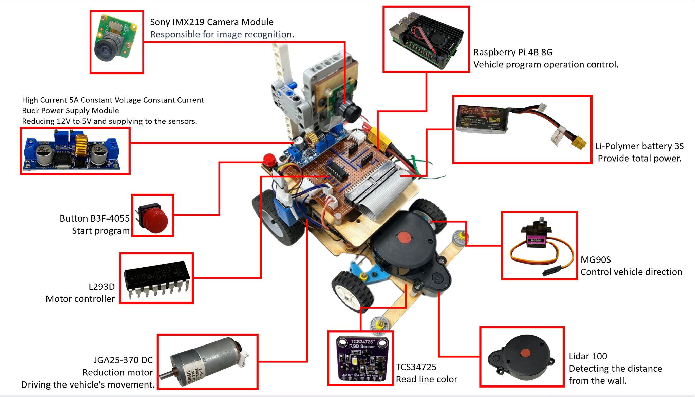
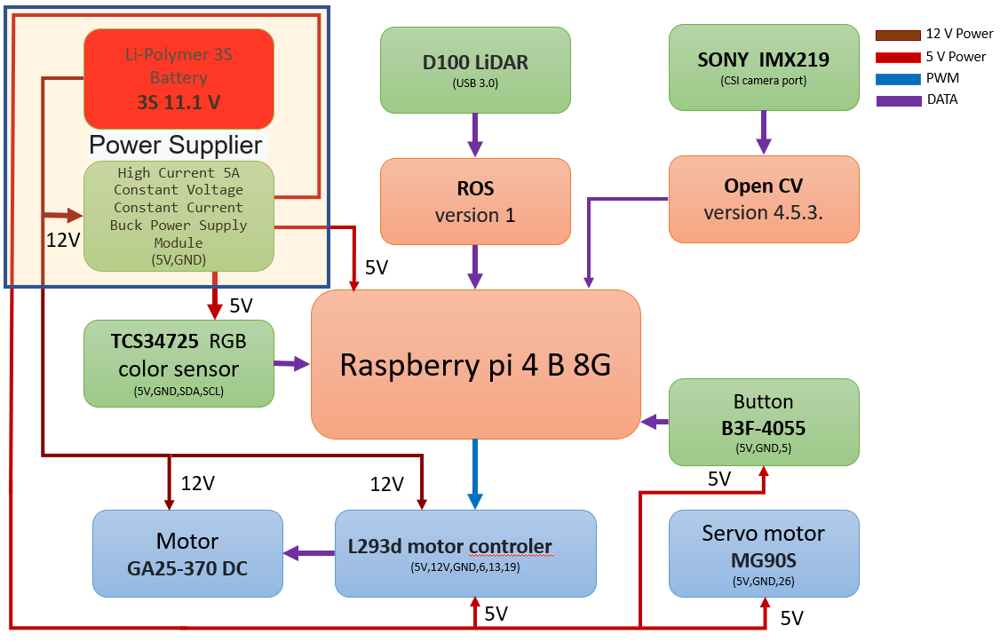
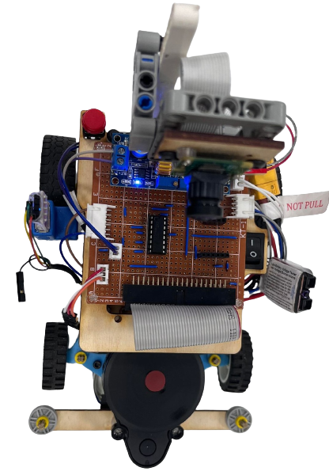
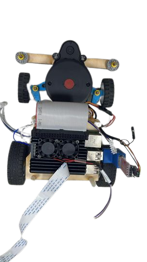
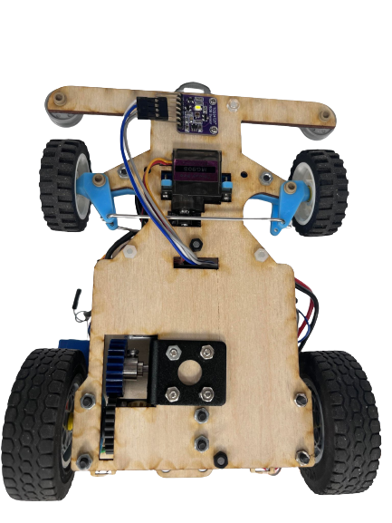
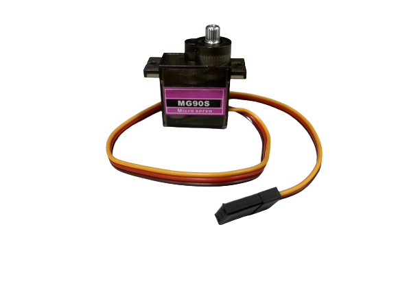
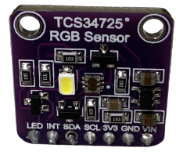
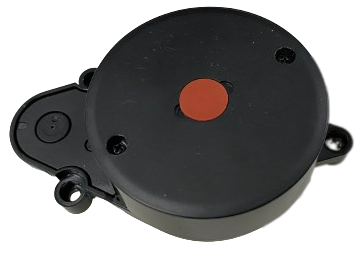

## 
Hardware Assembly Instructions

- ### Hardware Configuration of Electronic Equipment

  - The combination of electronic equipment configuration with the vehicle chassis structure forms a self-driving car.
  - The diagram below illustrates the placement of electronic equipment on the vehicle.
  

- ### System Operation Process
    

- The battery provides 12V power to the motor controller (L293D) and the voltage regulator. The voltage regulator steps down the voltage from 12V to 5V before supplying power to the Raspberry Pi and various sensors as their power source.  
- The LiDAR sensor detects distance values between the vehicle and walls in a 360-degree range. These values are transmitted to the Raspberry Pi via ROS for computation. The control signals are then sent to the front wheel servo motor (MG90S) to control the direction of movement.  
- The Sony IMX219 camera transmits images to the Raspberry Pi, which then uses OpenCV for image recognition. The control signals are then sent to the front wheel servo motor (MG90S) to control the direction of movement for obstacle avoidance.  
- The color sensor is used to identify the blue, orange, and white areas on the track. It reads the color values and transmits them to the Raspberry Pi for computation. This information is used to count the laps of the vehicle on the track.
- ### Vehicle Body Structure Display Diagram
  

  <table>
    <tr>
        <th>Top View of the Overall Apparatus</th>
        <th>Middle Layer Structure Top View</th>
        <th>Top View of Vehicle Chassis</th>
        <th>Bottom View of Vehicle Chassis</th>
    </tr>
    <tr align="center">
      <td>   </td><td></td><td></td>
      <td></td>
    </tr>
  </table>
  

- ### Circuit Board 

<table>
  <tr align="center">
      <th> Circuit Board of Top View </th><th>Circuit Board of Button View</th>
  </tr>
  <tr align="center">
     <td>  </td><td></td>
  </tr>
</table>

- ### Overview of Important Parts List
  - #### Raspberry Pi 4B 8G
    <table border=0 width=100% >
      <tr>
      <td >

    __Specification:__ 
    - Processor: Broadcom BCM2711, Quad-core Cortex-A72, 64-bit SoC, 1.5GHz
    -  Memory: 8GB LPDDR4 SDRAM
    -   Connectivity: Dual-band IEEE 802.11ac wireless + Bluetooth 5.0, Gigabit Ethernet, 2×USB 3.0, 2×USB 2.0 ports
    -   GPIO: Forward-compatible with Raspberry Pi's standard 40-pin GPIO
    -   Dimensions: 85.6×56.5×17.8mm
    -   Weight: 45 grams

    __Uses in Competition:__ 
    - Responsible for receiving data from color sensors, LiDAR, and images, processing recognition, and controlling the vehicle's direction and movement.
    </td>
       <td >
       
       </td>
      </tr>
    </table>

  - #### JGA25-370 DC Reduction Moto
    <table border=0 width=100% >
      <tr>
      <td > 

    __Specifications:__  
    - No-load Speed: 640 rpm  
    - Reduction Ratio: 1:34  
    - Operating Voltage: 6 - 12V  

    __Uses in Competition：__
    - Responsible for rotating the vehicle's rear wheels to enable it to move forward and backward.
    </td>
       <td >
       
        </td>
      </tr>
    </table>     
  - ### MG90S Servo Motor
    <table border=0 width=100% >
      <tr>
      <td>  

    __Specifications:__ 
    - Controllable Rotation Angle: 0-180°  
    - Maximum Torque: 2.0 kg/cm (at 4.8V)  
    - Fastest Rotation Speed: 0.11 seconds (at 4.8V)  
    - Operating Voltage: 4.8V - 7.2V  

    __Uses in Competition：__
    - Control the front wheel steering of the vehicle to enable it to turn while in motion. 
    </td>
        <td>
      
        </td>
      </tr>
    </table>

  - #### Dual H-bridge DC motor driver IC - L293D

    <table border=0 width=100% >
      <tr>
      <td>  

    __Specifications:__ 
    - 293D is a dual H-bridge DC motor driver IC that can be used to control two DC motors.
    - Wide operating voltage range: 4.5V to 36V.
    - Output current: 600 mA (continuous) and 1.2 A (peak) per channel.
    - Output voltage range: 3 V to 36 V.
    __Uses in Competition：__  
    - Drive the vehicle forward and backward by controlling the JGA25-370 DC gear motor
    </td>
       <td>
      
       </td>
      </tr>
    </table>
  - #### Li-Polymer 3S Battery 
    <table border=0 width=100% >
      <tr>
        <td> 

    __Specifications:__
    - Maximum Current: 45.5A  
    - Net Weight: Approximately 107g  
    - Rated Voltage: 11.1V  

    __Uses in Competition：__  
    - Supply power to the vehicle for use.  
    </td>
        <td>
      
        </td>
      </tr>
    </table>

  - #### Button

    <table border=0 width=100% >
      <tr>
        <td>

    __Specifications:__ 
    - Operating Voltage: 3.3V - 5.0V  
    - Number of Pins: 3  
    - Output Signal: Digital  

    __Uses in Competition：__
    - Control the vehicle's start and drive switch.
    </td>
        <td>
       
        </td>
      </tr>
    </table>

  - #### High Current 5A Constant Voltage Constant Current Buck Power Supply Module 

    <table border=0 width=100% >
      <tr>
        <td> 

    __Specifications:__ 
    - Input Voltage: 4.0V - 38.0V  
    - Output Voltage: 1.25V - 36.0V  
    - Operating Frequency: 180Hz  

    __Uses in Competition：__  
    - Step down the battery voltage from 11.1V to 5V to provide the required voltage for the vehicle's electronic devices.
    </td>
        <td>
       
        </td>
      </tr>
    </table>
  

  - #### TCS34725 RGB Color Sensor
    <table border=0 width=100% >
      <tr>
        <td > 

    __Specifications:__  

    - Operating Voltage: 3.3V - 5.0V 
    - Output resolution: 16 bits
    - Dynamic range: 3.8M:1
    - Sensitivity: 100 μV/lux
    - Interface: I2C interface  

    __Uses in Competition：__  
    - Responsible for detecting the blue and orange lines as well as the white areas on the field.

    </td>
        <td>
       
        </td>
      </tr>
    </table>

  - #### SNOY IMX 219 Camera Module
    <table border=0 width="100%" >
      <tr>
        <td> 

    __Specifications:__ 
    - Viewing Angle: 160 degrees  
    - Effective pixels: 3280 x 2464
    - Total pixels: 3296 x 2512
    - Maximum aperture: F2.0
    - Focal length: 2.96mm
    - Interface: CSI (Camera Serial Interface)  

    __Uses in Competition：__  
    - Collecting images for image recognition. Responsible for collecting images and transmitting them to the Raspberry Pi for image recognition.
    </td>
       <td >
        
        </td>
      </tr>
    </table>

  - ### D100 LiDAR
    <table border=0 width=100% >
      <tr>
       <td> 

    __Specifications:__  
    - The D100 Developer Kit is built around the LiDAR LD14 as its core, complemented by related accessories.
    - It employs triangulation technology for a simple 360-degree full scan.
    - Angular Resolution: 1 degree.
    - Maximum measurement distance is 8 meters.
    - Detection frequency: 2300 Hz.
    - Dimensions: 96.3 x 59.8 x 38.8 mm.

    __Uses in Competition：__  
    - Used to detect obstacles in front and on the left and right sides, as well as to keep the vehicle centered in its lane. 
      </td>
      </td>
        <td>
          
        </td>
      </tr>
    </table>

# 
[Return Home](../../)
 
