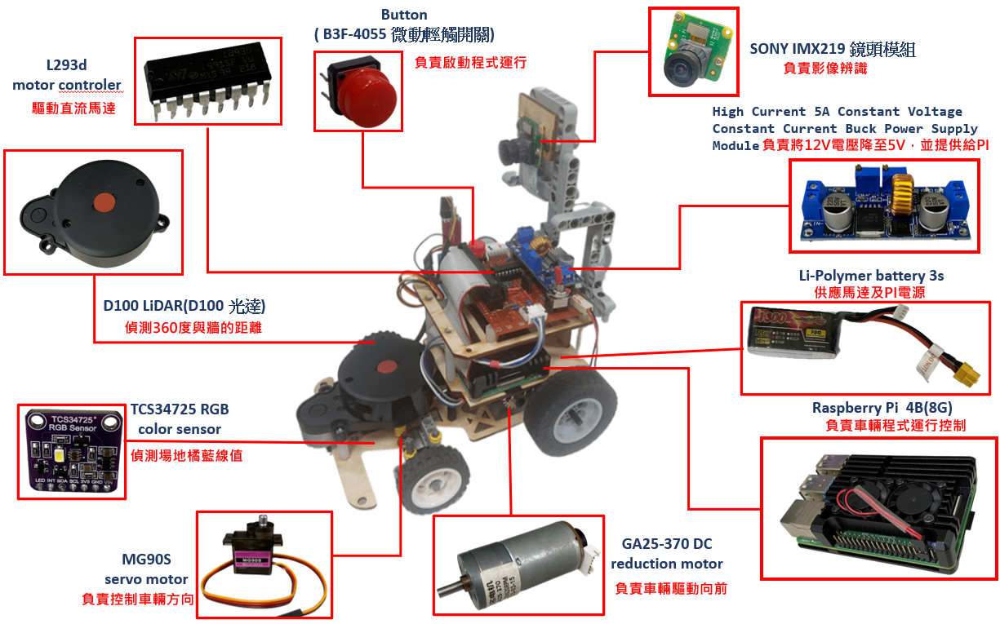
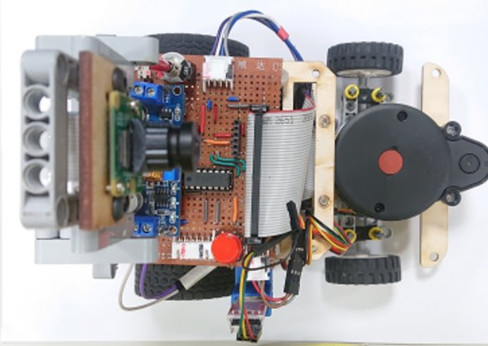
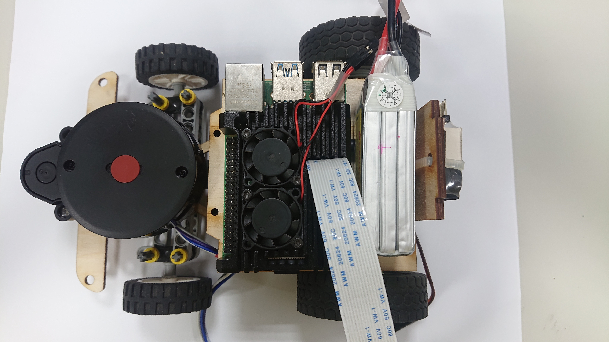
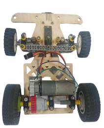
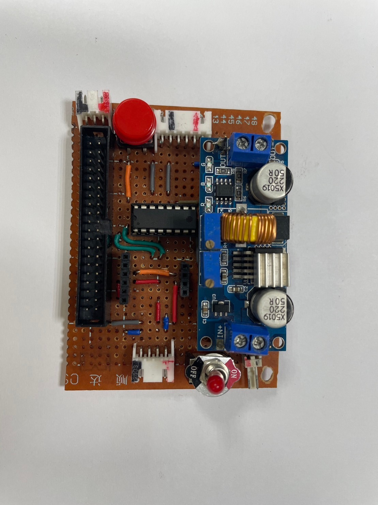
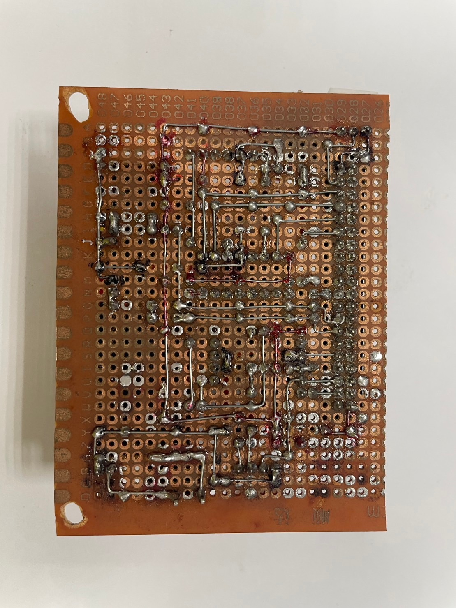

2023WRO Future Engineers Fire On All Cylinders  
====
# 
Hardware Assembly Instructions.(硬體組裝說明)

- ## Components's Position (硬體結構配置)
  

- ## System Operation Process (系統運作流程)
  

- ## Mechanical Structure (機體結構)
|  |  |  | 
| :----: | :----: | :----: |  

- ## Circuit Board (電路板)
|  |  |
| :----: | :----: | 

- ## Overview of Important Parts List. (重要零件清單概述)
### Raspberry Pi 4B 8G (樹梅派4B 8G )
#### English
<table border=0 width=100% >
  <tr>
    <td >
    
__Specification:__ 
- With the Advanced RISC Machine(ARM) produced by Broadcom Corporation 
- the total memory capacity of it has 1、2、4 or 8 Giga bytes.
- The TransFlash card of it serves as the system’s main storage media.
- equipped the USB interface device and the output of High Definition Multimedia Interface, it can adapt with several types of operating systems.  

__Usage:__ 
- Collects photos from the lens and carries out the image identifying, controls the vehicle to move ,and ,last but not least, used to write the program.  
 </td>
    <td >
   
    </td>
  </tr>
</table>

#### 中文
規格:  
- 使用由Broadcom Corporation生產的精簡指令集計算機(Reduced Instruction Set Computer)中的 ARM(Advanced RISC Machine) 處理器
- 其總記憶體容量為1、2、4或8 GB
- 它的TransFlash卡作為系統的主要儲存媒體
- 配備USB介面設備和高清晰度多媒體接口的輸出，可以適應多種操作系統  

用途:  
- 從鏡頭收集照片並進行影像辨識，控制車輛移動，最後還用於編寫程式 

### GA25-370 DC reduction motor (GA25-370 直流減速馬達) 
#### English
<table border=0 width=100% >
  <tr>
    <td > 

__Specifications:__
- No-load Speed: 126 rpm/m  
- Reduction Ratio: 1:34  
- Operating Voltage: 3 - 12V  
__Usage:__
- Driving the car's rear wheels to control the vehicle's forward and backward movements.  
 </td>
    <td >
   
    </td>
  </tr>
</table>

#### 中文
__規格:__
- 無負載轉速：126 rpm/m
- 減速比：1:34
- 工作電壓：3 - 12V  

__用途:__ 
- 驅動汽車後輪以控制車輛前進與後退    

### MG90S servo motor MG90S servo motor (MG90S伺服馬達)
#### English
Specifications:  

- Controllable Rotation Angle: 90°  
- Maximum Torque: 2.0 kg/cm (at 4.8V)  
- Fastest Rotation Speed: 0.11 seconds (at 4.8V)  
- Operating Voltage: 4.8V - 7.2V  

Usage:  
- Control the steering mechanism to make the vehicle turn.  

#### 中文  
規格:  
- 可控制轉動角度：90°
- 最大扭力：2.0 kg/cm（在4.8V時）
- 最快轉動速度：0.11秒（在4.8V時）
- 工作電壓：4.8V - 7.2V  

用途:
- 控制前輪轉向使車輛轉彎    
   

### L293d motor controler (L293d 馬達控制晶片)
#### English
Specifications:  

- Wide power supply voltage range: 4.5V to 36V  
- Output current per channel: 0.6mA per channel  
- Peak output current: 1.2A  

Usage:  
- Control the rotation direction of GA25-371 DC reduction motor.  

#### 中文  
規格:
- 寬電源電壓範圍：4.5V 至 36V
- 每通道輸出電流：0.6mA 每通道
- 峰值輸出電流：1.2A

用途:
- 控制GA25-371直流減速電機旋轉方向    
   

### Li-Polymer 3S Battery (鋰聚合物電池 3S)
#### English
Specifications:  

- Maximum Current: 45.5A  
- Net Weight: Approximately 107g  
- Rated Voltage: 11.1V  

Usage:  
- Supplying power to Raspberry Pi and other electronic components.  

#### 中文
規格:
- 最大電流：45.5A
- 淨重：約107g
- 額定電壓：11.1V  

用途:  
- 供應電力給樹莓派及其他電子元件    
   

### Button (B3F-4055 微動輕觸開關)
#### English
Specifications:  

- Operating Voltage: 3.3V - 5.0V  
- Number of Pins: 3  
- Output Signal: Digital  

Usage:  
- Send an activation signal before initiating the program.  

#### 中文  
規格:  
- 工作電壓：3.3V – 5.0V
- 引腳數量：3個
- 輸出信號：數字（Digital）

用途:  
- 在啟動程序之前發送啟動信號    
   

### High Current 5A Constant Voltage Constant Current Buck Power Supply Module (大電流5A恆壓恆流降壓電源模組)  
#### English
Specifications:  

- Input Voltage: 4.0V - 38.0V  
- Output Voltage: 1.25V - 36.0V  
- Operating Frequency: 180Hz  

Usage:  
- Stabilizing the power supplied by lithium batteries.  

#### 中文
規格:  
- 輸入電壓：4.0V - 38.0V
- 輸出電壓：1.25V - 36.0V
- 工作頻率：180Hz
用途:  
- 穩定鋰電池提供的電力  
   

### TCS34725 RGB color sensor (TCS34725 顏色感測器)
#### English
Specifications:  

- Operating Voltage: 3.3V - 5.0V  
- Interface: I2C interface  

Usage:  
- Line color recognition 
- counting the current number of revolutions.  

#### 中文

規格:  
- 工作電壓：3.3V – 5.0V
- 接口：I2C接口

用途:  
- 辨識線的顏色
- 計算目前圈數  
   

### SNOY IMX 219 Lens module (SNOY IMX 219鏡頭模組)  
#### English
Specifications:  
- Viewing Angle: 160 degrees  
- Interface: CSI (Camera Serial Interface)  

Usage:  
- Collecting images for image recognition.  

#### 中文

規格:  
- 可見角度：160度
- 接口：CSI (相機串行接口，Camera Serial Interface)

用途:  
- 收集影像用於影像辨識  
   

### D100 LiDAR (D100 光達)
#### English
Specifications:  

The D100 Developer Kit is built around the LiDAR LD14 core, complemented with various related accessories. 
- It utilizes triangulation technology for straightforward 360-degree full scanning, with a maximum range of 8 meters.
- The detection frequency is 2300 Hz, and the physical dimensions of the device are 96.3 x 59.8 x 38.8 mm.
Usage:  
- Used for detecting front, left, and right walls and keeping the machine centered in the lane. 

#### 中文

規格：  
D100 開發者套裝是以光達 LiDAR LD14為核心再搭配相關零配件組合而成。  
- 採用三角測距技術，簡易360度全掃描
- 最大測距為8公尺。  
- 偵測頻率 2300 HZ，外觀尺寸 96.3*59.8*38.8 mm  

用途： 
- 用於偵測前方及左右兩側牆壁及使機器維持在車道中央  
  

# 
[Return Home](../../)
 
