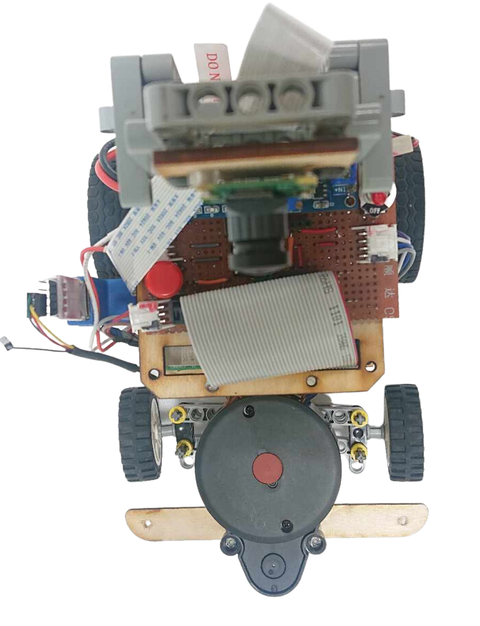
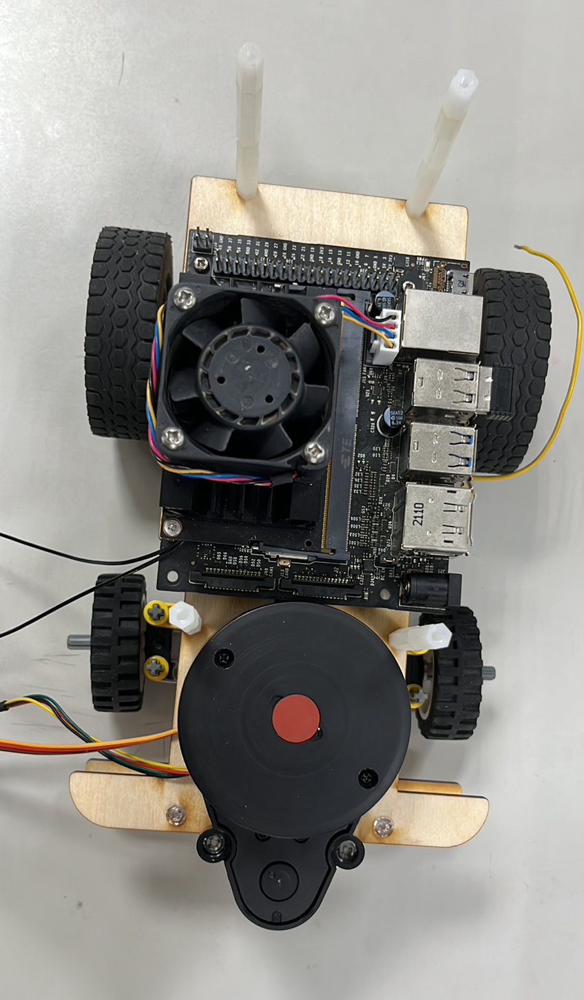
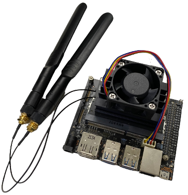
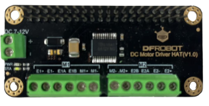
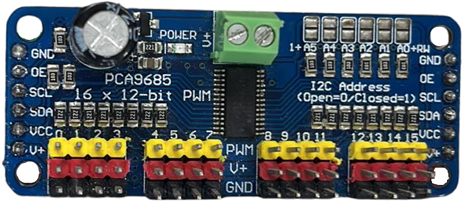
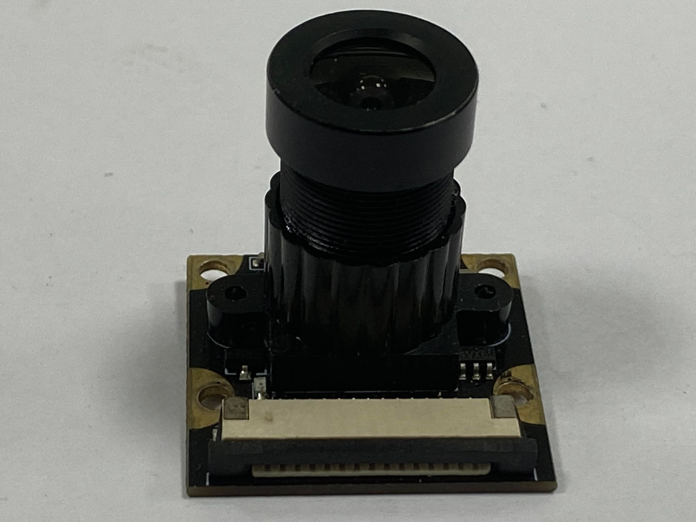

2023WRO Future Engineers Shinan Fire On All Cylinders  
====
# 
Hardware Assembly Instructions.

- ## Components's Position 

- ## System Operation Process 

- ## Mechanical Structure 

<table>
  <tr>
      <th>Inner Structure Top View of the Overall Apparatus</th>
      <th>Middle Layer Structure Top View</th>
      <th>Top View of Vehicle Chassis</th>
      <th>Bottom View of Vehicle Chassis</th>
  </tr>
  <tr align="center">
     <td>   </td><td></td><td></td>
     <td></td>
  </tr>
</table>

- ### Circuit Board 

<table>
  <tr align="center">
      <th> Circuit Board of Top View </th>
  </tr>
  <tr align="center">
     <td>  </td>
  </tr>
</table>

- ## Overview of Important Parts List. 
### NVIDIA Jeston Nano  
<table border=0 width=100% >
  <tr>
    <td >

__Specification:__ 
- It is equipped with a quad-core ARM Cortex-A57 CPU and a 128-core Maxwell GPU. 
- the total memory capacity of it has 4 Giga bytes,It operating system is 64-bit.
- The TransFlash card of it serves as the system’s main storage media.
- Equipped the USB interface device and the output of High Definition Multimedia Interface, it can adapt with several types of operating systems.  

__Usage:__ 
- Collects photos from the lens and carries out the image identifying, controls the vehicle to move ,and used to write the program.  
 </td>
    <td >
   
    </td>
  </tr>
</table>

### JGA25-370 DC reduction motor 
<table border=0 width=100% >
  <tr>
    <td > 

__Specifications:__  
- No-load Speed: 640 rpm/m  
- Reduction Ratio: 1:34  
- Operating Voltage: 6 - 12V  

__Usage:__
- Driving the car's rear wheels to control the vehicle's forward and backward movements.  
 </td>
    <td >
   
    </td>
  </tr>
</table>

### DC Motor Driver HAT(V1.0)
<table border=0 width=100% >
  <tr>
    <td>  

__Specifications:__ 
- Operating Voltage: 7~12V
- Logical Voltage: 5V
- Motor Driver Chip: TB6612FNG
- Communication Interface: I2C
- Default I2C Address: 0 x10
- Continuous Drive Current: 1.2A
- Peak Current: 2A
- Support 2-way DC Motor/DC Motor with Encoder
- Dimension: 65x30mm/2.56x1.18 

__Usage:__
- Controlling the speed and direction of a DC geared motor.  
 </td>
    <td>
  
    </td>
  </tr>
</table>

### MG90S servo motor
<table border=0 width=100% >
  <tr>
    <td>  

__Specifications:__ 
- Controllable Rotation Angle: 90°  
- Maximum Torque: 2.0 kg/cm (at 4.8V)  
- Fastest Rotation Speed: 0.11 seconds (at 4.8V)  
- Operating Voltage: 4.8V - 7.2V  

__Usage:__
- Control the steering mechanism to make the vehicle turn.  
 </td>
    <td>
  
    </td>
  </tr>
</table>

### PCA9685 16-channel 20bit PWM driver
<table border=0 width=100% >
  <tr>
    <td>  

__Specifications:__
- Technical Parameters:
  - Voltage: DC5-10V power supply
  - Communication Interface: IIC
  - 16-way steering gear control
  - Size:25x61mm

- Product features:
  - The PCA9685 chip is wrapped in the center of the board
  - Power input terminal
  - Green power indicator
  - In the 4 groups of 3-pin connector to facilitate the insertion of 16 servo motor (servo motor plug slightly wider than 0.1 )
  - The polarity of the reverse polarity is input on the terminal block

- Cascade design:
  - V + line to place a large capacitor, the maximum external input voltage depends on the 10V 1000uf capacitor
  - All PWM output lines have a 220 ohm series resistor protection and can easily drive LED  
  
<samll>Date sourse:[Amazon](https://www.amazon.com/-/zh_TW/HiLetgo-PCA9685-PWM-%E4%BC%BA%E6%9C%8D%E9%A6%AC%E9%81%94%E9%A9%85%E5%8B%95%E5%99%A8-Arduino/dp/B01D1D0CX2)</small>

__Usage:__ 
- Control MG90s Servo Motor turn angles
 </td>
 <td>

 </td>
  </tr>
</table>

### Li-Polymer 3S Battery
<table border=0 width=100% >
  <tr>
    <td> 

__Specifications:__
- Maximum Current: 45.5A  
- Net Weight: Approximately 107g  
- Rated Voltage: 11.1V  

__Usage:__  
- Supplying power to Raspberry Pi and other electronic components.  
 </td>
    <td>
  
    </td>
  </tr>
</table>
 

### Button 
<table border=0 width=100% >
  <tr>
    <td>

__Specifications:__ 
- Operating Voltage: 3.3V - 5.0V  
- Number of Pins: 3  
- Output Signal: Digital  

__Usage:__
- Send an activation signal before initiating the program.  
 </td>
    <td>
   
    </td>
  </tr>
</table>

### High Current 5A Constant Voltage Constant Current Buck Power Supply Module 
<table border=0 width=100% >
  <tr>
    <td> 

__Specifications:__ 
- Input Voltage: 4.0V - 38.0V  
- Output Voltage: 1.25V - 36.0V  
- Operating Frequency: 180Hz  

__Usage:__  
- Stabilizing the power supplied by lithium batteries.  
 </td>
    <td>
   
    </td>
  </tr>
</table>
  

### TCS34725 RGB color sensor
<table border=0 width=100% >
  <tr>
    <td > 

__Specifications:__  
- Operating Voltage: 3.3V - 5.0V  
- Interface: I2C interface  

__Usage:__  
- Line color recognition 
- counting the current number of revolutions.  

__Logic judgment:__
- When color sensor read the line color ,it will send the value to Jetson Nano ,then Jetson Nano will compare the current value and the setting value ,if the current value is lower ,vehicle will turn left because this means that it has detected a blue line.  
On the contrary, if it is greater than the set value and less than the white value, it indicates an orange line, and a right turn is required.

當顏色感測器讀到顏色，他會將數值傳送給Jetson Nano，然後Jetson Nano會比較傳輸的數值和設定的數值，如果比較低，車輛將會左轉為這代表線是藍色的
相反的，如果大於設定的數值並且小於白色，這代表是橘色，需要進行右轉
 </td>
    <td>
   
    </td>
  </tr>
</table>

### IMX 219-160 Camera for Jetson Nano
<table border=0 width="100%" >
  <tr>
    <td> 

__Specifications:__ 
- Viewing Angle: 160 degrees  
- Interface: CSI (Camera Serial Interface)  

__Usage:__  
- Collecting images for image recognition. 

__Logic judgment:__
- Camera will keep to capture pictures ,and send it to Jetson Nano ,then Jetson Nano will check if there are any blocks in the photo ,if yes ,Jetson Nano will compare the sizes of all the blocks and identify the blocks color in image.

相機會持續取照片，並且傳送給Jetson Nano ，然後Jetson Nano會檢查照片中有無方塊，如果有，Jetson Nano 會比較照片中所有的方塊大小和辨識顏色
  </td>
    <td >
    
    </td>
  </tr>
</table>

### D100 LiDAR
<table border=0 width=100% >
  <tr>
    <td> 

__Specifications:__  
The D100 Developer Kit is built around the LiDAR LD14 core, complemented with various related accessories. 
- It utilizes triangulation technology for straightforward 360-degree full scanning, with a maximum range of 8 meters.
- The detection frequency is 2300 Hz, and the physical dimensions of the device are 96.3 x 59.8 x 38.8 mm.

__Usage:__  
- Used for detecting front, left, and right walls and keeping the machine centered in the lane. 

__Logic judgment:__
- When the distances on the left and right sides are imbalanced, it will first check if they are within the set range. If they are within the range, it will proceed straight. If they exceed the range, it means it has reached a turning area and needs to make a turn.

當左右兩邊的距離不平衡時，會先判斷是不是在設定範圍內，如果是就進行至中，如果超過了就表示到達轉彎區域，需要進行轉彎
  </td>
    <td>
      
    </td>
  </tr>
</table>

# 
[Return Home](../../)
 
