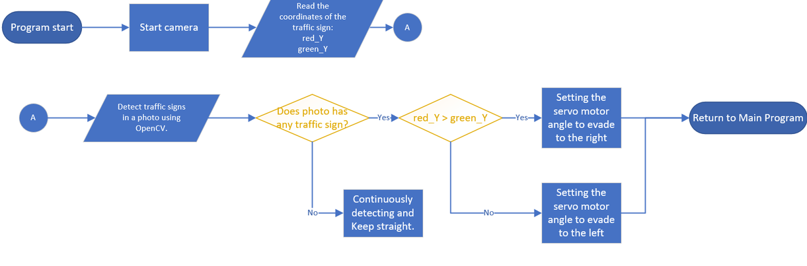

# 
Camera
 
- In order for the vehicle to accurately avoid obstacles, a camera module needs to be installed on the vehicle to recognize the position and color of obstacles. This allows the controller to compute and control the vehicle's motors for obstacle avoidance.  
- Since we are using a Raspberry Pi as the controller, we need to find a camera module that is compatible with it. To do this, we referenced the camera module used by the American team last year and compared it with other camera modules from the same series.
  
  __Here is the product information:__
    1. Raspberry Pi Camera Rev 1.3(sensor:OmniVision OV5647)
    2. Raspberry Pi Camera Module V2(sensor:Sony IMX219)
    3. Raspberry Pi Camera Module V3(sensor:Sony IMX708)
     
- Although the frame rate of Camera Module V3 is higher, we decided not to use it because it is not compatible with the existing Raspberry Pi operating system.  
- The frame rate of Camera 1.3 is only 30p, while the frame rate of Camera Module V2 can reach up to 90p.  
- Through experimentation, we found that the Camera Module V2 version also delivers excellent recognition performance. Therefore, we have ultimately chosen the Camera Module V2 as the AI recognition camera module for our self-driving car. 

#### Camera Module

<table>
<tr align="center" >
<th rowspan="2">Model</th> 
<th >Raspberry pi Camera Rev 1.3</th>
<th >Raspberry pi Camera Module V2</th>
<th >Raspberry pi Camera Module V3</thd>
</tr>
<tr align="center">

<td></td>
<td></td>
<td></td>
</tr>
<tr align="center">
<td>Sensor</td>
<td>Omnivision OV547</td>
<td>Sony IMX 219</td>
<td>Sony IMX 708</td>
</tr>
<tr align="center">
<td>Sensor Resolution</td>
<td>2592 * 1944 pix</td>
<td>3280 * 2464 pix</td>
<td>4608 * 2592 pix</td>
</tr>
<tr align="center">
<td>FPS</td>
<td>30p MAX</td>
<td>90p MAX</td>
<td>120p MAX</td>
</tr>
</table>

- In the experimental tests, it was found that when the vehicle was avoiding obstacles, the camera's field of view was too small to predict the position of the next obstacle. This caused problems for the vehicle's obstacle avoidance strategy.  
- Therefore, we modified the original camera lens  to a wide-angle lens. Compared to the original 72-degree field of view, the wide-angle lens provides a 160-degree field of view, which allows us to predict the position of the next obstacle in advance, thus improving the effectiveness of the vehicle's obstacle avoidance strategy.

#### Wide-Angle Lens

<table>
<tr align="center">
<th> Without the Wide-Angle Lens</th> 
<th>With the Wide-Angle Lens</th>
</tr>
<tr align="center">
<td></td>
<td>
</td>
</tr>
<tr align="center">
<td></td>
<td> </td>
</tr>
</table>

- In the Raspberry Pi program, it is possible to set the resolution of the camera module. We will experiment with the following common resolutions to determine the camera module resolution that offers the best recognition performance.

  1. 1080x640 FPS30
  2. 640x320 FPS60
  3. 320x240 FPS90
     
- In the experiments, it was found that when the camera module resolution was set to 1080x640, the high-resolution image processing requirements resulted in the program taking a significant amount of time to recognize obstacles. This led to a decrease in the program's computational efficiency.
- When the resolution was set to 320x240, although computational efficiency was extremely high, the low resolution resulted in the inability to recognize obstacles accurately.
- However, when the resolution was set to 640x320, we observed that obstacle recognition could be performed accurately, and the computational efficiency was not excessively slow, thus avoiding the issue of the vehicle colliding with obstacles.
  
__Therefore, we have set the camera module resolution to 640x320 to achieve the optimal recognition efficiency for the camera module resolution.__

## Camera Module AI Obstacle Recognition Operation Process

- When the program starts, it will start the camera, continuously take pictures and transmit them to the main controller. Then, the program will use OpenCV's image recognition function to detect whether there are blocks in the photo. If blocks are detected, it will compare the size of the red and green traffic signs. If the red sign is larger, the vehicle will flash right. If the green sign is larger, it will flash left. If no traffic signs are detected, the vehicle will continue straight.
  

# 
[Return Home](../../)
  

