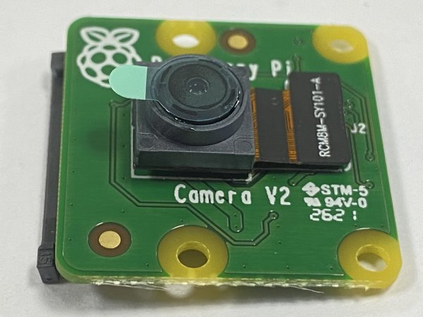
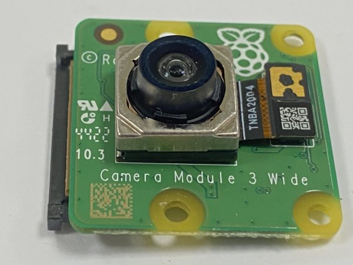
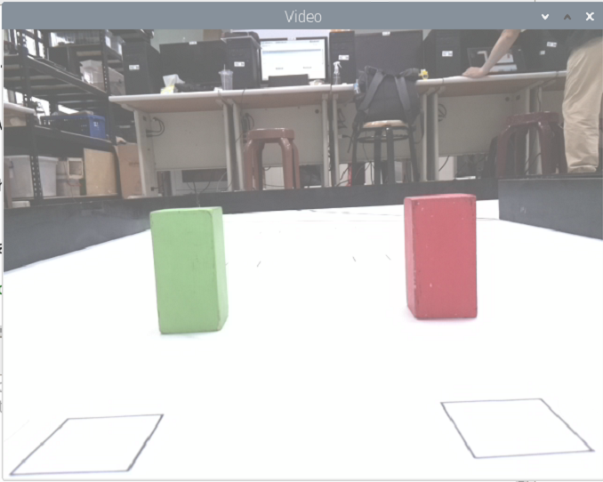
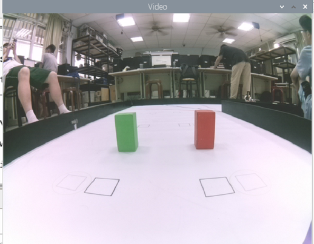

# 
Camera
 
- In order to enable the vehicle to avoid obstacles accurately, we need to install a camera module on the vehicle. Since we are using a Raspberry Pi as the controller, we need to find a compatible camera module for it. To do this, we referred to the camera module used by the American team in last year's competition and compared it with other camera modules in the same series. Here is the product information:

1. Raspberry Pi Camera Rev 1.3(sensor:OmniVision OV5647)
2. Raspberry Pi Camera Module V2(sensor:Sony IMX219)
3. Raspberry Pi Camera Module V3(sensor:Sony IMX708)

- Considering that V3 is not compatible with our existing Raspberry Pi operating system, we decided not to use that version. Additionally, the detection rate of version 1.3 is only 30p, whereas the V2 version can reach a maximum of 90p. Therefore, we ultimately chose the Raspberry Pi Camera Module V2 for our project. Through experimentation, we found that the V2 version has the best recognition performance.

#### Camera Module

<table>
<tr align="center" >
<th rowspan="2">Model</th> 
<th >Raspberry pi camera Rev 1.3</th>
<th >Raspberry pi camera Module V2</th>
<th >Raspberry pi camera Module V3</thd>
</tr>
<tr align="center">

<td></td>
<td></td>
<td></td>
</tr>
<tr align="center">
<td>Sensor</td>
<td>Omnivision OV547</td>
<td>Sony IMX 219</td>
<td>Sony IMX 708</td>
</tr>
<tr align="center">
<td>Sensor resolution</td>
<td>2592 * 1944 pix</td>
<td>3280 * 2464 pix</td>
<td>4608 * 2592 pix</td>
</tr>
<tr align="center">
<td>FPS幀率</td>
<td>30p MAX</td>
<td>90p MAX</td>
<td>120p MAX</td>
</tr>
</table>

- During subsequent testing, we found that the vehicle was unable to anticipate the position of the next block while avoiding obstacles. This posed a challenge for the vehicle's obstacle avoidance strategy. As a result, we decided to modify the original camera and convert it into a wide-angle lens. Compared to the original 72-degree field of view, the wide-angle lens provides a 160-degree field of view, allowing us to anticipate the position of the next block in advance. This improvement has enhanced the vehicle's obstacle avoidance effectiveness.

#### Wide-angle lens

<table>
<tr align="center">
<th> Without the wide-angle lens</th> 
<th>With the wide-angle lens</th>
</tr>
<tr align="center">
<td></td>
<td>
</td>
</tr>
<tr align="center">
<td></td>
<td> </td>
</tr>
</table>

- In the Raspberry Pi program, it is possible to configure the resolution of the camera module. We conducted experiments with the following common resolutions.

1. 1080x640 FPS30
2. 640x320 FPS60
3. 320x240 FPS90
- In our experiments, we found that when the camera module's resolution was set to 1080x640, the high-resolution image processing demands led to a significant amount of time being spent on block recognition, resulting in a decrease in computational efficiency. On the other hand, when the resolution was set to 320x240, the computational efficiency was extremely high, but the low resolution hindered the proper recognition of the blocks. However, when we set the resolution to 640x320, we observed that the program could successfully recognize the blocks without compromising computational efficiency, thus avoiding collisions with the blocks. Therefore, we ultimately decided to set the camera module's resolution to 640x320.

## The Camera Judging Process

- After the program is launched, it will activate the camera, continuously capture photos, and transmit them to the main controller. The program will then use OpenCV's image recognition capabilities to detect the presence of building blocks in the photos. If building blocks are detected, it will compare the sizes of the red and green traffic signs. If the red sign is larger, the vehicle will flash to the right. If the green sign is larger, it will flash to the left. If no traffic signs are detected, the vehicle will continue moving straight.

# 
[Return Home](../../)
  

