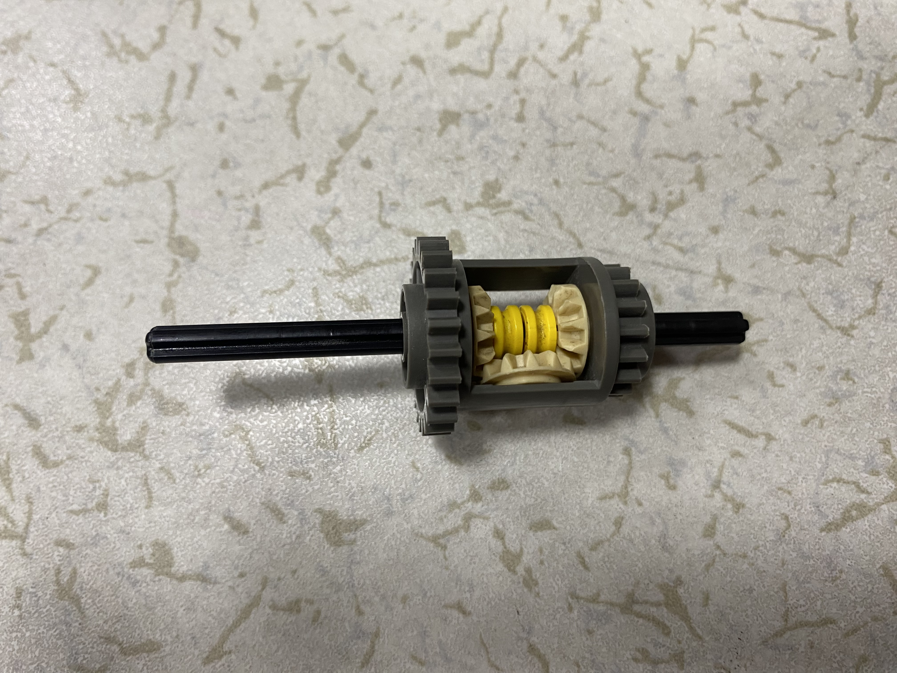

2023WRO Future Engineers Shinan Fire On All Cylinders  
====
# 
Differential 差速器
 
## Introduce Lego Differential 介紹樂高差速器
- This differential integrates a 16-tooth gear and a 24-tooth gear, both of which have a circular hole with a 5mm diameter at their centers for accommodating a cross-axis. In the center of the differential, there is a small pillar, which allows us to better secure the right-angle mating gear.

- 此差速器整合16尺齒輪和24尺齒輪，兩個齒輪中心有直徑5mm的圓孔，方便放置十字軸，差速器中央有一根小柱子，這可以讓我們更好的固定直角轉接齒輪

<table>
<tr>
<th>Photo 原本照片</th>
<th>Complete Differential Photo 完整的差速器照片</th>
</tr><tr>
<td></td>
<td></td>
</tr>
</table>

## 選擇原因
- Due to the compact size of this differential, and the fact that the larger 24-tooth gear on the motor is of the same size, it effectively transfers the motor's speed and torque to the tires without causing issues such as reducing torque due to a lower gear ratio or slowing down speed due to a higher gear ratio.

- 由於此差速器的大小不大，而且較大的齒輪和馬達上的24尺齒輪一樣大，這可以很好的將馬達的速度和扭力傳輸到輪胎上，不會造成加速比減少扭力或是減速比放慢速度的問題

# 
[Return Home](../../)
  