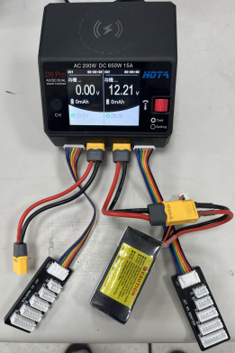

## 
Li-Polymer Battery Low Voltage Alarm and Charging Equipment
 
 - #### Low Voltage Alarm
   Li-Polymer Battery Low Voltage Alarm
   

   <table>
   <tr>
   <td>The primary purpose of installing a low voltage alarm is to prevent the battery from reaching a critically low voltage, thereby avoiding abnormal vehicle operation or battery damage. Therefore, when the battery voltage drops below a specific threshold, the low voltage alarm will sound an alert, reminding the user to take notice or promptly replace the battery to prevent any disruptions to the ongoing race.  
        
   </td>
   <td></td>
    </tr>
   </table>
   

   
  - #### Battery Charging/Discharging Equipment 
    - In general, rechargeable batteries, such as nickel-metal hydride (NiMH) and nickel-cadmium (NiCd) batteries, can be stored directly for long periods of time without any problem. However, Li-Polymer batteries should not be stored directly for long periods of time. If they are, the internal charge will gradually decrease, which can lead to a loss of capacity and even the inability to use the battery.
    - The long-term storage method for Li-Polymer batteries is as follows:
      1. Charge the battery to around 50% of its capacity.
      2. Use a charge/discharge device to discharge the battery to approximately 3.2V.
      3. Store the battery in a cool, dry place.  
            This approach can help extend the lifespan of lithium polymer batteries.
    - The following are the reasons for the deterioration of lithium polymer batteries when left unused for an extended period:
      1. Insufficient internal battery charge, leading to the inability of chemical reactions within the battery to proceed normally, resulting in a loss of battery capacity.
      2. Excessive internal battery charge, causing the breakdown of the battery's electrolyte and, in turn, damaging the battery.
      3. Storing the battery in a high-temperature or high-humidity environment, accelerating the chemical reactions within the battery and causing damage to the battery.

      

      <table>
        <tr align="center">
        <th>Skyrc E430</th>
        <th>Skyrc Imax B6C2 v2</th>
        <th>HOTA D6 Pro</th>
        </tr>
        <tr>
        <td></td>
        <td></td>
        <td></td>      
        </tr>

</table>

      
     
 
# 
[Return Home](../../)
 
