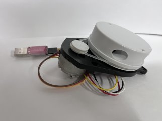
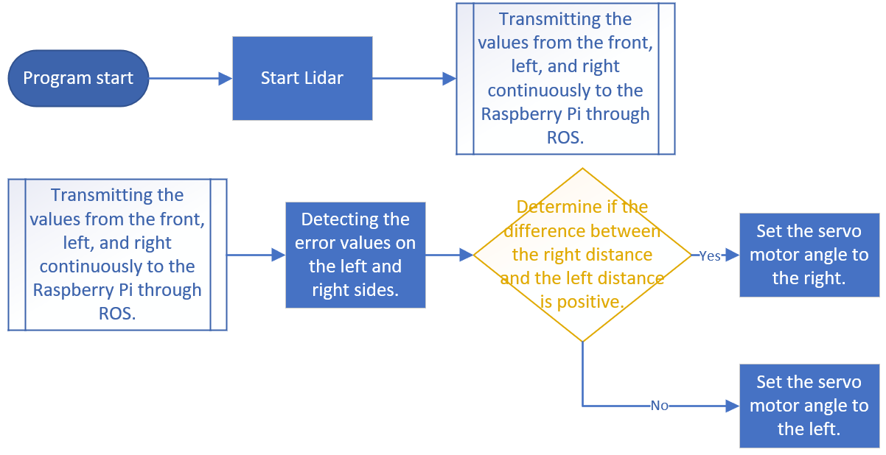

# 
 Lidar Selection
 

- Lidar, also known as Light Detection and Ranging, is a technology that uses laser pulses to measure distances and create maps. Lidar systems typically consist of lasers, receivers, computing devices, and navigation systems.

    __Working Principle:__
  - Emitting laser pulses: Lidar emits very short laser pulses through a laser. These pulses propagate at extremely high speeds and then return after reflection.  
  - Receiving reflected signals: The receiver of the Lidar records the time it takes for the laser pulses to return and measures the intensity of the light pulses. The time and intensity information of the reflections can be used to calculate the distance and characteristics of objects from the Lidar.  
  - Data processing: The computing device of the Lidar processes the received reflection data and calculates the position, shape, and movement of objects based on the measured time and the speed of light.

  __Applications:__  
  - Lidar has widespread applications in various fields, including but not limited to:  
     - Autonomous vehicles
     - Environmental sensing 
     - Drones and aviation 
     - Environmental monitoring
     - Military applications  
The Lidar D100 Developer Kit is centered around the LD14 Lidar sensor core, complemented with a set of related accessories, and employs triangulation technology.

  __Product Specifications__
    - Detection Range: 360 degrees
    - Detection Distance: 0.15 ~ 8 meters
    - Angular Resolution: 1 degree
    - Detection Frequency: 2300 Hz
    - Scanning Frequency: 6 Hz
    - Dimensions: Approximately 96.3 * 59.8 * 38.8 mm
 
- __The difference between ultrasonic sensors and Lidar is as follows:__   
Ultrasonic sensors can only detect in one direction, limited to the front, used for distance measurement and obstacle detection. Lidar, on the other hand, provides a 360-degree panoramic coverage, enabling simultaneous sensing of surroundings, used for high-precision environmental perception and map creation, reducing collision risks. It is widely applied in autonomous driving, environmental modeling, etc. Lidar surpasses ultrasonic sensors in providing comprehensive environmental information, making it superior in robot navigation.  

- __Issues encountered with different brands of Lidar:__  
One problem with the D100 Lidar is its detection frequency, which is 2300 Hz, compared to the YDLidar X2 with 3000 Hz and X4 with 5000 Hz. The lower frequency results in a slower response time.  

   __Due to unfamiliarity with the usage of ydlidar x4 and ydlidar x2, there were issues with detecting obstacles, leading to missing angles. Therefore, in this competition, we decided to utilize the D100 sensor for vehicle detection and measuring the distance to the arena walls. The results obtained using this sensor met our expectations.__

- #### Performance Testing of Low-Cost LiDARs Commonly Available in the Market.

    
|  Lidar D100    |  Ydlidar x4  |   Ydlidar x2    |      
| :----: | :----: | :----:|
||||

 

- #### Missing Point Problems of LiDARs ydlidar x4, ydlidar x2, and D100

 <table>
    <tr align="center">
    <th> Lidar D100</th>
    <th colspan="2">Ydlidar X4 X2</th>
    </tr>
    <tr align="center">
    <td></td>
    <td></td>
    <td></td>
    </tr>
</table>   

 

## Lidar Dudging Process
When the LiDAR and program are started, the LiDAR will use the ROS system to detect the distance between the vehicle and the walls in front, right, and left sides. The distance data will be transmitted to the Raspberry Pi controller for computation and judgment. The controller will then determine which side the vehicle is leaning towards. Finally, the front steering servo motor will be adjusted to control the vehicle's movement.

# 
[Return Home](../../)
  
