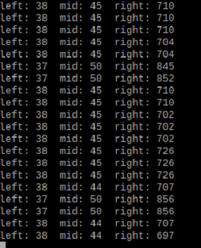

## 
 LiDAR Sensor Selection 
 
- ### LiDAR Sensor Introduction
   - LiDAR sensor, also known as Light Detection and Ranging, is a technology that uses laser pulses to measure distances and create maps. LiDAR systems typically consist of a laser, a receiver, computing equipment, and a navigation system.  
   - LiDAR sensor is widely used in various fields, including applications such as autonomous vehicles, environmental monitoring, drones, and aviation.  
   - Therefore, in this competition, we have chosen __LiDAR sensor__ as the sensor for detecting the distance between the vehicle and the walls.

- ### Comparison between Ultrasonic and LiDAR sensor   
  - Ultrasonic sensors can only detect in one direction, typically limited to the front, and are used for distance measurement and obstacle detection. LiDAR, on the other hand, offers 360-degree coverage, allowing simultaneous sensing in all directions. It is used for high-precision environmental awareness, map creation, collision risk reduction, and finds extensive applications in areas such as autonomous driving and environmental modeling. LiDAR excels over ultrasonic sensors in providing comprehensive environmental information, making it more advantageous in robot navigation. 

- ### Comparison of Different LiDAR Sensors
  - We compared commonly available and cost-effective LiDAR models in the market, including D100, YDLIDAR X2, and YDLIDAR X4, with the expectation of finding the best Lidar to be used as the sensor for this competition.  
  - The D100 has a detection frequency of 2300Hz, which is lower compared to the 3000Hz of YDLIDAR X2 and the 5000Hz of X4, making its response slightly slower.  
  - Due to unfamiliarity with the use of YDLIDAR X4 and YDLIDAR X2, we encountered issues with missing angles in obstacle detection. Therefore, for this competition, we decided to use the __D100__ sensor for detecting the distance of the vehicle from the field's edge walls.
 
   - #### Performance Testing of Low-Cost LiDAR Sensors Commonly Available in the Market
    
      |  Lidar D100    |  Ydlidar x4  |   Ydlidar x2    |      
      | :----: | :----: | :----:|
      ||||

   - #### Missing Point Problems of LiDAR Sensors ydlidar x4, ydlidar x2, and D100

      

      <table>
         <tr >
         <th> LiDAR D100</th>
         <th colspan="2"  >YdLiDAR X4 X2</th>
         </tr>
         <tr >
         <td></td>
         <td></td>
         <td></td>
         </tr>
      </table>   
      
 

- ### LiDAR-Controlled Steering Detection Process

  - This is the process for using the LiDAR sensor in this competition.
  - When the LiDAR sensor and program are started, the LiDAR sensor detects the distance between the vehicle and the walls in front, right, and left. The distance values are transmitted to the Raspberry Pi controller via ROS for calculation and judgment. The controller then uses this information to determine which side the vehicle is leaning towards. The controller also transmits the steering values to the front steering servo motor to control the vehicle's movement and steering.

     

   - ####  Using LIDAR Sensor to Center on the Road
      - Using LIDAR sensor to measure the distances between the object's right and left sides and the walls, we can calculate the error values for both sides.  
      - By multiplying these error values with coefficients, we can obtain the angle to center the servo motor on the road.  
         
         |LIDAR sensor Detects Surrounding Walls|LIDAR sensor Readings|
         |:---:|:---:|
         |||

# 
[Return Home](../../)
  
