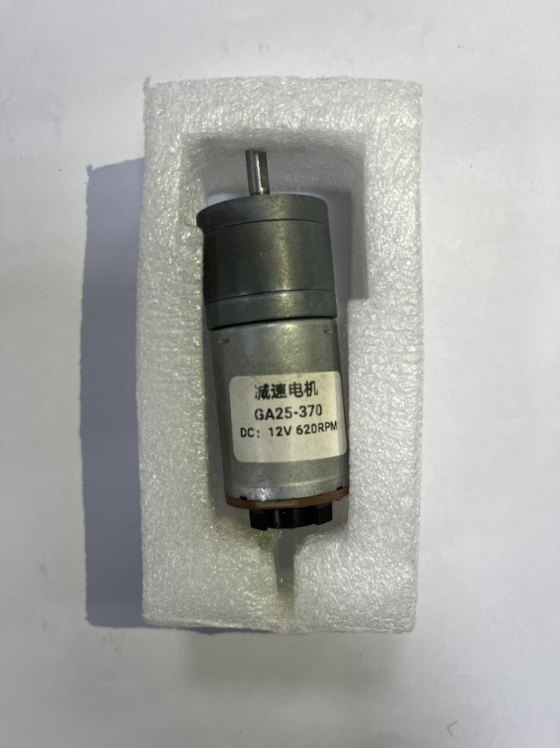

2023WRO Future Engineers Shinan Fire On All Cylinders  
====
# 
 Motor Selection
 
When the vehicle is in motion, the Raspberry Pi sends speed information to the motor controller to control the rear-wheel drive DC motor. Simultaneously, the Raspberry Pi also sends messages to the servo motor of the front steering mechanism, enabling the vehicle to maneuver freely and move forward.

### Front Steering Mechanism by Servo Motor
- To select a servo motor among commonly available options in the market, considering factors such as weight, rotation angle, and torque, we have identified two suitable servo motors: MG90S and SG90.
- The main difference between MG90S and SG90 lies in their front gears. The former has metal gears, while the latter has plastic gears. Since continuous rotation is often required, we opted for the MG90S due to its durability and resistance to damage.

 
#### Servo Motor

<table>
<tr align="center">
<th rowspan="2" >Model</th>
<th>MG90S</th>
<th>SG90</th>
</tr>
<tr align="center">
<td></td>
<td> </td>
</tr>
<tr align="center">
<td>rotation angle</td>
<td>90° MAX</td>
<td>0~90°/180° MAX</td>
</tr>
<tr align="center">
<td>torque</td>
<td>2.0kg/cm</td>
<td>1.4 kg/cm</td>
</tr>
<tr align="center">
<td>speed</td>
<td>0.11s</td>
<td>0.1S</td>
</tr>
</table>

### Rear-Drive DC Motor
- When selecting a DC motor among commonly available options in the market, considering factors such as weight, rotational speed, and torque, we have identified the following four suitable DC motors。
- Among them, the three types of motors, JGA25, have different model numbers but share a similar physical appearance, and their differences are as follows.
- After conducting experimental research, we found that choosing the high-speed 1630rpm JGA-370 motor resulted in lower torque, making it difficult for the vehicle to move effectively. On the other hand, opting for the high-torque JGA-371 motor led to an excessively low rotational speed, which did not meet the requirements for the vehicle's operation.
- Therefore, based on these findings, we ultimately selected the 620rpm JGA-370 motor as the rear-wheel drive DC motor for the vehicle. This choice strikes a balance between rotational speed and torque, providing the necessary performance for the vehicle's propulsion.

#### DC Motor

<table><tr align="center">
<th rowspan="2" >Model</th>
<th >JGA25 370</th>
<th >JGA25 370</th>
<th >JGA25 371</th>
<th >JGA16-050</th>
</tr>
<tr align="center">
<td ></td>
<td ></td>
<td ></td>
<td ></td>
</tr>
<tr align="center">
<td >speed</td>
<td >1360rpm/m</td>
<td >620rpm/m</td>
<td >294rpm/m</td>
<td >220rpm/m</td>
</tr>
<tr align="center"><td>torque</td><td>4.27kg.cm</td><td>9.15kg.cm</td><td>5.2kg.cm</td><td>1.15kgcm</td></tr><tr align="center">
<td>power</td><td>5.4W</td><td>5.4W</td><td>4.2W</td><td>0.33W</td>
</tr>
</table>

### Motor Controller

- When testing the operation of the motor, simply providing power does not effectively control the movement of the GA25-370 motor, making it impossible to adjust the speed. Therefore, we need to install a motor controller to regulate the speed of the DC gear motor. Currently, there are two options available in the market: the L293D chip and the L298N module. To reduce weight, we chose the smaller L293D chip. Its compact size allows us to install more sensors, thereby saving space, reducing weight, and increasing the maneuverability of the vehicle.

#### Motor Controller

<table>
<tr align="center" >
<th rowspan="2">Model</th>
<th>L293D</th>
<th>L298N</th>
</tr>
<tr align="center">
<td> </td>
<td ></td>
</tr>
<tr align="center">
<td>Occupied area(mm)</td>
<td>29.5x8</td>
<td>43.5x43.5</td>
</tr>
<tr align="center">
<td>Output voltage</td>
<td>4.5V to 36V</td>
<td>5V to 46V</td>
</tr>
<tr align="center">
<td>Rated power </td>
<td>5W</td>
<td>10W</td>
</tr>
</table>

# 
[Return Home](../../)
  
