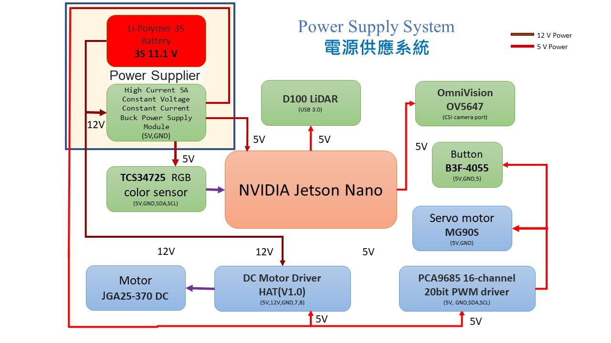
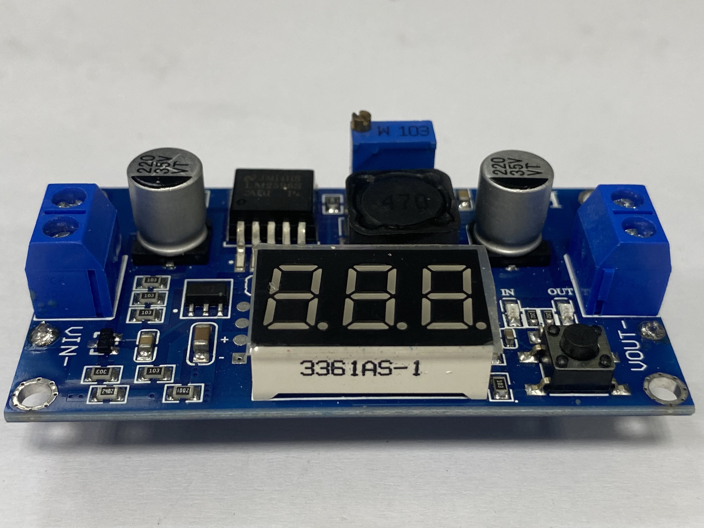

2023WRO Future Engineers Shinan Fire On All Cylinders  
====
# 
Power_supply_system
 
- ###  Power_supply_system of Summary diagram(電源供應系統概要圖) 

- Due to the continuous movement of the vehicle, the power source needs to be changed to a battery. Considering that the motors require a 12V voltage to operate, we need to choose a battery with a voltage of 12V and a current of 3V. There are two options: lithium-ion batteries (18650) and lithium polymer batteries (3S). However, the 18650 battery is heavier and takes up more space, so we opted for the lithium polymer battery.

- 由於車輛需要不斷的移動，因此需要將電力來源改成電池。考慮到馬達需要12V的電壓才能使用，我們選擇了電壓為12V、電流為3A的電池。有兩種選擇：鋰離子電池(18650)和鋰聚合電池(3S)。然而，由於18650電池重量較重且佔據空間較大，因此我們選擇了鋰聚合電池。

#### Batteries(電池)

<table>
<tr align="center">
  <th> 18650 lithium batteries </th> <th>Li-Polymer 3S Battery 
  </th>
</tr>
<tr align="center">
  <td>
   </td>
  <td>
  
  </td>

</tr>
</table>

- However, the maximum voltage supported by the Jetson Nano is only 5.2V. Therefore, we need to use a step-down module to reduce the voltage to prevent damage to the Raspberry Pi. We initially considered using the LM2596 DC-DC adjustable step-down module, as it has a numerical display to show the current output voltage. However, its maximum current capacity is only 3A. Therefore, we chose a constant voltage and constant current step-down power supply module that can handle up to 5A. Though it lacks a numerical display, we will install a low voltage alarm to detect the battery voltage and ensure its safety.

- 但是Jetson Nano最大電壓只能到5.2V，因此我們需要使用降壓板來將電壓降低，以避免樹梅派受損。最初我們打算使用LM2596 DC-DC可調降壓模組，因為它有數值顯示，可以顯示目前輸出電壓的大小。然而，它的最大電流只能接受3A，因此我們選擇了一個能夠支援最大5A電流的恆壓恆流降壓電源模組。儘管沒有數值顯示，我們將安裝一個能夠偵測電池電壓的低電壓警報器，以確定目前電池的電壓是否正常。

#### Step-Down Module

<table with=100%>
<tr align="center">
<th> LM2596 DC-DC Adjustable Buck Converter Module </th>
<th>5V Constant Voltage Constant Current Buck Power Supply Module</th>
</tr>
<tr align="center">
  <td>  </td>
  <td> 
  </td>

</tr>
</table>

# 
[Return Home](../../)
  

