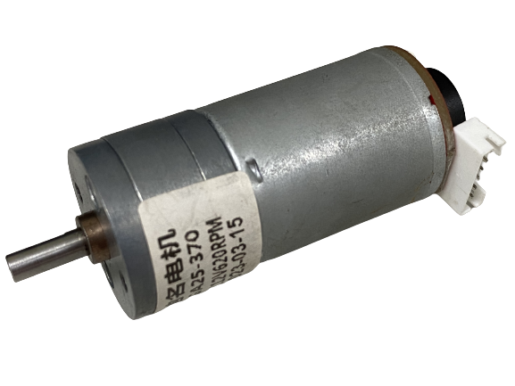
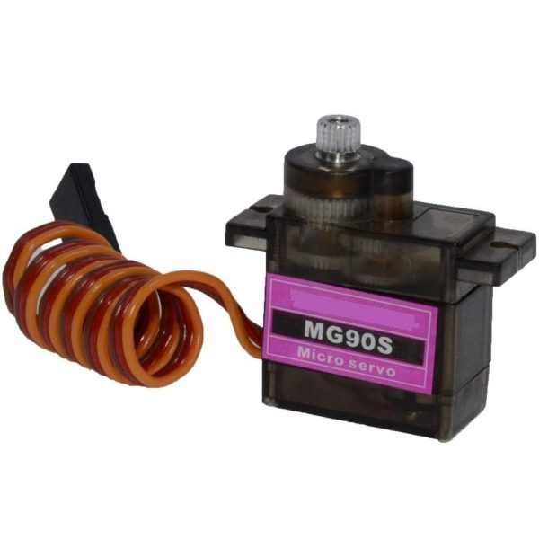
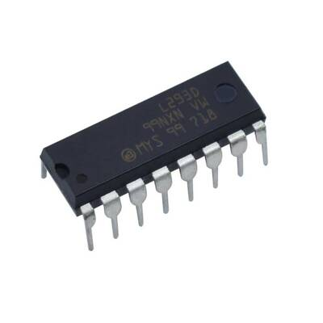
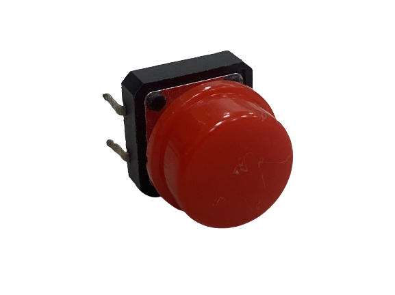
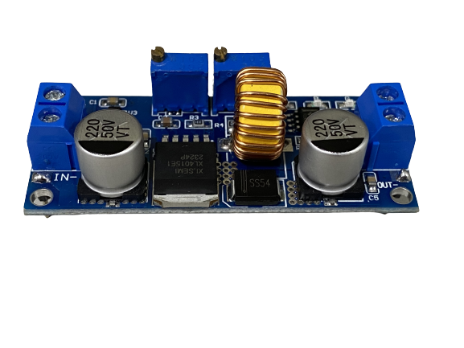

# Electromechanical diagrams  

## Components's Position  

  
## Pin Configuration  

### Raspberry Pi 4 B 8G  
Specification:  
With the Advanced RISC Machine(ARM) produced by Broadcom Corporation , the total memory capacity of it has 1、2、4 or 8 Giga bytes.The TransFlash card of it serves as the system’s main storage media. equipped the USB interface device and the output of High Definition Multimedia Interface, it can adapt with several types of operating systems.  
  
Usage:  
Collects photos from the lens and carries out the image identifying, controls the vehicle to move ,and ,last but not least, used to write the program.  
   

### GA25-370 DC reduction motor  
Specifications:  
No-load Speed: 126 rpm/m  
Reduction Ratio: 1:34  
Operating Voltage: 3 - 12V  
  
Usage:  
Driving the car's rear wheels to control the vehicle's forward and backward movements.  
  

### MG90S servo motor  
Specifications:  
Controllable Rotation Angle: 90°  
Maximum Torque: 2.0 kg/cm (at 4.8V)  
Fastest Rotation Speed: 0.11 seconds (at 4.8V)  
Operating Voltage: 4.8V - 7.2V  
  
Usage:  
Control the steering mechanism to make the vehicle turn.  
   

### L293d motor controler  
Specifications:  
Wide power supply voltage range: 4.5V to 36V  
Output current per channel: 0.6mA per channel  
Peak output current: 1.2A  
  
Usage:  
Control the rotation direction of GA25-371 DC reduction motor.  
   

### battery Lithium Polymer  
Specifications:  
Maximum Current: 45.5A  
Net Weight: Approximately 107g  
Rated Voltage: 11.1V  
  
Usage:  
Supplying power to Raspberry Pi and other electronic components.  
   

### button  
Specifications:  
Operating Voltage: 3.3V - 5.0V  
Number of Pins: 3  
Output Signal: Digital  
  
Usage:  
Send an activation signal before initiating the program.  
   

### ADIO-DC36V5A Switching power adapter  
Specifications:  
Input Voltage: 4.0V - 38.0V  
Output Voltage: 1.25V - 36.0V  
Operating Frequency: 180Hz  
  
Usage:  
Stabilizing the power supplied by lithium batteries.  
   

### TCS725 RGB color sensor  
Specifications:  
Operating Voltage: 3.3V - 5.0V  
Interface: I2C interface  
  
Usage:  
Line recognition and counting the current number of revolutions.  
   

### Raspberry Pi Camera V2  
Specifications:  
Viewing Angle: 160 degrees  
Interface: CSI (Camera Serial Interface)  
  
Usage:  
Collecting images for image recognition.  
   

### Lidar D100
Specifications:  
D100 開發者套裝是以光達 LiDAR LD14為核心再搭配相關零配件組合而成。  
採用三角測距技術，簡易360度全掃描，最大測距為8公尺。  
偵測頻率 2300 HZ，外觀尺寸 96.3*59.8*38.8 mm  

Usage:  
用於偵測前方牆壁及使機器維持在車道中央  
  
