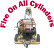
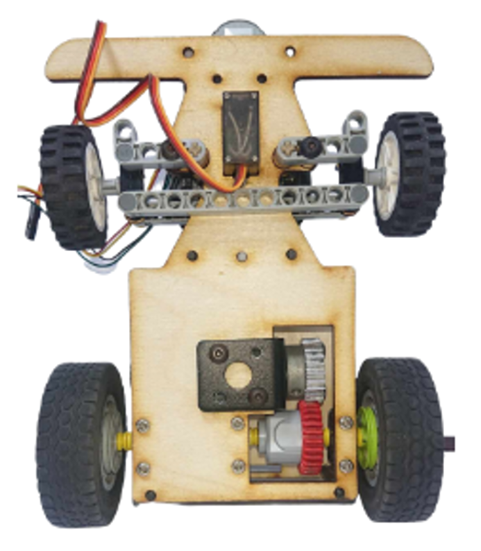
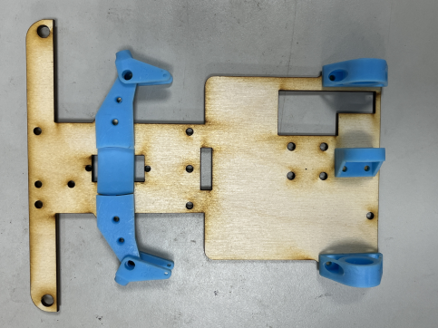
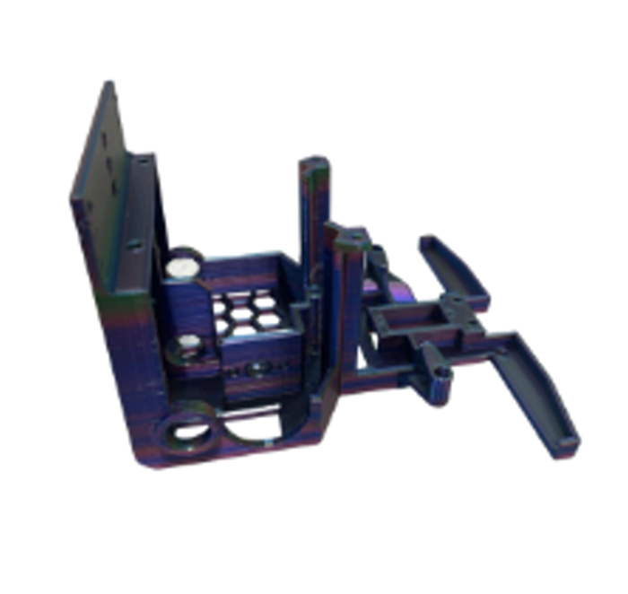
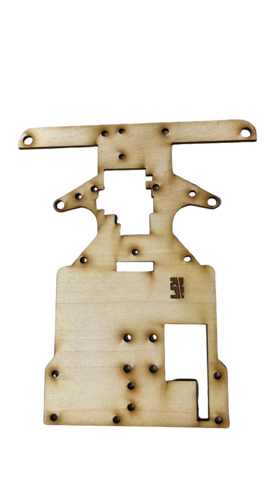
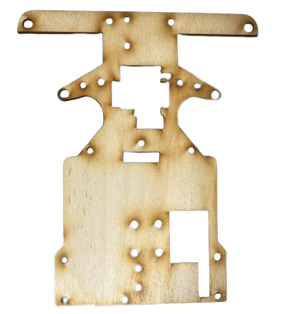
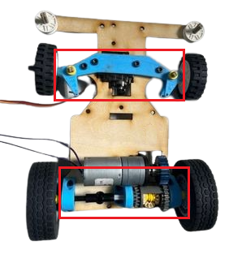
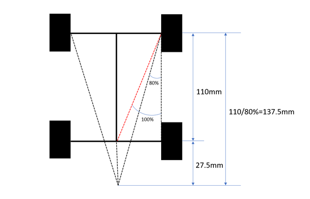
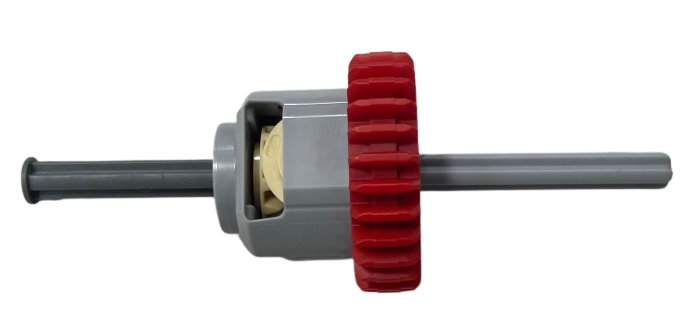

## 
Vehicle Chassis Design Process
 

- ### Vehicle Chassis Design
  - The vehicle chassis used in this competition is self-designed and developed.
  - We applied Ackermann Steering Geometry to the vehicle chassis mechanism to facilitate obstacle avoidance and U-turns.
  - The following table shows the 3D models and finished products of the vehicle chassis.

    |3D Vehicle Chassis Design| Vehicle Chassis Top View | Vehicle Chassis Bottom View|
    |:----:|:----:|:----:|
    ||||

    - We used a Stereolithography (SLA) 3D Printer and laser -cutting machine to design and produce all the components on the vehicle chassis, except for the gears, differential, and tires. This approach not only saves space but also allows us to customize dimensions and shapes according to the specific needs of the vehicle.
    - By incorporating bearings into the vehicle's support frame, we've reduced friction, thereby increasing the vehicle's speed.
    - The support frame for the Ackermann steering geometry on the vehicle chassis was designed through 3D modeling, and the model was then produced using a stereolithography (SLA) 3D printer. This approach allows for the flexible adjustment of the Ackermann ratio, helping us determine the optimal turning radius with precision.

- #### Vehicle Chassis Improvement Record

    - In the process of designing the vehicle chassis, we encountered many issues. We will document the problem-solving and modification process in the following table:

        |First Prototype | Explanation |
        |:----:|:----|
        ||This is the first prototype of the chassis assembled using LEGO and wooden boards. However, during assembly, many structural components couldn't be realized due to the constraints of LEGO specifications, such as the Ackermann steering mechanism.|

        |Second Prototype| Explanation|
        |:----:|:----|
        ||To ensure smoother wheel rotation, we incorporated bearings. We utilized a Stereolithography (SLA) 3D Printer to create the bearing mounts, which were then accurately aligned with corresponding holes cut into the wooden board.|

        |Third Prototype | Explanation|
        |:----:|:----|
        || We attempted to create an integrated chassis structure through 3D printing. The advantage we considered was that it eliminates the need to assemble it in separate parts, making the model more compact. However, later we discovered that the 3D printed base was quite fragile and prone to breaking.|

        |Fourth Prototype | Explanation|
        |:----:|:----|
        ||Due to the fragility of the 3D printed material, we reverted back to using the original wooden board material. Additionally, we adjusted the placement of the servo motor to lower its position, thus reducing the center of gravity and enhancing stability.|

        |Final Build | Explanation|
        |:----:|:----|
        ||The key change in this edition is shifting the position of the servo motor from being on the left side to being in the center. Otherwise, the left wooden board would be too thin and prone to breaking.|

- #### What is an Ackermann Steering Geometry?

  - #### Ackermann Steering Geometry Introduction 
    - The Ackermann steering geometry, proposed by German automotive engineer Lankensperger in 1817, is a steering system design used in automobiles. It was developed to address the geometric discrepancy in the paths of the inner and outer turning wheels when a vehicle makes a turn.
    - People apply Ackermann steering geometry to the steering mechanism of vehicles. Through the corresponding cranks of the four-linkage system, the steering angle of the wheels relative to the projected tire is increased by about 2 to 4 degrees. This results in the rough convergence of the trajectory centers of all four wheels along the extension line of the rear axle, thereby achieving the vehicle's turning.
      
        

      Reference Link：[Ackermann steering geometry@Wikipedia](https://zh.wikipedia.org/zh-tw/%E9%98%BF%E5%85%8B%E6%9B%BC%E8%BD%89%E5%90%91%E5%B9%BE%E4%BD%95)
      #### The principle of Ackermann steering geometry is based on the following concepts:     
       - __Difference in Turning Radius:__ When the vehicle makes a turn, the two front wheels need to rotate at different angles to allow the vehicle to pivot around a central point.
       - __Turning Angles of the Two Front Wheels:__ The design of the Ackermann steering geometry ensures that both front wheels pass through a central point simultaneously during steering.
    - Compared to the Ackermann steering geometry made from the original 0% LEGO bricks, the steering mechanism of this competition vehicle is designed with reference to an 80% Ackermann steering geometry. It offers advantages such as reduced resistance and smoother turns. The Ackermann steering geometry parts are produced using a stereolithography (SLA) 3D printer. However, the most challenging aspect of the process was adjusting the Ackermann ratio to achieve the ideal turning angle for our vehicle to navigate around blocks effectively.  
  
  - #### Why Choose an 80% Ackermann Ratio?

    - In theory, this design is the optimal choice for smooth and efficient turns. However, it may lead to excessive tire wear. Therefore, in automobile design, a 100% Ackermann ratio is usually not chosen. Compared to a 100% Ackermann ratio, an 80% Ackermann ratio allows for smoother, more predictable turns, improves maneuverability, and reduces tire wear.

  - #### Producing Ackermann steering geometry components (80% Ackermann angle) using Stereolithography (SLA) 3D Printer
    - The Ackermann steering geometry components within the red box in the bottom-left diagram are assembled using LEGO bricks.
    - The Ackermann steering geometry components within the red box in the bottom-right diagram are assembled from self-produced plastic parts using a Stereolithography (SLA) 3D Printer.
    - Assembling the steering system with LEGO bricks can save costs and time, while using a Stereolithography (SLA) 3D printer to manufacture plastic parts can enhance precision and customization.
    - During the process of production and testing, we found that using LEGO bricks was limited by the original specifications, making it difficult to create a structure that perfectly suited our needs. In contrast, utilizing a Stereolithography (SLA) 3D Printer to produce the Ackermann steering geometry components allowed for customization in size and shape, giving us the flexibility to design and print according to our specific requirements. 
    - __As a result, we ultimately decided to use the SLA 3D Printer to manufacture the Ackermann steering geometry components for the vehicle's steering mechanism.__

    

    <table>
    <tr>
    <th>Assembling with LEGO Bricks.</th>
    <th>Assembled Using Photocured PartsAssembling Parts Produced with a SLA 3D Printer</th>
    </tr><tr>
    <td></td>
    <td align=center></td>
    </tr>
    </table>
    

    - #### Calculating the Ackermann Angle Graphically (a-b = ack)

    

    <table>
    <tr align=center>
    <td></td>
    <td></td>
    </tr>
    </table>
    

    Reference Video website：[汽车转弯 没那么简单: 阿克曼转向几何是个啥？How does Ackerman steering geometry work?](https://www.youtube.com/watch?v=8AimxDPWKcM)

- ###  Gear Differential

  - The gear differential is a crucial component of a vehicle's drivetrain, used to balance and distribute power to different wheels.
  - It allows the driven wheels to rotate at different speeds, especially during turns. This is crucial for enhancing the vehicle's agility and maneuverability. The gear differential achieves this function through a series of gear mechanisms, enabling the two drive wheels to rotate adaptively, ensuring the stability and balance of the vehicle, and maintaining good driving conditions regardless of road conditions.
   - #### The LEGO Brick Gear Differential Introduction 
        - In this competition, we use a LEGO brick gear differential to achieve the function of the vehicle driving and turning.
        - There are two types of LEGO brick gear differentials: LEGO 65414 Differential Gear and LEGO 6573 Differential Gear.
        - LEGO 65414 Differential Gear: It consists of the 28-tooth gear from LEGO 65413 and five LEGO Gear 12 Tooth Bevel 4565452.
        - LEGO 6573 Differential Gear: Integrating a 16-tooth gear and a 24-tooth gear, both gears have a 5mm diameter hole in the center for easy placement of a cross axle. There is a small pillar in the center of the differential, allowing us to better secure the right-angle bevel gears and combine three LEGO Gear 12 Tooth Bevel 4565452.

          

          <table>
          <tr align=center>
          <th>LEGO 65414 GearDifferential</th>
          <th>LEGO 6573 Gear Differential</th>
          </tr><tr align=center>
          <td></td>
          <td></td>
          </tr>
          </table>
          

    - #### Reason for Selection
        - We originally used the LEGO 65414 gear differential as a steering system component. However, during testing, we found that the gear differential would occasionally disengage while the vehicle was driving, causing the vehicle to malfunction. As a result, we switched to the LEGO 6573 gear differential, which solved the problem.

        

        <table>
        <tr>
        <th>LEGO 65414 Gear Differential </th>
        <th>LEGO 6573 Gear Differential </th>
        </tr><tr align=center>
        <td></td>
        <td></td>
        </tr>
        </table>
        

- ###  Vehicle Suspension and Shock Absorption System
    - We once attempted to address the issue of unstable weight distribution during vehicle turns by experimenting with a suspension system. Here is the description of our attempt.
    - Therefore, we chose the MacPherson strut system as the vehicle's suspension system, as it offers many advantages over the double-wishbone suspension system. The MacPherson strut system is characterized by its simple structure, ease of manufacturing, and space efficiency. Additionally, the MacPherson strut system is widely used in modern vehicles, especially in the front-wheel suspension system.
    - The main components of the system include:  
      - Spring: Typically composed of a spring and a shock absorber, it connects the wheel to the chassis, absorbing vibrations and impacts from uneven road surfaces.
      - Upper control arm: Located above the wheel, it connects the chassis to the wheel. Its design allows the wheel to move freely in the vertical direction.
      - Lower control arm: Connects the chassis to the wheel and helps control the motion of the wheel.
    - We designed two options. The first option had a larger vertical vibration range both above and below, which couldn't effectively control the vehicle's vibration. Therefore, we chose the second option, which had a smaller vibration amplitude and could also maintain a lower center of gravity for the vehicle.

        

        <table>
            <tr align="center">
            <th>Big Range</th>
            <th>Small Range</th>
            <th>Actual Application Image</th>
            </tr>
            <tr align="center">
            <td></td>
            <td></td>
            <td></td>
            </tr>
        </table>  
        
 

      Due to the smoothness of the competition venue, the shock absorbers cannot provide significant damping effect. __Therefore, we have decided to omit the use of shock absorbers to reduce the complexity in vehicle fabrication.__

# 
[Return Home](../../)
  
