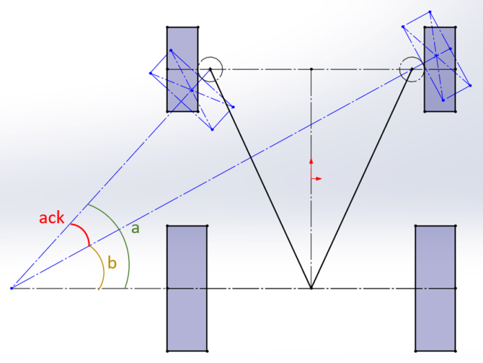
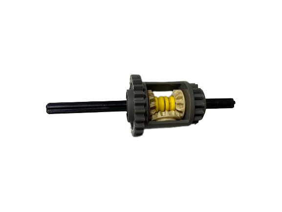
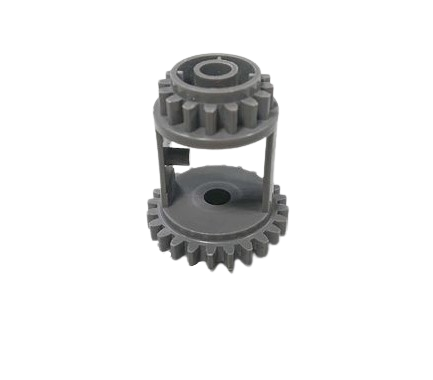

2023WRO Future Engineers Shinan Fire On All Cylinders  
====
# 
Vehicle Chassis Design 
 

- ## Vehicle chassis design
|Vehicle chassis design 3D| Vehicle chassis design Entity TOP view | Vehicle chassis design Entity Down view|
|:----:|:----:|:----:|
||||

We replaced most of the LEGO parts on the chassis with components 3D printed through photopolymerization. This allowed us to save space and customize dimensions and shapes according to the vehicle's needs. With photopolymerization, we were able to introduce bearings in the middle to reduce friction and increase the vehicle's speed. Additionally, we transitioned the mentioned Ackermann steering mechanism to be 3D printed through photopolymerization. This freed us from the constraints of fixed LEGO part shapes, enabling us to freely adjust the Ackermann angle.

- ###  Chassis Improvement Record
|First generation | Explanation  |
|:----:|:----:|
|| This is the first generation chassis assembled using LEGO and wooden boards. However, during assembly, many structural components couldn't be realized due to the constraints of LEGO specifications, such as the Ackermann steering mechanism.|

|Second generation| Explanation  |
|:----:|:----:|
|| To ensure smoother wheel rotation, we incorporated bearings. We utilized a photopolymerization-based 3D printer to create the bearing mounts, which were then accurately aligned with corresponding holes cut into the wooden board.|

|Third generation | Explanation  |
|:----:|:----:|
||  We attempted to create an integrated chassis structure through 3D printing. The advantage we considered was that it eliminates the need to assemble it in separate parts, making the model more compact. However, later we discovered that the 3D printed base was quite fragile and prone to breaking.|

|Fourth generation | Explanation |
|:----:|:----:|
|| Due to the fragility of the 3D printed material, we reverted back to using the original wooden board material. Additionally, we adjusted the placement of the servo motor to lower its position, thus reducing the center of gravity and enhancing stability.|

- ## Ackermann_steering_geometry

  ## __Introduction to Ackermann_steering_geometry__

  

- The Ackermann steering is a steering system designed for automobiles with the aim of having both front wheels pass through a single pivot point during a turn, achieving smoother turns. The term "80% Ackermann steering structure" refers to the practical implementation of about 80% of the Ackermann steering principle.

### The principle of Ackermann steering is based on the following concepts:

    Difference in turning radii: When a vehicle makes a turn, both front wheels need to rotate at different angles so that the vehicle can pivot around a central point.

    Turning angles of the two front wheels: The design of Ackermann steering ensures that both front wheels pass through a single pivot point when turning.

- Compared to the original 0% Ackermann structure made with LEGO, the steering mechanism of the vehicle in this competition is designed based on an 80% Ackermann steering structure. It offers advantages such as reduced resistance and smoother turns. It is achieved using 3D photocuring technology. However, the most challenging issue encountered during the process is adjusting the Ackermann angle to achieve the optimal turning angle for our vehicle to navigate around obstacles.

  
- ###  Why choose an 80% ackermann ratio ?

  In automotive design, we typically avoid choosing a 100% Ackermann ratio because it would lead to overly sensitive steering, making it difficult to control. Additionally, both excessive and insufficient Ackermann angles can result in tire wear.

    Therefore, we ultimately opted for an Ackermann angle of 80% in the steering structure design.

- ## Designing an Ackermann steering mechanism (with 80% Ackermann ratio) using photopolymerization.
- The components within the red frame are the Ackermann steering mechanism we produced using photopolymerization 3D printing and LEGO construction.

<table>
<tr>
<th>Tconstructed using LEGO parts </th>
<th>assembled with photocured parts </th>
</tr><tr>
<td></td>
<td></td>
</tr>
</table>

- ###  The graphical method to calculate the Ackermann angle.(a-b= ack)

<table>
<tr align=center>
<td></td>
<td></td>
</tr>
</table>

Video link：[汽车转弯 没那么简单: 阿克曼转向几何是个啥？How does Ackerman steering geometry work?](https://www.youtube.com/watch?v=8AimxDPWKcM)

- ##  Gear Differential 
### Reason for Selection 
We initially used the differential on the left because it had complete gears. However, during operation, we found that it would slip, causing the vehicle to malfunction. When we replaced it with the grey differential on the right, the slipping issue was resolved.

<table>
<tr>
<th>Commercially available differential with gears  </th>
<th>Self-assembled differential gear </th>
</tr><tr align=center>
<td></td>
<td></td>
</tr>
</table>

### Introduce Lego Differential 
 This differential integrates a 16-tooth gear and a 24-tooth gear, both of which have a circular hole with a 5mm diameter at their centers for accommodating a cross-axis. In the center of the differential, there is a small pillar, which allows us to better secure the right-angle mating gear.

 

 <table>
 <tr align=center>
 <th>Differential photo</th>
 </tr><tr>
 <td></td>
 </tr>
 </table>
 

- ##  MacPher Suspension System 
- We have selected this system as our suspension choice due to its advantages over the Double Wishbone Suspension System. The McPherson suspension system offers structural simplicity, ease of manufacturing, and space efficiency. Furthermore, the McPherson suspension system is extensively employed in modern vehicles, especially for front-wheel suspension. 

    The main components of the system include:

    Spring: Typically a combination of springs and shock absorbers, connecting the wheels and the body of the vehicle, absorbing vibrations and impacts from uneven road surfaces.

    Upper Arm: Positioned above the vehicle's wheels, connecting the body and the wheels. Its design allows the wheels to move freely in the vertical direction.

    Lower Arm: Connecting the vehicle's body and the wheels, assisting in controlling the motion of the wheels.

- We have designed the following two options. The first option, due to its larger vertical vibration space, cannot effectively restrict the vehicle's vibrations. Therefore, we have chosen the second option, which has a smaller vibration amplitude and can also maintain the vehicle's low center of gravity.

 <table>
    <tr align="center">
    <th>Big Range</th>
    <th>Small Range</th>
    </tr>
    <tr align="center">
    <td></td>
    <td></td>
    </tr>
</table>  

 

 ###  Actual Application Image

 

# 
[Return Home](../../)
  

