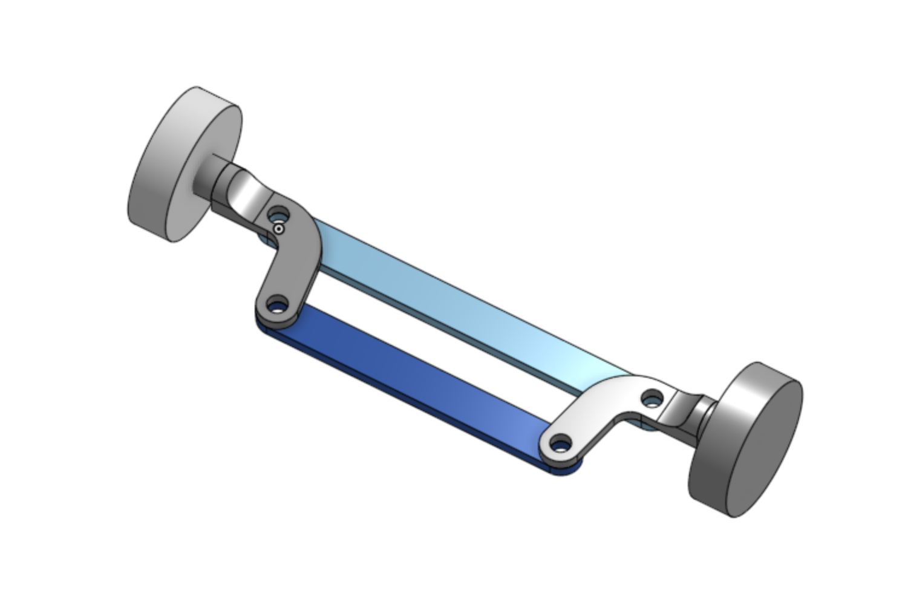
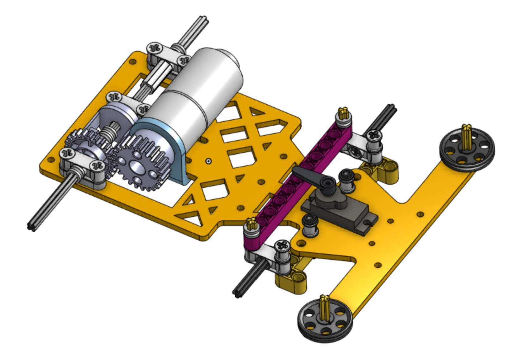
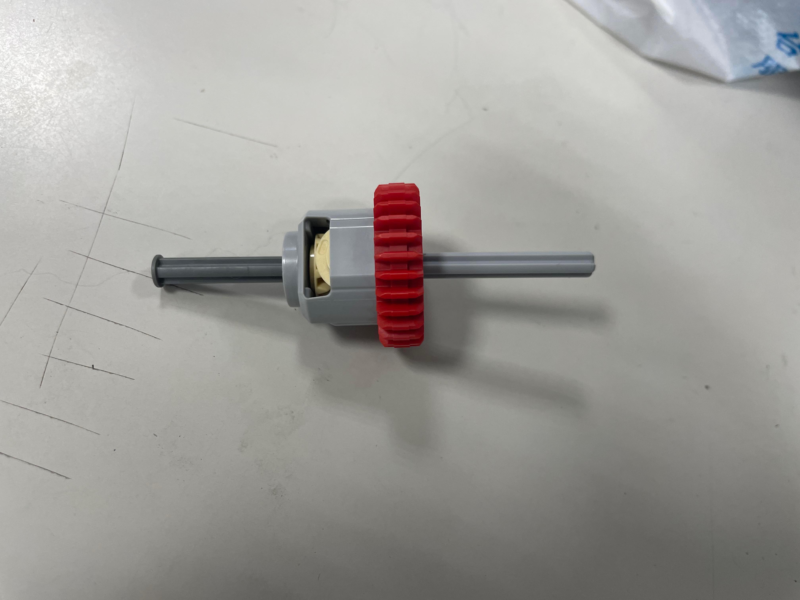

2023WRO Future Engineers Fire On All Cylinders  
====
# 
Vehicle Chassis Design (車輛底盤設計)
 

- ## Ackermann_steering_geometry(阿克曼轉向機構)
__Introduction to Ackermann_steering_geometry__
- The steering mechanism of the vehicles used in this competition is designed based on the Ackermann steering mechanism and implemented using LEGO parts. However, due to the fixed specifications of LEGO parts, modifications are not possible, and the design can only closely resemble the Ackermann steering mechanism. 
- 本競賽活動車輛的轉向機構是參考阿克曼轉向機構而設計，並使用樂高零件來實現。然而，由於樂高零件具有其固定的規格，因此無法進行改變，只能盡量接近阿克曼轉向機構的設計。

Video link：[汽车转弯 没那么简单: 阿克曼转向几何是个啥？How does Ackerman steering geometry work?](https://www.youtube.com/watch?v=8AimxDPWKcM)

- ## Ackermann_steering_geometry for LEGO(使用LEGO設計阿克曼轉向機構(0%阿克曼))

- ## vehicle chassis design 

|vehicle chassis design 3D| vehicle chassis design Entity |
|:----:|:----:|
|||

- ##  Gear Differential (齒輪差速器)
  - 使用市售常見樂高的差速器零件，以降低車輛設計上的難度，LEGO齒輪差速器零件編號為65414、65413、6589，如下圖所示。
 

# 
[Return Home](../../)
  

