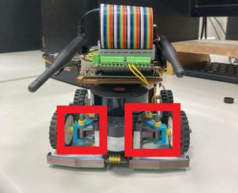

2023WRO Future Engineers Shinan Fire On All Cylinders  
====
# 
Vehicle Chassis Design 
 

- ## Ackermann_steering_geometry
__Introduction to Ackermann_steering_geometry__
- The steering mechanism of the vehicles used in this competition is designed based on the Ackermann steering mechanism and implemented using LEGO parts. However, due to the fixed specifications of LEGO parts, modifications are not possible, and the design can only closely resemble the Ackermann steering mechanism. 

Video link：[How does Ackerman steering geometry work?](https://www.youtube.com/watch?v=8AimxDPWKcM)

- ## Ackermann_steering_geometry for Photocured 3D Printing(100% Ackermann)

 
 
The components highlighted within the red box are the Ackermann steering mechanism that we have produced using photocured 3D printing.

- ## Vehicle chassis design

|Vehicle chassis design 3D| Vehicle chassis design Entity TOP view | Vehicle chassis design Entity Down view|
|:----:|:----:|:----:|
||||

- ##  Gear Differential
- Using commonly available LEGO differential gear parts with part numbers 65414, 65413, and 6589, as shown in the diagram, to simplify vehicle design and enhance maneuverability.

- ##  MacPher Suspension Systen
- We have selected this system as our suspension choice due to its advantages over the Double Wishbone Suspension System. The McPherson suspension system offers structural simplicity, ease of manufacturing, and space efficiency. Furthermore, the McPherson suspension system is extensively employed in modern vehicles, especially for front-wheel suspension. 

    The main components of the system include:

    Spring: Typically a combination of springs and shock absorbers, connecting the wheels and the body of the vehicle, absorbing vibrations and impacts from uneven road surfaces.

    Upper Arm: Positioned above the vehicle's wheels, connecting the body and the wheels. Its design allows the wheels to move freely in the vertical direction.

    Lower Arm: Connecting the vehicle's body and the wheels, assisting in controlling the motion of the wheels.

- We have designed the following two options. The first option, due to its larger vertical vibration space, cannot effectively restrict the vehicle's vibrations. Therefore, we have chosen the second option, which has a smaller vibration amplitude and can also maintain the vehicle's low center of gravity.

 <table>
    <tr align="center">
    <th>Big Range</th>
    <th>Small Range</th>
    </tr>
    <tr align="center">
    <td></td>
    <td></td>
    </tr>
</table>  

 

# 
[Return Home](../../)
  

