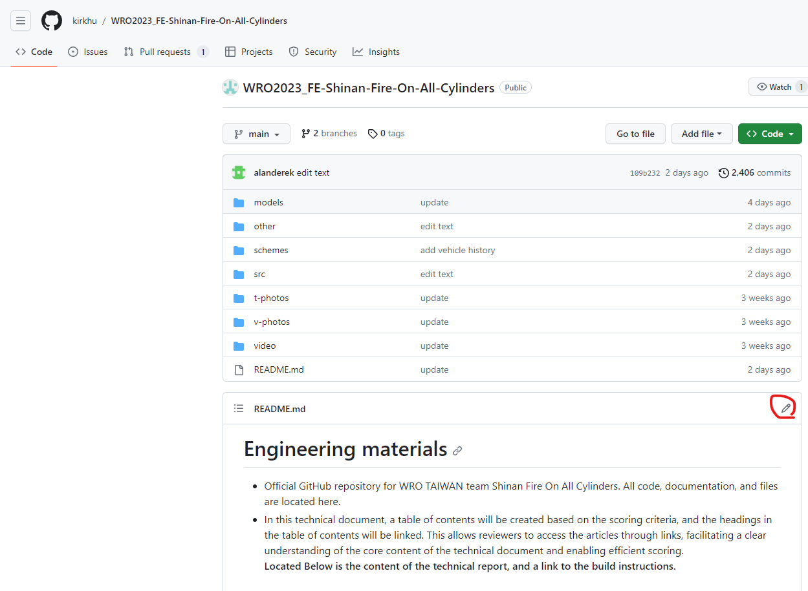
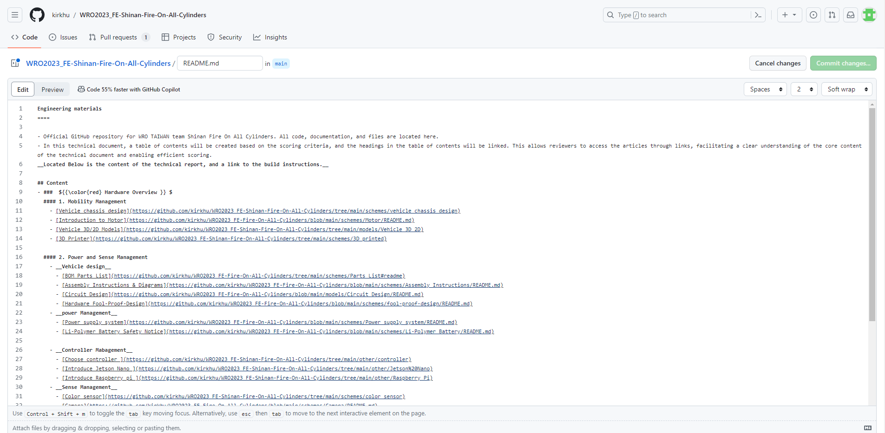
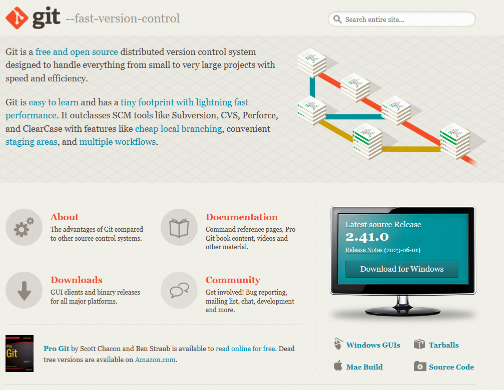
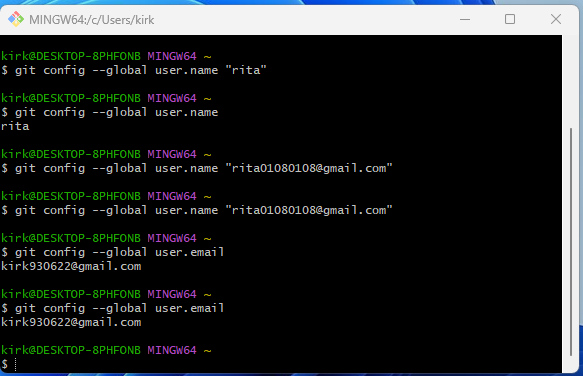
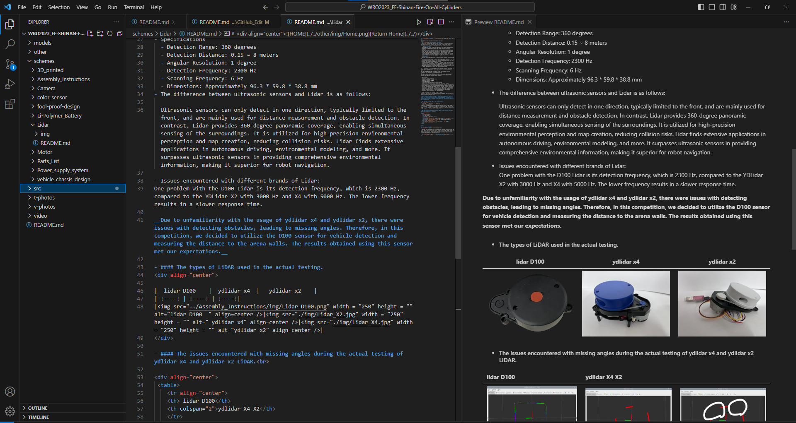
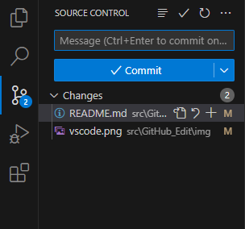

## 
GitHub's Editing Process 

__There are two ways to edit GitHub repositories:__ one is to edit directly on the GitHub website, which is called online editing, and the other is to use software like VS Code + Git on your local computer for offline editing, and then synchronize the changes to GitHub.

- #### Online Editing on GitHub Website:
  This is the simplest method. You can log in to your GitHub account using a web browser, navigate to the file you want to edit, and click the pencil icon on the top right corner to start editing. During online editing, you can directly modify the file content and submit the changes when you are done. GitHub will automatically create a new commit and apply the changes to the main branch or the branch you choose.

  
  
|||
|:---:|:---:|

- #### Offline Editing with VS Code + Git:
  This method requires you to install specific software, such as Visual Studio Code (VS Code) and Git, on your local computer. First, you need to download and install VS Code and Git. Next, you can open your GitHub repository in VS Code and make modifications to the desired file. After completing the edits, you need to use Git commands to push your local changes to the remote GitHub repository. This way, the file on GitHub will be updated to reflect the edits you made on your local machine.  

|Git| Git_bash|VS Code| VS Code Git|
|:---:|:---:|:---:|:---:|
|||||

  In summary, both methods allow you to edit and synchronize files on GitHub. Online editing is suitable for simple changes, while offline editing provides more features and flexibility, making it particularly useful for handling larger projects and collaborative work. However, it's worth noting that online editing might be less intuitive when it comes to creating file folders compared to local editing. As a result, our team primarily uses local editing with online editing as a supplementary approach when editing GitHub repositories.  
 

- ### Introduction to Code Editor Software(Visal Studio Code) 

  - Visual Studio Code (often referred to as VS Code) is a free, open-source, and cross-platform code editor developed by Microsoft. It supports multiple programming languages and offers a rich set of extensions to cater to individual needs.
  - VS Code features an intuitive user interface and powerful code editing capabilities, including intelligent code completion, code navigation, debugging, and version control. It is widely embraced by developers and has become the preferred editing tool for many software development projects.

  __Therefore, we have chosen VS Code as the programming tool for the self-driving vehicle.__

  - Software Link：[Visal Studio Code](https://code.visualstudio.com/) 

# 
[Return Home](../../)
  

