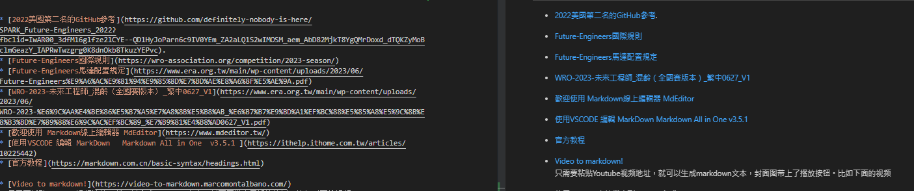
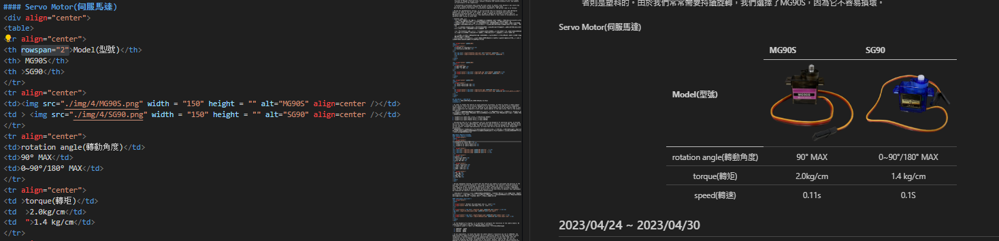

## 
GitHub Web Editing Languages
 

 GitHub web editing languages primarily refer to the programming languages used when editing on the GitHub website.GitHub offers various editing methods, allowing users to edit and manage code, documents, and other project files.  

   On GitHub, commonly used and user-friendly web editing languages include:

   1. __Markdown:__ Markdown is a lightweight markup language used for formatting text and easily creating structured documents. It is widely used on GitHub for writing README files, documentation, blogs, and forums.
   2. __HTML:__ HTML is a hypertext markup language used for building web pages. With HTML, you can create the structure, content, and layout of web pages.  
  
__In the competition, in addition to other web editing languages such as CSS, JavaScript, JSON, YAML, these are not the primary focus of the current competition. Therefore, on GitHub, we primarily utilize Markdown and HTML languages as the main tools for web editing, fully leveraging their respective strengths to more effectively apply them in the editing process of technical documentation.__

<table>
<tr align="center" >
<th>Markdown</th>
<th>HTML</th>
</tr>
<tr align="center">
<td> </td>
<td>HTML 語法"/> </td>
</tr>
</table>

- #### [Markdown Document link](https://markdown.tw/#link)
- #### [HTML Document link](https://www.w3schools.com/html/)
# 
[Return Home](../../)
  

