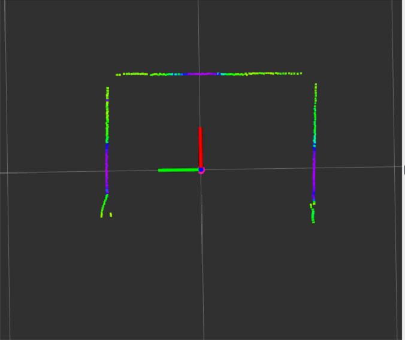

2023WRO Future Engineers Shinan Fire On All Cylinders  
====
# 
Image_Processing_and_Predictions
 

### Image processing  
- When processing images, it is necessary to convert them to different color spaces for more efficient handling of specific tasks.  
- We use the cv2.cvtColor function to convert the original RGB image to the HSV (Hue, Saturation, Value) color space.  
- After the image is converted, we use the cv2.inRange function, where we set six HSV values: redMax, redMin, greenMin, greenMax, blueMin, and blueMax, to define the color ranges. The cv2.inRange function compares each pixel value in the HSV image with the specified HSV ranges. If the pixel value falls within this range, it will be retained; otherwise, it will be filtered out. This process allows us to obtain a filtered image.  

|Adjusting the HSV range values for red color|Adjusting the HSV range values for green color|
|:----:|:----:|
|||

|Obstacle detection in images|
|:----:|
||

### Traffic sign avoidance  
- Using the filtered red and green color images, we obtain the X and Y coordinates, as well as the area of objects in the image. We determine which color (red or green) is closer based on the Y coordinate.  
- Then, we calculate the error value by subtracting the X coordinate of the closer traffic sign from the desired X coordinate where we want to avoid. Finally, we set this error value as the angle for the servo motor to turn, completing the avoidance maneuver around the traffic sign.  

###  Using LIDAR to center on the road
- Using LIDAR to measure the distances between the object's right and left sides and the walls, we can calculate the error values for both sides.  
- By multiplying these error values with coefficients, we can obtain the angle to center the servo motor on the road.    

  
|LIDAR detects surrounding walls|LIDAR readings|
|:---:|:---:|
|||

# 
[Return Home](../../)
  
