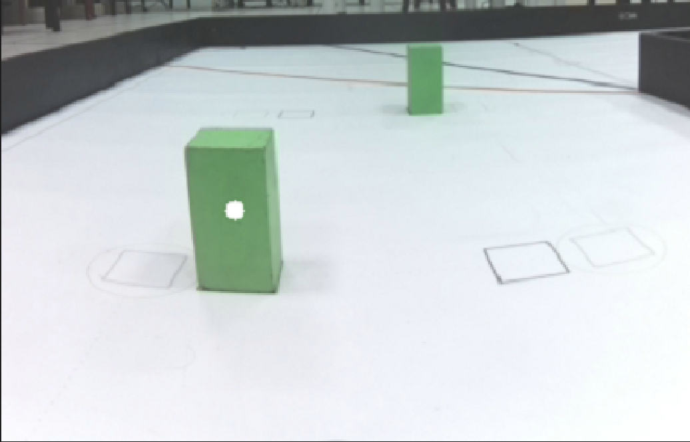
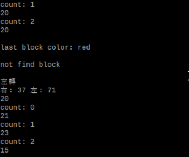
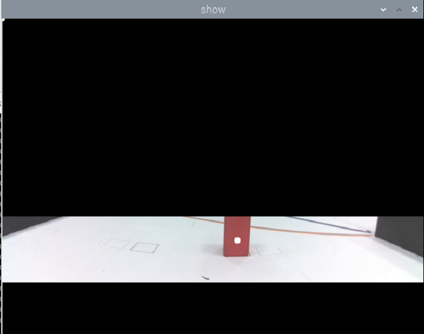

<div align=center>  </div>

## <div align="center">Steering Overview</div> 

 ### Wall Steering
  - While the vehicle is moving, it reads whether one side of the LiDAR walls is more than 100 cm away. If the right LiDAR reads a distance exceeding 100 cm, it indicates clockwise motion; otherwise, it is counterclockwise, and the vehicle performs a steering maneuver.
  - After determining the travel direction, read the distance between the LiDAR and the wall ahead. When the distance between the LiDAR and the wall is less than 55 cm, execute the turning action.
  - program code:
        ```
        if get_left_dis > 100:
            reverse = False
        else:
            reverse = True
        if get_mid_dis > 55:
            servo.angle(-40)
        ```

        |LiDAR Readings|
        |:---:|
        |<div align="center"> </div>|

### Obstacle Avoidance
 - While the vehicle is in motion, the camera lens transmits the video to the controller (Raspberry Pi), which performs calculations to obtain the X and Y coordinates and area of the objects in the image.
 - We will complete the avoidance of traffic signs through the following steps:  
   1. Use the Y coordinates to determine which block has a larger Y coordinate, indicating that it is closer.  
   2. Determine the color of the closer traffic sign and obtain its X coordinate.  
   3. Subtract the desired avoidance coordinate from the X coordinate of the closer  traffic sign and then multiply it by the avoidance coefficient to calculate the error value.  
   4. Set the steering angle of the servo motor to turn in the direction of the error value, completing the avoidance of the traffic sign.

<div align=center>

  |Recognize Obstacles that are Closer in Distance|XY Coordinates of Obstacles|
  |:---:|:---:|
  |<div align="center"> </div>|<div align="center"> </div>|

</div>  


 ### Slalom Steering

  - We will use a color sensor to count the number of times the track lines are passed, to determine if it has entered the last area of the second lap.
  - Therefore, if the count reaches 7 times, it means that the car has entered the last area of the second lap.
  - If the car reaches the last area of the second lap, the system will use the camera to continuously record the color of the nearest traffic sign until the car leaves the area. At this point, the traffic sign color will no longer be recorded.
  - If the color of the last traffic sign in the last area of the second lap is green, the car will continue to go straight. If the color of the sign is red, the car will turn around in the next area (starting area).

 <div align="center">

|Display the number of lines and the color of the nearest traffic sign|Camera detects the color of the nearest traffic sign|
|:---:|:---:
|<div align="center"> </div>|<div align="center"> </div>|

</div>

# <div align="center">[Return Home](../../../)</div>  


