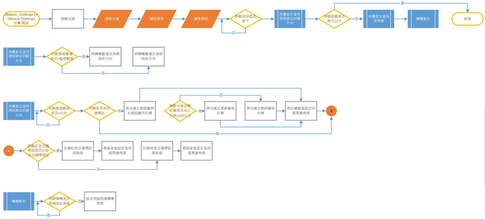

<div align="center"></div>

## <div align="center">Obstacle Challenge Code Overview</div>
 - In the competition, vehicle control involves complex operations such as image recognition, color identification, distance detection, motor rotation, and vehicle steering. All of these are implemented using the __Python__ programming language.
 - Through the built-in SSH or VNC functionality in Mobaxterm or using RealVNC, we can easily connect to the Raspberry Pi, access its editor interface, carry out programming tasks, and perform real-time execution tests.
 - The libraries introduced in this competition program are as follows.
 
```
   #Import the required modules
   import pigpio       #Raspberry Pi I/O Control Function Library
   import time         #Time Module
   import smbus        #I2C Manage  Module
   import struct       #Binary Data Packing and Unpacking Modul
   import os           #System Information Reading Module 
   import math         #Mathematical Calculation Module
   import cv2          #OpenCV  Module
   import threading    #Multithread Management  Module
   import pickle       #Serialization/Deserialization Modul
   import rospy        #ROS Python Commands Module
   import numpy as np  #Multidimensional Arrays and Matrix Operations Module
   import signal       #Exception Handling Module
   from sensor_msgs.msg import LaserScan  #ROS Data Structure Definitions
```
<div align="center">
</div>
 <table>
 <tr align="center">
 <th> Edit python of  Mobaxterm_SSH  
 </th>
 <th> Edit python of  Mobaxterm_VNC
 </th>
 <th>Edit python of RealVNC
 </th>
 </tr>
 <tr align="center" > 
 <td> </td>
 <td> </td>
 <td> </td>
 </tr>
 </table>
 </div>
 
 - ### Introduction to the Required Module Programs in the Operating Software:
   - #### Field Environment Value Recording Configuration Workflow
     
     - #### [line_color_write.py](./line_color_write.py)
       - The main functionality of the "line_color_write.py" program is to read the color values of white areas, orange lines, and blue lines, and save these values to a file named "color_sensor.p". Additionally, the program stores this file in the "save_file" directory.       
       
     - #### [HSV_Test.py](./HSV_Test.py)
       - The main purpose of the 'HSV_Test.py' program is to adjust HSV range values for color filtering. Users can configure the HSV range values for green and red and save these settings in files named 'HSV_Green.p' and 'HSV_Red.p,' which are stored in the 'save_file' folder.

     - #### [save_file](./save_file)
       - The function of the 'save_file' folder is to store color values related to the white area of the field, orange lines, and blue lines.
       - These numerical data are used for image processing, image recognition, and determining whether the next turn is reached or whether to walk forward or backward.

      
    - #### Obstacle Challenge Flow Chart
        
      - #### [vehicle_function.py](./vehicle_function.py)
        - "vehicle_function.py," which is the program library used in this competition, provides custom functions for vehicle movement, image recognition, color recognition, and controlling servo motors. These custom functions simplify complex procedures into subroutines for ease of debugging.
  
      - #### [Obstacle_Challenge.py](./Obstacle_Challenge.py)  
        - "Obstacle_Challenge.py" is the main program responsible for controlling the self-driving car. It reads the values detected by the color sensor, LIDAR sensor, and image recognition technology to drive the car's motors and achieve the goal of avoiding obstacles and completing specific tasks.

- ### Obstacle Challenge Program Operation Flowchart Description
  - Activate the program along with the LiDAR. After activation, the program will read the values from the LiDAR and color sensor, as well as capture photos from the camera. When the button is pressed, the DC motor speed will be set to 60%, and it will continue to move forward until the color sensor detects a line. It will execute a turn and check if it has turned 12 times. If it has, it will end; if not, it will continue to repeat the process of moving forward and checking for wall turns.  
  - __Subroutine Description:__   

    __1. Determining Vehicle Turn Direction Based on Blue and Orange Lines Subroutine：__    
    While the vehicle is in motion, if the color sensor detects a value lower than that of white (35), it indicates the presence of a blue line (15) or an orange line (27). Subsequently, the program calculates the midpoint value between the two lines as (15+27)/2 to determine the color of the line. If the value is lower than 21, it signifies the detection of a blue line, and the turning direction is set to counterclockwise. If the value is higher than 21, it signifies the detection of an orange line, and the turning direction is set to clockwise.
    
    __2. Vehicle Lane Centering Subroutine：__    
   While driving, it continuously checks whether the value read by the color sensor is greater than that of white (35). If it is, the vehicle continues moving forward. It also checks for the presence of obstacles in front. If an obstacle is detected, it performs the action to avoid the obstacle. If no obstacle is detected, it proceeds to center the Lidar. Lidar centering involves calculating the values on the left and right sides, subtracting the right value from the left value, and passing it to the servo motor to control the direction.

    __3. Vehicle Avoiding Obstacles Subroutine:__  
    It determines which has a larger area, the red block or the green block. If the red block is larger, it controls the servo motor to steer to the right and avoid the red block. If the green block is larger, it controls the servo motor to steer to the left and avoid the green block.
    
    __4. Vehicle Turning Subroutine：__ Continue turning until the specified angle is reached.
    
# <div align="center">[Return Home](../../../)</div>  
