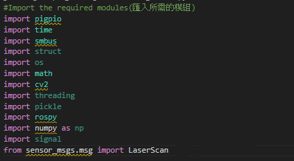
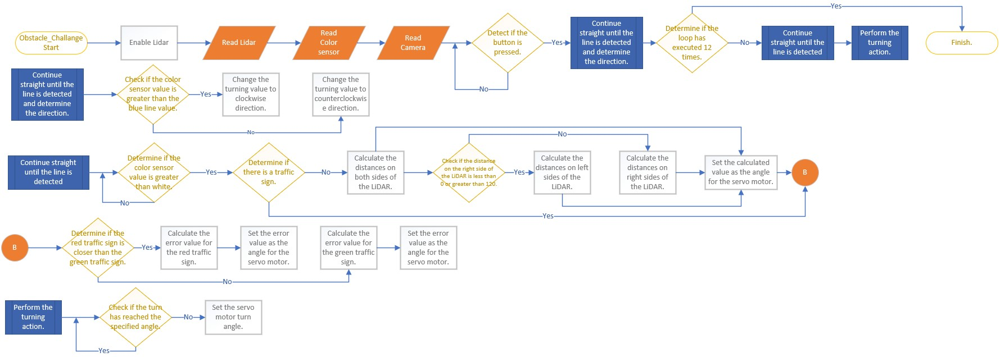

## 
Obstacle Challenge Code Overview

- In the competition, the control of the vehicle's movement encompasses a series of actions, including image recognition, color identification, distance detection, motor rotation, and vehicle steering, among other intricate maneuvers. All of these precise and versatile controls are implemented using the __Python__ programming language.
- Through the built-in SSH or VNC functionalities of the Mobaxterm tool or RealVNC, we can easily establish connections to the Raspberry Pi, access its editor interface, initiate programming tasks, and perform real-time execution testing.
- Modules required for the operation of the program : 

 <table>
 <tr align="center">
 <th> Edit python of  Mobaxterm_SSH  
 </th>
 <th> Edit python of  Mobaxterm_VNC
 </th>
 <th>Edit python of RealVNC
 </th>
 </tr>
 <tr align="center" > 
 <td> </td>
 <td> </td>
 <td> </td>
 </tr>

 </table>
 

 
### [save_file](./save_file)
- The function of the save_file folder is to store the HSV range values for green and red colors from HSV_Test, along with color values related to white areas, orange lines, and blue lines.
- These data values will be used as the basis for image processing, image recognition, and determining whether to approach the next curve or proceed with straight or reverse movement decisions.

### [HSV_Test.py](./HSV_Test.py)
- The main functionality of "HSV_Test.py" is to adjust HSV range values for color filtering. Users can set the HSV range values specifically for green and red colors and record these settings in files named "HSV_Green.p" and "HSV_Red.p". Furthermore, the program stores these files in the "save_file" directory.

### [line_color_write.py](./line_color_write.py)
- The main functionality of the "line_color_write.py" program is to read the color values of white areas, orange lines, and blue lines, and save these values to a file named "color_sensor.p". Additionally, the program stores this file in the "save_file" directory.

### Flowchart for the Configuration of Green Recording of Venue Environmental Value
   

## [vehicle_function.py](./vehicle_function.py)
- "vehicle_function.py" is a library primarily designed to provide a variety of custom functions for controlling a vehicle. It utilizes a Raspberry Pi along with various sensors and devices to implement functions such as vehicle movement, image recognition, color identification, and servo motor control.
  

### [Obstacle_Challenge.py](./Obstacle_Challenge.py)
- The main purpose of "Obstacle_Challenge.py" is to control a vehicle. It combines data from color sensors, LIDAR sensors, and image recognition techniques to drive the vehicle's motors, enabling it to navigate and avoid obstacles, accomplishing specific mission objectives.

### Obstacle Challenge Flow Chart

The program starts up along with the LiDAR and color sensor, continuously reading their values as well as capturing images from the camera. When the button is pressed, the program sets the DC motor speed to 60% and continues to move forward until the color sensor detects a line. At this point, it initiates a turn and checks if it has completed 12 turns. If so, it ends; otherwise, it repeats the process of moving straight, detecting walls, and turning.

Subroutines:
1. Continue straight until a line is detected and determine the direction: The program moves forward continuously, and when it detects a value lower than white, it recognizes the presence of a line. Then, it uses the midpoint between two color values to determine the line's color. If the value is lower, it sets the turning direction to counterclockwise (for blue lines), and if it's higher, it sets the turning direction to clockwise (for orange lines).

2. Continue straight until a line is detected: This subroutine continually checks if the color sensor's reading is greater than white. If it is, the program continues moving straight. It also checks for the presence of blocks. If there are blocks, it executes an avoidance maneuver by moving around them. If no blocks are present, it performs LiDAR centering. LiDAR centering involves calculating the difference between the values on the left and right sides and then feeding this result to the servo motor to control the direction.

3. Block Avoidance: This subroutine first checks if the area of the red block is greater than that of the green block. If it is, it controls the servo motor to turn right to avoid the red block. If the green block's area is larger, it controls the servo motor to turn left to avoid the green block.

4. Turning Action: This subroutine continues turning until it reaches a specified angle.

# 
[Return Home](../../../)
  
