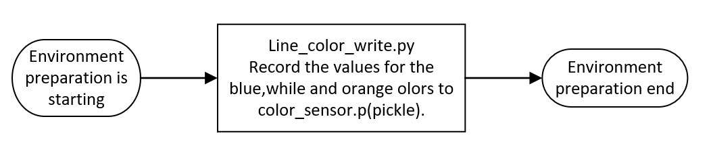
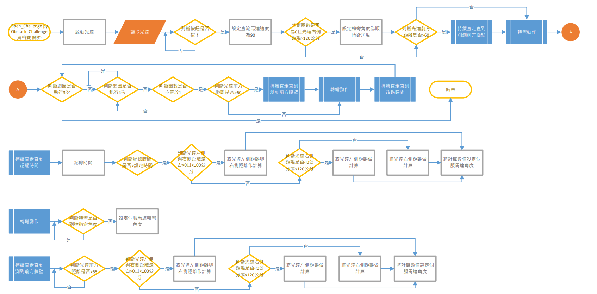

<div align=center>  </div>

## <div align="center">Open Challenge Code Overview</div> 
 - In the competition, vehicle control involves complex operations such as image recognition, color identification, distance detection, motor rotation, and vehicle steering. All of these are implemented using the __Python__ programming language.
 - Through the built-in SSH or VNC functionality in Mobaxterm or using RealVNC, we can easily connect to the Raspberry Pi, access its editor interface, carry out programming tasks, and perform real-time execution tests.  
 - The libraries introduced in this competition program are as follows.
```
   #Import the required modules
   import pigpio       #Raspberry Pi I/O Control Function Library
   import time         #Time Module
   import smbus        #I2C Manage  Module
   import struct       #Binary Data Packing and Unpacking Module
   import os           #System Information Reading Module 
   import math         #Mathematical Calculation Module
   import cv2          #OpenCV  Module
   import threading    #Multithread Management  Module
   import pickle       #Serialization/Deserialization Modul
   import rospy        #ROS Python Commands Module
   import numpy as np  #Multidimensional Arrays and Matrix Operations Module
   import signal       #Exception Handling Module
   from sensor_msgs.msg import LaserScan  #ROS Data Structure Definitions
```  
<div align="center">
</div>
 <div align="center">
 <table>
 <tr align="center">
 <th> Edit python of  Mobaxterm_SSH  
 </th>
 <th> Edit python of  Mobaxterm_VNC
 </th>
 <th>Edit python of RealVNC
 </th>
 <tr align="center" > 
 <td> </td>
 <td> </td>
 <td> </td>
 </tr>
 </tr>
 </table>
 </div>

 - ### Introduction to the Required Module Programs in the Operating Software:
   - #### Field Environment Value Recording Configuration Workflow  
    
   
      - #### [line_color_write.py](./line_color_write.py)  
        - The main functionality of the "line_color_write.py" program is to read the color values of white areas, orange lines, and blue lines, and save these values to a file named "color_sensor.p". Additionally, the program stores this file in the __"save_file"__ directory.
     
      - #### [save_file](./save_file)
        - The function of the 'save_file' folder is to store color values related to the white area of the field, orange lines, and blue lines.  
        - These numerical data are used for image processing, image recognition, and determining whether the next turn is reached or whether to walk forward or backward.
   
    - #### Open Challenge Program Operation Flowchart
     
     
      - #### [vehicle_function.py](./vehicle_function.py)
        - "vehicle_function.py," which is the program library used in this competition, provides custom functions for vehicle movement, image recognition, color recognition, and controlling servo motors. These custom functions simplify complex procedures into subroutines for ease of debugging.

      - #### [Open_Challenge.py](./Open_Challenge.py)
        - "Open_Challenge.py" is the main program responsible for controlling the self-driving car. It reads the values detected by the color sensor and LIDAR sensor to drive the car's motors and control its steering. Its purpose is to enable the vehicle to accurately navigate the track in both clockwise and counterclockwise directions to complete the mission. 

 - ### Open Challenge Program Operation Flowchart Description
     - The LiDAR will start up with the program, and the program will read LiDAR data indefinitely.  
     - The vehicle program system will first initialize, setting the DC motor speed to 0, the servo motor angle to 0, and the turn direction to counterclockwise by default.  
     - After the switch button is pressed, the DC motor speed is set to 90%. If the lap number is 0 and the LiDAR right side is greater than 120cm, the vehicle will turn clockwise. Otherwise, it will skip. When the distance in front is less than 60, the vehicle will turn.  
     - The program will continuously check if it has finished three laps. If not, it will detect if the current lap is finished. If not, it will determine if it is the second lap. If so, it will determine if the distance in front is greater than 60. If yes, it will continue to go straight until it is less than 60, then turn. After turning, it will go straight for a distance, otherwise the LiDAR may miscalculate and turn early.  
     - __Subroutine Description:__ 
                
         __1.Vehicle Lane Centering Subroutine：__  
          The vehicle continuously monitors the current program execution time. If the time exceeds the set limit, it checks whether the distances on the left and right sides of the LIDAR are within the range of 0 to 100 cm. If they are within this range, it calculates the difference between the right-side distance and the left-side distance and sends the result to the servo motor for centering. If the distances are not within this range, it checks whether the right-side distance from the LIDAR is between 0 to 120 cm. If it is, it uses the left-side value in the algorithm; otherwise, it uses the right-side value. Finally, the calculated value is output to the servo motor as the centering angle.
       
         __2.Vehicle Turning Subroutine:__  
          When the vehicle reaches the turning point, it will turn based on the angle of the turn until it completes the turn.
       
         __3.Vehicle Wall Detection Subroutine:__    
          This action continuously checks if the distance in front is less than 65cm while moving forward. During straight-line movement, it also performs road centering until it detects a wall to initiate a turn.

# <div align="center">[Return Home](../../../)</div>  
