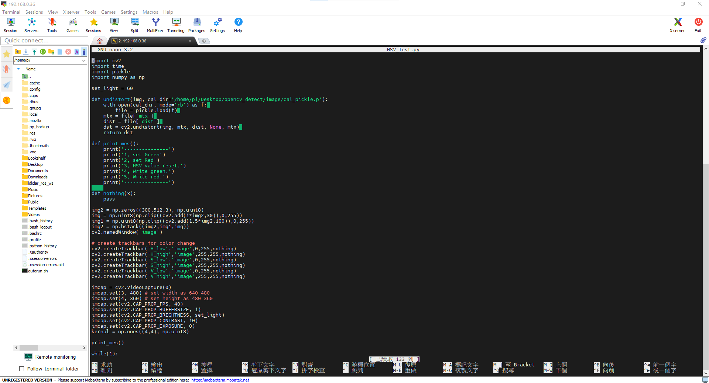
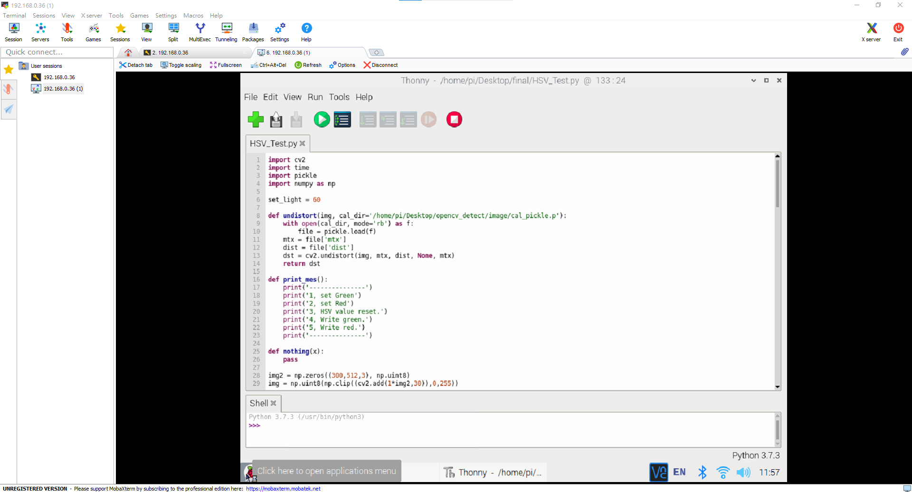
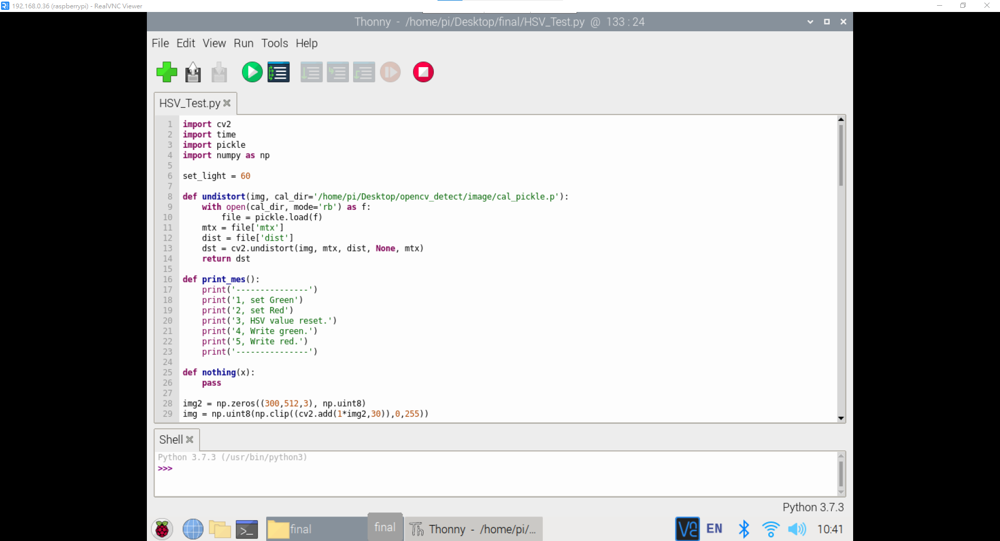
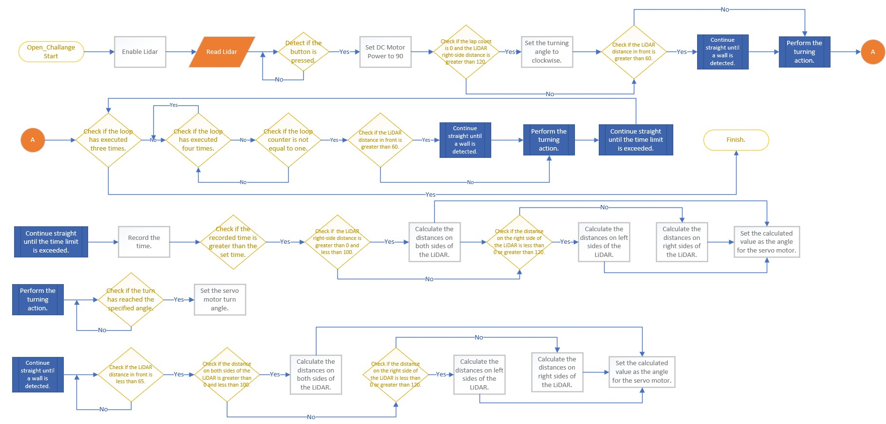

<div align=center>  </div>

## <div align="center">Open Challenge Code Overview</div> 
 - In the competition, vehicle control involves complex operations such as image recognition, color identification, distance detection, motor rotation, and vehicle steering. All of these are implemented using the __Python__ programming language.
 - Through the built-in SSH or VNC functionality in Mobaxterm or using RealVNC, we can easily connect to the Raspberry Pi, access its editor interface, carry out programming tasks, and perform real-time execution tests.  
 - The libraries introduced in this competition program are as follows.
```
   #Import the required modules
   import pigpio       #Raspberry Pi I/O Control Function Library
   import time         #Time Module
   import smbus        #I2C Manage  Module
   import struct       #Binary Data Packing and Unpacking Module
   import os           #System Information Reading Module 
   import math         #Mathematical Calculation Module
   import cv2          #OpenCV  Module
   import threading    #Multithread Management  Module
   import pickle       #Serialization/Deserialization Modul
   import rospy        #ROS Python Commands Module
   import numpy as np  #Multidimensional Arrays and Matrix Operations Module
   import signal       #Exception Handling Module
   from sensor_msgs.msg import LaserScan  #ROS Data Structure Definitions
```  
<div align="center">
</div>
 <div align="center">
 <table>
 <tr align="center">
 <th> Edit python of  Mobaxterm_SSH  
 </th>
 <th> Edit python of  Mobaxterm_VNC
 </th>
 <th>Edit python of RealVNC
 </th>
 <tr align="center" > 
 <td> </td>
 <td> </td>
 <td> </td>
 </tr>
 </tr>
 </table>
 </div>

 - ### Introduction to the Required Module Programs in the Operating Software:
   - #### Field Environment Value Recording Configuration Workflow  
    
   
      - #### [line_color_write.py](./line_color_write.py)  
        - The main functionality of the "line_color_write.py" program is to read the color values of white areas, orange lines, and blue lines, and save these values to a file named "color_sensor.p". Additionally, the program stores this file in the __"save_file"__ directory.
     
      - #### [save_file](./save_file)
        - The function of the 'save_file' folder is to store color values related to the white area of the field, orange lines, and blue lines.  
        - These numerical data are used for image processing, image recognition, and determining whether the next turn is reached or whether to walk forward or backward.
   
    - #### Open Challenge Program Operation Flowchart
     
     
      - #### [vehicle_function.py](./vehicle_function.py)
        - "vehicle_function.py" is a library primarily designed to provide a variety of custom functions for controlling a vehicle. It utilizes a Raspberry Pi along with various sensors and devices to implement functions such as vehicle movement, image recognition, color identification, and servo motor control.

      - #### [Open_Challenge.py](./Open_Challenge.py)
        - The main functionality of "Open_Challenge.py" is to control a vehicle. It combines data from color sensors and LIDAR sensors to drive the vehicle's motors and perform steering maneuvers. Its objective is to enable the vehicle to accurately complete three laps around the designated course in both clockwise and counterclockwise directions, accomplishing a specific task goal.

 - ### Open Challenge Program Operation Flowchart Description
     - The LiDAR will start up with the program, and the program will read LiDAR data indefinitely.  
     - The vehicle program system will first initialize, setting the DC motor speed to 0, the servo motor angle to 0, and the turn direction to counterclockwise by default.  
     - After the switch button is pressed, the DC motor speed is set to 90%. If the lap number is 0 and the LiDAR right side is greater than 120cm, the vehicle will turn clockwise. Otherwise, it will skip. When the distance in front is less than 60, the vehicle will turn.  
     - The program will continuously check if it has finished three laps. If not, it will detect if the current lap is finished. If not, it will determine if it is the second lap. If so, it will determine if the distance in front is greater than 60. If yes, it will continue to go straight until it is less than 60, then turn. After turning, it will go straight for a distance, otherwise the LiDAR may miscalculate and turn early.  
     - __Description of other actions:__         
         __1.Keep going straight until the time is over：__  
       The machine continuously reads the current time (referring to the program execution time). If the time exceeds the set time, it checks whether the distance on the left and right sides of the Lidar is greater than 0 and less than 100cm. If within this range, it subtracts the right-side value from the left-side value and then sends the result to the servo motor for centering calibration. If it's not within the range, it checks if the distance on the right side of the Lidar is between 0 and 120cm. If it is, it sends the left-side value to an algorithm; otherwise, it sends the right-side value. Finally, the value is output to the servo motor as the centering angle.  
         __2.Turn action:__  
         When the machine reaches the turn, it will turn based on the turning angle until it has completely turned the corner.  
         __3.Continue to go straight until the front wall is detected:__    
         This action will continuously detect if the distance in front is less than 65cm. In the process of going straight, it will also center the road until it detects the wall and turns.  

# <div align="center">[Return Home](../../../)</div>  
