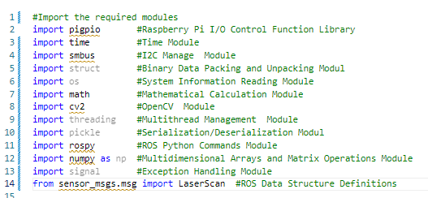

  

2023WRO Future Engineers Fire On All Cylinders  
====
## 
Open Challenge Code overview
 
- In the competition, the control of the vehicle's movement encompasses a series of actions, including image recognition, color identification, distance detection, motor rotation, and vehicle steering, among other intricate maneuvers. All of these precise and versatile controls are implemented using the __Python__ programming language.
- Through the built-in SSH or VNC functionalities of the Mobaxterm tool or RealVNC, we can easily establish connections to the Raspberry Pi, access its editor interface, initiate programming tasks, and perform real-time execution testing.
- Modules required for the operation of the program :

 

 <table>
 <tr align="center">
 <th> Edit python of  Mobaxterm_SSH  
 </th>
 <th> Edit python of  Mobaxterm_VNC
 </th>
 <th>Edit python of RealVNC
 </th>
 <tr align="center" > 
 <td> </td>
 <td> </td>
 <td> </td>
 </tr>

 </tr>
 </table>
 

### [save_file](./save_file)
- The function of the save_file folder is to store the HSV range values for green and red colors from HSV_Test, along with color values related to white areas, orange lines, and blue lines.
- These data values will be used as the basis for image processing, image recognition, and determining whether to approach the next curve or proceed with straight or reverse movement decisions.

### [HSV_Test.py]()
- The main functionality of "HSV_Test.py" is to adjust HSV range values for color filtering. Users can set the HSV range values specifically for green and red colors and record these settings in files named "HSV_Green.p" and "HSV_Red.p". Furthermore, the program stores these files in the "save_file" directory.

### [line_color_write.py]()
- The main functionality of the "line_color_write.py" program is to read the color values of white areas, orange lines, and blue lines, and save these values to a file named "color_sensor.p". Additionally, the program stores this file in the "save_file" directory.

### Flowchart for the Configuration of Green Recording of Venue Environmental Value
   

## [vehicle_function.py]()
- "vehicle_function.py" is a library primarily designed to provide a variety of custom functions for controlling a vehicle. It utilizes a Raspberry Pi along with various sensors and devices to implement functions such as vehicle movement, image recognition, color identification, and servo motor control.

### [Open_Challenge.py]()
- The main functionality of "Open_Challenge.py" is to control a vehicle. It combines data from color sensors and LIDAR sensors to drive the vehicle's motors and perform steering maneuvers. Its objective is to enable the vehicle to accurately complete three laps around the designated course in both clockwise and counterclockwise directions, accomplishing a specific task goal.

### Open Challenge Flow Chart

# 
[Return Home](../../../)
  
