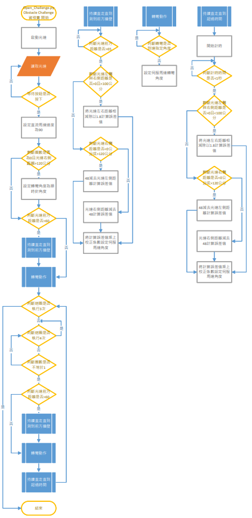

2023WRO Future Engineers Fire On All Cylinders  
====
# 
Programming(程式設計)
 

## Open Challenge Flow Chart(資格賽程式流程)

## Obstacle Challenge Flow Chart(任務賽程式流程)

## 圖像預測
所有圖像過濾可以在[vehicle_function.py](./Obstacle_Challenge/vehicle_function.py)中找到。
### 圖像處理
處理圖像時，需要將其轉換到不同的色彩空間，以便更有效地進行特定任務。我們使用cv2.cvtColor函數將原始的RGB圖像轉換為HSV（色調、飽和度、明度）色彩空間。轉換圖像後使用cv2.inRange函數，我們會設定六個HSV值，即redMax、redMin、greenMin、greenMax、blueMin和blueMax，設定顏色範圍。cv2.inRange函數比較HSV圖像中的每個像素值與指定的HSV範圍，如果像素值在這個範圍內，則將保留這個像素，否則將其過濾掉。這樣我們就可以得到一個經過過濾的圖像。

### 交通標誌閃避
使用過濾後的紅色綠色圖像，獲得圖像在畫面中的X、Y座標與面積。我們會利用Y座標判斷是哪一個顏色較近，再使用較近的交通標誌X座標減去我們所想要閃避到的座標計算出誤差值，將誤差值設定成伺服馬達轉向角度完成交通標誌閃避。

# 
[Return Home](../../)
 
