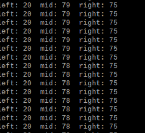

<div align=center>  </div>

2023WRO Future Engineers Shinan Fire On All Cylinders  
====
# <div align="center">Steering overview</div> 

## ydlidar Steering
- Perform wall navigation. First, read one side of the LiDAR to check if the distance is greater than 100 cm. If the LiDAR on the right side reads a distance greater than 100 cm, it indicates clockwise movement; otherwise, it indicates counterclockwise movement.
- After determining the travel direction, read the distance between the LiDAR and the wall ahead. When the distance between the LiDAR and the wall is less than 55 cm, execute the turning action.
- program:
```
if get_left_dis > 100:
    reverse = False
else:
    reverse = True
if get_mid_dis > 55:
    servo.angle(-40)
```

|LiDAR readings|
|:---:|
|<div align="center"> </div>|

## Pillar Steering


- Use filtered red and green images to obtain the X and Y coordinates, as well as the area of the image.  
- We will complete the avoidance of traffic signs through the following steps:  
 1.Use the Y coordinates to determine which block has a larger Y coordinate, indicating that it is closer.  
 2.Determine the color of the closer traffic sign and obtain its X coordinate.  
 3.Subtract the desired avoidance coordinate from the X coordinate of the closer  traffic sign and then multiply it by the avoidance coefficient to calculate the error value.  
 4.Set the steering angle of the servo motor to turn in the direction of the error value, completing the avoidance of the traffic sign.

  |Recognize obstacles that are closer in distance|XY coordinates of obstacles|
  |:---:|:---:|
  |<div align="center"> </div>|<div align="center"> </div>|

  

## slalom Steering

- We will use the color sensor to detect the number of times the line is crossed and determine if it has exceeded the set count.
- If the specified count is not reached, the system will continuously record the color of the nearest traffic sign until the number of line crossings is greater than or equal to the set count. At that point, it will stop recording colors.
- After recording the color of the nearest traffic sign, the program will determine if the color is red. If the sign color is red, the system will set the servo motor angle for a right turn and continue turning until the vehicle is facing the specified direction. If the nearest traffic sign color is not red, the vehicle will continue moving forward.

 
 <div align="center">

|Display the number of lines and the color of the nearest traffic sign|
|:---:|
|<div align="center"> </div>|

</div>

# <div align="center">[Return Home](../../)</div>  


