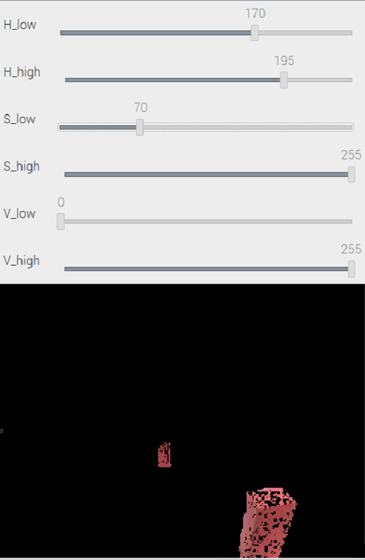
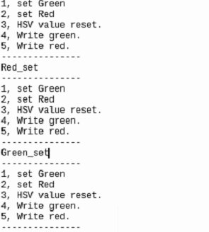

2023WRO Future Engineers Fire On All Cylinders  
=====
## <div align="center">Software Platform Construction (軟體平台建置)</div> 
- ### System Platform Software Installation Process Diagram(系統軟體平台安裝程序圖)
 
 - [Introduction to Raspberry Pi(樹莓派介紹)](https://github.com/kirkhu/WRO2023_Future-Engineers-Fire-On-All-Cylinders/blob/main/other/Raspberry_Pi/README.md)  
 #### English
 - When installing PI OS, select "Raspberry Pi OS (Legacy)" for installation.
   - Software link：[Raspberry Pi](https://www.raspberrypi.com/news/new-old-functionality-with-raspberry-pi-os-legacy/) 
   - After installation, please update the operating system to ensure software compatibility.
```
$ sudo apt-get update  
$ sudo apt-get upgrade   
```
 - After selecting "Interface Options," enable the Camera, SSH, VNC, and other desired features, then exit the menu.
 - Before installing OpenCV version 4.7.0.72, you should first check whether the versions of setuptools and wheel support the installation of this specific version of OpenCV.
 - Install ROS system version "noetic ninjemys", first set up the database, then create a workspace, proceed to install the required dependencies, and finally build the catkin workspace.
 - Install the PIGPIO Library to facilitate the control of the color sensor and read the field color values
 - To install the Dlidar LiDAR driver, first obtain the Lidar installation package. Then, set the USB interface permissions, install the required dependencies, compile the driver, and finally, add it to the environment variables.

 #### 中文
 

 - 安裝PI OS時，選擇安裝Raspberry Pi OS (Legacy)  
   - 軟體連結：[樹梅派](https://www.raspberrypi.com/news/new-old-functionality-with-raspberry-pi-os-legacy/) 
   - 安裝完之後，請更新作業系統，以確保的軟體的相容性
 - 使用Mobaxterm工具(__工具介紹在本頁最下方__)，連線至Raspberry Pi，進行系統更新及ROS、OpenCV等軟體安裝。 
```
$ sudo apt-get update  
$ sudo apt-get upgrade   
```
 - 選擇Interface Options之後打開Camera、SSH和VNC等功能後退出  
 - 安裝opencv版本:4.7.0.72，在裝之前要先確認 setuptools 和 wheel 的版本支援安裝的opencv  
 - 安裝ROS系統版本:noetic ninjemys，先設定資料庫，再來建立工作環境，之後安裝依賴項目，最後在建置catkin的工作環境  
 - 安裝PIGPIO Library，以利控制顔色感測器，讀取場地顏色值
 - 安裝Dlidar光達的驅動程式，首先先取得Lidar安裝包，再來設定USB接口權限，之後安裝依賴項目，然後編譯，最後加入環境變數

- ### Green Recording of Venue Environmental Value Configuration(場地環境值記綠設定)
  
#### [ColorDetect.py](../Programming/Open_Challenge/line_color_write.py)紀錄場地顏色數值
#### 英文
- Open ColorDetect.py to start recording the values of white, orange, and blue colors, and save the values to the color_sensor.p file.
- Press the button to start recording the blue line. Move the color sensor back and forth over the white area of the field to record the minimum value of that area. Press the button again to stop recording and save the value of the white area to the color_sensor.p file.
- After finishing recording the white zone, press the button again to start recording the orange line. Place the color sensor on the orange line and move it back and forth on the track to record the minimum value of the orange line. Press the button again to stop recording the orange line, and save the recorded orange line value to the "color_sensor.p" file.
- After ending the recording of the orange line, press the button again to start recording the blue line. Place the color sensor on the blue line of the field and move it back and forth to record the minimum value of the blue line. Press the button again to end the recording of the blue line and save the value of the blue line to the "color_sensor.p" file.
#### 中文
- 打開ColorDetect.py開始記錄白、橘、藍顏色數值，將數值紀錄到color_sensor.p檔案裡。
- 按下按鈕開始記錄藍線，將顏色感測器放在場地白色區域上來回移動，記錄該區域的最低數值。再次按下按鈕結束紀錄，並將白色區域數值記錄到color_sensor.p文件中。
- 在結束紀錄白色區域後，再次按下按鈕開始記錄橘線，將顏色感測器放在場地橘線上來回移動，記錄橘線的最低數值。再次按下按鈕結束紀錄橘線，並將橘線數值紀錄到color_sensor.p文件中。
- 在結束橘色線記錄後，再次按下按鈕開始記錄藍色線。將顏色感測器放在場地藍色線上來回移動，記錄藍色線的最低數值。再次按下按鈕結束藍色線記錄，並將藍色線的數值記錄到color_sensor.p文件中。

<div align="center">

|Record the color values of the venue(紀錄場地顏色數值)|
|:---:|
||
</div>

#### [HSV_Detect.py](../Programming/Obstacle_Challenge/HSV_Test.py)調整積木閥值
#### 英文
- After opening HSV_Detect.py, the following functions will be displayed corresponding to the keyboard number keys 1 to 5:  
1: Display the previously recorded green threshold values.  
2: Display the previously recorded red threshold values.  
3: Restore the currently adjusted threshold values to their   default values.  
4: Record the adjusted green threshold values to the HSV_Green.p file.  
5: Record the adjusted red threshold values to the HSV_Red.p file.
- When adjusting the block threshold, we will place a block both at a distant and close distance to ensure that the adjusted threshold can recognize blocks at any distance. After the adjustment, press the number keys 4 or 5 to record the threshold into the HSV_Green.p or HSV_Red.p file.
- After adjusting the settings, you can press the number keys 1 and 2 to display the previous recorded thresholds for readjustment.
#### 中文
- 開啟 HSV_Detect.py 後，將會顯示以下功能對應於鍵盤數字鍵 1~5：  
數字 1：顯示上次紀錄的綠色閥值。  
數字 2：顯示上次紀錄的紅色閥值。  
數字 3：將正在調整的閥值恢復為預設值。  
數字 4：將調整完的綠色閥值記錄到 HSV_Green.p 檔案中。  
數字 5：將調整完的紅色閥值記錄到 HSV_Red.p。 
- 在調整積木閾值時，我們會在距離遠和近都放一顆積木，以確保調整的閾值可以辨識任何距離的積木。調整完後，按下數字鍵4或5，將閾值紀錄到HSV_Green.p或HSV_Red.p檔案裡。
- 在調整記錄完成後，您可以按下數字鍵1、2來顯示上次記錄的閾值，以便進行再次調整。

<div align="center">
 
|Adjust the green color threshold(調整綠色閾值)|Adjust the red color threshold(調整紅色閾值)|
|:---:|:---:|
|<div align="center"> </div>|<div align="center"> </div>|

|Display Button Functionality(顯示按鈕功能)|
|:---:|
|<div align="center"> </div>|

</div>
- ### Programming Language(程式語言)
  #### English
   - Python is a high-level, general-purpose, interpreted programming language created by Guido van Rossum in 1991. It is designed to be concise, readable, and comes with a rich 
  standard library, enabling developers to write code quickly and efficiently. 
   - Python is widely used in web development, scientific computing, data analysis, artificial intelligence, machine learning, and various other fields. It features dynamic typing, automatic garbage collection, and supports multiple platforms.
   - With an active community, Python has a plethora of third-party libraries and tools, making development even more convenient. Python has become a popular choice for both beginners and experienced developers.  

  __Therefore, we choose Python as the programming language for the development of the self-driving vehicle.__

  #### 中文
   - Python是一種高階、通用、直譯式程式語言，由Guido van Rossum於1991年創建。它設計簡潔、易讀且具有豐富的標準函式庫，使開發者能夠快速有效地撰寫程式碼。
   - Python被廣泛應用於Web開發、科學計算、數據分析、人工智慧、機器學習等領域。它具有動態類型、自動垃圾回收等特性，並支援多種平台。
   - Python社群活躍，有大量的第三方庫和工具，使得開發更加便捷，Python成為初學者和專業開發者的熱門選擇。

   __因此，我們選用python 作為自駕車輛的程式開發語言。__ 

### ${{\color{red} Introduction to  Mobaxterm( Mobaxterm 的介紹)}} $  
  #### English：
  - MobaXterm is a feature-rich cross-platform remote computing management tool. 
  - It integrates various network tools such as X11 server, remote computing, SSH, VNC, and more, providing an intuitive user interface for easy connection to remote servers in Windows environments.
  - MobaXterm also supports simultaneous management of multiple sessions, allowing users to switch and operate different remote connections effortlessly. This tool is highly valuable for system administrators, network engineers, and developers.

  __Therefore, we have chosen MobaXterm as the remote control tool for the Raspberry Pi in the self-driving vehicle.__

  #### 中文：
  - MobaXterm是一款功能豐富的跨平台遠端計算機管理工具。
  - 它整合了X11伺服器、遠端運算、SSH、VNC等多種網路工具，並提供一個直觀的用戶界面，方便用戶在Windows環境下連接到遠端伺服器。
  - MobaXterm還支援多個會話的同時管理，讓用戶輕鬆切換和操作不同的遠端連接。這款工具對於系統管理員、網路工程師和開發人員來說是一個極具價值的工具。

   __因此，我們選用Mobaxterm作為自駕車輛中Raspberry Pi的遠端控制工具。__  

- Software link：[Mobaxterm](https://mobaxterm.mobatek.net/) 

### ${{\color{red} Introduction to Visal Studio Code(Visal Studio Code的介紹)}} $  

- ### 
  #### English：
  - Visual Studio Code (often referred to as VS Code) is a free, open-source, and cross-platform code editor developed by Microsoft. It supports multiple programming languages and offers a rich set of extensions to cater to individual needs.
  - VS Code features an intuitive user interface and powerful code editing capabilities, including intelligent code completion, code navigation, debugging, and version control. It is widely embraced by developers and has become the preferred editing tool for many software development projects.

  __Therefore, we have chosen VS Code as the programming tool for the self-driving vehicle.__

  #### 中文：
  - Visual Studio Code（簡稱VS Code）是一款由Microsoft開發的免費、開源且跨平台的程式碼編輯器。它支援多種程式語言，並擁有豐富的擴充功能，讓使用者可以個性化配置以滿足不同需求。
  - VS Code擁有直覺的用戶界面和強大的代碼編輯功能，如智慧程式碼完成、程式碼導航、除錯和版本控制等。它廣受開發人員歡迎，成為許多軟體開發項目的首選編輯工具。
   
   __因此，我們選用VS Code作為自駕車輛的程式撰寫工具。__  

- Software link：[Visal Studio Code](https://code.visualstudio.com/) 

  # <div align="center">[Return Home](../../)</div>  
