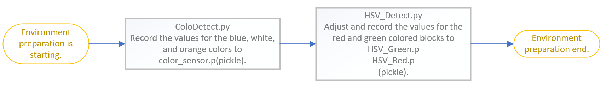

2023WRO Future Engineers Fire On All Cylinders  
=====
# 
Software Platform (軟體平台)
 
- ### System Platform Software Installation Process Diagram.
  
- 安裝__PI OS__時，選擇安裝Raspberry Pi OS (Legacy)   
   - 安裝完之後，請更新作業系統，以確保的軟體的相容性

   > $ sudo apt-get update  

   > $ sudo apt-get upgrade   

- 選擇Interface Options之後打開Camera、SSH和VNC然後退出    

- 安裝__opencv__ 版本:4.7.0.72，在裝之前要先確認setuptools和wheel的版本支援安裝的opencv  

- 安裝__ROS系統__ 版本:noetic ninjemys，先設定資料庫，再來建立工作環境，之後安裝依賴項目，最後在建置catkin的工作環境  

- 安裝__PIGPIO Library__，以利控制顔色感測器，讀取場地顏色值

- 安裝__Dlidar光達的驅動程式__，首先先取得Lidar安裝包，再來設定USB接口權限，之後安裝依賴項目，然後編譯，最後加入環境變數

- ### Seutp Recode (紀錄場地值)
  
- ### Programming Language
   我們選了 python 用於我們的程式開發上  
      
   Python是一种高级、通用的编程语言。它的设计理念强调代码的可读性，使用了显著缩进。Python是动态类型且具有自動的記憶體管理機制功能。  
   支持多种编程范式，包括结构化（特别是特別程序化）、面向对象和函数式编程。由于其全面的标准库，它通常被描述为一个 “batteries included” 的語言。  
   
   <small>來源網址:[維基百科](https://zh.wikipedia.org/zh-tw/Python)</small>

  # 
[Return Home](../../)
  
