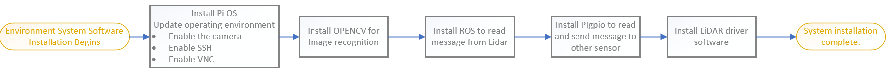
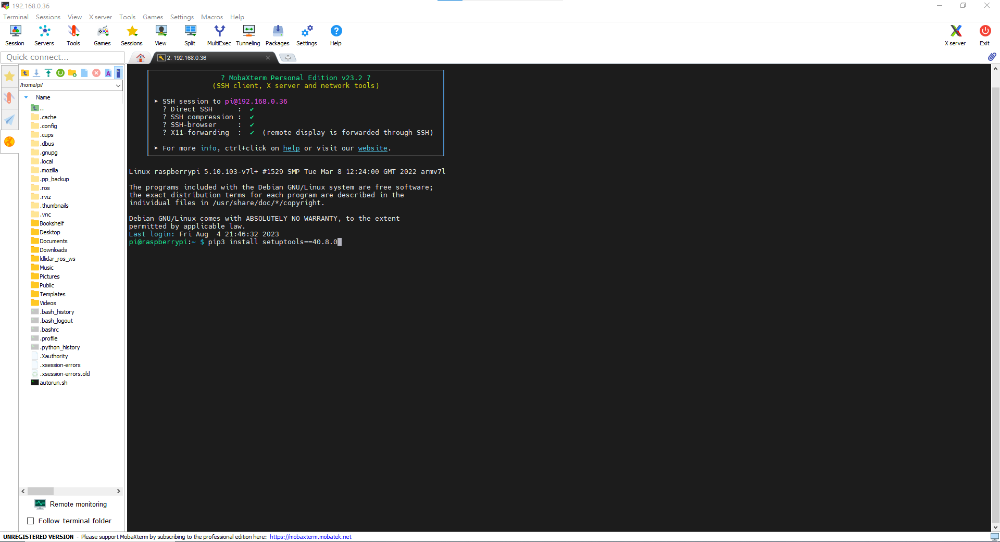
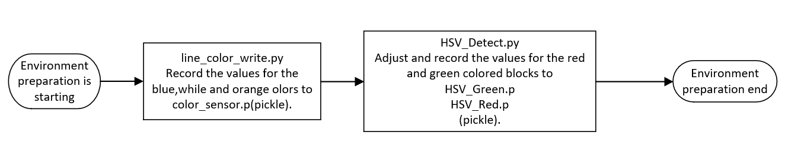
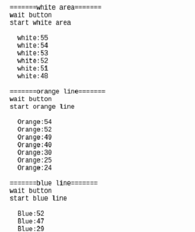
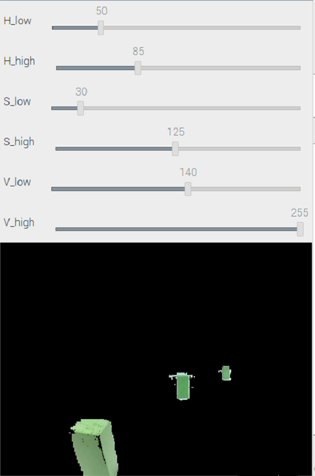

<div align=center>  </div>

## <div align="center">Software Platform Construction </div> 
- ### Installing System Software Required for Self-Driving Cars 
  - #### System Platform Software Installation Process Diagram  
        
   - When installing PI OS, select "Raspberry Pi OS (Legacy)" for installation.
      - Software link：[Raspberry Pi](https://www.raspberrypi.com/news/new-old-functionality-with-raspberry-pi-os-legacy/) 
      - After installation, please update the operating system to ensure software compatibility.
   - Using the Mobaxterm tool (__tool introduction at the bottom of this page__), you can connect to a Raspberry Pi via VNC or SSH to perform system configuration, updates, and install software such as ROS, OpenCV, and more.

      ```
      $ sudo apt-get update  
      $ sudo apt-get upgrade   
      ``` 
    - After selecting "Interface Options," enable the Camera, SSH, VNC, and other desired features, then exit the menu.
    - Before installing OpenCV version 4.7.0.72, you should first check whether the versions of setuptools and wheel support the installation of this specific version of OpenCV.
    - Install ROS system version "noetic ninjemys", first set up the database, then create a workspace, proceed to install the required dependencies, and finally build the catkin workspace.
    - Install the PIGPIO Library to facilitate the control of the color sensor and read the field color values
    - To install the Dlidar LiDAR driver, first obtain the Lidar installation package. Then, set the USB interface permissions, install the required dependencies, compile the driver, and finally, add it to the environment variables.
 <div align="center">
 <table>
 <tr align="center" > 
 <td> </td>
 <td> </td>
 </tr>
 <tr align="center"></tr>
 </table>
 </div>

- ### Record Field Environment Values
  - In practice, we pre-record the color values of the blue, orange lines, white areas, and block colors in the field into the 'color_sensor.p' file. This is done to facilitate the use of these values during the actual competition, enhancing recognition accuracy and saving preparation time for the official race.  
  - #### Field Environment Value Recording Configuration Workflow
      
  - #### [line_color_write.py](../Programming/Open_Challenge/line_color_write.py)
    - "The 'line_color_write.py" program is primarily designed to read the color values of white, orange, and blue colors in the competition field and record these values into the 'color_sensor.p' file within the 'save_file' data.
    - When the program is running, use the button on the vehicle to aim the color sensor at the blue, orange lines, and white areas on the field, moving back and forth. Press the button to record the lowest value in that area and save it in the 'color_sensor.p' file.
    - The 'color_sensor.p' file records the values of various colors in the competition field, and through program calculations, these values can be utilized in the official competition, making it convenient for retrieval and saving preparation time.

      |The Color Values of the Field in the 'color_sensor.p' File|
      |:---:|
      ||

  - #### [HSV_Detect.py](../Programming/Obstacle_Challenge/HSV_Test.py)
    - The "HSV_Detect.py" program primarily reads the color values of the blocks on the field and records these values in the "HSV_Green.p" and "HSV_Red.p" files within the "save_file" data directory.  
    - The "HSV_Green.p" and "HSV_Red.p" files contain the recorded color values of the blocks on the competition field. These values can be used during the official competition, making it easier to read and saving preparation time.  
    - When the HSV_Detect.py program is executed, the camera will be aligned with the block, and the following functions will be displayed on the computer screen, corresponding to the keyboard number keys 1~5:  
      - Number 1: Display the last recorded green threshold value.  
      - Number 2: Display the last recorded red threshold value.  
      - Number 3: Reset the currently adjusted threshold values to default.  
      - Number 4: Record the adjusted green threshold value to the HSV_Green.p file.  
      - Number 5: Record the adjusted red threshold value to the HSV_Red.p file.  
    - When adjusting the threshold values for recognizing the blocks, we place a block both at a distance and up close to ensure that the adjusted thresholds can identify blocks at any distance. After the adjustments, press either the number 4 or 5 to save the threshold values to the HSV_Green.p or HSV_Red.p files.  
    - After completing the adjustment and recording, you can press the number 1 or 2 to display the previously recorded threshold values for further adjustments.  


<div align="center">
 
|Adjust the Green Color Threshold Value|Adjust the Red Color Threshold Value|Display Button Functionality|
|:---:|:---:|:---:|
|<div align="center"> </div>|<div align="center"> </div>|<div align="center"> </div>|
</div>

- ### Competition Programming Language Introduction - Python
   - Python is a high-level, general-purpose, interpreted programming language created by Guido van Rossum in 1991. It is designed to be concise, readable, and comes with a rich standard library, allowing developers to write code quickly and efficiently.
  standard library, enabling developers to write code quickly and efficiently. 
   - Python is widely used in web development, scientific computing, data analysis, artificial intelligence, machine learning, and various other fields. It features dynamic typing, automatic garbage collection, and supports multiple platforms.
   - With an active community, Python has a plethora of third-party libraries and tools, making development even more convenient. Python has become a popular choice for both beginners and experienced developers.  

  __Therefore, we choose Python as the programming language for the development of the self-driving vehicle.__

- ### Competition Programming Editor Introduction - Mobaxterm
  - MobaXterm is a feature-rich cross-platform remote computing management tool. 
  - It integrates various network tools such as X11 server, remote computing, SSH, VNC, and more, providing an intuitive user interface for easy connection to remote servers in Windows environments.
  - MobaXterm also supports simultaneous management of multiple sessions, allowing users to switch and operate different remote connections effortlessly. This tool is highly valuable for system administrators, network engineers, and developers.

  __Therefore, we chose Mobaxterm as the remote control programming tool for the Raspberry Pi in our self-driving vehicle.__


  - Software Website：[Mobaxterm](https://mobaxterm.mobatek.net/) 

# <div align="center">[Return Home](../../)</div> 
