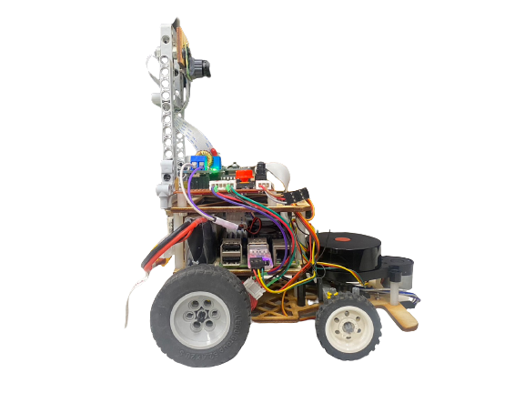
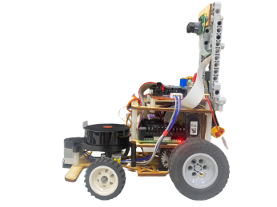
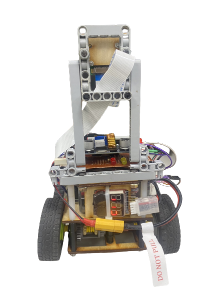
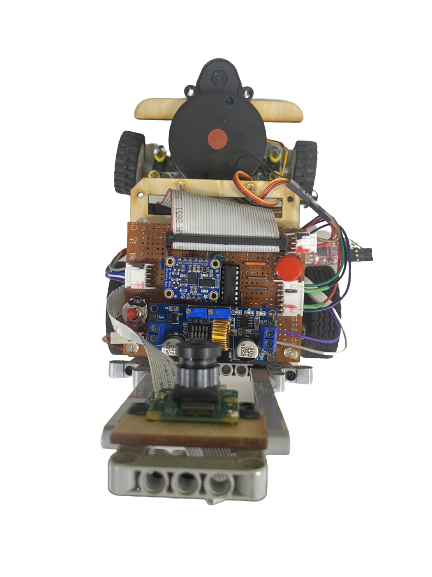
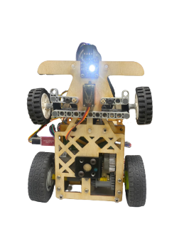

Vehicle's photos
====
|        |        |  
| :----: | :----: |  
|  left view 左視圖  | Right view 右視圖  |
|  |  |
|   Front view  前視圖  |  Rear view 後視圖   |    
|  |  | 
|  top view 上視圖  |  bottom view 下視圖  |   
|  |  |   

# 
[Return Main](../)
  