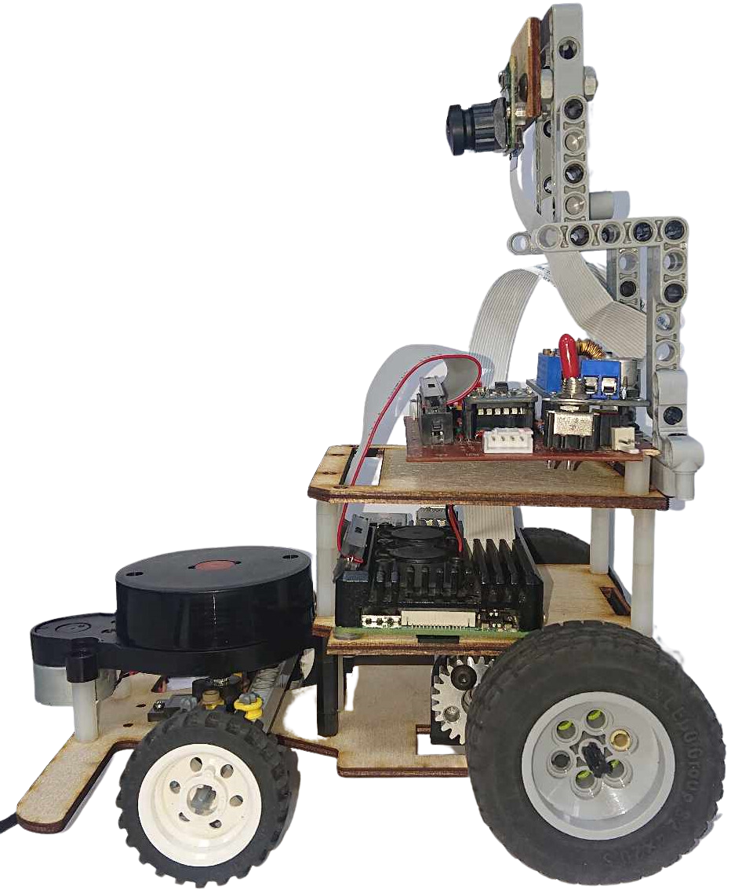
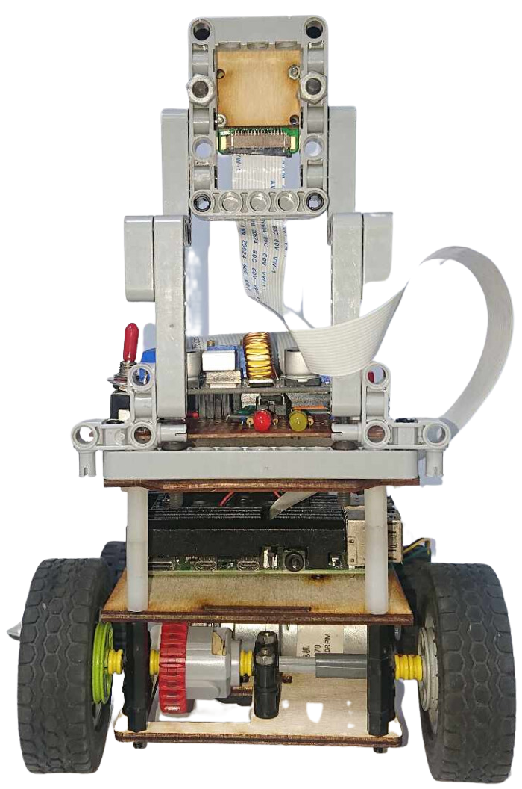

2023WRO Future Engineers Fire On All Cylinders  
=====
## 
Vehicle's photos(車輛照片)
 

<table>
  <tr>
    <td align="center" font size="5">Left view 左視圖</td>
    <td align="center" font size="5">Right view 右視圖</td>
  </tr>
    <tr>
    <td> </td>
    <td></td>
  </tr>
    <tr>
    <td align="center" font size="5"> Front view 前視圖</td>
    <td align="center" font size="5">Rear view 後視圖 </td>
  </tr>
    </tr>
    <tr>
    <td></td>
    <td></td>
  </tr>
      <tr>
    <td align="center" font size="5">Top view 上視圖</td>
    <td align="center" font size="5">Bottom view 下視圖 </td>
  </tr>
    </tr>
    <tr>
    <td></td>
    <td> </td>
  </tr>
</table>
  

 

# 
[Return Home](../)
 
